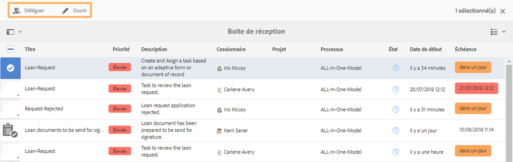
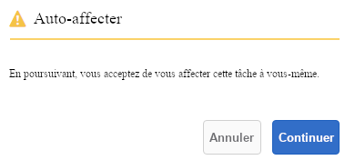
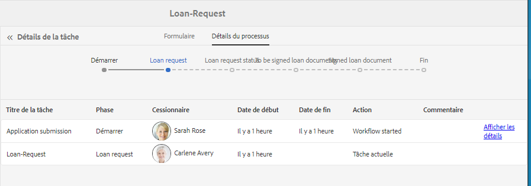
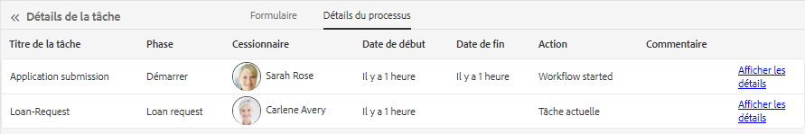

# Gestion des applications et des tâches Forms dans la boîte de réception AEM  {#manage-forms-applications-and-tasks-in-aem-inbox}

L’une des nombreuses façons de lancer ou de déclencher un processus orienté formulaire consiste à utiliser des applications dans la boîte de réception AEM. Vous devez créer une application de processus pour rendre un processus Forms disponible en tant qu’application dans la boîte de réception. Pour plus d’informations sur l’application de processus et d’autres façons de lancer les processus de Forms, voir [Lancement d’un processus orienté formulaire sur OSGi](/help/forms/using/aem-forms-workflow.md#launch).

En outre, la boîte de réception AEM réunit les notifications et les tâches de différents composants AEM, notamment les processus Forms. Lorsqu’un processus Forms contenant une étape Affecter une tâche est déclenché, l’application associée est répertoriée comme une tâche dans la boîte de réception de la personne désignée. Si la personne désignée est un groupe, la tâche s’affiche dans la boîte de réception de tous les membres du groupe jusqu’à ce qu’un membre demande ou délègue la tâche.

L’interface utilisateur de la boîte de réception fournit la liste et les vues de calendrier pour afficher les tâches. Vous pouvez également configurer les paramètres d’affichage. Vous pouvez filtrer les tâches en fonction de divers paramètres. Pour plus d’informations sur la vue et les filtres, voir [Votre boîte de réception](/help/sites-authoring/inbox.md).

En résumé, la boîte de réception vous permet de créer une nouvelle application et de gérer les tâches affectées.

>[!NOTE]
>
>Vous devez être membre du groupe d’utilisateurs de processus pour pouvoir utiliser la boîte de réception AEM.

## Création d’une application {#create-application}

1. Accédez à AEM boîte de réception à l’adresse `https://[server]:[port]/aem/inbox`.
1. Dans l’interface utilisateur de la boîte de réception, appuyez sur **[!UICONTROL Créer > Application]**. La page Sélectionner l’application s’affiche.
1. Sélectionnez une application, puis appuyez sur **[!UICONTROL Créer]**. Le formulaire adaptatif associé à l’application s’ouvre. Remplissez les formulaires et appuyez sur **[!UICONTROL Envoyer]**. Cette action lance le processus associé et crée une tâche dans la boîte de réception de la personne désignée.

## Gestion des tâches {#manage-tasks}

Lorsqu’un processus Forms est déclenché et que vous êtes une personne désignée ou un membre du groupe de personnes désignées, une tâche s’affiche dans votre boîte de réception. Vous pouvez afficher les détails de la tâche et effectuer les actions disponibles pour la tâche depuis la boîte de réception.

### Demande ou délégation de tâches {#claim-or-delegate-tasks}

Les tâches affectées à un groupe s’affichent dans la boîte de réception de tous les membres du groupe. Tout membre du groupe peut demander cette tâche ou la déléguer à un autre membre du groupe. Pour ce faire :

1. Appuyez sur la vignette de la tâche pour la sélectionner. Les options pour ouvrir ou déléguer la tâche s’affichent en haut.

   

1. Utilisez l’une des méthodes suivantes :

   * Pour déléguer la tâche, appuyez sur **[!UICONTROL Déléguer]**. La boîte de dialogue Déléguer un élément s’ouvre. Sélectionnez un utilisateur (vous pouvez également ajouter un commentaire) puis appuyez sur **[!UICONTROL OK]**.

   

   * Pour demander la tâche, appuyez sur **[!UICONTROL Ouvrir]**. La boîte de dialogue Auto-affecter s’ouvre. Appuyez sur **[!UICONTROL Continuer]** pour demander la tâche. La tâche demandée s’affiche avec vous en tant que personne désignée dans votre boîte de dialogue.

   

### Affichage des détails et actions sur les tâches {#view-details-and-perform-actions-on-tasks}

Lorsque vous ouvrez une tâche, vous pouvez afficher les détails de la tâche et exécuter les actions disponibles. Les actions disponibles pour une tâche sont définies à l’étape Affecter une tâche du processus Forms associé.

1. Appuyez sur la vignette de la tâche pour la sélectionner. Des options pour ouvrir ou déléguer la tâche sélectionnée s’affichent en haut.
1. Appuyez sur **[!UICONTROL Ouvrir]** pour afficher les détails de la tâche et prendre des mesures. La vue détaillée de la tâche s’ouvre. Dans cette vue, vous pouvez afficher les détails de la tâche et agir sur la tâche.

   >[!NOTE]
   >
   >Si une tâche est affectée à un groupe, vous devez d’abord la demander pour pouvoir l’ouvrir dans la vue détaillée.

La vue détaillée de tâche comprend les sections suivantes :

* Détails de la tâche
* Formulaire
* Détails du processus
* Barre d’outils Actions

#### Détails de la tâche {#task-details}

La section Détails de la tâche affiche des informations sur la tâche. Les informations affichées dépendent des paramètres de configuration de l’[étape Affecter une tâche](/help/sites-developing/workflows-step-ref.md) dans le processus. Dans l’exemple ci-dessus s’affichent la description, l’état, la date de début et le processus utilisé pour la tâche. Il permet également de joindre un fichier à la tâche.

#### Formulaire {#form}

L’onglet Formulaire dans la zone de contenu principale affiche le formulaire envoyé et les pièces jointes du champ, le cas échéant.

#### Détails du processus {#workflow-details}

L’onglet Détails de processus en haut affiche la progression de la tâche via différentes étapes dans le processus. Il affiche les étapes terminées, en cours et en attente pour la tâche. Les étapes d’un processus sont définies à [l’étape Affecter une tâche](/help/sites-developing/workflows-step-ref.md) du processus associé.

En outre, l’onglet affiche l’historique de la tâche pour chaque étape terminée dans le processus. Vous pouvez appuyer sur **[!UICONTROL Afficher les détails]** pour une étape terminée afin de connaître les détails de cette étape. Cette action permet d’afficher les détails de la tâche : les commentaires, les pièces jointes de formulaire et de tâches, l’état, les dates de début et de fin, etc.

#### Barre d’outils Actions {#actions-toolbar}

La barre d’outils Actions affiche toutes les options disponibles pour la tâche. Les actions Enregistrer, Réinitialiser et Déléguer sont des actions par défaut, mais d’autres actions disponibles sont configurées dans [l’étape Affecter une tâche](/help/sites-developing/workflows-step-ref.md). Dans l’exemple ci-dessus, les options Approuver et Rejeter sont configurées dans le processus.

Lorsque vous agissez sur la tâche, elle se poursuit dans le processus.

### Affichage des tâches terminées {#view-completed-tasks}

La boîte de réception AEM affiche uniquement les tâches actives. Les tâches terminées n’apparaissent pas dans la liste. Cependant, vous pouvez utiliser les filtres de la boîte de réception pour filtrer les tâches en fonction de plusieurs paramètres, tels que le type de tâche, l’état, les dates de début et de fin, etc. Pour afficher les tâches terminées :

1. Dans la boîte de réception AEM, appuyez sur  pour ouvrir le sélecteur de filtres.
1. Appuyez sur l’accordéon **[!UICONTROL État de la tâche]** et choisissez **[!UICONTROL Terminé]**. Toutes vos tâches terminées s’affichent.

   

1. Appuyez pour sélectionner une tâche et appuyez sur **[!UICONTROL Ouvrir]**.

La tâche s’ouvre pour afficher le document ou le formulaire adaptatif associé à la tâche. Pour le formulaire adaptatif, il affiche le formulaire adaptatif en lecture seule ou son document d’enregistrement de PDF tel que configuré dans l’onglet Formulaire/document de la [Étape de processus Assign Task](/help/sites-developing/workflows-step-ref.md).

La section de détails de la tâche affiche des informations telles qu’une mesure prise, l’état de la tâche, la date de début et la date de fin.

L’onglet **[!UICONTROL Détails du processus]** affiche chaque étape du processus. Appuyez sur **[!UICONTROL Afficher les détails]** d’une étape pour obtenir des informations détaillées.

