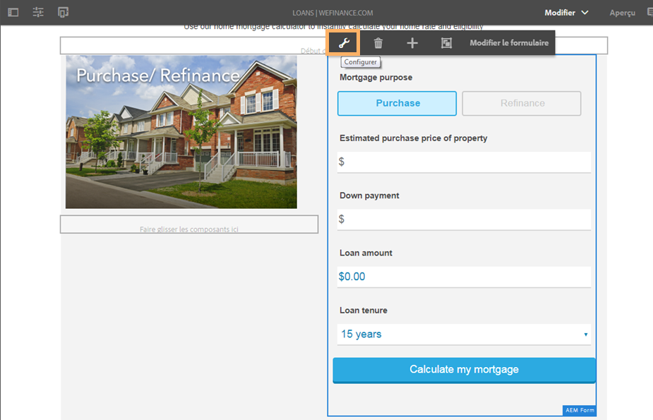

# Configuration de Microsoft Dynamics 365 pour le processus de prêt immobilier du site de référence We.Finance {#configure-microsoft-dynamics-for-the-home-mortgage-workflow-of-the-we-finance-reference-site}

Découvrez comment optimiser les services Microsoft® Dynamics 365 via des formulaires adaptatifs pour le processus de prêt immobilier du site de référence We.Finance

## Présentation {#overview}

Microsoft® Dynamics 365 est un logiciel de gestion de la relation client (CRM) et de planification des ressources d&#39;entreprise (ERP) qui fournit des solutions d&#39;entreprise pour la création et la gestion de comptes clients, de contacts, de pistes, d&#39;opportunités et de cas.

AEM Forms provides a cloud service to integrate Dynamics 365 with [Forms Data Integration](/help/forms/using/data-integration.md) module. Le scénario de la [présentation de l’application de prêt immobilier avec Microsoft® Dynamics](/help/forms/using/finance-reference-site-walkthrough.md#home-mortgage-application-walkthrough-with-microsoft-dynamics) montre comment un client utilise le site de référence We.Finance pour demander un prêt lorsque le site utilise Microsoft® Dynamics pour l’intégration de données de formulaire. Avant de pouvoir utiliser la procédure pas à pas de l&#39;application Prêt immobilier avec le scénario Microsoft® Dynamics, vous devez configurer Microsoft® Dynamics 365 pour l&#39;utiliser avec le site de référence We.Finance.

## Conditions préalables {#prerequisites}

Avant de commencer à installer et configurer Dynamics 365, vérifiez que vous avez :

* [Installé et configuré les sites de référence d’AEM Forms](/help/forms/using/setup-reference-sites.md).

* AEM 6.3 Forms Service Pack 1 et versions ultérieures
* Compte Microsoft® Dynamics 365
* Application enregistrée pour le service Dynamics 365 avec Microsoft® Azure Principale Directory
* ID client et secret client pour la demande enregistrée

## Liaison du calculateur de prêt immobilier avec la page d’accueil de votre site {#link-the-home-mortgage-calculator-with-your-site-home-page}

1. Sur une instance d’auteur, accédez à la page suivante :

   https://[sderver]:[port]/editor.html/content/we-finance/global/en/loan-landing-page.html

1. Faites défiler l’écran vers le calculateur de prêt immobilier.
1. Sélectionnez le panneau de la colonne de droite (du calculateur) et appuyez pour afficher le menu contextuel. Dans le menu contextuel, appuyez sur Configurer. La boîte de dialogue Modifier le conteneur d’AEM Forms s’affiche.

   

1. Dans la boîte de dialogue Modifier le conteneur d’AEM Forms, accédez au chemin d’accès à l’actif et sélectionnez le calculateur de prêt immobilier dans chemin suivant, puis appuyez sur **Confirmer** :

   formsanddocuments/We.Finance/MS Dynamics/

   

1. Appuyez sur **Done** (Terminé). 
1. Publiez la page modifiée.

   >[!NOTE]
   >
   >La liaison des champs du calculateur avec FDM est préconfigurée via le package du site de référence We.Finance. Pour afficher la liaison, vous pouvez ouvrir le formulaire dans le mode de création et voir les références de liaison de champ.

1. Pour créer une entité personnalisée pour stocker l’enregistrement de demandeur pour une demande de prêt immobilier, importez le package de solution AEMFormsFSIRefsite_1_0.zip sur votre instance Microsoft® Dynamics :

   1. Téléchargez le package à partir de :

      `https://[server]:[port]/content/aemforms-refsite-collaterals/we-finance/home-mortgage/ms-dynamics/AEMFormsFSIRefsite_1_0.zip`

   1. Importez le package de solution dans une instance de Microsoft® Dynamics. Dans votre instance Microsoft® Dynamics, accédez à **Paramètres** > **Solutions**, puis appuyez sur **Importer**.

1. Pour configurer les coordonnées de l’utilisateur utilisées dans le site de référence, importez le package Sarah Rose Contact.CSV dans votre instance Microsoft® Dynamics :

   1. Téléchargez le package à partir de :

      `https://[server]:[port]/content/aemforms-refsite-collaterals/we-finance/home-mortgage/ms-dynamics/Sarah%20Rose%20Contact.csv`

   1. Importez le package dans votre instance Microsoft® Dynamics. Dans votre instance Microsoft® Dynamics, accédez à **Ventes** > **Contacts**, puis appuyez sur **Importer les données**.

