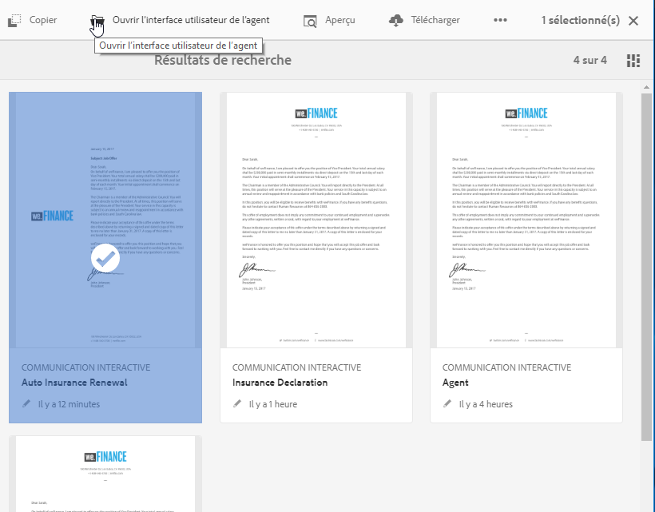
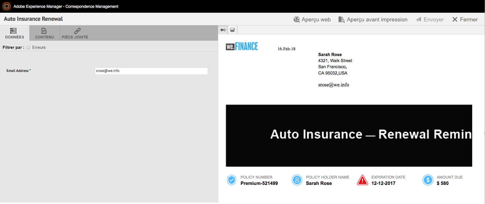
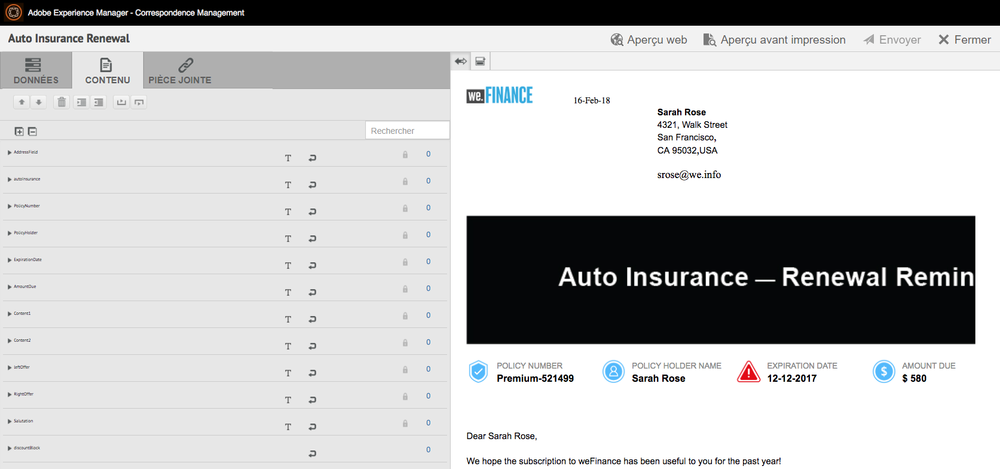
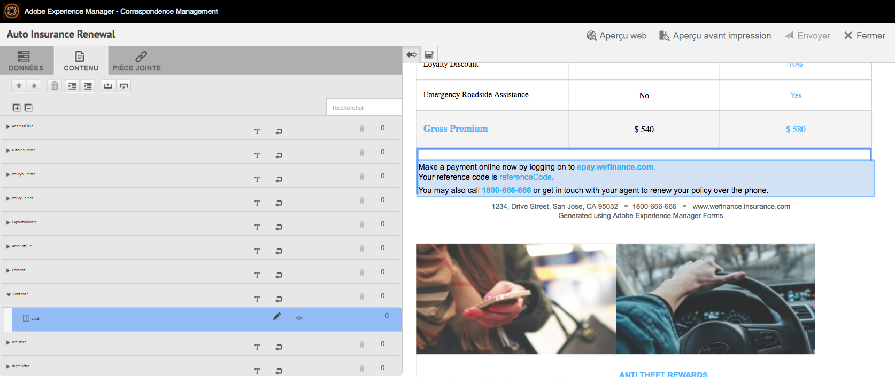
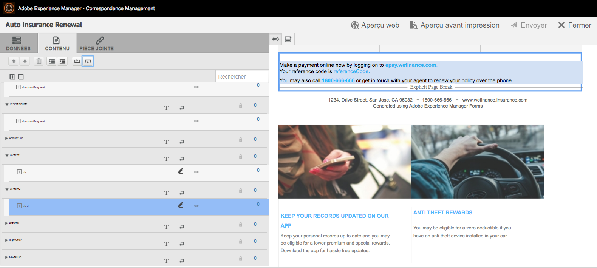
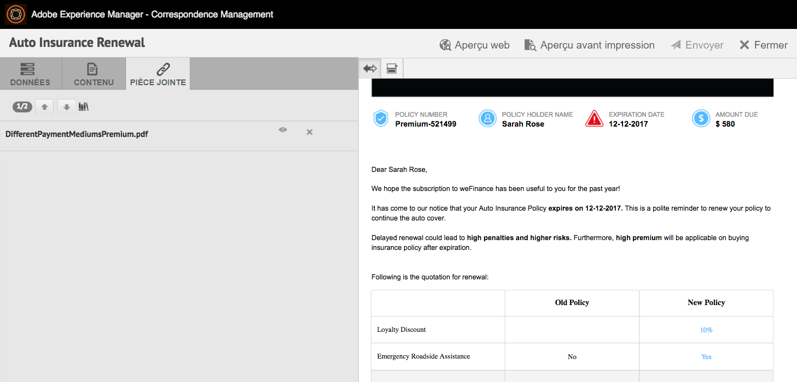
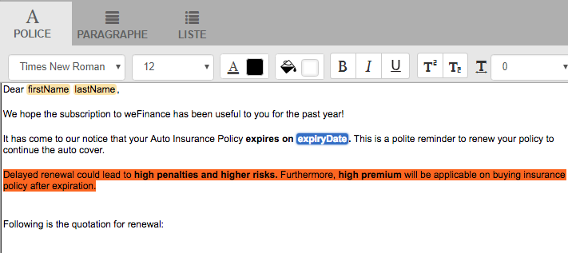
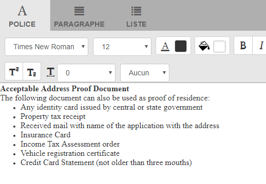

# Préparation et envoi d’une communication interactive à l’aide de l’interface utilisateur de l’agent {#prepare-and-send-interactive-communication-using-the-agent-ui}

L’interface utilisateur de l’agent permet aux agents de préparer et d’envoyer la communication interactive au post-traitement. L’agent apporte les modifications nécessaires dans la mesure du possible et envoie la communication interactive en post-traitement, comme un courrier électronique ou une impression.

## Présentation {#overview}

Une fois la communication interactive créée, l’agent peut ouvrir la communication interactive dans l’interface utilisateur de l’agent et préparer une copie spécifique au destinataire en saisissant des données et en gérant le contenu et les pièces jointes. Enfin, l’agent peut envoyer la communication interactive à un post-traitement.

Lors de la préparation de la communication interactive à l’aide de l’interface utilisateur de l’agent, l’agent gère les aspects suivants de la communication interactive dans l’interface utilisateur de l’agent avant de l’envoyer en post-traitement :

* **Données** : l’onglet Données de l’interface utilisateur de l’agent affiche toutes les variables modifiables par l’agent et les propriétés du modèle de données du formulaire non verrouillées dans la communication interactive. Ces variables/propriétés sont créées lors de la modification ou de la création de fragments de documents inclus dans la communication interactive. L’onglet Données comprend également tous les champs intégrés dans le modèle de canal d’impression/XDP. L’onglet Données s’affiche uniquement lorsqu’il existe des variables, des propriétés de modèle de données de formulaire ou des champs de la communication interactive modifiables par l’agent.
* **Contenu** : dans l’onglet Contenu, l’agent gère le contenu, tel que des fragments de documents et des variables de contenu dans la communication interactive. L’agent peut apporter les modifications au fragment de document comme autorisé lors de la création de la communication interactive dans les propriétés de ces fragments de document. L’agent peut également réorganiser, ajouter/supprimer un fragment de document et ajouter des sauts de page, si cela est autorisé.
* **Pièces jointes**: L’onglet Pièces jointes apparaît dans l’interface utilisateur de l’agent uniquement si la communication interactive comporte des pièces jointes ou si l’agent a accès à la bibliothèque. L’agent peut être autorisé ou non à modifier les pièces jointes.

## Préparation de la communication interactive à l’aide de l’interface utilisateur de l’agent {#prepare-interactive-communication-using-the-agent-ui}

1. Sélectionnez **[!UICONTROL Formulaires]** > **[!UICONTROL Formulaires et documents]**.
1. Sélectionnez la communication interactive appropriée et appuyez sur **[!UICONTROL Ouvrir l’interface utilisateur de l’agent]**.

   >[!NOTE]
   >
   >L’interface utilisateur de l’agent ne fonctionne que si la communication interactive sélectionnée comporte un canal d’impression.

   

   En fonction du contenu et des propriétés de la communication interactive, l’interface utilisateur de l’agent affiche les trois onglets suivants : Données, Contenu et Pièces jointes.

   

   Procédez à la saisie des données, à la gestion du contenu et à la gestion des pièces jointes.

### Saisir des données {#enter-data}

1. Dans l’onglet Données, saisissez les données pour les variables, les propriétés du modèle de données de formulaire et les champs du modèle d’impression (XDP), selon les besoins. Renseignez tous les champs obligatoires marqués d’un astérisque (&amp;ast;) pour activer la variable **Envoyer** bouton .

   Appuyez sur une valeur de champ de données dans l’aperçu de la communication interactive pour mettre en surbrillance le champ de données correspondant dans l’onglet Données ou vice versa.

### Gérer le contenu {#manage-content}

Dans l’onglet Contenu, vous pouvez gérer du contenu, tel que des fragments de documents et des variables de contenu dans la communication interactive.

1. Sélectionnez **[!UICONTROL Contenu]**. L’onglet Contenu de la communication interactive s’affiche.

   

1. Modifiez les fragments de document, selon les besoins, dans l’onglet Contenu. Pour mettre l’accent sur le fragment approprié dans la hiérarchie de contenu, vous pouvez appuyer sur la ligne ou le paragraphe approprié dans l’aperçu de la communication interactive ou appuyer directement sur le fragment dans la hiérarchie Contenu .

   Par exemple, le fragment de document avec la ligne « Effectuer un paiement en ligne dès maintenant… » est sélectionné dans l’aperçu du graphique ci-dessous et le même fragment de document est sélectionné dans l’onglet Contenu.

   

   Dans l’onglet Contenu ou Données, en appuyant sur Mettre en surbrillance les modules sélectionnés dans le contenu ( ) dans le coin supérieur gauche de l’aperçu, vous pouvez activer ou désactiver la fonctionnalité d’accès au fragment de document lorsque le texte, le paragraphe ou le champ de données approprié est sélectionné ou sélectionné dans l’aperçu.

   Les fragments autorisés à être modifiés par l’agent lors de la création de la communication interactive ont l’option Modifier le contenu sélectionné ( ). Appuyez sur l’icône Modifier le contenu sélectionné pour lancer le fragment en mode édition et y apporter des modifications. Utilisez les options suivantes pour formater et gérer le texte :

   * [Options de mise en forme](#formattingtext)

      * [Copier-coller du texte formaté depuis d’autres applications](#pasteformattedtext)
      * [Parties du texte en surbrillance](#highlightemphasize)
   * [Caractères spéciaux](#specialcharacters)
   * [Raccourcis clavier](/help/forms/using/keyboard-shortcuts.md)

   Pour plus d’informations sur les actions disponibles pour divers fragments de document dans l’interface utilisateur de l’agent, voir [Actions et informations disponibles dans l’interface utilisateur de l’agent](#actionsagentui).

1. Pour ajouter un saut de page à la sortie imprimée de la communication interactive, placez le curseur à l’endroit où vous souhaitez insérer un saut de page et sélectionnez Saut de page avant ou Saut de page après ( ).

   Un espace réservé explicite de saut de page est inséré dans la communication interactive. Pour voir comment un saut de page explicite affecte la communication interactive, reportez-vous à l’aperçu avant impression.

   

   Procédez à la gestion des pièces jointes de la communication interactive.

### Gestion des pièces jointes {#manage-attachments}

1. Sélectionner **[!UICONTROL Pièce jointe]**. L’interface utilisateur de l’agent affiche les pièces jointes disponibles de la manière dont elles ont été configurées lors de la création de la communication interactive.

   Vous pouvez choisir de ne pas envoyer de pièce jointe avec la communication interactive en appuyant sur l’icône d’affichage et vous pouvez appuyer sur la croix dans la pièce jointe pour la supprimer (si l’agent est autorisé à supprimer ou masquer la pièce jointe) de la communication interactive. Pour les pièces jointes spécifiées comme obligatoires, lors de la création de la communication interactive, les icônes Afficher et Supprimer sont désactivées.

   

1. Appuyez sur Accès à la bibliothèque ( ) pour accéder à la bibliothèque de contenu afin d’insérer des ressources DAM en tant que pièces jointes.

   >[!NOTE]
   >
   >L’icône Accès à la bibliothèque n’est disponible que si l’accès à la bibliothèque a été activé lors de la création de la communication interactive (dans les propriétés Conteneur de document du canal d’impression).

1. Si l’ordre des pièces jointes n’a pas été verrouillé lors de la création de la communication interactive, vous pouvez réorganiser les pièces jointes en sélectionnant une pièce jointe et en appuyant sur les flèches haut et bas.
1. Utilisez Aperçu web et Aperçu avant impression pour voir si les deux sorties sont conformes à vos besoins.

   Si vous trouvez les aperçus satisfaisants, appuyez sur **[!UICONTROL Envoyer]** pour envoyer/envoyer la communication interactive à un post-traitement. Ou, pour apporter des modifications, quittez l’aperçu pour revenir à la modification.

## Formatage du texte {#formattingtext}

Lors de l’édition d’un fragment de texte dans l’interface utilisateur de l’agent, la barre d’outils change en fonction du type d’édition que vous choisissez d’effectuer (Police, Paragraphe ou Liste) :

 

Barre d’outils de la police

Barre d’outils Paragraphe

Barre d’outils de la liste

### Mettre des parties de texte en surbrillance/en évidence {#highlightemphasize}

Pour mettre des parties de texte en surbrillance\en évidence dans un fragment modifiable, sélectionnez le texte et appuyez sur Couleur de surbrillance.

### Coller le texte formaté {#pasteformattedtext}

### Insérer des caractères spéciaux dans le texte {#specialcharacters}

L’interface utilisateur de l’agent offre une prise en charge intégrée de 210 caractères spéciaux. L’administrateur peut [ajout de la prise en charge de caractères spéciaux plus ou personnalisés par personnalisation](/help/forms/using/custom-special-characters.md).

#### Livraison des pièces jointes {#attachmentdelivery}

* Lorsque la communication interactive est rendue à l’aide des API côté serveur en tant que PDF interactif ou non interactif, le PDF rendu contient des pièces jointes en tant que pièces jointes de PDF.
* Lorsqu’un post-traitement associé à une communication interactive est chargé dans le cadre de l’option Envoyer à l’aide de l’interface utilisateur de l’agent, les pièces jointes sont transmises en tant que liste.&lt;com.adobe.idp.document> paramètre inAttachmentDocs .
* Les processus du mécanisme de livraison, tels que l’envoi par courrier électronique et l’impression, livrent les pièces jointes avec la version PDF de la communication interactive.

## Actions et informations disponibles dans l’interface utilisateur de l’agent {#actionsagentui}

### Fragments de document {#document-fragments}

* **Flèches haut/bas** : flèches permettant de déplacer les fragments de document vers le haut ou vers le bas dans la communication interactive.
* **Supprimer** : si cela est autorisé, supprimez le fragment de document de la communication interactive.
* **Saut de page avant** (applicable aux modules enfant de la zone cible) : insère un saut de page avant le fragment de document.
* **Retrait** : augmente ou réduit le retrait d’un fragment de document.
* **Saut de page après** (applicable pour les fragments enfants de la zone cible) : Insère un saut de page après le fragment de document.

* Modification (fragments de texte uniquement) : ouvrez l’éditeur de texte enrichi pour modifier le fragment de document texte. Pour plus d’informations, voir [Formatage de texte](#formattingtext).

* Sélection (icône représentant un œil) : inclut\exclut le fragment de document de la communication interactive.
* Valeurs vides (information) : indique le nombre de variables vides dans le fragment de document.

### Fragments de document de la liste {#list-document-fragments}

* Insertion d’une ligne vide : permet d’insérer une nouvelle ligne vide.
* Sélection (icône représentant un œil) : inclut\exclut le fragment de document de la communication interactive.
* Ignorer les puces/numérotations : permet d’ignorer les puces/numéros dans le fragment de document de la liste.
* Valeurs vides (information) : indique le nombre de variables vides dans le fragment de document.
