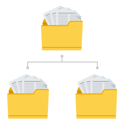

# Présentation de Process Reporting {#introduction-to-process-reporting}

>[!CAUTION]
>
>AEM 6.4 a atteint la fin de la prise en charge étendue et cette documentation n’est plus mise à jour. Pour plus d’informations, voir notre [période de support technique](https://helpx.adobe.com/fr/support/programs/eol-matrix.html). Rechercher les versions prises en charge [here](https://experienceleague.adobe.com/docs/?lang=fr).

Process Reporting est un outil de navigateur que vous utilisez pour créer et afficher des rapports sur les processus et tâches AEM Forms.

La création de rapports de processus fournit un ensemble de rapports d’usine qui vous permettent de filtrer, d’afficher des informations sur les processus à long terme, la durée de processus et le volume de workflow.

De plus, Process Reporting fournit une interface permettant d’exécuter des requêtes ad hoc et d’intégrer des vues de rapports personnalisées dans l’interface utilisateur Process Reporting.

Pour obtenir la liste des navigateurs pris en charge, voir [Plateformes prises en charge par AEM Forms](/help/forms/using/aem-forms-jee-supported-platforms.md).

Process Reporting est construit sur des modules qui permettent de :

* Lire les données de processus de la base de données AEM Forms.
* Publier des données de processus dans un référentiel Process Reporting incorporé.
* Fournir une interface utilisateur de navigateur pour afficher les rapports.

## Fonctionnalités essentielles {#key-capabilities}

### Création de rapports permanents {#always-on-reporting}

Affichez la liste des processus à long terme, des graphiques de durée de processus et exécutez des requêtes personnalisées à l’aide de filtres.

Process Reporting offre également la possibilité d’exporter le rapport et les données de requête au format CSV.

### Rapports ad hoc {#adhoc-reports}

Utilisez des filtres pour obtenir une vue spécifique des données.

Vous pouvez rechercher des processus ou des tâches par identifiant, durée, dates de début et de fin, initiateur de processus, etc..

Vous pouvez combiner plusieurs filtres pour créer des rapports spécifiques.

Vous pouvez ensuite enregistrer les filtres de rapport pour les exécuter à une date ou une heure ultérieure.

### Historique des processus/tâches {#process-task-history}

Les serveurs AEM Forms exécutent de nombreux processus en parallèle. Ces processus continuent de passer d’un statut à un autre. En publiant des données Forms dans le référentiel Process Reporting à intervalles réguliers, Process Reporting conserve les informations de transition sur les processus en cours d’exécution dans AEM Forms.

### Contrôle d’accès {#access-control-br}

Process Reporting permet d’accéder à l’interface utilisateur en fonction des autorisations.

Cela signifie que seuls les utilisateurs disposant d’autorisations de création de rapports ont accès à l’interface utilisateur Process Reporting.
