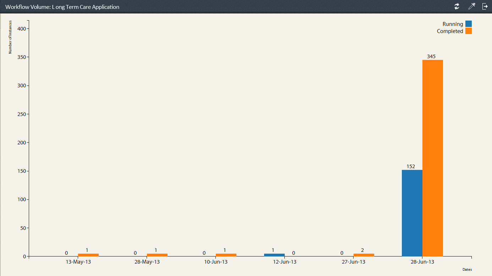

# Rapports prédéfinis dans le Rapports de processus {#pre-defined-reports-in-process-reporting}

Le Rapports de processus AEM Forms est livré avec les rapports *prêts à l’emploi* suivants :

* **[Processus](/help/forms/using/process-reporting/pre-defined-reports-in-process-reporting.md#p-long-running-processes-p)** à long terme : Rapport de tous les processus AEM Forms dont l’exécution a pris plus d’un temps spécifié

* **[Graphique](/help/forms/using/process-reporting/pre-defined-reports-in-process-reporting.md#p-process-duration-report-br-p)** de durée du processus : Rapport d’un processus AEM Forms spécifié par durée

* **[Volume](/help/forms/using/process-reporting/pre-defined-reports-in-process-reporting.md#p-workflow-volume-report-p)** de flux de travaux : Rapport des instances en cours d’exécution et terminées d’un processus spécifié par date

## Processus à long terme {#long-running-processes}

Le rapport Processus à long terme affiche les processus AEM Forms dont l’exécution a pris plus d’un temps spécifié.

### Pour exécuter un rapport de processus à long terme {#to-execute-a-long-running-process-report-br}

1. Pour vue de la liste des rapports prédéfinis dans le Rapports de processus, sur la vue de l&#39;arborescence **Rapports de processus**, cliquez sur le noeud **Rapports**.
1. Cliquez sur le noeud de rapport **Processus à long terme**.

   

   Lorsque vous sélectionnez un rapport, le panneau **Paramètres du rapport** s&#39;affiche à droite de la vue de l&#39;arborescence.

   

   Paramètres:

   * **Durée** (*obligatoire*) : Spécifiez une durée et une unité de temps. Affichez tous les processus AEM Forms qui ont été exécutés pendant plus de la durée spécifiée.
   * **Démarré après**  (*facultatif*) : Sélectionnez une date. Filtrez le rapport pour afficher les instances de processus démarrées après la date spécifiée.
   * **Démarré avant**  (*facultatif*) : Sélectionnez une date. Filtrez le rapport pour afficher les instances de processus démarrées avant la date spécifiée.

1. Cliquez sur **Aller** pour exécuter le rapport.

   Le rapport s’affiche dans le panneau **Rapport** à droite de la fenêtre **Rapports de processus**.

   

   Utilisez les options situées dans le coin supérieur droit du panneau **Rapport** pour effectuer les opérations suivantes sur le rapport.

   * **Actualiser** : Actualise le rapport avec les dernières données stockées dans l&#39;enregistrement
   * **Modifier la couleur** de la légende : Sélectionner et modifier la couleur de la légende du rapport
   * **Exporter au format CSV** : Exportez et téléchargez les données du rapport dans un fichier séparé par des virgules.

## Rapport Durée du processus {#process-duration-report-br}

Le rapport Durée du processus affiche le nombre d’instances d’un processus Forms par nombre de jours d’exécution de chaque instance.

### Pour exécuter un rapport Durée du processus {#to-execute-a-process-duration-report-br}

1. Pour vue des rapports prédéfinis dans le Rapports de processus, sur la vue **Rapports de processus** de l&#39;arborescence, cliquez sur le noeud **Rapports**.
1. Cliquez sur le noeud de rapport **Durée des processus**.

   

   Lorsque vous sélectionnez un rapport, le panneau **Paramètres du rapport** s&#39;affiche à droite de la vue de l&#39;arborescence.

   

   Paramètres:

   * **Sélectionnez Processus**  (*obligatoire*) : Sélectionnez un processus AEM Forms.

1. Cliquez sur **Aller** pour exécuter le rapport.

   Le rapport s’affiche dans le panneau **Rapport** à droite de la fenêtre Rapports de processus.

   

   Utilisez les options situées dans le coin supérieur droit du panneau **Rapport** pour effectuer les opérations suivantes sur le rapport.

   * **Actualiser** : Actualise le rapport avec les dernières données stockées dans l&#39;enregistrement
   * **Modifier la couleur** de la légende : Sélectionner et modifier la couleur de la légende du rapport
   * **Exporter au format CSV** : Exportez et téléchargez les données du rapport dans un fichier séparé par des virgules.

## Rapport Volume de flux de travail {#workflow-volume-report}

Le rapport Volume de flux de travail affiche le nombre d’instances en cours d’exécution et terminées d’un processus AEM Forms par jour calendaire.

### Pour exécuter un rapport Volume de flux de travail {#to-execute-a-workflow-volume-report-br}

1. Pour vue des rapports prédéfinis dans le Rapports de processus, sur la vue **Rapports de processus** de l&#39;arborescence, cliquez sur le noeud **Rapports**.
1. Cliquez sur le noeud de rapport **Volume de flux de travail**.

   

   Lorsque vous sélectionnez un rapport, le panneau **Paramètres du rapport** s&#39;affiche à droite de la vue de l&#39;arborescence.

   

   Paramètres:

   * **Sélectionnez Processus** (*obligatoire*) : Sélectionnez un processus AEM Forms.
   * **Démarré après**  (*facultatif*) : Sélectionnez une date. Filtres le rapport pour afficher les instances de processus qui ont commencé après la date spécifiée.
   * **Démarré avant**  (*facultatif*) : Sélectionnez une date. Filtres le rapport pour afficher les instances de processus qui ont commencé avant la date spécifiée.

1. Cliquez sur **Aller** pour exécuter le rapport.

   Le rapport s’affiche dans le panneau **Rapport** à droite de la fenêtre **Rapports de processus**.

   

   Utilisez les options situées dans le coin supérieur droit du panneau **Rapport** pour effectuer les opérations suivantes sur le rapport.

   * **Actualiser** : Actualise le rapport avec les dernières données stockées dans l&#39;enregistrement
   * **Modifier la couleur** de la légende : Sélectionner et modifier la couleur de la légende du rapport
   * **Exporter au format CSV** : Exportez et téléchargez les données du rapport dans un fichier séparé par des virgules.

