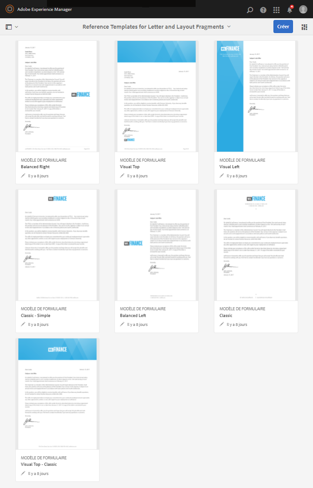

# Modèles de lettres de référence {#reference-letter-templates}

>[!CAUTION]
>
>AEM 6.4 a atteint la fin de la prise en charge étendue et cette documentation n’est plus mise à jour. Pour plus d’informations, voir notre [période de support technique](https://helpx.adobe.com/fr/support/programs/eol-matrix.html). Rechercher les versions prises en charge [here](https://experienceleague.adobe.com/docs/?lang=fr).

Dans Correspondence Management, un modèle de lettre contient des champs de formulaire classiques, des fonctions de mise en page (en-têtes et pieds de page, par exemple) et des « zones cibles » vides où placer du contenu.

Correspondence Management fournit des modèles de lettre dans le package AEM Forms [Package de module complémentaire AEM Forms](https://experienceleague.adobe.com/docs/experience-manager-release-information/aem-release-updates/forms-updates/aem-forms-releases.html?lang=fr). Pour installer un package, voir [Utilisation de packages](/help/sites-administering/package-manager.md). Vous pouvez personnaliser les modèles dans Designer en fonction de vos besoins de marque et d’entreprise. Le package comprend les modèles suivants :

* Classique
* Classique simple
* Équilibré à gauche
* Équilibré à droite
* Visuel gauche
* Visuel haut
* Visuel haut - Classic

Une fois le package installé, les modèles de mise en page (XDP) sont répertoriés dans le dossier templates à l’emplacement suivant :

`https://[server]:[port]/[context-root]/aem/forms.html/content/dam/formsanddocuments/templates-folder`

Vous trouverez ci-dessous les champs communs à tous les modèles de ce package :

* Date 
* Salutations
* Texte de fermeture
* Texte de signature

Après l’installation du package AEM-FORMS-6.3-REFERENCE-LAYOUT-TEMPLATES, les modèles sont répertoriés dans le dossier templates-folder

## Classique {#classic}

Avec un logo au-dessus, le modèle Classic convient à une lettre professionnelle simple.

Aperçu PDF d’une lettre créée à l’aide du modèle Classic

## Classique simple {#classic-simple}

Comprend des champs permettant de saisir le numéro de téléphone et l’adresse électronique. Un modèle classique simple est similaire au modèle classique, sauf qu’il ne contient pas de champs dans lesquels vous pouvez saisir l’adresse du destinataire.

Aperçu PDF d’une lettre créée à l’aide du modèle classique simple

## Équilibré à gauche {#balanced-left}

Le modèle Équilibré à gauche comprend le logo à gauche de la lettre.

Aperçu PDF d’une lettre créée à l’aide du modèle Équilibré à gauche

## Équilibré à droite {#balanced-right}

Le modèle Équilibré à droite comporte le logo de la société à gauche et fournit un espace pour la saisie de l’adresse des destinataires dans la lettre elle-même. Le modèle Equilibré à droite comprend également un pied de page qui se répète lorsque votre lettre comporte plusieurs pages.

Aperçu PDF d’une lettre créée à l’aide du modèle Équilibré à droite

## Visuel gauche {#visual-left}

Le modèle Visuel gauche comporte un en-tête latéral sur la gauche de la page avec le logo de la société placé sur l’en-tête latéral. Le modèle Visuel gauche comporte un champ d’objet mais pas de pied de page.

Aperçu PDF d’une lettre créée à l’aide du modèle Visuel gauche

## Visuel haut {#visual-top}

Le modèle Visuel haut comporte une marge visuelle en haut. Le modèle Visuel haut comporte un champ permettant de saisir l’adresse du destinataire sur la page elle-même. Le modèle En haut visuel comporte le champ d’objet et un pied de page qui se redéploie pour les lettres qui s’étendent sur plusieurs pages.

Aperçu PDF d’une lettre créée à l’aide du modèle Visuel haut

## Visuel haut - Classic {#visual-top-classic}

Le modèle Visuel haut - Classic comporte un en-tête en haut de la page avec le logo de l’entreprise. Le modèle Visuel haut - Classique comporte un champ pour saisir un objet, mais pas de pied de page.

Aperçu PDF d’une lettre créée à l’aide du modèle Visuel haut - Classique
