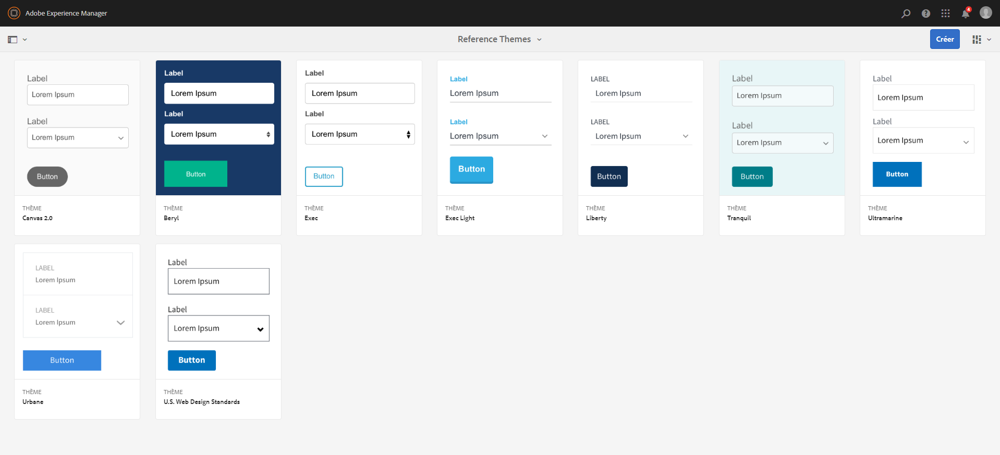
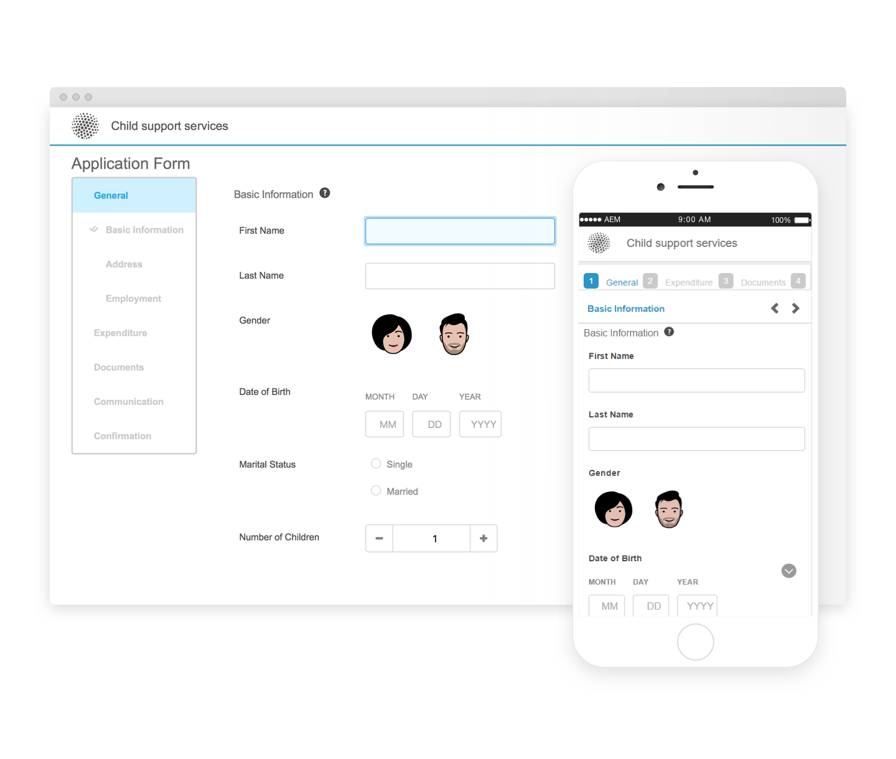

# Thèmes de référence {#reference-themes}

>[!CAUTION]
>
>AEM 6.4 a atteint la fin de la prise en charge étendue et cette documentation n’est plus mise à jour. Pour plus d’informations, voir notre [période de support technique](https://helpx.adobe.com/fr/support/programs/eol-matrix.html). Rechercher les versions prises en charge [here](https://experienceleague.adobe.com/docs/?lang=fr).

Les [thèmes](/help/forms/using/themes.md) vous permettent de styliser vos formulaires sans aucune connaissance approfondie de CSS. En plus du thème par défaut, vous pouvez obtenir les thèmes suivants en installant le [package complémentaire AEM Forms](https://experienceleague.adobe.com/docs/experience-manager-release-information/aem-release-updates/forms-updates/aem-forms-releases.html?lang=fr) :

* Beryl
* Exec
* Exec-Light
* Liberty
* Ultramarine
* Urbane
* U.S. Web Design Standards
* Tranquil

Chaque thème contient un style unique et élégant que vous pouvez utiliser pour créer des formulaires adaptatifs attrayants pour vos utilisateurs. Il contient des styles uniques pour les sélecteurs tels que le panneau, la zone de texte, la zone numérique, le bouton radio, le tableau et le commutateur. Les styles de ces thèmes sont basés sur les besoins. Par exemple, dans un scénario particulier, vous avez besoin d’un thème minimaliste avec des polices propres. Le thème Liberté permet d&#39;obtenir cet aspect.

Les thèmes inclus dans ce module sont réactifs et la mise en forme de ces thèmes est définie pour les affichages mobiles et de bureau. La plupart des navigateurs modernes sur différents périphériques peuvent sans problème rendre des formulaires auxquels est appliqué l’un de ces thèmes.

Pour plus d’informations sur l’installation du package, voir [Comment travailler avec les packages](/help/sites-administering/package-manager.md).

## Beryl {#beryl}

Le thème Beryl est utilisé par [Formulaire adaptatif We.Gov](/help/forms/using/gov-reference-site-walkthrough.md), et met l’accent sur l’utilisation de l’image d’arrière-plan, de la transparence et des grandes icônes aplaties. Dans la capture d’écran ci-dessous, vous pouvez voir à quoi ressemble le thème Beryl, et comment il peut augmenter le style de votre formulaire.

[Cliquez pour agrandir](assets/beryl-1.png)

## Exec {#exec}

Le thème Exec évite les remplissages d’arrière-plan solides pour mettre en évidence les composants de formulaire. La sélection et le clic sur des composants modifient les couleurs de police. Par rapport au thème Canevas par défaut, la couleur de police du texte dans l’onglet sélectionné passe au bleu foncé. Notez la différence entre les boutons de navigation et d’envoi et le thème Beryl.

[Cliquez pour agrandir](assets/exec-1.png)

## Exec Light {#exec-light}

Le thème Exec Light utilise l’espace blanc pour créer une expérience transparente. Les boutons Suivant et Envoyer ont un remplissage plein et une ombre 3D. Les onglets sélectionnés sur la gauche ont une flèche au lieu de deux coches.

[Cliquez pour agrandir](assets/exec-light-1.png)

## Liberty {#liberty}

Le thème de la liberté utilise une approche minimaliste pour mettre en évidence l&#39;important. Par exemple, la couleur de police de l’onglet visité passe au vert. Vous ne pouvez afficher que le contour inférieur de la zone de texte qui imite l’aspect d’un formulaire papier avec des lignes. La principale zone de texte a un contour inférieur noir tandis que d’autres ont un contour inférieur gris clair.

[Cliquez pour agrandir](assets/liberty-1.png)

## Tranquil {#tranquil}

Le thème Tranquil fournit des nuances claires et sombres du jeu de couleurs Tranquil pour mettre en évidence différents composants d’un formulaire. Par exemple, les boutons radio, les panneaux et les onglets ont une nuance de vert différente.

[Cliquez pour agrandir](assets/tranquil-1.png)

## Ultramarine {#ultramarine}

Le thème Ultramarine utilise des nuances bleues profondes pour mettre en surbrillance les composants tels que les onglets, les panneaux, les zones de texte et les boutons.

## Urbane {#urbane}

Le thème Urbane met en évidence une apparence minimaliste et fonctionnelle de votre formulaire. Lorsque vous appliquez le thème Urbane à votre formulaire, vous pouvez voir que les composants sont aplatis. Les panneaux reçoivent des contours fins pour créer un aspect moderne.

[Cliquez pour agrandir](assets/urbane-1.png)

## U.S. Web Design Standards {#u-s-web-design-standards}

Le thème U.S. Web Design Standards, comme le nom l’indique, utilise les polices et les styles décrits sur le site Draft U.S. Web Design Standards. La norme Web est utilisée par les organisations fédérales pour créer des contenus Web homogènes sur les sites Web du gouvernement fédéral américain.

[Cliquez pour agrandir](assets/usgov.png)
