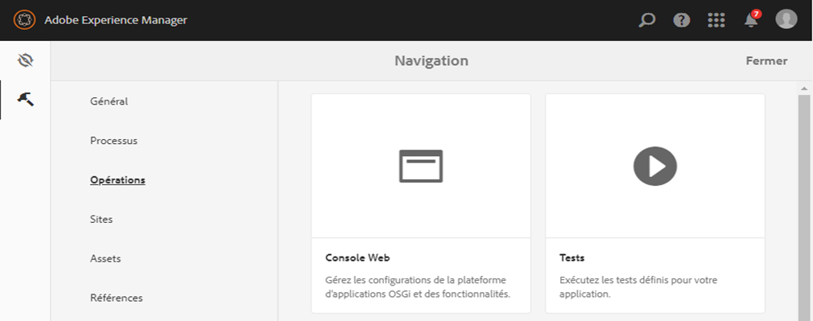

# Autorisation d’accès à l’éditeur de règles pour des groupes d’utilisateurs sélectionnés {#grant-rule-editor-access-to-select-user-groups}

## Présentation {#overview}

Plusieurs types d’utilisateurs dotés de différentes compétences peuvent utiliser les formulaires adaptatifs. Les utilisateurs chevronnés peuvent avoir les connaissances requises pour utiliser des scripts et des règles complexes. Toutefois, certains utilisateurs peu expérimentés utilisent uniquement les propriétés de mise en page et de base des formulaires adaptatifs.

AEM Forms permet de limiter l’accès à l’éditeur de règles des utilisateurs selon leur rôle ou fonction. Dans les paramètres du service de configuration des formulaires adaptatifs, vous pouvez spécifier les [groupes d’utilisateurs](/help/sites-administering/security.md) qui pourront afficher l’éditeur de règles et y accéder.

## Spécification des groupes d’utilisateurs qui peuvent accéder à l’éditeur de règles {#specify-user-groups-that-can-access-rule-editor}

1. Connectez-vous à AEM Forms en tant qu’administrateur.
1. In the author instance, click Adobe Experience Manager > Tools  > Operations > Web Console. La console Web s’ouvre dans une nouvelle fenêtre.

   

1. In Web Console Window, locate and click **Adaptive Form Configuration Service**. **La boîte de dialogue Service** de configuration de formulaire adaptatif s’affiche. Ne modifiez aucune valeur puis cliquez sur **Enregistrer**.

   Vous créez ainsi un fichier /apps/system/config/com.adobe.aemds.guide.service.impl.AdaptiveFormConfigurationServiceImpl.config dans le référentiel CRX.

1. Connectez-vous à CRDXE en tant qu’administrateur. Ouvrez le fichier /apps/system/config/com.adobe.aemds.guide.service.impl.AdaptiveFormConfigurationServiceImpl.config pour le modifier.
1. Utilisez la propriété suivante pour spécifier le nom d’un groupe pouvant accéder à l’éditeur de règles (par exemple, RuleEditorsUserGroup) et cliquez sur **Enregistrer tout**.

   `af.ruleeditor.custom.groups=["RuleEditorsUserGroup"]`

   Pour autoriser l’accès à plusieurs groupes, spécifiez une liste de valeurs séparées par des virgules :

   `af.ruleeditor.custom.groups=["RuleEditorsUserGroup", "PermittedUserGroup"]`

   

   Now, when a user that is not a part of the specified user group (here RuleEditorsUserGroup) taps a field, the Edit Rule icon ( ) is not available for her in the components toolbar:

   

   Barre d’outils de composants comme visible pour un utilisateur ayant un accès à l’éditeur de règles

   

   Barre d’outils de composants comme visible pour un utilisateur sans accès à l’éditeur de règles

   For instructions on adding users to groups, see [User Administration and Security](/help/sites-administering/security.md).

