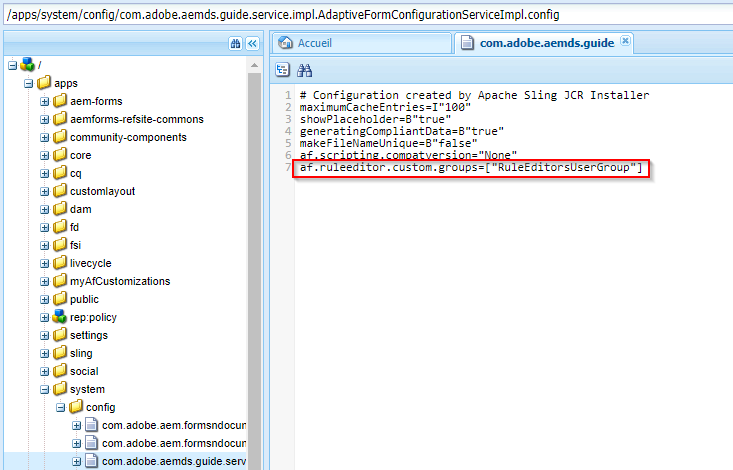

# Autorisation d’accès à l’éditeur de règles pour des groupes d’utilisateurs sélectionnés {#grant-rule-editor-access-to-select-user-groups}

>[!CAUTION]
>
>AEM 6.4 a atteint la fin de la prise en charge étendue et cette documentation n’est plus mise à jour. Pour plus d’informations, voir notre [période de support technique](https://helpx.adobe.com/fr/support/programs/eol-matrix.html). Rechercher les versions prises en charge [here](https://experienceleague.adobe.com/docs/?lang=fr).

## Présentation {#overview}

Vous pouvez avoir différents types d’utilisateurs avec des compétences variées qui fonctionnent avec le Forms adaptatif. Les utilisateurs chevronnés peuvent avoir les connaissances requises pour utiliser des scripts et des règles complexes. Toutefois, certains utilisateurs peu expérimentés utilisent uniquement les propriétés de mise en page et de base des formulaires adaptatifs.

AEM Forms permet de limiter l’accès à l’éditeur de règles des utilisateurs selon leur rôle ou fonction. Dans les paramètres du service de configuration des formulaires adaptatifs, vous pouvez spécifier les [groupes d’utilisateurs](/help/sites-administering/security.md) qui pourront afficher l’éditeur de règles et y accéder.

## Spécification des groupes d’utilisateurs qui peuvent accéder à l’éditeur de règles {#specify-user-groups-that-can-access-rule-editor}

1. Connectez-vous à AEM Forms en tant qu’administrateur.
1. Dans l’instance d’auteur, cliquez sur Adobe Experience Manager > Outils  > Opérations > Console web. La console web s’ouvre dans une nouvelle fenêtre.

   

1. Dans la fenêtre de la console web, recherchez et cliquez sur **[!UICONTROL Configuration de canal web du formulaire adaptatif et de la communication interactive]**. La boîte de dialogue **[!UICONTROL Configuration de canal web du formulaire adaptatif et de la communication interactive]** sʼaffiche. Ne modifiez aucune valeur, puis cliquez sur **[!UICONTROL Enregistrer]**.

   Il crée un fichier /apps/system/config/com.adobe.aemds.guide.service.impl.AdaptiveFormConfigurationServiceImpl.config dans le référentiel CRX.

1. Connectez-vous à CRXDE en tant qu’administrateur. Ouvrez le fichier /apps/system/config/com.adobe.aemds.guide.service.impl.AdaptiveFormConfigurationServiceImpl.config pour le modifier.
1. Utilisez la propriété suivante pour spécifier le nom d’un groupe pouvant accéder à l’éditeur de règles (par exemple, RuleEditorsUserGroup) et cliquez sur **Enregistrer tout**.

   `af.ruleeditor.custom.groups=["RuleEditorsUserGroup"]`

   Pour autoriser l’accès à plusieurs groupes, spécifiez une liste de valeurs séparées par des virgules :

   `af.ruleeditor.custom.groups=["RuleEditorsUserGroup", "PermittedUserGroup"]`

   

   Désormais, lorsqu’un utilisateur qui ne fait pas partie du groupe d’utilisateurs spécifié (ici RuleEditorsUserGroup) clique sur un champ, l’icône Modifier la règle ( ) n’est pas disponible pour elle dans la barre d’outils des composants :

   

   Barre d’outils de composants comme visible pour un utilisateur ayant un accès à l’éditeur de règles

   

   Barre d’outils de composants comme visible pour un utilisateur sans accès à l’éditeur de règles

   Pour obtenir des instructions sur l’ajout d’utilisateurs aux groupes, voir [Administration et sécurité des utilisateurs](/help/sites-administering/security.md).
