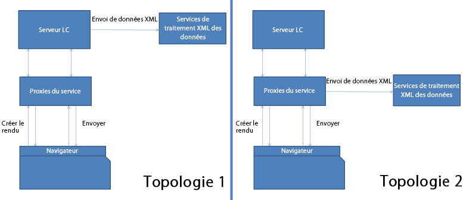

# Proxy de service de formulaires HTML5 {#html-forms-service-proxy}

>[!CAUTION]
>
>AEM 6.4 a atteint la fin de la prise en charge étendue et cette documentation n’est plus mise à jour. Pour plus d’informations, voir notre [période de support technique](https://helpx.adobe.com/fr/support/programs/eol-matrix.html). Rechercher les versions prises en charge [here](https://experienceleague.adobe.com/docs/?lang=fr).

Le proxy de service de HTML5 forms est une configuration permettant d’enregistrer un proxy pour le service d’envoi. Pour configurer le proxy de service, spécifiez l’URL du service d’envoi via le paramètre de requête *submissionServiceProxy*.

## Avantages du proxy de service {#benefits-of-service-proxy-br}

Le proxy de service élimine les opérations suivantes :

* Le processus de HTML5 forms nécessite l’ouverture du service d’envoi &quot;/content/xfaforms/submission/default&quot; pour les utilisateurs de HTML5 forms. Il expose les serveurs AEM à une audience plus large et sans intention particulière.
* L’URL du service est incorporée dans le modèle d’exécution du formulaire. Il n’est pas possible de modifier le chemin d’accès à l’URL du service.
* L’envoi est un processus en deux étapes. Pour l’envoi de données au formulaire, au moins deux voyages vers le serveur sont nécessaires. Par conséquent, augmente la charge sur le serveur.
* Les formulaires HTML5 envoient des données dans la demande de post-traitement au lieu de la demande PDF. Pour le flux de travail impliquant des formulaires PDF et HTML5, deux méthodes différentes sont nécessaires pour traiter les envois.

## Topologies {#topologies-br}

HTML5 forms peut utiliser les topologies suivantes pour se connecter aux serveurs AEM.

* Une topologie dans laquelle AEM Server ou HTML5 forms envoient des données au serveur via POST.
* Une topologie dans laquelle le serveur proxy envoie des données de post-traitement au serveur.

Topologies du proxy de service de formulaires HTML5

Les formulaires HTML5 se connectent aux serveurs AEM pour exécuter les scripts, les services web et les envois côté serveur. L’exécution XFA des formulaires HTML5 utilise des appels Ajax sur l’extrémité « /bin/xfaforms/submitaction » avec divers paramètres permettant de se connecter aux serveurs AEM. HTML5 forms connecte AEM serveurs pour effectuer les opérations suivantes :

### Exécution des scripts et des services web côté serveur {#execute-server-sided-scripts-and-web-services}

Les scripts marqués pour exécution sur le serveur sont appelés scripts côté serveur. Le tableau suivant répertorie tous les paramètres utilisés dans les scripts et services web côté serveur.

<table> 
 <tbody> 
  <tr> 
   <td>
<strong>Paramètre</strong>
 </td> 
   <td>
<strong>Description</strong>
 </td> 
  </tr> 
  <tr> 
   <td>
activité
 </td> 
   <td>
Activité contient les événements qui déclenchent la requête. Par exemple, cliquer, quitter ou modifier
 </td> 
  </tr> 
  <tr> 
   <td>
contextSom
 </td> 
   <td>
contextSom contient l’expression SOM de l’objet où les événements sont exécutés.
 </td> 
  </tr> 
  <tr> 
   <td>
Modèle
 </td> 
   <td>
Le modèle contient le modèle utilisé pour générer le formulaire.
 </td> 
  </tr> 
  <tr> 
   <td>
contentRoot
 </td> 
   <td>
contentRoot contient le répertoire racine du modèle utilisé pour générer le formulaire.
 </td> 
  </tr> 
  <tr> 
   <td>
Données
 </td> 
   <td>
Les données contiennent des octets de données utilisés pour générer le formulaire.
 </td> 
  </tr> 
  <tr> 
   <td>
formDom
 </td> 
   <td>
formDom contient le DOM du formulaire HTML5 au format JSON.
 </td> 
  </tr> 
  <tr> 
   <td>
packet
 </td> 
   <td>
packet est spécifié sous forme de formulaire.
 </td> 
  </tr> 
  <tr> 
   <td>
debugDir
 </td> 
   <td>
debugDir contient le répertoire de débogage utilisé pour générer le formulaire.
 </td> 
  </tr> 
 </tbody> 
</table>

### Envoi de données {#submit-data}

En cliquant sur le bouton Envoyer, les formulaires HTML5 envoient des données au serveur. Le tableau suivant répertorie tous les paramètres que HTML5 forms envoie au serveur.

<table> 
 <tbody> 
  <tr> 
   <td>
<strong>Paramètre</strong>
 </td> 
   <td>
<strong>Description</strong>
 </td> 
  </tr> 
  <tr> 
   <td>
Modèle
 </td> 
   <td>
Modèle utilisé pour générer le formulaire.
 </td> 
  </tr> 
  <tr> 
   <td>
contentRoot
 </td> 
   <td>
répertoire racine du modèle utilisé pour générer le formulaire.
 </td> 
  </tr> 
  <tr> 
   <td>
Données
 </td> 
   <td>
octets de données utilisés pour générer le formulaire.
 </td> 
  </tr> 
  <tr> 
   <td>
formDom
 </td> 
   <td>
DOM du formulaire HTML5 au format JSON.
 </td> 
  </tr> 
  <tr> 
   <td>
submiturl
 </td> 
   <td>
URL à laquelle les données XML sont publiées.
 </td> 
  </tr> 
  <tr> 
   <td>
debugDir
 </td> 
   <td>
Répertoire de débogage utilisé pour générer le formulaire.
 </td> 
  </tr> 
 </tbody> 
</table>

### Comment fonctionne le proxy d’envoi ? {#how-nbsp-the-nbsp-submit-proxy-works}

Le proxy de service d’envoi agit comme une transmission si submiturl n’est pas présent dans le paramètre de requête. Il agit comme une passerelle. Il envoie la requête au point d’entrée //bin/xfaforms/submitaction et la réponse à l’exécution XFA.

Le proxy de service d’envoi sélectionne une topologie si submiturl figure dans le paramètre de requête.

* Si AEM serveurs publient les données, le service proxy agit comme une transmission. Il envoie la requête à l’extrémité //bin/xfaforms/submitaction et la réponse à l’exécution XFA.
* Si le proxy publie les données, le service de proxy transmet tous les paramètres, à l’exception de submitUrl, à l’extrémité */bin/xfaforms/submitaction* et reçoit des octets XML dans le flux de réponse. Ensuite, le service de proxy publie les octets XML de données au paramètre submitUrl pour traitement.

* Avant d’envoyer des données (demande de POST) à un serveur, HTML5 forms vérifie la connectivité et la disponibilité du serveur. Pour vérifier la connectivité et la disponibilité, les formulaires HTML envoient une première demande vide au serveur. Si le serveur est disponible, les formulaires HTML5 envoie les données (demande de post-traitement) au serveur. Sinon, le message d’erreur *Could’t connect to the server* (connexion au serveur impossible) s’affiche. La détection anticipée prévient les problèmes lors du remplissage du formulaire par les utilisateurs. La servlet de proxy gère la requête HEAD et ne lance aucune exception.
