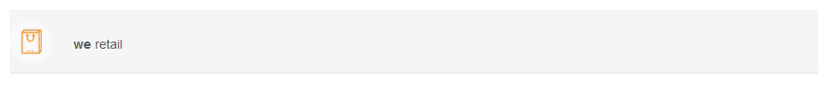
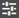

# Donner un style à votre formulaire adaptatif {#do-not-publish-style-your-adaptive-form}

>[!CAUTION]
>
>AEM 6.4 a atteint la fin de la prise en charge étendue et cette documentation n’est plus mise à jour. Pour plus d’informations, voir notre [période de support technique](https://helpx.adobe.com/fr/support/programs/eol-matrix.html). Rechercher les versions prises en charge [here](https://experienceleague.adobe.com/docs/?lang=fr).

Découvrez comment créer un thème personnalisé, mettre en forme des composants individuels et utiliser des polices web dans un thème

Ce tutoriel est une étape dans la [Créer votre premier formulaire adaptatif](create-your-first-adaptive-form.md) série. Il est recommandé de suivre la série dans un ordre chronologique pour comprendre, exécuter et démontrer le cas d’utilisation complet du tutoriel.

## À propos du tutoriel  {#about-the-tutorial}

Vous pouvez utiliser des thèmes pour donner un aspect et un style uniques à un formulaire adaptatif. Vous pouvez appliquer des thèmes prêts à l’emploi fournis avec l’éditeur de formulaires adaptatifs ou créer vos propres thèmes personnalisés. AEM Forms fournit une [éditeur de thèmes](themes.md) pour créer des thèmes personnalisés. Un seul thème peut donner une apparence différente au même formulaire adaptatif ouvert sur un appareil mobile, une tablette ou un ordinateur de bureau. Aucune connaissance préalable de CSS ou LESS n’est requise pour utiliser l’éditeur de thème, mais elle est souhaitée.

À la fin du tutoriel, vous apprendrez à :

* Application d’un thème prêt à l’emploi à un formulaire adaptatif
* Création d’un thème pour le formulaire adaptatif à l’aide de l’éditeur de thème
* Style des composants individuels
* Section bonus : Utilisation des polices web dans un thème personnalisé

Une fois le tutoriel terminé, le formulaire se présente comme suit :

## Avant de commencer {#before-you-start}

Téléchargez les images de style d’en-tête et de logo, comme illustré ci-dessous, sur votre ordinateur local. L’en-tête du formulaire adaptatif `shipping-address-add-update-form` utilise les images de style d’en-tête et de logo. L’image de style d’en-tête s’affiche à droite de l’en-tête.

[Obtenir le fichier](assets/header-style.png)

[Obtenir le fichier](assets/logo-1.png)

## Étape 1 : Application d’un thème à votre formulaire adaptatif {#step-apply-a-theme-to-your-adaptive-form}

L’éditeur de formulaires adaptatifs fournit plusieurs thèmes prêts à l’emploi. Si vous envisagez de ne pas utiliser de style personnalisé pour votre formulaire adaptatif, vous pouvez également publier vos formulaires adaptatifs avec un thème prêt à l’emploi. Les thèmes sont indépendants des formulaires adaptatifs. Vous pouvez appliquer le même thème à plusieurs formulaires adaptatifs. Pour appliquer un thème à un formulaire adaptatif :

1. Ouvrez le formulaire adaptatif pour le modifier.

   [http://localhost:4502/editor.html/content/forms/af/shipping-address-add-update-form.html](http://localhost:4502/editor.html/content/forms/af/shipping-address-add-update-form.html)

1. Ouvrir les propriétés de **Conteneur de formulaires adaptatifs**. Dans l’explorateur de propriétés, accédez à **De base** > **Thème de formulaire adaptatif**. Le champ **Thème de formulaire adaptatif** répertorie tous les thèmes prêts à l’emploi et personnalisés. Par défaut, le thème Zone de travail est appliqué.
1. Sélectionnez un thème dans la **Thème de formulaire adaptatif** champ . Par exemple : **Thème Enquête**. Cliquez sur  pour appliquer le thème sélectionné.

**Illustration :** *formulaire adaptatif avec le thème par défaut*.

**Illustration :** *formulaire adaptatif avec le thème Enquête*.

## Étape 2 : Mettre à jour votre formulaire adaptatif {#step-update-your-adaptive-form}

La conception affichée ci-dessus nécessite des modifications du texte et du logo de l’espace réservé de votre formulaire adaptatif existant. Effectuez les étapes suivantes pour faire les changements nécessaires :

1. Modifiez le logo existant et le texte de l’en-tête. Pour supprimer le logo :

   1. Ouvrez le formulaire dans l’éditeur de formulaire.

      [http://localhost:4502/editor.html/content/forms/af/shipping-address-add-update-form.html](http://localhost:4502/editor.html/content/forms/af/shipping-address-add-update-form.html)

   1. Cliquez sur l’image du logo dans le composant d’en-tête, puis sur Propriétés . Dans la propriété image, appuyez sur X pour supprimer l’image du logo existant.
   1. Cliquez sur charger, sélectionnez le fichier logo.png, puis cliquez sur  pour enregistrer les modifications. L’image a été téléchargée dans la section [Avant de commencer](/help/forms/using/style-your-adaptive-form.md#before-you-start).
   1. Cliquez sur le texte de l’en-tête, `We.Retail`, puis sur  **modifier**. Modifiez le texte de l’en-tête par `we retail`. Appliquez le format Gras uniquement à `we` dans `we retail`.

   

1. Supprimez le titre et ajouter un texte d’espace réservé :

   1. Cliquez sur le champ identifiant de client et sur Propriétés .
   1. Copiez le contenu du champ **Titre** dans le champ **Texte d’espace réservé**.
   1. Supprimez le contenu du champ **Titre** et cliquez sur .
   1. Répétez les trois étapes précédentes pour toutes les zones de texte, la zone numérique et le champ d’adresse électronique du formulaire.

   

## Étape 3 : Création d’un thème personnalisé pour votre formulaire adaptatif {#step-create-a-custom-theme-for-your-adaptive-form}

Vous pouvez utiliser [éditeur de thèmes](/help/forms/using/themes.md) pour créer des thèmes personnalisés. L’éditeur de thèmes est un éditeur WYSIWYG tout puissant. Il s’agit d’une méthode visuelle pour appliquer une page CSS à différents composants d’un formulaire adaptatif. Il fournit des commandes plus précises pour appliquer un style aux composants et aux panneaux d’un formulaire adaptatif.

Un thème est une entité distincte comme les formulaires adaptatifs. Il contient des styles (CSS) pour les composants et les panneaux d’un formulaire adaptatif. Les styles incluent les propriétés CSS telles que les couleurs d’arrière-plan, les couleurs d’état, la transparence, l’alignement et la taille. Lorsque vous appliquez un thème, le style spécifié est appliqué aux composants correspondants d’un formulaire adaptatif.

Dans ce tutoriel, vous allez mettre en forme l’en-tête et le pied de page, les composants texte et numériques, les composants de pièce jointe et les boutons. Commençons par la création d’ un thème :

### Création d’un thème {#create-a-theme}

1. Connectez vous à l’instance de création AEM et accédez à **Adobe Experience Manager** > **Forms** > **Thèmes**. L’URL par défaut est [http://localhost:4502/aem/forms.html/content/dam/formsanddocuments-themes](http://localhost:4502/aem/forms.html/content/dam/formsanddocuments-themes).
1. Appuyez sur **[!UICONTROL Créer]** et sélectionnez **[!UICONTROL Thème]**. La page Créer un thème s’affiche avec les champs requis pour créer un thème. Les champs Titre et Nom sont obligatoires :

   * **Titre :** spécifiez le titre du thème. Par exemple : **Thème global.** Le titre vous permet d’identifier le thème dans la liste des thèmes.
   * **Nom :** spécifiez le nom du thème. Par exemple : **Thème global.** Un noeud portant le nom spécifié est créé dans le référentiel. Lorsque vous commencez à saisir un titre, la valeur du champ de nom est automatiquement générée. Vous pouvez modifier la valeur suggérée. Le champ Nom ne peut contenir que des caractères alphanumériques, des tirets et des traits de soulignement. Toutes les entrées non valides sont remplacées par un trait d’union.

1. Appuyez sur **Créer**. Un thème est créé et une boîte de dialogue pour ouvrir le formulaire à modifier s’affiche. Cliquez sur **Ouvrir** pour ouvrir le thème créé dans un nouvel onglet. Le thème s’ouvre dans l’éditeur de thèmes. Pour la mise en forme, l’éditeur de thèmes utilise un formulaire adaptatif prêt à l’emploi fourni avec AEM Forms.

   Pour plus d’informations sur l’utilisation de l’interface utilisateur de l’éditeur de thèmes, voir [À propos de l’éditeur de thèmes](/help/forms/using/themes.md#aboutthethemeeditor).

1. Appuyez sur **Options du thème**  > **Configurer**. Dans le champ **Prévisualisation du formulaire**, sélectionnez le formulaire adaptatif **shipping-address-add-update-form**, cliquez sur  et sur **Enregistrer**. L’éditeur de thème est maintenant configuré pour utiliser votre propre formulaire adaptatif au lieu du formulaire adaptatif par défaut. Appuyez sur **Annuler** pour revenir à l’éditeur de thèmes.

   

   **Illustration :** *éditeur de thèmes avec le formulaire adaptatif shipping-address-add-update-form*.

   

   **Illustration :** *formulaire adaptatif avec le formulaire par défaut*.

### En-tête et pied de page de style {#style-header-and-footer}

L’en-tête et le pied de page donnent un aspect cohérent et distinctif à un formulaire adaptatif. En règle générale, l’en-tête contient le logo et le nom de l’organisation, le pied de page contient des informations de copyright, qui restent identiques dans plusieurs formes d’une organisation. Pour mettre en forme l’en-tête et le pied de page du formulaire adaptatif shipping-address-add-update-form :

1. Accédez au **En-tête** > **Texte** dans le panneau Sélecteurs. Le panneau Sélecteurs se trouve à gauche de l’éditeur de thèmes. Si le panneau n’est pas visible, appuyez sur  Active/désactive le panneau latéral.

1. Définissez les propriétés suivantes dans l’accordéon **Texte** et cliquez sur .

   | Propriété | Valeur |
   |---|---|
   | Famille de polices | Arial |
   | Couleur de la police | FFFFFF |
   | Taille de police | 54 px |

1. Cliquez sur le widget d’en-tête, puis sur **En-tête**. Les options permettant d’appliquer un style au widget En-tête s’affichent à gauche. Développez l’accordéon **Dimensions et position**, définissez la **Hauteur** sur `120px`, puis cliquez sur .
1. Développez l’accordéon Arrière-plan du widget d’en-tête, définissez la **couleur d’arrière-plan** sur `F6921E.`.

   Pointez sur **Image et dégradé** > **+ Ajouter** et cliquez sur **Image**. Définissez les propriétés suivantes et cliquez sur .

   | Propriété | Valeur |
   |---|---|
   | image | Téléchargez le fichier header-style.png. L’image a été téléchargée dans la section [Avant de commencer](/help/forms/using/style-your-adaptive-form.md#before-you-start). |
   | Position | En bas à droite |
   | Mosaïque | Pas de répétition |

1. Dans l’éditeur de thème, appuyez sur le logo dans l’en-tête puis appuyez sur **Logo de l’en-tête**. Développez l’accordéon Dimensions et position, définissez les propriétés suivantes, puis cliquez sur .

<table> 
 <tbody> 
  <tr> 
   <td>Marge</td> 
   <td>Valeur</td> 
  </tr> 
  <tr> 
   <td>Marge</td> 
   <td> 
    <ul> 
     <li>Haut : 1,5 rem</li> 
     <li>Bas : -35px</li> 
     <li>Gauche : 1 rem<strong>  </strong></li> 
    </ul> 
<strong>Conseil :</strong> appuyez sur l’icône de lien pour fournir une valeur différente à chaque champ.  
 </td> 
  </tr> 
  <tr> 
   <td>Hauteur</td> 
   <td>4.75rem</td> 
  </tr> 
 </tbody> 
</table>

1. Appuyez sur le widget de pied de page, puis sur **Pied de page**. Développez l’accordéon **Arrière-plan**, définissez la **Couleur d’arrière-plan** sur `F6921E`, puis cliquez sur .

### Donner un style au composant de capture de données et appliquer un arrière-plan au formulaire adaptatif {#style-the-data-capture-component-and-apply-a-background-to-the-adaptive-form}

Vous pouvez utiliser plusieurs composants dans un formulaire adaptatif pour capturer des données. Par exemple, la zone de texte et la zone numérique. Vous pouvez fournir un style identique à tous les composants de capture de données ou un style distinct pour chaque composant. Dans ce didacticiel, un style identique est appliqué aux zones numériques (ID client, Code postal) et aux zones de texte (ID client, Nom, Adresse de livraison, État, Adresse électronique). Pour appliquer un style aux composants de capture de données :

1. Cliquez sur le champ ID de client et sur l’option **Widget de champ**. Définissez les propriétés suivantes et cliquez sur .

<table> 
 <tbody> 
  <tr> 
   <td>Accordéon</td> 
   <td>Propriété</td> 
   <td>Valeur</td> 
  </tr> 
  <tr> 
   <td>Bordure</td> 
   <td>Couleur de la bordure</td> 
   <td>A7A9AC</td> 
  </tr> 
  <tr> 
   <td>Bordure</td> 
   <td>Rayon de bordure </td> 
   <td> 
    <ul> 
     <li>Haut : 7 px  </li> 
     <li>Droite : 7 px  </li> 
     <li>Bas : 7 px  </li> 
     <li>Left : 7 px  </li> 
    </ul> </td> 
  </tr> 
  <tr> 
   <td>Texte</td> 
   <td>Famille de polices</td> 
   <td>Arial</td> 
  </tr> 
  <tr> 
   <td>Texte</td> 
   <td>Couleur de la police</td> 
   <td>939598  </td> 
  </tr> 
  <tr> 
   <td>Texte</td> 
   <td>Taille de police</td> 
   <td>18 px</td> 
  </tr> 
  <tr> 
   <td>Dimensions et position</td> 
   <td>Largeur</td> 
   <td>60%</td> 
  </tr> 
  <tr> 
   <td>Dimensions et position</td> 
   <td>Marge</td> 
   <td> 
    <ul> 
     <li>Gauche : 10 rem</li> 
    </ul> </td> 
  </tr> 
 </tbody> 
</table>

1. Cliquez sur la zone vide au-dessus du champ ID de client, puis sur **Conteneur de panneau en responsive design**. Définissez **Arrière-plan** > **Couleur d’arrière-plan** sur F1F2F2. Cliquez sur .

   

### Application d’un style aux boutons {#style-the-buttons}

Vous pouvez utiliser un thème personnalisé pour appliquer un style identique à tous les boutons du formulaire adaptatif et un [style en ligne](/help/forms/using/inline-style-adaptive-forms.md) pour appliquer un style à un bouton spécifique. Pour appliquer un style aux boutons :

1. Appuyez sur le bouton **Envoyer** et appuyez sur l’option **Bouton**. Définissez les propriétés suivantes et cliquez sur .

<table> 
 <tbody> 
  <tr> 
   <td>Accordéon</td> 
   <td>Propriété</td> 
   <td>Valeur</td> 
  </tr> 
  <tr> 
   <td>Arrière-plan</td> 
   <td>Couleur d’arrière-plan</td> 
   <td>F6921E</td> 
  </tr> 
  <tr> 
   <td>Bordure  </td> 
   <td>Couleur de la bordure</td> 
   <td>F6921E</td> 
  </tr> 
  <tr> 
   <td>Bordure</td> 
   <td>Rayon de bordure </td> 
   <td> 
    <ul> 
     <li>Haut : 7 px  </li> 
     <li>Droite : 7 px  </li> 
     <li>Bas : 7 px  </li> 
     <li>Left : 7 px</li> 
    </ul> </td> 
  </tr> 
  <tr> 
   <td>Texte  </td> 
   <td>Famille de polices</td> 
   <td>Arial</td> 
  </tr> 
  <tr> 
   <td>Texte</td> 
   <td>Couleur de la police</td> 
   <td>FFFFFF</td> 
  </tr> 
  <tr> 
   <td>Texte</td> 
   <td>Taille de police</td> 
   <td>18 px</td> 
  </tr> 
 </tbody> 
</table>

1. [Application du thème personnalisé](/help/forms/using/style-your-adaptive-form.md#step-apply-a-theme-to-your-adaptive-form), Thème global, à votre formulaire adaptatif. Si le style ne se reflète pas sur le formulaire adaptatif, videz le cache du navigateur et réessayez.

   

## Étape 4 : Style des composants individuels {#step-style-individual-components}

Certains styles s’appliquent uniquement à un composant spécifique. Ces composants sont stylisés dans l’éditeur de formulaires adaptatifs.

1. Ouvrez le formulaire adaptatif pour le modifier. [http://localhost:4502/editor.html/content/forms/af/shipping-address-add-update-form.html](http://localhost:4502/editor.html/content/forms/af/change-billing-shipping-address.html)
1. Dans la barre supérieure, sélectionnez l’option **Style**.

   

1. Cliquez sur le bouton **Joindre** et sur l’icône . Définissez les propriétés suivantes dans l’accordéon **Dimensions et position** :

   | Propriété | Valeur |
   |---|---|
   | Flottant | Gauche |
   | Largeur | 10% |

1. Cliquez sur l’option **Preuve d’adresse approuvée par le gouvernement** et sur l’icône . Définissez les propriétés suivantes :

<table> 
 <tbody> 
  <tr> 
   <td>Accordéon</td> 
   <td>Propriété</td> 
   <td>Valeur</td> 
  </tr> 
  <tr> 
   <td>Dimensions et position</td> 
   <td>Flottant</td> 
   <td>Gauche</td> 
  </tr> 
  <tr> 
   <td>Dimensions et position</td> 
   <td>Largeur</td> 
   <td>73%</td> 
  </tr> 
  <tr> 
   <td>Dimensions et position</td> 
   <td>Remplissage</td> 
   <td> 
    <ul> 
     <li>Left : 10 px</li> 
    </ul> </td> 
  </tr> 
  <tr> 
   <td>Dimensions et position</td> 
   <td>Hauteur</td> 
   <td>40 px</td> 
  </tr> 
  <tr> 
   <td>Dimensions et position  </td> 
   <td>Marge</td> 
   <td>  
    <ul> 
     <li>Droite : 2rem</li> 
     <li>Gauche : 10 rem </li> 
    </ul> </td> 
  </tr> 
  <tr> 
   <td>Arrière-plan</td> 
   <td>Couleur d’arrière-plan</td> 
   <td>FFFFFF</td> 
  </tr> 
  <tr> 
   <td>Bordure</td> 
   <td>Largeur de bordure</td> 
   <td>1 px</td> 
  </tr> 
  <tr> 
   <td>Bordure</td> 
   <td>Style de la bordure</td> 
   <td>Solide</td> 
  </tr> 
  <tr> 
   <td>Bordure</td> 
   <td>Couleur de la bordure</td> 
   <td>A7A9AC</td> 
  </tr> 
  <tr> 
   <td>Bordure</td> 
   <td>Rayon de bordure</td> 
   <td>7 px</td> 
  </tr> 
  <tr> 
   <td>Texte</td> 
   <td>Famille de polices</td> 
   <td>Arial</td> 
  </tr> 
  <tr> 
   <td>Texte</td> 
   <td>Couleur de la police</td> 
   <td>BCBEC0</td> 
  </tr> 
  <tr> 
   <td>Texte</td> 
   <td>Taille de police</td> 
   <td>18 px</td> 
  </tr> 
  <tr> 
   <td>Texte</td> 
   <td>Hauteur de ligne</td> 
   <td>2</td> 
  </tr> 
 </tbody> 
</table>

1. Cliquez sur le bouton **Envoyer**, puis sur l’icône . Définissez les propriétés suivantes :

<table> 
 <tbody> 
  <tr> 
   <td>Accordéon</td> 
   <td>Propriété</td> 
   <td>Valeur</td> 
  </tr> 
  <tr> 
   <td>Dimensions et position</td> 
   <td>Flottant</td> 
   <td>Droite</td> 
  </tr> 
  <tr> 
   <td>Dimensions et position</td> 
   <td>Marge</td> 
   <td> 
    <ul> 
     <li>Haut : 5rem</li> 
     <li>Droite : 14 rem</li> 
     <li>Bas : 20 px</li> 
     <li>Left : 20 px  </li> 
    </ul> </td> 
  </tr> 
  <tr> 
   <td>Arrière-plan</td> 
   <td>Couleur d’arrière-plan</td> 
   <td>F6921E</td> 
  </tr> 
  <tr> 
   <td>Bordure</td> 
   <td>Couleur de la bordure</td> 
   <td>F6921E</td> 
  </tr> 
 </tbody> 
</table>

## Étape 5 : Section bonus : Utilisation de polices web dans un thème personnalisé {#step-bonus-section-using-web-fonts-in-a-custom-theme}

Vous pouvez utiliser différentes polices pour concevoir un formulaire adaptatif. Les polices utilisées pour concevoir le formulaire adaptatif peuvent ne pas être utilisées pour tous les périphériques sur lesquels le formulaire adaptatif est affiché. Vous pouvez utiliser un service de polices web pour fournir les polices requises à lʼappareil cible.

Adobe Typekit est un service de polices web. Vous pouvez configurer et utiliser le service avec les formulaires adaptatifs. Pour utiliser Adobe Typekit dans un formulaire adaptatif :

>[!NOTE]
>
> Typekit s’appelle désormais Adobe Fonts et est fourni avec Creative Cloud et d’autres abonnements. [En savoir plus](https://fonts.adobe.com/).

1. Créez un [Adobe Typekit](https://typekit.com/) créer un kit, ajouter la police Myriad Pro au kit, publier le kit et obtenir l’identifiant du kit. Il est nécessaire d’utiliser les polices Adobe Typekit (polices web) dans un formulaire adaptatif.
1. Dans le serveur AEM Forms, accédez à  **Adobe Experience Manager** > **Outils**  > **Déploiement** > **Cloud Services**. Sur la page Cloud Services, accédez à **Services tiers** > **Typekit**, puis cliquez sur **Configurer** Maintenant sous Typekit. Si une configuration est déjà disponible, cliquez sur le bouton + pour créer une nouvelle instance.

   Dans la boîte de dialogue Créer une configuration, donnez un **titre** à la configuration, puis cliquez sur **Créer**. Vous êtes redirigé sur la page de configuration. Dans la boîte de dialogue Modifier le composant qui s’affiche, indiquez votre **ID de kit**, puis cliquez sur **OK**.

1. Configurez votre thème pour utiliser la configuration TypeKit. Dans l’instance d’auteur, ouvrez un **thème global** dans l’éditeur de thèmes. Dans l’éditeur de thèmes, cliquez sur Options du thème > Configurer. Dans **Configuration de Typekit** , sélectionnez le kit, puis cliquez sur **Enregistrer**.

   Les polices ajoutées au Typekit peuvent être sélectionnées dans le **Texte** de tous les composants.
