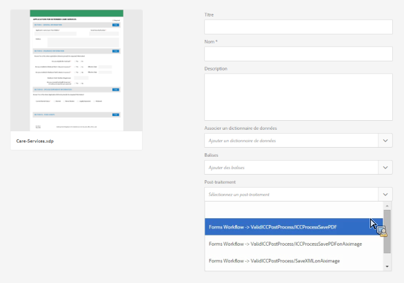

# Post-traitement des lettres et communications interactives {#post-processing-of-letters-and-interactive-communications}

## Post-traitement {#post-processing}

Les agents peuvent associer et exécuter les flux de travaux de post-traitement sur les lettres et les communications interactives. Le post-traitement à exécuter peut être sélectionné dans la vue Propriétés du modèle de lettre. Vous pouvez configurer des post-traitements pour envoyer par courrier électronique, imprimer, télécopier ou archiver vos lettres finales.

Pour associer les post-traitements aux lettres et communications interactives, vous devez commencer par configurer les post-traitements. Deux types de workflows peuvent être exécutés sur les lettres envoyées :

1. **Forms Workflow :** Il s’agit des processus de gestion des processus d’AEM Forms on JEE. Instructions de configuration [Forms Workflow](#formsworkflow).

1. **AEM Workflow :** AEM workflows peuvent également être utilisés comme post-traitements pour les lettres envoyées. Instructions de configuration [Processus AEM](/help/forms/using/aem-forms-workflow.md).

## Processus des formulaires {#formsworkflow}

1. Dans AEM, ouvrez Configuration de la console web Adobe Experience Manager pour votre serveur à l’aide de l’URL suivante : `https://<server>:<port>/<contextpath>/system/console/configMgr`

   

1. Sur cette page, recherchez la configuration du SDK de client AEM Forms et développez-la en cliquant dessus.
1. Dans l’URL du serveur, saisissez le nom de votre serveur AEM Forms on JEE, puis cliquez sur **Enregistrer**.

   

1. Indiquez le nom d’utilisateur et le mot de passe.
1. Assurez-vous que sun.util.calendar est ajouté à la configuration du pare-feu de désérialisation.

   Accédez à Configuration du pare-feu de désérialisation et, sous les classes Placées sur la liste autorisée de préfixes de package, ajoutez sun.util.calendar.

1. Désormais, vos serveurs sont mappés et les post-traitements dans AEM Forms on JEE sont disponibles dans l’interface utilisateur d’AEM lors de la création de lettres.

   

1. Pour authentifier un processus/service, copiez le nom d’un processus et retournez sur la page Configurations de la console Web Adobe Experience Manager > Configuration du SDK de client Adobe AEM Forms et ajoutez le processus en tant que nouveau service.

   Par exemple, si la liste déroulante de la page Propriétés de la lettre affiche le nom du processus comme Forms Workflow -> ValidCCPostProcess/SaveXML, ajoutez un Nom de service comme `ValidCCPostProcess/SaveXML`.

1. Pour utiliser les flux de travaux AEM Forms on JEE pour le post-traitement, configurez les paramètres et les sorties nécessaires. Les valeurs par défaut des paramètres sont indiquées ci-dessous.

   Accédez à la page Configurations de la console web Adobe Experience Manager > **[!UICONTROL Configurations de Correspondence Management]** et configurez les paramètres suivants :

   1. **inPDFDoc (paramètre de document du PDF) :** Un document de PDF comme entrée. Cette entrée contient la lettre générée comme entrée. Les noms de paramètre indiqués peuvent être configurés. Ils peuvent être configurés depuis les configurations de Correspondence Management, sous Configuration.
   1. **inXMLDoc (paramètre de données XML) :** Un document XML en entrée. Cette entrée contient les données saisies par l’utilisateur sous la forme XML.
   1. **inXDPDoc (paramètre de document XDP) :** Un document XML en entrée. Cette entrée contient la mise en page sous-jacente (XDP).
   1. **inAttachmentDocs (paramètre de documents joints) :** Un paramètre d’entrée de liste. Cette entrée contient toutes les pièces jointes comme entrée.
   1. **redirectURL (sortie de l’URL de redirection) :** Un type de sortie indiquant l’URL vers laquelle rediriger la page.

   Votre processus des formulaires doit présenter un paramètre de document PDF ou un paramètre de données XML en tant qu’entrée avec un nom identique à celui spécifié dans les **[!UICONTROL configurations de Correspondence Management]**. Ces informations sont requises pour que le processus soit répertorié dans la liste déroulante Post-traitement.

## Paramètres de l’instance de publication {#settings-on-the-publish-instance}

1. se connecter à `http://localhost:publishport/aem/forms`.
1. Accédez à **[!UICONTROL Lettres]** pour afficher la lettre publiée disponible sur l’instance de publication.
1. Configurez les paramètres AEM DS. Voir [Configuration des paramètres AEM DS](/help/forms/using/configuring-the-processing-server-url-.md).

>[!NOTE]
>
>Lorsque vous utilisez des processus AEM ou des formulaires, vous devez configurer le service de paramètres DS avant tout envoi depuis le serveur de publication. Dans le cas contraire, l’envoi du formulaire échouera.

## Récupération des instances de lettre {#letter-instances-retrieval}

Les instances de lettre enregistrées peuvent faire l’objet d’une manipulation supplémentaire, telle que la récupération d’instances de lettre et la suppression de celles-ci en utilisant les API ci-dessous définies dans LetterInstanceService.

<table> 
 <tbody> 
  <tr> 
   <td><strong>API côté serveur</strong></td> 
   <td><strong>Nom de l’opération</strong></td> 
   <td><strong>Description</strong></td> 
  </tr> 
  <tr> 
   <td>
Public LetterInstanceVO
 
getLetterInstance(String letterInstanceId)
 
Throws ICCException; 
 </td> 
   <td>getLetterInstance</td> 
   <td>Récupération de l’instance de lettre spécifiée </td> 
  </tr> 
  <tr> 
   <td>Public void deleteLetterInstance(String letterInstanceId) throws ICCException; </td> 
   <td>deleteLetterInstance </td> 
   <td>Suppression de l’instance de lettre spécifiée </td> 
  </tr> 
  <tr> 
   <td>List getAllLetterInstances(Query) throws ICCException; </td> 
   <td>getAllLetterInstances </td> 
   <td>Cette API récupère les instances de lettre en fonction du paramètre de requête d’entrée. Pour récupérer toutes les instances de lettre, le paramètre de requête doit être transmis comme nul.  </td> 
  </tr> 
  <tr> 
   <td>Public Boolean letterInstanceExists(String letterInstanceName) throws ICCException; </td> 
   <td>letterInstanceExists </td> 
   <td>Vérifier si une instance de lettre existe par prénom </td> 
  </tr> 
 </tbody> 
</table>

## Association d’un post-traitement à une lettre {#associating-a-post-process-with-a-letter}

Dans l’interface utilisateur CCR, effectuez les étapes suivantes pour associer un post-traitement à une lettre :

1. Pointez sur une lettre et appuyez sur **Afficher les propriétés**.
1. Sélectionnez **Modifier**.
1. Dans Propriétés de base, sélectionnez le post-traitement à associer à la lettre dans la liste déroulante Post-traitement. Les post-traitements liés aux formulaires et à AEM sont répertoriés dans la liste déroulante.
1. Appuyez sur **Enregistrer**.
1. Après avoir configuré la lettre avec le post-traitement, publiez la lettre et, sur l’instance de publication, spécifiez éventuellement l’URL de traitement dans le service Paramètres AEM DS. Cela garantit que le post-traitement est exécuté sur une instance de traitement.

## Rechargement d’une instance de lettre Brouillon {#reloaddraft}

Une instance de lettre Brouillon peut être rechargée dans l’interface utilisateur en utilisant l’URL suivante :

`https://<server>:<port>/aem/forms/`

`createcorrespondence.html?/random=$&cmLetterInstanceId=$<LetterInstanceId>`

LetterInstaceID : l’identificateur unique de l’instance de lettre envoyée.

Pour plus d’informations sur l’enregistrement d’un brouillon de lettre, voir [Enregistrement des brouillons et envoi d’instances de lettre](/help/forms/using/create-correspondence.md#savingdrafts).
