# Textes dans les communications interactives {#texts-in-interactive-communications}

Création et modification de fragments de document texte à utiliser dans les communications interactives - Texte est l’un des quatre types de fragments de document utilisés pour créer des communications interactives. Les trois autres sont des fragments de condition, de liste et de mise en page.

## Présentation {#overview}

Un fragment de document texte se compose d’un ou de plusieurs paragraphes de texte. Un paragraphe peut être statique ou dynamique. Un paragraphe dynamique peut contenir des propriétés et des variables de modèle de données de formulaire. Vous pouvez également appliquer des règles et les répéter dans un fragment de document de texte. Par exemple, le nom du client dans une formule de politesse peut être une propriété FDM (Form Data Model) dont la valeur est rendue disponible au moment de l’exécution. En modifiant ces valeurs, la même communication interactive peut être utilisée pour préparer la communication interactive pour différents clients à l’aide de l’interface utilisateur de l’agent.

Le fragment de document de texte dans Interactive Communication prend en charge le type de données dynamiques suivant :

* **Objets de modèle de données** : les propriétés des données utilisent une source de données d’arrière-plan.
* **Contenu basé sur des règles** : parties du contenu d’un texte qui apparaissent ou sont masquées en fonction d’une règle. Une règle peut également être basée sur les propriétés et variables du modèle de données de formulaire.
* **Variables** : dans le fragment de document texte, les variables ne sont pas liées à une source de données d’arrière-plan. L’agent remplit/sélectionne des valeurs dans des variables ou lie les variables aux sources de données lors de la préparation de la communication interactive pour l’envoyer à un post-processus.
* **Répétez** : Vous pouvez avoir des informations dynamiques dans votre communication interactive, telles que des transactions dans un relevé de carte de crédit, dont le nombre d&#39;occurrences peut continuer à changer avec chaque communication interactive générée. La répétition permet de mettre en forme et structurer ces informations dynamiques. Pour plus d’informations, voir [Condition en ligne et répétition](cm-inline-condition.md).

## Créer du texte {#createtext}

1. Sélectionnez **`[!UICONTROL Forms]`** > **[!UICONTROL Fragments de Document]**.
1. Sélectionnez **`[!UICONTROL Create]`** > **[!UICONTROL Texte]**.
1. Saisissez les informations suivantes :

   * **[!UICONTROL Titre]** : (Facultatif) Saisissez le titre du fragment de document de texte. Les titres ne doivent pas nécessairement être uniques et peuvent contenir des caractères spéciaux et des caractères dans une autre langue que l’anglais. Les textes sont référencés par leur titre (le cas échéant) comme dans les vignettes et les propriétés.
   * **[!UICONTROL Nom]** : Nom unique du texte, dans un dossier. Aucun fragment de document (texte, condition ou liste), quel que soit son état, ne peut porter le même nom qu’un autre fragment de document dans un dossier. Dans le champ nom, vous ne pouvez entrer que les caractères, les chiffres et les tirets d’anglais. Le champ Nom est automatiquement renseigné en fonction du champ Titre. Les caractères spéciaux, les espaces, les chiffres et les caractères non anglais saisis dans le champ Titre sont remplacés par des tirets dans le champ Nom. Bien que la valeur du champ Titre soit automatiquement copiée dans Nom, vous pouvez la modifier.
   * **[!UICONTROL Description]** : entrez une description du texte.
   * **[!UICONTROL Modèle de données de formulaire]** : facultativement, sélectionnez le bouton radio Modèle de données de formulaire pour créer le texte en fonction d’un modèle de données de formulaire. Lorsque vous sélectionnez le bouton radio Modèle de données de formulaire, le champ **[!UICONTROL Modèle de données de formulaire]** s’affiche. Recherchez et sélectionnez un modèle de données de formulaire. Lorsque vous créez un texte et une condition pour une communication interactive, veillez à utiliser le même modèle de données que celui que vous avez l’intention d’utiliser dans la communication interactive. Pour plus d’informations sur le modèle de données de formulaire, consultez la section [Intégration de données](/help/forms/using/data-integration.md).
   * **[!UICONTROL Balises]** : éventuellement, pour créer une balise personnalisée, entrez la valeur dans le champ de texte et appuyez sur Entrée. Lorsque vous enregistrez ce texte, les balises nouvellement ajoutées sont créées.

1. Appuyez sur **[!UICONTROL Next]** (Suivant).

   La page Créer du texte s’affiche. Si vous avez choisi de créer un texte basé sur un modèle de données de formulaire, les propriétés du modèle de données de formulaire s’affichent dans le volet de gauche.

1. Tapez le texte et utilisez les options suivantes pour formater et insérer des propriétés et des variables de modèle de données de formulaire dans votre texte et pour leur attribuer des conditions :

   * [Modèle de données de formulaire](#formdatamodel)
   * [Variables](#variables)
   * [Éditeur de règles](#rules)
   * [Options de mise en forme](#formatting)

      * [Copier-coller du texte formaté depuis d’autres applications](#paste)
      * [Parties du texte en surbrillance](#highlight)
   * [Répéter](/help/forms/using/cm-inline-condition.md)
   * [Caractères spéciaux](#special)
   * [Recherche et remplacement de texte](#search-features)
   * [Raccourcis clavier](/help/forms/using/keyboard-shortcuts.md)

1. Appuyez sur **[!UICONTROL Save]** (Enregistrer).

   Le texte est créé. Vous pouvez maintenant utiliser le texte comme bloc de création lors de la création d’une communication interactive.

## Modifier du texte {#edittext}

Vous pouvez modifier un fragment de document texte existant en suivant les étapes ci-dessous. Vous pouvez également choisir de modifier un fragment de document de texte dans un éditeur Interactive Communication.

1. Sélectionnez **`[!UICONTROL Forms]`** > **[!UICONTROL Fragments de Document]**.
1. Accédez à un fragment de document texte et sélectionnez-le.
1. Appuyez sur **[!UICONTROL Modifier]**.
1. Effectuez les modifications nécessaires. Pour plus d’informations sur les options dans le texte, consultez [Créer du texte](#createtext).
1. Appuyez sur **[!UICONTROL Enregistrer]** puis sur **[!UICONTROL Fermer]**.

## Personnalisation d’un fragment de document texte à l’aide de propriétés de modèle de données de formulaire {#formdatamodel}

Vous pouvez personnaliser les fragments de document texte en insérant les propriétés du modèle de données de formulaire. En insérant des propriétés de modèle de données de formulaire dans du texte, vous pouvez récupérer et renseigner des données spécifiques au destinataire à partir de la source de données associée tout en prévisualisant une communication interactive. Pour plus d’informations sur le modèle de données de formulaire, voir [Intégration de données AEM Forms](/help/forms/using/data-integration.md).

Si vous avez spécifié un modèle de données de formulaire lors de la création d’un texte, les propriétés du modèle de données de formulaire apparaissent dans le volet gauche de l’éditeur de texte. Le modèle de données de formulaire spécifié doit être identique pour le fragment de document de texte ainsi que pour la communication interactive qui l’inclut.

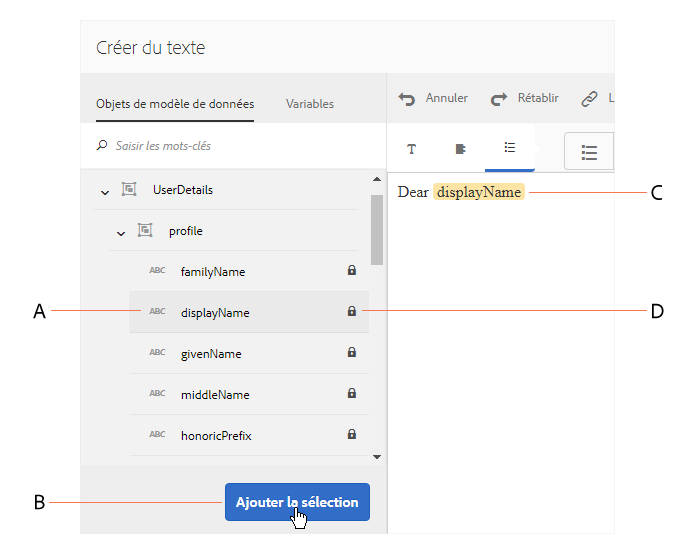

* Pour insérer une propriété FDM dans du texte, placez le curseur à l’endroit où vous souhaitez insérer la propriété, puis sélectionnez la propriété **`[A]`** dans le volet de gauche en appuyant dessus, puis appuyez sur **`[B]`** **[!UICONTROL Ajouter la sélection]**. Vous pouvez également appuyer sur la propriété en doublon pour l&#39;insérer à la position du curseur **`[C]`**. Les propriétés du modèle de données de formulaire sont mises en surbrillance dans une couleur d’arrière-plan brunâtre.

* Pour permettre aux agents de modifier la valeur d&#39;une propriété FDM dans l&#39;interface utilisateur de l&#39;agent tout en [Préparant et envoyant Interactive Communication](/help/forms/using/prepare-send-interactive-communication.md) à l&#39;aide de l&#39;interface utilisateur de l&#39;agent, appuyez sur l&#39;icône **`[D]`** de verrouillage de cette propriété et assurez-vous qu&#39;elle est à l&#39;état déverrouillé. L’état par défaut de la propriété est verrouillé et un agent ne peut pas modifier la propriété dans l’interface utilisateur de l’agent.

* 

Vous pouvez également utiliser les propriétés du modèle de données de formulaire pour construire des règles d’affichage ou de masquage de parties du contenu. Pour en savoir plus, consultez [Créer des règles dans le texte](#rules).

## Création et utilisation de variables dans un fragment de document texte {#variables}

Les variables sont des espaces réservés qui peuvent être liés lors de la création d’une communication interactive. Les variables peuvent être liées à une propriété de modèle de données de formulaire ou à un fragment de texte. Les variables peuvent également être laissées à l’agent pour qu’il les remplisse.

Vous pouvez utiliser des variables plutôt que des propriétés du modèle de données de formulaire lorsque :

* Un fragment de document texte doit être utilisé dans plusieurs communications interactives où la liaison doit être différente pour différentes communications interactives.
* Le fragment de document texte ne dispose pas de modèle de données de formulaire au moment de sa création. Vous pouvez insérer des variables et les lier ensuite aux propriétés du modèle de données du formulaire au moment de la création de la communication interactive.
* Vous devez lier et récupérer du texte à partir d’un fragment de document texte. Seuls ces fragments de document texte peuvent être liés à des variables qui ne contiennent aucune variable.

Lors de la création ou de la modification d’un fragment de document texte, vous pouvez créer et insérer des variables. Les variables que vous créez apparaissent dans l’onglet Données de l’interface utilisateur de l’agent. L&#39;agent spécifie les valeurs des variables tandis que [Préparer et envoyer la communication interactive à l&#39;aide de l&#39;interface utilisateur de l&#39;agent](/help/forms/using/prepare-send-interactive-communication.md).

### Créer des variables {#create-variables}

1. Dans le volet de gauche, appuyez sur **[!UICONTROL Variables]**.

   Le volet Variables apparaît.

   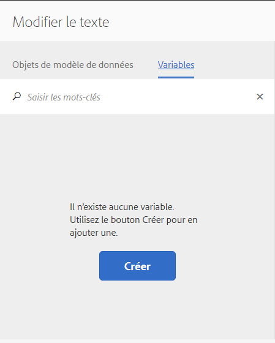

1. Appuyez sur **[!UICONTROL Créer]**. 

   Le volet Créer des variables apparaît.

1. Saisissez les informations suivantes et appuyez sur **[!UICONTROL Créer]** :

   * **[!UICONTROL Nom*]** : nom de la variable.
   * **[!UICONTROL Description]** : entrez éventuellement une description de la variable.
   * **[!UICONTROL Type*]** : sélectionnez un type de variable : Chaîne, Nombre, Valeur booléenne ou Date.
   * **[!UICONTROL Autoriser les valeurs spécifiques uniquement]** : pour les variables de type Chaîne et Nombre, vous pouvez garantir que l’agent choisisse parmi un ensemble spécifique de valeurs pour un espace réservé dans l’interface utilisateur de l’agent. Pour spécifier le jeu de valeurs, sélectionnez cette option, puis spécifiez des valeurs séparées par des virgules qui sont autorisées dans le champ **[!UICONTROL Valeurs]**.

1. Appuyez sur **[!UICONTROL Créer]**. 

   La variable est créée et répertoriée dans le volet Variables.

1. Pour insérer une variable dans le texte, placez le curseur à l’endroit approprié, sélectionnez la variable et appuyez sur **[!UICONTROL Ajouter la sélection]**.

   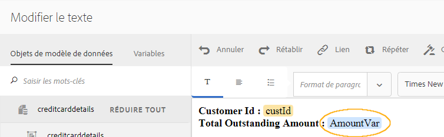

   Les variables sont mises en surbrillance sur fond bleu clair, tandis que les propriétés du modèle de données de formulaire sont mises en surbrillance en brunâtre.

1. Appuyez sur **[!UICONTROL Save]** (Enregistrer).

## Créer des règles dans le texte {#rules}

L’éditeur de règles dans un texte permet de créer des règles pour afficher ou masquer des chaînes de texte ou des éléments de contenu en fonction de **conditions prédéfinies**. Ces conditions peuvent être construites en fonction des éléments suivants :

* Chaînes
* Nombres
* Expression mathématique
* Dates
* Propriétés du modèle de données de formulaire associé
* Toute variable que vous avez potentiellement créée dans le texte

### Créer des règles dans le texte  {#create-rules-in-text}

1. Lors de la création ou de la modification d’un texte, sélectionnez la chaîne de texte, le paragraphe ou le contenu que vous souhaitez conditionner à l’aide de la règle.

   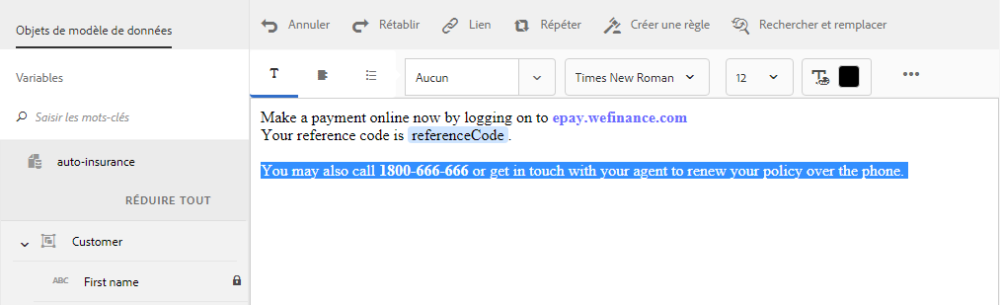

1. Appuyez sur **[!UICONTROL Créer une règle]**.

   La boîte de dialogue Créer une règle s’affiche. En plus de la chaîne, du nombre, de l’expression mathématique et de la date, les éléments suivants sont également disponibles dans l’éditeur de règles pour la création d’instructions :

   * Propriétés du modèle de données de formulaire associé
   * Toute variable que vous avez créée

   Sélectionnez l’option pertinente à évaluer.

   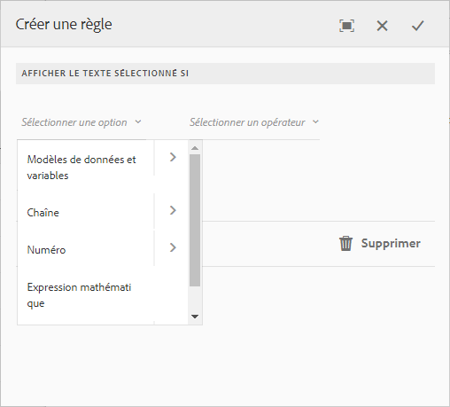

   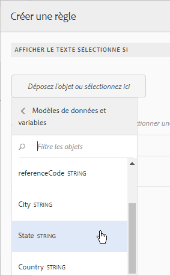

   >[!NOTE]
   >
   >La propriété Collection n’est pas prise en charge pour la création de règles d’attribution de condition au texte et d’affichage du texte.

1. Sélectionnez l’opérateur approprié pour évaluer la règle, tel que Est égal à, Contient et Démarre avec.

   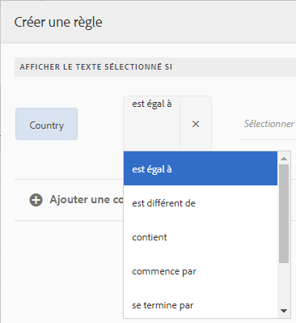

1. Insérez l’expression d’évaluation, la valeur, la propriété du modèle de données ou la variable.

   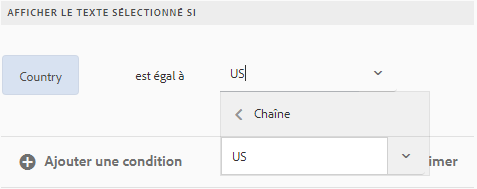

   Règle d’affichage du texte sélectionné si le destinataire se situe aux Etats-Unis selon les données source FDM

   * Lors de la création ou de la modification d’une règle, vous pouvez également appuyer sur  (Redimensionner) pour développer la boîte de dialogue Créer une règle/Modifier la règle. La boîte de dialogue développée, pleine fenêtre, vous permet de glisser-déposer des propriétés de modèle de données de formulaire et des variables pour construire des règles. Appuyez à nouveau sur Redimensionner pour revenir à la boîte de dialogue Créer une règle.
   * Vous pouvez également créer plusieurs conditions dans une règle.
   * Vous pouvez également créer des règles qui se chevauchent, dans lesquelles une règle s’applique à une partie d’un contenu auquel s’applique déjà une règle.

1. Appuyez sur **[!UICONTROL Done]** (Terminé). 

   La règle est appliquée. Le texte ou le contenu auquel la règle s’applique est surligné en vert. Lorsque vous passez le curseur sur la poignée gauche de la partie en surbrillance, la règle appliquée apparaît.

   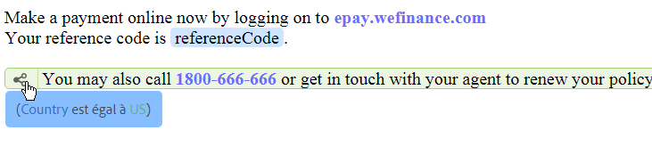

   En cliquant sur la poignée gauche de la règle appliquée, vous obtenez les options de modification ou de suppression de la règle.

## Formatage du texte {#formatting}

Lors de la création ou de la modification d’un texte, la barre d’outils change selon le type de modifications que vous souhaitez effectuer : paragraphes, alignement ou liste :

Sélectionnez le type de barre d’outils : Paragraphe, alignement ou liste

Barre d’outils d’édition de polices

Barre d’outils d’alignement

Barre d’outils Liste

### Mettre en surbrillance/en évidence des parties de texte  {#highlight}

Pour mettre en surbrillance ou mettre en évidence des parties de texte dans un fragment de document modifiable, sélectionnez le texte et appuyez sur Mettre en surbrillance la couleur.

Vous pouvez soit appuyer directement sur une couleur de base **`[A]`** présente dans la palette Couleurs de base, soit appuyer sur **Sélectionner** après avoir utilisé le curseur **`[B]`** pour choisir l’ombrage approprié de la couleur.

Vous pouvez également accéder à l’onglet Avancé pour sélectionner la teinte, la luminosité et la saturation **`[C]`** appropriée afin de créer la couleur précise, puis appuyer sur Sélectionner **`[D]`** pour appliquer la couleur de mise en surbrillance du texte.

### Coller le texte formaté {#paste}

Pour réutiliser un ou plusieurs paragraphes de texte existant dans une autre application, comme par exemple du texte issu de Microsoft® Word ou des pages HTML, copiez et collez le texte dans l’éditeur de texte. La mise en forme du texte copié est conservée dans l’éditeur de texte.

Vous pouvez copier et coller un ou plusieurs paragraphes de texte dans un fragment de document modifiable. Par exemple, vous pouvez disposer d’un document Microsoft® Word contenant une liste à puces de preuves de résidence acceptables comme suit :

Vous pouvez directement copier et coller le texte à partir du document Microsoft® Word vers un fragment de texte modifiable. La mise en forme, telle que la liste à puces, la police et la couleur du texte, est conservée dans le fragment de texte.

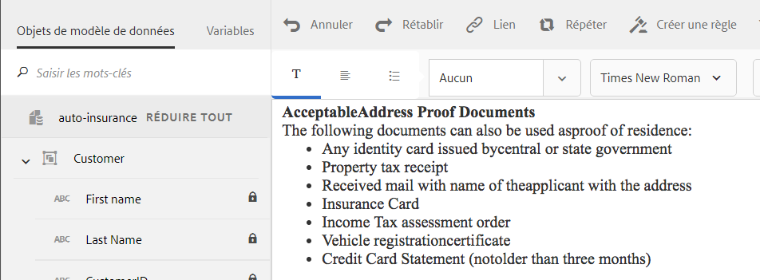

>[!NOTE]
>
>Toutefois, la mise en forme du texte collé présente certaines [restrictions](https://helpx.adobe.com/aem-forms/kb/cm-copy-paste-text-limitations.html).

## Insérer des caractères spéciaux dans le texte {#special}

Si nécessaire, insérez des caractères spéciaux dans le fragment de document. Vous pouvez, par exemple, utiliser la palette des caractères spéciaux pour insérer les caractères suivants :

* Symboles de devise tels que €, ¥ et £
* Symboles mathématiques tels que Δ, √,  et ^
* Symboles de ponctuation tels que ‟ et&quot;

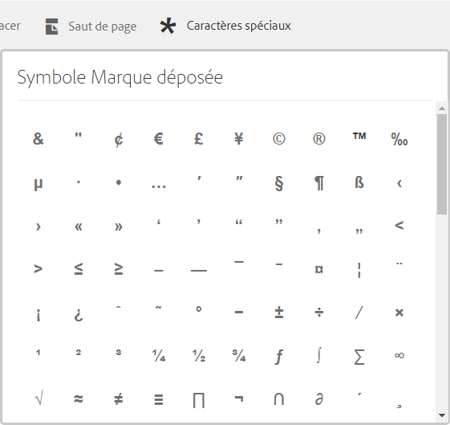

L’éditeur de texte offre une prise en charge intégrée de 210 caractères spéciaux. L’administrateur peut [ajouter la prise en charge de caractères spéciaux supplémentaires/personnalisés en personnalisant](/help/forms/using/custom-special-characters.md).

## Recherche et remplacement de texte {#search-features}

Lorsque vous utilisez des fragments de document de texte contenant une grande quantité de texte, vous devez rechercher une chaîne de texte spécifique. Vous devrez peut-être également remplacer une chaîne de texte spécifique par une autre chaîne.

La fonction Rechercher et remplacer vous permet de rechercher (et de remplacer) n’importe quelle chaîne de caractères dans un fragment de document de texte. La fonction comprend également une recherche d’expression régulière puissante.

1. Ouvrez un fragment de document texte pour [modification](#edittext).
1. Appuyez sur **[!UICONTROL Rechercher et remplacer]**.

1. Saisissez le texte à rechercher dans le champ **[!UICONTROL Rechercher]** et le nouveau texte (texte de remplacement) dans le champ **[!UICONTROL Remplacer]** puis cliquez sur **[!UICONTROL Remplacer]**.

1. Si le texte recherché est trouvé, il est remplacé par le texte de remplacement.

   * Si une autre occurrence du texte de recherche est trouvée, elle est mise en surbrillance dans le fragment de document texte. Si vous appuyez à nouveau sur **[!UICONTROL Remplacer]**, l’occurrence mise en surbrillance est remplacée et, si une troisième occurrence est trouvée, le curseur se déplace vers le bas.
   * Si aucune autre instance n’est trouvée, la boîte de dialogue Rechercher et remplacer affiche un message : Fin du module atteinte.

   Vous pouvez également appuyer sur Remplacer tout pour remplacer toutes les correspondances en une seule fois.

   La fonction Rechercher et remplacer comprend également une recherche d’expression régulière puissante. Pour utiliser une expression régulière dans votre recherche, sélectionnez **[!UICONTROL Exp. rég.]**, puis appuyez sur **[!UICONTROL Rechercher]** ou **[!UICONTROL Remplacer]**.
