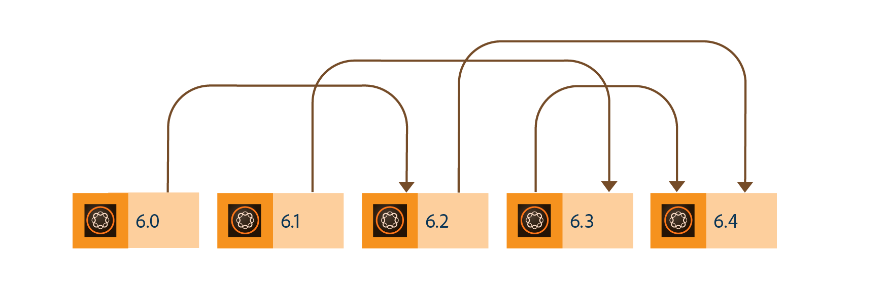

# Mise à niveau vers AEM 6.4 Forms{#upgrade-to-aem-forms}

AEM 6.4 Forms comporte plusieurs nouvelles fonctionnalités et améliorations qui optimisent la création, la gestion et la convivialité des formulaires et correspondances. Pour en savoir plus sur toutes les nouvelles fonctionnalités et améliorations d’AEM 6.4 Forms, voir [Résumé des nouvelles fonctionnalités](/help/forms/using/whats-new.md).

Vous pouvez mettre à niveau votre installation LiveCycle ou AEM Forms pour obtenir les nouvelles fonctionnalités et améliorations proposées dans AEM 6.4 Forms tout en conservant intactes les données, processus et actifs existants. Lors de la mise à niveau, les métadonnées et l’état des processus sont également conservés. Vous pouvez choisir un chemin de mise à niveau pour commencer la mise à niveau.

Le diagramme suivant affiche les chemins de mise à niveau disponibles pour AEM Forms on OSGi :

Vous pouvez effectuer une mise à niveau directe depuis :

* AEM 6.2 Forms on OSGi
* AEM 6.3 Forms on OSGi

Vous pouvez également effectuer une mise à niveau en plusieurs étapes depuis

* AEM 6.0 Forms on OSGi
* AEM 6.1 Forms on OSGi

Le diagramme suivant affiche les chemins de mise à niveau disponibles pour AEM Forms on JEE :

Vous pouvez effectuer une mise à niveau directe depuis :

* LiveCycle ES3
* LiveCycle ES4 SP1
* AEM 6.2 Forms on JEE
* AEM 6.3 Forms on JEE

Vous pouvez également effectuer une mise à niveau en plusieurs étapes depuis

* LiveCycle ES2
* AEM 6.0 Forms on JEE
* AEM 6.1 Forms on JEE