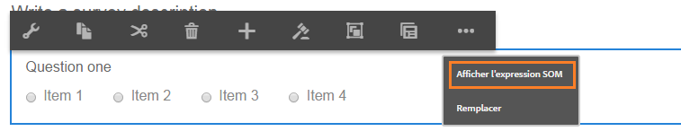

# Utilisation d’expressions SOM dans des formulaires adaptatifs  {#using-som-expressions-in-adaptive-forms}

Les formulaires adaptatif sont modélisés comme des pages AEM, représentées par des structures de contenu JCR dans le référentiel AEM. L’élément clé de la structure de contenu est le nœud du guideContainer. Sous le guideContainer, il existe un rootPanel pouvant contenir un panneau et des champs imbriqués.

Vous pouvez utiliser un modèle d’objet de script (SOM) pour référencer des valeurs, des propriétés et des méthodes dans un modèle d’objet de document (DOM) particulier. Un DOM organise les objets et les propriétés de mémoire dans une arborescence. Une expression SOM référence des champs ou des éléments de dessin et des panneaux.

L’image suivante illustre une structure de noeud à laquelle un formulaire adaptatif se traduit lorsque vous ajoutez des composants à un formulaire. Par exemple, vous pouvez ajouter un panneau au panneau racine et un bouton radio au panneau transformé en DOM à l’exécution. L’Expression SOM du champ de bouton radio dans le formulaire adaptatif est spécifiée comme `guide[0].guide1[0].guideRootPanel[0].panel1[0].radiobutton[0]`.

Une expression SOM pour tout élément dans un formulaire adaptatif est précédée de `guide[0].guide1[0]`. La position d’un composant dans la hiérarchie de la structure de nœud est utilisée pour dériver son expression SOM.

L’expression SOM change lorsque vous modifiez la position des boutons radio dans le formulaire adaptatif. Dans le mode création, vous pouvez afficher l’expression SOM d’un champ ou d’un élément dans AEM Forms à l’aide de l’option Visualiser l’expression SOM. L’option apparaît dans le panneau et lorsque vous faites un clic droit sur le champ ou sur l’élément.

Dans les panneaux, vous pouvez accéder à la fonction depuis la barre d’outils du panneau. La fonction facilite la création de scripts par les auteurs de formulaires adaptatifs.

Certaines API répertoriées dans [GuideBridge](https://helpx.adobe.com/aem-forms/6/javascript-api/GuideBridge.md) utilisent l’expression SOM d’un élément. Par exemple, pour centrer l’attention sur un champ particulier d’un formulaire adaptatif, transmettez l’expression SOM correspondante à l’`getFocus`API dans le `guideBridge`.

