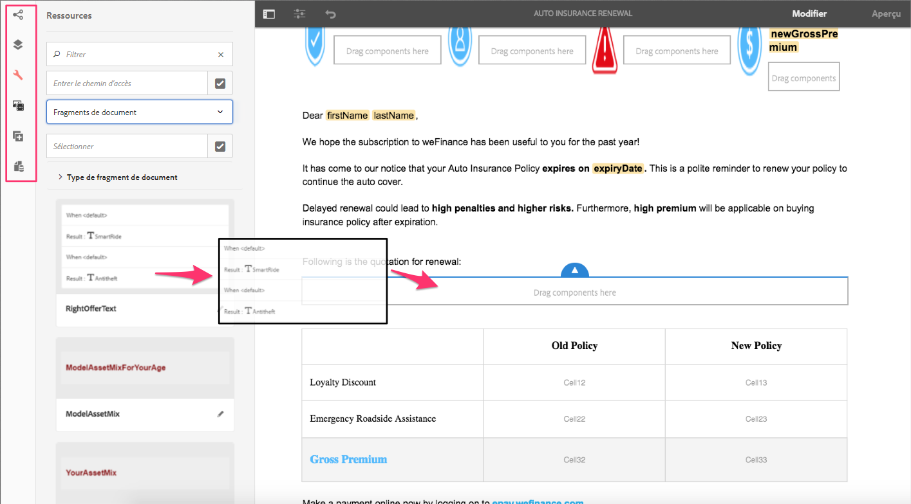

# Résumé des nouvelles fonctionnalités | AEM 6.4 Forms {#new-features-summary-aem-forms}

>[!CAUTION]
>
>AEM 6.4 a atteint la fin de la prise en charge étendue et cette documentation n’est plus mise à jour. Pour plus d’informations, voir notre [période de support technique](https://helpx.adobe.com/fr/support/programs/eol-matrix.html). Rechercher les versions prises en charge [here](https://experienceleague.adobe.com/docs/?lang=fr).

Résumé des nouvelles fonctionnalités et améliorations d’AEM 6.4 Forms.

AEM Forms comprend plusieurs nouvelles fonctionnalités et améliorations qui optimisent la création, la gestion et les expériences utilisateur avec des formulaires adaptatifs et des communications interactives.

Lisez la suite pour une introduction rapide aux nouvelles fonctionnalités et améliorations. Consultez la documentation pour obtenir des informations détaillées sur les ressources. Voir également AEM 6.4 Forms [notes de mise à jour](/help/release-notes/forms.md). Pour consulter la documentation complète d’AEM 6.4 Forms, rendez-vous sur [Guide d’AEM 6.4 Forms](/help/forms/home.md).

## Communications interactives {#interactive-communications}

Les communications interactives centralisent et gèrent la création, l’assemblage et la livraison de correspondances sécurisées, personnalisées et interactives telles que la correspondance commerciale, les lettres, les documents, les déclarations, les avis de prestations, les prospectus de gestion de patrimoine, les courriers marketing, les factures et les kits de bienvenue.

Les communications interactives utilisent les mêmes technologies, processus et composants sous-jacents que les formulaires adaptatifs pour créer des communications multicanaux réactives, tout comme les formulaires adaptatifs réactifs.

La communication interactive offre des avantages significatifs :

* Fournit une intégration prête à l’emploi avec le modèle de données de formulaire pour permettre un accès facile et simplifié aux bases de données principales et à d’autres systèmes CRM tels que MS Dynamics
* Fournit une interface de création intégrée pour les canaux d’impression et web
* Fournit une interface de création par glisser-déplacer, similaire à la création de Forms adaptatif, pour les canaux d’impression et web.

La communication interactive est l’approche par défaut et recommandée pour créer des communications client. Pour continuer à utiliser les lettres dans AEM 6.3 Forms et AEM 6.2 Forms, vous devez installer un package de compatibilité.

### Création de communication interactive multicanal {#multi-channel-interactive-communication-authoring}

Grâce à la communication interactive, vous pouvez créer et modifier des documents papier et web à partir d’un seul éditeur de document. En utilisant les mêmes fragments de document pour créer des rendus des deux canaux, vous pouvez éliminer la duplication des efforts.

Pour plus d’informations, voir [Présentation des communications interactives](/help/forms/using/interactive-communications-overview.md).

### WYSIWYG Document Editor {#wysiwyg-document-editor}

L’éditeur de document glisser-déposer WYSIWYG est convivial. L’interface intuitive, la fonctionnalité de glisser-déposer, les composants standard, les modèles de données et le référentiel intégré des ressources facilitent la création rapide et facile de communication interactive.

Pour créer une communication interactive ou en modifier une existante, les utilisateurs professionnels peuvent utiliser les blocs de création suivants : Canaux, Contenu, Propriétés, Ressources, Composants et Sources de données.

Pour plus d’informations, voir [Présentation de la création d’une communication interactive](/help/forms/using/introduction-interactive-communication-authoring.md).

### Générer automatiquement une version web à partir du contenu imprimé dans une communication interactive {#auto-generate-web-version-from-print-content-in-interactive-communication}

Les auteurs peuvent générer automatiquement du contenu de document Web à partir de documents imprimés pour créer, prévisualiser et modifier des documents papier et Web dans le même éditeur. Les auteurs de communication interactive peuvent créer une fois et publier sur tous les canaux. Les auteurs de communication interactive peuvent utiliser les mêmes fragments de document dans les canaux d’impression et web pour éviter la duplication des efforts.

Pour plus d’informations, voir [Canal d’impression et canal web](/help/forms/using/web-channel-print-channel.md).

### Utilisation de thèmes pour styliser le canal web de la communication interactive {#use-themes-to-style-web-channel-of-interactive-communication}

La communication interactive prend en charge les thèmes. Vous pouvez créer des thèmes et les appliquer à votre communication interactive. Un thème contient des détails de style pour les composants et les panneaux. Vous pouvez réutiliser un thème sur différentes communications interactives pour leur donner une apparence et une marque communes et cohérentes.

AEM Forms comprend un thème prêt à l’emploi pour les communications interactives. À l’aide d’un thème, vous pouvez également personnaliser l’aspect d’une communication interactive sur un appareil.

Pour plus d’informations, voir [Thèmes dans AEM Forms](/help/forms/using/themes.md).

### Interface de l’agent améliorée {#enhanced-agent-interface}

L’interface utilisateur de l’agent prend désormais en charge l’impression et l’aperçu web de la communication interactive. Dans la même interface utilisateur de l’agent, vous pouvez choisir de modifier le canal d’impression et de prévisualiser le canal web de votre communication interactive multicanal. Les champs, variables, éléments FDM et fragments de document dans le canal d’impression peuvent être configurés pour être modifiés par l’agent dans l’interface utilisateur de l’agent. La prise en charge du modèle de données de formulaire vous permet de générer des aperçus avec des données d’exemple préremplies.

Pour plus d’informations, voir [Préparation et envoi d’une communication interactive à l’aide de l’interface utilisateur de l’agent](/help/forms/using/prepare-send-interactive-communication.md).

### Présenter des informations dans les graphiques {#present-information-in-charts}

La communication interactive prend en charge les graphiques dans le canal web et d’impression pour des communications plus riches. Grâce à des graphiques tels que les secteurs, les beignets, les barres et les colonnes, vous pouvez condenser et présenter visuellement de grandes quantités d’informations pour une interprétation et une analyse simples.

 

Pour en savoir plus, consultez la rubrique [Utiliser des graphiques dans les communications interactives](/help/forms/using/chart-component-interactive-communications.md).

### Connecteurs de données d’usine pour préremplir des documents {#out-of-the-box-data-connectors-to-prefill-documents}

La communication interactive permet l’intégration de données à des outils métier permettant de se connecter à plusieurs systèmes métier, y compris les systèmes CRM, et de personnaliser les données dans des documents.

Pour plus d’informations, reportez-vous à la section [Utilisation d’un modèle de données de formulaire](/help/forms/using/using-form-data-model.md).

### Éditeur de fragments de document amélioré {#enhanced-document-fragment-editor}

Vous pouvez désormais utiliser des éléments et des règles FDM dans des fragments de document de communication interactive.

* Prise en charge des éléments de modèle de données de formulaire
* Afficher ou masquer un fragment de ressource/texte à l’aide de règles
* Validation de la valeur d’un élément/d’une variable
* Exécuter des fonctions pour calculer la valeur d’une expression mathématique

Pour en savoir plus, voir :

* [Textes dans les communications interactives](/help/forms/using/texts-interactive-communications.md)
* [Conditions dans les communications interactives](/help/forms/using/conditions-interactive-communications.md)

### Package de compatibilité pour les ressources existantes {#compatibility-package-for-existing-assets}

Par défaut, les ressources de lettre des versions précédentes d’AEM Forms ne sont pas prises en charge dans cette version. Si vous souhaitez continuer à utiliser les lettres d’AEM 6.3 Forms et d’AEM 6.2 Forms, vous devez installer le package de compatibilité.

## Intégration de données  {#data-integration}

[Intégration des données AEM Forms](/help/forms/using/data-integration.md) vous permet de configurer des sources de données disparates ; comme les bases de données, les services Web RESTful ou SOAP et les services OData ; pour créer un modèle de données de formulaire que vous pouvez utiliser pour lier des données, préremplir et appeler des services dans des formulaires et des documents adaptatifs.

Plusieurs nouvelles fonctionnalités et améliorations ont été apportées à l’intégration des données dans cette version.

### Créer un modèle de données de formulaire sans source de données {#create-form-data-model-without-data-source}

Les utilisateurs professionnels et les auteurs de formulaires peuvent désormais créer un modèle de données de formulaire comprenant ses entités et propriétés sans configurer de source de données et peuvent être utilisés pour créer des formulaires et des documents adaptatifs. Vous pouvez lier ultérieurement le modèle de données de formulaire aux sources de données. Il élimine les dépendances des sources de données pour la création de formulaires et de documents à l’aide du modèle de données de formulaire.

De même, vous pouvez créer des entités et des propriétés enfants dans un modèle de données de formulaire existant et les lier ultérieurement aux entités et propriétés correspondantes dans une source de données.

Pour plus d’informations, voir [Créer un modèle de données de formulaire](/help/forms/using/create-form-data-models.md).

### Création des propriétés calculées {#create-computed-properties}

Les auteurs et les développeurs Forms peuvent créer des propriétés calculées dans un modèle de données de formulaire. Ils vous permettent de calculer une valeur pour la propriété en créant des règles ou une logique sur les données disponibles dans les sources de données configurées. Une règle est une expression évaluée lorsque les données sont chargées dans le modèle de données de formulaire ou que les valeurs des propriétés de l’expression changent. Par exemple, une propriété calculée appelée Installations calcule le montant mensuel à payer pour un prêt en fonction du taux d’intérêt spécifié dans la source de données et du montant du prêt et de la durée spécifiés par l’utilisateur dans le formulaire.

Une propriété calculée réside localement dans un modèle de données de formulaire et n’existe pas dans une source de données. Vous pouvez utiliser des propriétés calculées dans des formulaires adaptatifs et des communications interactives.

Pour plus d’informations, reportez-vous à la section [Utilisation d’un modèle de données de formulaire](/help/forms/using/work-with-form-data-model.md).

### Aperçu des formulaires et des documents avec des exemples de données {#preview-forms-and-documents-with-sample-data}

Le modèle de données de formulaire permet de générer des données d’exemple pour les propriétés de toutes les entités d’un modèle de données de formulaire. Les données générées correspondent aux types de données configurés pour les propriétés. Lorsque vous prévisualisez un formulaire ou un document adaptatif associé au modèle de données de formulaire, il est rendu avec des exemples de données préremplis.

Les exemples de données sont un ensemble de valeurs aléatoires qui changent à chaque fois que vous les générez. Cependant, vous pouvez modifier et enregistrer les données d’exemple qui persistent même si vous les régénérez. Par exemple, si vous modifiez et enregistrez les exemples de données pour les propriétés Prénom et Nom et que vous ajoutez ensuite une autre propriété ou entité dans le modèle de données de formulaire et régénérez les exemples de données, les propriétés Prénom et Nom affichent les valeurs enregistrées pendant que les valeurs d’autres propriétés sont regénérées.

Pour plus d’informations, voir [Utiliser le modèle de données de formulaire](/help/forms/using/using-form-data-model.md).

### Actualiser les définitions des sources de données {#refresh-data-source-definitions}

Les mises à jour des entités ou propriétés de la source de données ne sont pas automatiquement répercutées dans les modèles de données de formulaire associés. L’éditeur de modèle de données de formulaire est désormais disponible  (Actualiser les définitions de source de données) qui invalide le cache du serveur et récupère le schéma mis à jour de la source de données pour qu’il soit immédiatement reflété dans le modèle de données de formulaire.

### Configuration de sources de données à l’aide de l’interface utilisateur tactile {#configure-data-sources-using-touch-user-interface}

Avec cette version, la configuration des services cloud pour les sources de données est disponible dans l’interface utilisateur tactile. En outre, l’emplacement de configuration des services cloud a été remplacé par **[!UICONTROL Outils > Cloud Services > Sources de données]**. Voir [Configuration des sources de données](/help/forms/using/configure-data-sources.md).

## Formulaires adaptatifs {#adaptive-forms}

### Amélioration des performances des formulaires adaptatifs avec un chargement différé amélioré {#improve-performance-of-adaptive-forms-with-enhanced-lazy-loading}

La fonctionnalité de chargement différé dans les formulaires adaptatifs retarde l’initialisation des fragments de formulaire jusqu’à ce qu’ils soient nécessaires. Il améliore les performances des formulaires volumineux en réduisant le temps nécessaire au rendu d’un formulaire, ce qui améliore l’expérience utilisateur.

Plusieurs améliorations ont été apportées à la fonctionnalité de chargement différé dans cette version :

* Les composants Pièce jointe et Conditions générales sont pris en charge dans les fragments de formulaire avec le chargement différé activé.
* Les fragments de formulaire adaptatif avec chargement différé activé sont pris en charge dans les panneaux répétables.
* Les formulaires adaptatifs avec des fragments activés pour le chargement différé sont pris en charge dans l’application AEM Forms.

## Processus d’AEM axés sur Forms {#forms-centric-aem-workflows}

Grâce à la fonctionnalité Forms-Centric AEM Workflows, vous pouvez rapidement créer et déployer des workflows pour diverses tâches sur la pile OSGi. Il n’est plus nécessaire d’installer la fonctionnalité Process Management disponible sur la pile JEE, ce qui simplifie le déploiement et élimine les coûts du serveur d’applications et de l’infrastructure. Pour plus d’informations, voir [Workflows basés sur l’utilisation de Forms sur OSGi](/help/forms/using/aem-forms-workflow.md).

Vous trouverez ci-dessous les améliorations apportées aux workflows Forms-Centric AEM : ・

* L’éditeur de modèle de processus est disponible dans l’interface utilisateur tactile. Cela vous permet de réduire le temps nécessaire à la création de processus d’AEM axés sur les formulaires.
* Étape de workflow pour envoyer des emails. Par exemple, vous pouvez utiliser l’étape Envoyer un courrier électronique pour envoyer un document d’enregistrement à la fin d’un workflow.
* Étape de processus pour utiliser les services de modèle de données de formulaire dans un modèle de processus. Cette étape vous permet d’appeler les services d’intégration de données sans écrire de code personnalisé. Par exemple, vous pouvez appeler un service GET pour obtenir les détails des employés à partir des archives d’une base de données sans écrire de code personnalisé.

## Application AEM Forms {#aem-forms-app}

L’application AEM Forms permet aux agents de terrain de synchroniser leurs appareils mobiles avec un serveur AEM Forms et de travailler sur leurs formulaires. L’application fonctionne sans problème lorsque le périphérique est hors ligne en enregistrant les données localement sur le périphérique et en synchronisant les données avec le serveur lorsque le périphérique est de nouveau en ligne. Pour plus d’informations, voir [application AEM Forms](/help/forms/using/aem-forms-app.md).

Voici les améliorations apportées à l’application AEM Forms :

* Les formulaires adaptatifs avec des fragments activés pour le chargement différé sont pris en charge dans l’application AEM Forms.
* Les formulaires adaptatifs avec modèle de données de formulaire sont pris en charge dans l’application AEM Forms.

## Document Security {#document-security}

Document Security vous permet de distribuer en toute sécurité toutes les informations enregistrées dans un format pris en charge. Document Security garantit que seuls les utilisateurs autorisés peuvent utiliser vos documents. Voici les principales modifications apportées à Document Security :

* Document Security fournit une [Bibliothèque portable de protection (PPL)](/help/forms/using/document-security-offerings.md) pour protéger un document localement, sans l’envoyer au serveur AEM Forms. Seules les informations d’identification de sécurité et les détails de la stratégie transitent sur le réseau vers le serveur AEM Forms. AEM 6.4 Forms a introduit la bibliothèque portable de protection (PPL) dans un format de lot OSGi. Désormais, vous pouvez directement installer la bibliothèque PPL sur un serveur AEM Forms et utiliser conjointement les fonctionnalités d’AEM et de PPL.
* Le SDK Document Security C++ et la bibliothèque PPL C++ peuvent être compilés avec Microsoft Visual Studio 2013. La version précédemment prise en charge était Microsoft Visual Studio 2010.

## Plateformes prises en charge {#supported-platforms}

AEM Forms peut être installé à l’aide de n’importe quelle combinaison de systèmes d’exploitation, serveurs d’applications, bases de données, pilotes de base de données, JDK, serveurs LDAP et serveurs de messagerie électronique pris en charge. Les principales modifications en matière de plateformes prises en charge sont les suivantes :

<table> 
 <tbody> 
  <tr> 
   <td>Composant</td> 
   <td>Prise en charge ajoutée</td> 
   <td>Prise en charge supprimée</td> 
  </tr> 
  <tr> 
   <td>Systèmes d’exploitation</td> 
   <td> 
    <ul> 
     <li>Microsoft Windows Server 2016</li> 
     <li>Oracle Linux 7 Update 3</li> 
    </ul> </td> 
   <td> 
    <ul> 
     <li>IBM AIX 7.2 [1]  </li> 
     <li>Solaris 11 [1]</li> 
    </ul> </td> 
  </tr> 
  <tr> 
   <td>Serveurs d’applications  </td> 
   <td> 
    <ul> 
     <li>Red Hat JBoss EAP 7</li> 
    </ul> </td> 
   <td> 
    <ul> 
     <li>IBM Weblogic 12.1.3</li> 
     <li>IBM WebSphere 8.5.5</li> 
     <li>Red Hat JBoss EAP 6</li> 
    </ul> </td> 
  </tr> 
  <tr> 
   <td>Bases de données</td> 
   <td> 
    <ul> 
     <li>Microsoft SQL Server 2016</li> 
     <li>MySQL 5.7.19 et versions ultérieures</li> 
     <li>IBM DB2 11.1</li> 
     <li>Architecture multi-tenant d’Oracle</li> 
    </ul> </td> 
   <td> 
    <ul> 
     <li>Microsoft SQL Server 2012  </li> 
     <li>Microsoft SQL Server 2014</li> 
     <li>MySQL 5.5</li> 
     <li>IBM DB2 10.5  </li> 
    </ul> </td> 
  </tr> 
  <tr> 
   <td>Serveurs LDAP</td> 
   <td> 
    <ul> 
     <li>Microsoft Active Directory 2016</li> 
     <li>Serveur d’annuaire IBM Tivoli 6.4</li> 
    </ul> </td> 
   <td> 
    <ul> 
     <li>Microsoft Active Directory 2008</li> 
     <li>Serveur d’annuaire IBM Tivoli 6.3</li> 
     <li>Oracle Directory Server Enterprise Edition 7.0</li> 
    </ul> </td> 
  </tr> 
  <tr> 
   <td>Serveurs de messagerie</td> 
   <td> 
    <ul> 
     <li>Microsoft Office 365</li> 
    </ul> </td> 
   <td> 
    <ul> 
     <li>Novell Groupwise 7</li> 
    </ul> </td> 
  </tr> 
  <tr> 
   <td>Connecteurs</td> 
   <td> 
    <ul> 
     <li>Connector for Microsoft Sharepoint 2016</li> 
     <li>Connector for EMC Documentum 7.3</li> 
    </ul> </td> 
   <td> 
    <ul> 
     <li>Connector for Microsoft Sharepoint 2007</li> 
     <li>Connector for Microsoft Sharepoint 2010</li> 
     <li>Connecteur pour IBM Filenet 5.0</li> 
     <li>Connector for EMC Documentum 6.7</li> 
    </ul> </td> 
  </tr> 
  <tr> 
   <td>Navigateurs</td> 
   <td> 
    <ul> 
     <li>Apple Safari 11.x sous macOS</li> 
     <li>Apple Safari 11.x sur iOS</li> 
    </ul> </td> 
   <td> 
    <ul> 
     <li>Navigateur Blackberry pour les appareils Blackberry Z30 et Q10</li> 
    </ul> </td> 
  </tr> 
  <tr> 
   <td>Application AEM Forms  </td> 
   <td> 
    <ul> 
     <li>Android 4.4 ou version ultérieure</li> 
     <li>Apple iOS 10 ou version ultérieure</li> 
    </ul> </td> 
   <td> </td> 
  </tr> 
 </tbody> 
</table>

1. Les systèmes d’exploitation AIX et Solaris sont disponibles uniquement pour les clients de mise à niveau.
