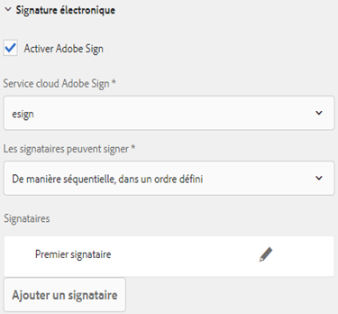
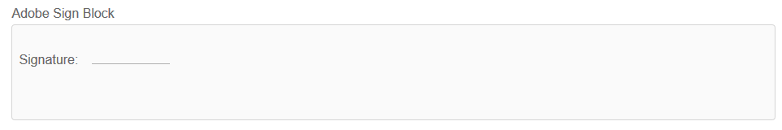

# Utilisation d’Adobe Sign dans un formulaire adaptatif {#using-adobe-sign-in-an-adaptive-form}

Activez les processus de signature électronique (Adobe Sign) pour un formulaire adaptatif afin d’automatiser les processus de signature, de simplifier les processus à signature unique et à signatures multiples et de signer électroniquement des formulaires à partir d’appareils mobiles.

Adobe Sign autorise les processus de signature électronique pour les formulaires adaptatifs. Les signatures électroniques améliorent les processus de traitement des documents pour les services juridiques, commercial, des ressources humaines, etc.

Dans un scénario Adobe Sign et de formulaires adaptatifs standard, un utilisateur remplit un formulaire adaptatif pour effectuer une demande de service. Par exemple, une demande de prêt hypothécaire et de carte de crédit nécessite des signatures légales de tous les emprunteurs et codemandeurs. Pour activer les processus de signature électronique, vous pouvez intégrer Adobe Sign à AEM Forms. Voici quelques exemples d’utilisation d’Adobe Sign :

* Remportez des contrats à partir de tout appareil à l’aide de processus entièrement automatisés d’offre, de devis et de contrat.
* Terminez les processus de ressource humaine plus rapidement et offrez à vos employés une expérience numérique.
* Réduisez considérablement les durées des cycles en matière de contrat et intégrez plus rapidement vos fournisseurs.
* Créez des processus numériques pour automatiser les processus courants.

L’intégration d’Adobe Sign à AEM Forms prend en charge ce qui suit :

* Processus de signature utilisateur unique et multiutilisateur
* Processus de signature séquentiels et simultanés
* Expériences de signature dans le formulaire et hors du formulaire
* Signature de formulaires en tant qu’utilisateur anonyme ou connecté
* Processus de signature dynamiques (intégration au processus AEM Forms)
* Authentification par le biais d’une base de connaissances, un téléphone et des profils de réseaux sociaux

## Conditions préalables {#prerequisites}

Avant d’utiliser Adobe Sign dans un formulaire adaptatif :

* Assurez-vous que le service cloud AEM Forms est configuré pour utiliser Adobe Sign. Pour plus de détails, voir [Intégrer Adobe Sign à AEM Forms](/help/forms/using/adobe-sign-integration-adaptive-forms.md).
* Gardez la liste des signataires prête. Vous devez disposer d’au moins une adresse électronique pour chaque signataire.

## Configurer Adobe Sign pour un formulaire adaptatif {#configure-adobe-sign-for-an-adaptive-form}

Effectuez les étapes suivantes pour configurer Adobe Sign pour un formulaire adaptatif :

1. [Modification des propriétés du formulaire adaptatif pour le panneau Adobe](#enableadobesign)
1. [Ajouter des champs Adobe Sign à un formulaire adaptatif](#addadobesignfieldstoanadaptiveform)
1. [Activer Adobe Sign pour un formulaire adaptatif](#enableadobsignforanadaptiveform)
1. [Sélectionner un service cloud Adobe Sign pour un formulaire adaptatif](#selectadobesigncloudserviceforanadaptiveform)

1. [Ajouter des signataires Adobe Sign à un formulaire adaptatif](#addsignerstoanadaptiveform)
1. [Sélectionner Envoyer l’action pour un formulaire adaptatif](#selectsubmitactionforanadaptiveform)

### Modification des propriétés d’un formulaire adaptatif pour Adobe Sign {#enableadobesign}

Configurez les propriétés de formulaire adaptatif pour Adobe Sign pour un formulaire adaptatif existant ou nouveau.

[Création d’un formulaire adaptatif pour Adobe Sign](/help/forms/using/working-with-adobe-sign.md#create-an-adaptive-form-for-adobe-sign) décrit les étapes de création d’un formulaire adaptatif de base. Voir [Création d’un formulaire](/help/forms/using/creating-adaptive-form.md) adaptatif pour connaître les autres options disponibles lors de la création d’un formulaire adaptatif.

#### Création d’un formulaire adaptatif pour Adobe Sign {#create-an-adaptive-form-for-adobe-sign}

Pour créer un formulaire adaptatif pour Adobe Sign, procédez comme suit :

1. Accédez à **[!UICONTROL Adobe Experience Manager]** > **[!UICONTROL Forms]** > **[!UICONTROL Forms &amp; Documents]**.
1. Appuyez sur **[!UICONTROL Créer]** et sélectionner le **[!UICONTROL Formulaire adaptatif]**. Une liste de modèles s’affiche. Select the template and tap **[!UICONTROL Next]**.
1. In the **[!UICONTROL Basic]** tab:

   1. Indiquez le **nom** et le **titre** du formulaire adaptatif.
   1. Sélectionnez le conteneur [de](/help/forms/using/adobe-sign-integration-adaptive-forms.md#configure-adobe-sign-with-aem-forms) configuration créé lors de la configuration d&#39;Adobe Sign avec AEM Forms.

      >[!NOTE]
      >
      >La liste déroulante Cloud Service **** Adobe Sign affiche les services cloud configurés dans le conteneur de configuration que vous sélectionnez dans ce champ. La liste déroulante Cloud Service **** Adobe Sign est disponible dans la section Signature **** électronique des propriétés du formulaire adaptatif lorsque vous sélectionnez l’option **[!UICONTROL Activer Adobe Sign]** .

1. Dans l’onglet Modèle **[!UICONTROL de]** formulaire, sélectionnez l’une des options suivantes :

   * Sélectionnez l’option **[!UICONTROL Associer le modèle de formulaire comme modèle]** de Document d’enregistrement et sélectionnez un modèle de Document d’enregistrement. Si vous utilisez un formulaire adaptatif basé sur un modèle de formulaire, les documents envoyés pour signature affichent uniquement les champs basés sur le modèle de formulaire associé. Il n’affiche pas tous les champs du formulaire adaptatif.
   * Sélectionnez l’option **[!UICONTROL Générer le Document d’enregistrement]** . Si vous utilisez une option Document d’enregistrement activée pour le formulaire adaptatif, le document envoyé pour signature affiche tous les champs du formulaire adaptatif.

1. Appuyez sur **[!UICONTROL Créer.]** Un formulaire adaptatif compatible avec la signature est créé, qui peut être utilisé pour ajouter des champs Adobe Sign.

#### Modification d’un formulaire adaptatif pour Adobe Sign {#editafsign}

Pour utiliser l’Adobe Sign dans un formulaire adaptatif existant, procédez comme suit :

1. Accédez à **[!UICONTROL Adobe Experience Manager]** > **[!UICONTROL Forms]**> **[!UICONTROL Forms &amp; Documents]**.
1. Select the adaptive form and tap **[!UICONTROL Properties]**.
1. Dans l’onglet **[!UICONTROL Réglages de base]** , sélectionnez le conteneur [de](/help/forms/using/adobe-sign-integration-adaptive-forms.md#configure-adobe-sign-with-aem-forms) configuration créé lors de la configuration de Adobe Sign avec AEM Forms.
1. Dans l’onglet Modèle **[!UICONTROL de]** formulaire, sélectionnez l’une des options suivantes :

   * Sélectionnez l’option **[!UICONTROL Associer le modèle de formulaire comme modèle]** de Document d’enregistrement et sélectionnez un modèle de Document d’enregistrement. Si vous utilisez un formulaire adaptatif basé sur un modèle de formulaire, les documents envoyés pour signature affichent uniquement les champs basés sur le modèle de formulaire associé. Il n’affiche pas tous les champs du formulaire adaptatif.
   * Sélectionnez l’option **[!UICONTROL Générer le Document d’enregistrement]** . Si vous utilisez une option Document d’enregistrement activée pour le formulaire adaptatif, le document envoyé pour signature affiche tous les champs du formulaire adaptatif.

1. Appuyez sur **[!UICONTROL Save &amp; Close]** (Enregistrer et fermer). Le formulaire adaptatif est activé pour Adobe Sign.

### Ajouter des champs Adobe Sign à un formulaire adaptatif {#addadobesignfieldstoanadaptiveform}

Adobe Sign dispose de plusieurs champs pouvant être placés sur un formulaire adaptatif. Ces champs acceptent divers types de données tels que les signatures, les initiales, la société ou le titre et aident à collecter des informations supplémentaires lors de la signature, ainsi que les signatures. Vous pouvez utiliser le composant Bloc Adobe Sign pour placer des champs Adobe Sign à différents emplacements dans un formulaire adaptatif.

Effectuez les étapes suivantes pour ajouter des champs à un formulaire adaptatif et personnaliser diverses options liées à ces champs :

1. Faites glisser et déposez le composant **Bloc Adobe Sign** de l’explorateur de composants dans le formulaire adaptatif. Le composant Bloc Adobe Sign dispose de tous les champs Adobe Sign pris en charge. By default, it adds a **Signature** field to the adaptive form.

   

   Par défaut, le bloc Adobe Sign n’est pas visible dans le formulaire adaptatif publié. Il est visible uniquement dans les documents de signature. Vous pouvez modifier la visibilité du bloc Adobe Sign dans les propriétés du composant Bloc Adobe Sign.

   >[!NOTE]
   >
   >* L’utilisation du bloc Adobe Sign n’est pas obligatoire pour utiliser Adobe Sign dans un formulaire adaptatif. Si vous n’utilisez pas le bloc Adobe Sign et n’ajoutez pas de champs pour les signataires, le champ de signature par défaut s’affiche au bas des documents de signature.
   >* Utilisez le bloc Adobe Sign seulement pour les formulaires adaptifs qui génèrent automatiquement un document d’enregistrement. Si vous utilisez un fichier XDP personnalisé pour générer un document d’enregistrement ou un formulaire adaptatif basé sur un modèle de formulaire, le bloc Adobe Sign n’est pas requis.

1. Select the **Adobe Sign Block** component and tap the **Edit**  icon. Il affiche des options pour ajouter des champs et mettre en forme l’apparence d’un champ.

   

   **R.** Sélectionnez et ajoutez des champs Adobe Sign. **B.** Développez le bloc Adobe Sign en vue plein écran.

1. Appuyez sur l’icône **Adobe Sign Field**  . Il affiche des options permettant de sélectionner et d’ajouter des champs Adobe Sign.

   Expand the **Type** drop-down field to select a Adobe Sign field and tap the Done  icon to add the selected field to Adobe Sign block. Le champ déroulant **Type** comprend les types de champs Signature, Informations sur le signataire et Données. Intégration d’Adobe Sign aux champs de prise en charge d’AEM Forms répertoriés dans la liste déroulante Type uniquement. Pour plus d’informations sur les champs Adobe Sign, voir la documentation [Adobe Sign](https://helpx.adobe.com/sign/help/field-types.html).

   

   Il est obligatoire de fournir un nom unique pour un champ. Vous pouvez également sélectionner l’option requise pour marquer un champ comme obligatoire. En plus de l’option **Nom** et **Obligatoire**, certains champs Adobe Sign ont plus d’options. Par exemple, masque et multiligne. De plus, spécifiez un nom unique pour chaque champ Adobe Sign que les champs se trouvent dans des blocs Adobe Sign identiques ou différents.

### Activer Adobe Sign pour un formulaire adaptatif {#enableadobsignforanadaptiveform}

Par défaut, Adobe Sign n’est pas activé pour un formulaire adaptatif. Effectuez les étapes suivantes pour l’activer :

1. In the Content browser, tap **Form Container**, and tap the **Configure**  icon. L’explorateur de propriétés s’ouvre et affiche les propriétés et affiche les propriétés du conteneur Formulaire adaptatif.
1. Dans l’explorateur de propriétés, développez l’accordéon **Signature électronique** et sélectionnez l’option **Activer Adobe Sign**. Elle active Adobe Sign pour un formulaire adaptatif.

### Sélectionner le service cloud Adobe Sign et un ordre de signature {#selectadobesigncloudserviceforanadaptiveform}

Vous pouvez configurer plusieurs services Adobe Sign pour une instance d’AEM Forms. Il est recommandé de disposer d’un ensemble distinct de services pour chaque fonction (ressources humaines, service financier, etc.). Cela facilite le suivi et la création de rapports sur les documents signés. Par exemple, une banque a plusieurs services. Vous pouvez avoir une configuration séparée pour chaque service pour un meilleur suivi des documents.

Un document peut également avoir plusieurs signataires. Par exemple, une demande de carte de crédit peut avoir plusieurs demandeurs. Une banque exige la signature de tous les demandeurs avant de commencer le traitement de la demande. Pour les scénarios multisignataires, vous pouvez choisir de signer le document dans un ordre séquentiel ou simultané.

Effectuez les étapes suivantes pour sélectionner un service cloud et un ordre de signature :

1. In the Content browser, tap **Form Container**, and tap the **Configure**  icon. L’explorateur de propriétés s’ouvre et affiche les propriétés et affiche les propriétés du conteneur Formulaire adaptatif.
1. Dans l’explorateur de propriétés, développez l’accordéon **Signature électronique** et sélectionnez l’option **Activer Adobe Sign**. Elle active Adobe Sign pour un formulaire adaptatif.
1. Sélectionnez un service cloud dans la liste des services cloud Adobe Sign déjà configurés.

   Si la liste du **service cloud Adobe Sign** est vide, suivez l’article [Configurer Adobe Sign avec AEM Forms](/help/forms/using/adobe-sign-integration-adaptive-forms.md) pour configurer le service.

   La liste déroulante liste les services cloud qui existent dans le `global` dossier Outils > **[!UICONTROL Cloud Services]** > **[!UICONTROL Adobe Sign]**. En outre, la liste déroulante liste également les services cloud qui existent dans le dossier que vous sélectionnez dans le champ Conteneur **[!UICONTROL de]** configuration lorsque vous créez un formulaire adaptatif.

1. Sélectionnez l’ordre de signature dans la boîte de dialogue **Les signataires peuvent signer**. Les signataires Adobe Sign peuvent signer un formulaire adaptatif de manière **séquentielle** (l’un après l’autre) ou **simultanée** (dans n’importe quel ordre).

   Dans un ordre séquentiel, un signataire à la fois reçoit le formulaire à signer. Une fois que le signataire a terminé la signature du document, le formulaire est envoyé au signataire suivant, et ainsi de suite.

   Dans l’ordre simultané, plusieurs signataires à la fois peuvent signer un formulaire.

1. [Ajoutez les signataires sur un formulaire](#addsignerstoanadaptiveform) adaptatif et appuyez sur l’icône Terminé pour enregistrer les modifications.

### Ajouter des signataires à un formulaire adaptatif {#addsignerstoanadaptiveform}

Vous ne pouvez avoir qu’un seul signataire ou plusieurs signataires pour un formulaire adaptatif. Lorsque vous ajoutez un signataire, vous pouvez également configurer les détails d’authentification pour le signataire. Vous pouvez également sélectionner si le remplisseur du formulaire et le signataire sont la même personne. Effectuez les étapes suivantes pour ajouter et fournir divers détails sur un signataire :

1. In the Content browser, tap **Form Container**, and tap the **Configure**  icon. Il ouvre l’explorateur de propriétés avec les propriétés du conteneur Formulaire adaptatif.
1. Dans l’explorateur de propriétés, développez l’accordéon **Signature électronique** et sélectionnez l’option **Activer Adobe Sign**. Elle active Adobe Sign pour un formulaire adaptatif.
1. Appuyez sur **Ajouter un signataire** sous **Configuration du signataire.** Il ajoute un signataire au formulaire adaptatif. Vous pouvez ajouter plusieurs signataires Adobe Sign à un formulaire adaptatif.
1. 

   Click the **Edit**  icon to specify the following information about the signer:

   * **Titre :** spécifiez un titre pour identifier de manière unique un signataire.
   * **Le signataire et la personne remplissant le formulaire sont-ils les mêmes ? :** Sélectionnez **Oui** si l’utilisateur et le premier signataire sont la même personne. Si l’option est définie sur **Non,** n’utilisez pas le composant d’étape de signature dans le formulaire adaptatif. Si le formulaire contient un composant Étape de signature, le champ est automatiquement défini sur Oui.
   * **Adresse électronique du signataire :** spécifiez l’adresse électronique du signataire. Le signataire reçoit les documents/formulaires à signer à l’adresse électronique indiquée. Vous pouvez choisir d’utiliser une adresse électronique fournie dans un champ de formulaire, dans le profil utilisateur AEM de l’utilisateur connecté ou d’entrer manuellement une adresse électronique. C’est une étape obligatoire. Notez également que si vous avez configuré un seul signataire, assurez-vous que l’adresse électronique du signataire n’est pas identique au compte Adobe Sign utilisé pour configurer les services cloud AEM.
   * **Méthode d’authentification du signataire :** spécifiez la méthode pour authentifier un utilisateur avant d’ouvrir un formulaire à des fins de signature. Vous pouvez choisir entre le téléphone, la base de connaissances et l’authentification basée sur l’identité de réseau social.

   >[!NOTE]
   >
   >* Par défaut, l’authentification basée sur l’identité de réseau social offre une option d’authentification via Facebook, Google et LinkedIn. Vous pouvez contacter le support Adobe Sign pour activer d’autres fournisseurs d’authentification sociale.

   * **Champs Adobe Sign à remplir ou à signer :** sélectionnez les champs Adobe Sign pour le signataire. Un formulaire adaptatif peut avoir plusieurs champs Adobe Sign. Vous pouvez choisir d’activer des champs spécifiques pour un signataire. Le champ affiche tous les blocs Adobe Sign disponibles. Lorsque vous sélectionnez un bloc, tous les champs du bloc sont sélectionnés. Vous pouvez utiliser l’icône X pour désélectionner un champ.

   

   L’image ci-dessus a deux exemples de blocs Adobe Sign : Personal-Information et Office-details

   Appuyez sur l’icône Terminé  . Le signataire est ajouté et configuré.

### Sélectionner Envoyer l’action pour un formulaire adaptatif {#selectsubmitactionforanadaptiveform}

Après avoir ajouté des champs Adobe Sign à un formulaire adaptatif, activé Adobe Sign à partir du conteneur de formulaire, sélectionné le service cloud Adobe Sign et ajouté des signataires Adobe Sign, sélectionnez une action d’envoi appropriée pour le formulaire adaptatif. Pour plus d’informations sur les actions d’envoi de formulaires adaptatifs, voir [Configuration de l’action d’envoi](/help/forms/using/configuring-submit-actions.md).

En outre, un formulaire adaptatif Adobe Sign est envoyé uniquement après que tous les signataires ont signé le formulaire. Vous pouvez trouver un formulaire partiellement signé dans la section En attente de signature du portail des formulaires. Le service de configuration d’Adobe Sign interroge le serveur Adobe Sign à [intervalles réguliers](/help/forms/using/adobe-sign-integration-adaptive-forms.md) pour vérifier l’état des signatures. Si tous les signataires terminent la signature du formulaire, le service d’action d’envoi est démarré et le formulaire est envoyé. Si vous utilisez une action d’envoi personnalisée et que le formulaire utilise Adobe Sign, mettez à jour votre action d’envoi personnalisée pour utiliser le service d’action d’envoi.

>[!NOTE]
>
>Les données du formulaire adaptatif sont stockées temporairement sur le portail des formulaires. It is recommended to use [custom storage for Forms Portal](/help/forms/using/configuring-draft-submission-storage.md). Il garantit que les données PII (informations personnellement identifiables) ne sont pas stockées sur les serveurs AEM.

Votre expérience de signature de formulaire est prête. Vous pouvez prévisualiser le formulaire pour vérifier l’expérience de signature. Sur le formulaire publié, les champs Bloc Adobe Sign sont affichés lorsqu’un signataire reçoit le formulaire à signer dans un courrier électronique. Cette expérience est également connue comme expérience de signature hors du formulaire. Vous pouvez également configurer une expérience de signature dans le formulaire pour le premier signataire. Pour les étapes détaillées, voir [Créer une expérience de signature dans le formulaire](/help/forms/using/working-with-adobe-sign.md#create-in-form-signing-experience).

## Configuration des signatures de cloud pour un formulaire adaptatif {#configure-cloud-signatures-for-an-adaptive-form}

Les signatures numériques basées sur le cloud ou les signatures distantes sont une nouvelle génération de signatures numériques qui fonctionnent sur les ordinateurs de bureau, les appareils mobiles et le Web — et qui répondent aux niveaux de conformité et d’assurance les plus élevés pour l’authentification des signataires. Vous pouvez signer un formulaire adaptatif avec des signatures numériques basées sur le cloud.

Après avoir [modifié les propriétés du formulaire adaptatif pour le signe](#enableadobesign)d’Adobe, procédez comme suit pour ajouter un champ de signature cloud à un formulaire adaptatif :

1. Faites glisser et déposez le composant **Bloc Adobe Sign** de l’explorateur de composants dans le formulaire adaptatif. Le composant Bloc Adobe Sign dispose de tous les champs Adobe Sign pris en charge. By default, it adds a **Signature** field to the adaptive form.

   

1. Select the **Adobe Sign Block** component and tap the **Edit**  icon. Il affiche des options pour ajouter des champs et mettre en forme l’apparence d’un champ.

   

   **R.** Sélectionnez et ajoutez des champs Adobe Sign. **B.** Développez le bloc Adobe Sign en vue plein écran.

1. Appuyez sur l’icône **Adobe Sign Field**  . Il affiche des options permettant de sélectionner et d’ajouter des champs Adobe Sign.

   Développez le champ déroulant **Type** pour sélectionner Signature **** numérique et appuyez sur l’icône Terminé  pour ajouter le champ sélectionné au bloc Adobe Sign.

   

   Il est obligatoire de fournir un nom unique pour un champ.

   Appliquez des signatures numériques au formulaire adaptatif à l’aide des éléments suivants :

   * Signatures de cloud : Signez avec un ID  numérique hébergé par un prestataire d’approbation.
   * Adobe Acrobat ou Reader : Téléchargez et ouvrez le document avec Adobe Acrobat ou Reader pour le signer à l’aide d’une carte à puce, d’un jeton USB ou d’un ID numérique basé sur des fichiers.

   Après avoir ajouté le champ de signature du cloud au formulaire adaptatif, effectuez les étapes suivantes pour terminer le processus de configuration :

   * [Activer Adobe Sign pour un formulaire adaptatif](#enableadobsignforanadaptiveform)
   * [Sélectionner un service cloud Adobe Sign pour un formulaire adaptatif](#selectadobesigncloudserviceforanadaptiveform)
   * [Ajouter des signataires Adobe Sign à un formulaire adaptatif](#addsignerstoanadaptiveform)
   * [Sélectionner Envoyer l’action pour un formulaire adaptatif](#selectsubmitactionforanadaptiveform)

## Créer une expérience de signature dans le formulaire {#create-in-form-signing-experience}

Un utilisateur peut également signer un formulaire adaptatif lors du remplissage du formulaire. Cette expérience est également connue comme expérience de signature dans le formulaire. L’expérience de signature dans le formulaire est disponible uniquement pour le premier signataire dans un environnement à plusieurs signataires. Effectuez les étapes suivantes pour créer une expérience de signature dans le formulaire pour un formulaire adaptatif :

1. Ajoutez et configurez le composant [Étape de signature](#add-and-configure-the-signature-step-component).
1. Ajoutez le composant [Étape de résumé](#configure-the-thank-you-page-or-summary-step-component).

### Ajouter et configurer le composant Étape de signature {#add-and-configure-the-signature-step-component}

Utilisez le composant Étape de signature pour fournir une zone pour signer électroniquement le formulaire rempli. Lorsque la section contenant le composant Étape de signature est générée, elle affiche une version PDF à signer du formulaire rempli. Le composant Étape de signature prend toute la largeur disponible pour le formulaire. Il est recommandé de ne pas avoir d’autre composant sur la section contenant le composant Étape de signature.

Effectuez les étapes suivantes pour configurer le composant Étape de signature :

1. Glissez et déposez le composant **Étape de signature** dans le formulaire à partir de l’explorateur de composants.
1. Select the newly added Signature step component and tap the **Configure**  icon. Elle ouvre l’explorateur de propriétés et affiche les propriétés Étape de signature. Configurez les propriétés suivantes :

   * **Nom d’élément** : spécifiez le nom du composant.
   * **Titre :** indiquez le titre unique du composant.
   * **Message du modèle :** indiquez le message à afficher lorsque la signature PDF est chargée. Les services Adobe Sign mettent un certain temps à préparer et charger la signature PDF.
   * **Service de signature :** sélectionnez l’option **Adobe Sign**.
   * **Utiliser le composant de signature électronique hérité** : si vous utilisez le formulaire adaptatif respectif dans [l’espace de travail AEM Forms](/help/forms/using/introduction-html-workspace.md), l’application AEM Forms ou que le formulaire adaptatif sous-jacent a un composant de signature électronique hérité, sélectionnez l’option **Utiliser le composant de signature électronique hérité**.
   * **Configuration **: sélectionnez une configuration (service cloud Adobe Sign). La liste déroulante n’est disponible que si l’option **Utiliser le composant de signature électronique** est activée.

   Appuyez sur l’icône Terminé  pour enregistrer les modifications.

   

   >[!NOTE]
   >
   >* Lorsque vous faites glisser le composant **[!UICONTROL Étape de signature]** dans le formulaire, l’option **[!UICONTROL Le signataire et la personne remplissant le formulaire ne sont-ils qu’une seule et même personne ?]** est automatiquement définie sur **Oui**. Il est nécessaire pour que le formulaire fonctionne.
   >* Les formulaires adaptatifs activés pour Adobe Sign ne prennent pas en charge l’utilisation du bouton Envoyer sur la section ou le panneau à l’aide du composant Étape de signature. Vous pouvez ajouter une étape de résumé après que l’étape Signature pour l’envoi manuel ou un envoi automatique est déclenchée après l’intervalle défini à l’aide du [service de configuration Adobe Sign](/help/forms/using/adobe-sign-integration-adaptive-forms.md#configure-adobe-sign-scheduler-to-sync-the-signing-status).

### Configurer la page de remerciements ou le composant de l’étape de résumé {#configure-the-thank-you-page-or-summary-step-component}

Le composant **Étape de résumé** envoie automatiquement le formulaire, indique les informations dans la page Résumé personnalisée et affiche le résumé du formulaire envoyé. Il obtient également les informations requises dans le mappage de retour. Le composant Synthèse des étapes prend toute la largeur disponible pour le formulaire. Il est recommandé de ne pas avoir d&#39;autre composant sur la section contenant le composant Résumé de l&#39;étape.

Maintenant, l’expérience de signature dans le formulaire est prête. Vous pouvez prévisualiser le formulaire pour vérifier l’expérience de signature.

## Forum aux questions {#frequently-asked-questions}

**Question : Vous pouvez incorporer un formulaire adaptatif dans un autre formulaire adaptatif. Le formulaire adaptatif intégré peut-il être activé pour Adobe Sign ?**

**Réponse :** Non, AEM Forms ne prend pas en charge l’utilisation d’un formulaire adaptatif incorporant un formulaire adaptatif activé pour Adobe Sign à des fins de signature.

**Q : Lorsque je crée un formulaire adaptatif à l’aide du modèle avancé et que je l’ouvre pour modification, un message d’erreur &quot;Signatures électroniques ou signataires mal configurés&quot; s’affiche. s’affiche. Comment résoudre le message d’erreur ?**

**Réponse :** Le formulaire adaptatif créé à l’aide du modèle avancé est configuré pour utiliser Adobe Sign. Pour résoudre l’erreur, créez et sélectionnez une configuration cloud Adobe Sign et configurez un signataire Adobe Sign pour le formulaire adaptatif.

**Question : Puis-je utiliser des balises de texte Adobe Sign dans un composant de texte statique d’un formulaire adaptatif ?**

**Réponse :** Oui, vous pouvez utiliser des balises de texte dans un composant de texte pour ajouter des champs Adobe Sign à un formulaire adaptatif doté de l’option [Document d’enregistrement](/help/forms/using/generate-document-of-record-for-non-xfa-based-adaptive-forms.md) (option de document d’enregistrement généré automatiquement uniquement). Pour en savoir plus sur la procédure et les règles de création d’une balise de texte, voir la [documentation d’Adobe Sign](https://helpx.adobe.com/fr/sign/help/text-tags.html). Notez également que les formulaires adaptatifs offre une prise en charge limitée des balises de texte. Vous pouvez utiliser les balises de texte pour créer uniquement les champs pris en charge par le bloc Adobe Sign.

**Question : AEM Forms fournit des composants de bloc Adobe Sign et d’étape de signature. Peut-on les utiliser simultanément dans un formulaire adaptatif ?**

**Réponse** : Vous pouvez utiliser simultanément les deux composants dans un formulaire. Voici quelques recommandations relatives à l’utilisation des composants suivants :

**Bloc Adobe Sign :** Vous pouvez utiliser le bloc Adobe Sign pour ajouter des champs Adobe Sign n’importe où dans le formulaire adaptatif. Il permet également d’attribuer des champs spécifiques aux signataires. Lorsqu’un formulaire adaptatif est prévisualisé ou publié, le bloc Adobe Sign n’est pas visible par défaut. Ces blocs sont disponibles uniquement dans le document de signature. Dans le document de signature, seuls les champs affectés à un signataire sont activés. Le bloc Adobe Sign peut être utilisé avec les premiers et futurs signataires.

**Composant d’étape de signature :** vous pouvez utiliser le composant d’étape de signature pour créer une expérience de signature dans le formulaire. Il permet uniquement au premier signataire de signer pendant que le formulaire est rempli. Lorsque la section contenant le composant Étape de signature est générée, elle affiche une version PDF à signer du formulaire. Il s’agit généralement de la dernière ou de l’avant-dernière section suivie du composant de résumé d’un formulaire.

