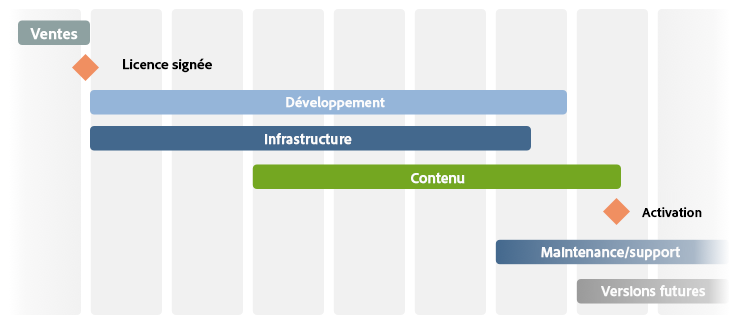

# La Liste de contrôle – Référence supplémentaire{#the-checklist-further-reference}

>[!CAUTION]
>
>AEM 6.4 a atteint la fin de la prise en charge étendue et cette documentation n’est plus mise à jour. Pour plus d’informations, voir notre [période de support technique](https://helpx.adobe.com/fr/support/programs/eol-matrix.html). Rechercher les versions prises en charge [here](https://experienceleague.adobe.com/docs/?lang=fr).

Cette page fournit des détails supplémentaires sur les documents et principes couverts par la [Gestion des projets - Liste de contrôle des bonnes pratiques](/help/managing/best-practices.md).

## AEM - Que voulez-vous utiliser ? {#aem-what-will-you-be-using}

>[!CAUTION]
>
>Les listes de cette sous-section ne sont pas exhaustives, mais elles ont pour but de servir d&#39;introduction.

### Fonctionnalités d’AEM {#features-within-aem}

Lors de la mise en œuvre d’AEM (notamment pour la première fois), vous devez passer en revue les [fonctionnalités et les workflows d’AEM](https://www.adobe.com/fr/marketing/experience-manager.html) afin de connaître avec certitude les domaines souhaités/requis.

Tenez compte des fonctions d’AEM que vous utiliserez et de l’impact sur votre travail de conception, par exemple :

* [Commerce](/help/sites-administering/ecommerce.md)
* [Screens](https://experienceleague.adobe.com/docs/experience-manager-screens/user-guide/aem-screens-introduction.html?lang=fr)
* [Assets](/help/assets/assets.md)
* [Balises](/help/sites-administering/tags.md)
* [Gestion de sites multiples et traduction](/help/sites-administering/msm-and-translation.md)
* [Forms](/help/forms/home.md)
* [Communities](/help/communities/deploy-communities.md)
* [Livefyre](https://experienceleague.adobe.com/docs/livefyre/implementation/getting-started/c-getting-started.html)

Vérifiez également la variable [Notes de mise à jour](/help/release-notes/release-notes.md), pour les différentes versions d’AEM, pour savoir quand de nouvelles fonctionnalités ont été ajoutées.

### Intégrations {#integrations}

AEM peut être intégré à d’autres produits Adobe et/ou services tiers. Ceux-ci peuvent augmenter la puissance et les fonctionnalités à votre disposition.

Voir [Intégration de solutions](/help/sites-administering/integration.md) pour obtenir des informations complètes.

## Migrer ou mettre à niveau ? {#migrate-or-upgrade}

Il est important de déterminer si vous souhaitez :

* Mettez à niveau l’installation existante.
* Migrez le contenu du système actuel vers une nouvelle installation.

Lorsque vous passez d’une version précédente à la version actuelle, deux options sont disponibles :

* Utilisez la variable [Gestionnaire de modules](/help/sites-administering/package-manager.md) pour exporter tout le contenu et le code de l’application de l’ancien système vers le nouveau.
* [Mettre à niveau](/help/sites-deploying/upgrade.md) l&#39;ancien système en place. Il s’agit du choix recommandé dans la plupart des cas.

## Règles de base {#basic-ground-rules}

Comme pour tout projet, il est essentiel d&#39;établir des règles de base dès que possible. Celles-ci comprennent les éléments suivants :

>[!NOTE]
>
>Ces points sont génériques, la [liste de contrôle des bonnes pratiques](/help/managing/best-practices.md) aborde les détails spécifiques à AEM.

* **Rôles**

   Ils doivent être clairement définis et connus de tous ceux qui participent au projet. En outre, il est conseillé de mettre en évidence :

   * Décideurs
   * Points de contact

* **Responsabilités**

   * Pour chaque rôle, une définition claire des responsabilités liées à votre projet permet d’éviter toute confusion.

* **Implication**

   En impliquant dès que possible les parties intéressées, vous pouvez les encourager à devenir *parties prenantes* dans le projet, augmentant ainsi leur engagement pour son succès.

   * Du côté client, cela inclut les auteurs qui devront travailler avec le système au quotidien.
   * Au sein de votre propre équipe de projet, cela inclut également les personnes responsables de l’assurance qualité. Plus ils comprennent les exigences du client, mieux ils peuvent planifier les tests.

* **Chemins de la communication**

   * Bien que celles-ci ne doivent pas être trop formalisées, des définitions spécifiques doivent veiller à ce que les personnes principales soient toujours informées. Une attention particulière doit être portée à la communication avec les parties externes.

* **Processus**

   Les processus à définir dépendent de votre projet individuel. Essayez encore de les simplifier en tenant compte des éléments suivants :

   * définir des processus (et chemins de communication) pour interagir avec des tiers, le cas échéant ; par exemple, les agences de conception et les fournisseurs de logiciels tiers.
   * Souvent, le client dispose de ses propres procédures et outils de gestion de projet et de reporting.

* **Outils de suivi**

   De nombreux outils sont disponibles pour effectuer le suivi d’informations sur les bogues, les tâches et d’autres aspects de votre projet. Voir [Présentation des outils potentiels](#overview-of-potential-tools) pour plus d’informations.

   * Le point essentiel à noter ici est de ne conserver qu&#39;une seule copie de l&#39;information et de la partager (et donc de l&#39;accès à l&#39;outil utilisé). Cela facilite la maintenance et permet d’éviter les incohérences.

* **Portée**

   Définissez clairement ce qui doit être couvert par le projet à différents niveaux :

   * les versions individuelles (si un processus de publication itératif est utilisé, et qu’elles soient diffusées aux clients ou à votre équipe de test interne).
   * le projet AEM.
   * l&#39;ensemble du projet; y compris les logiciels tiers, leur impact sur les tests, les problèmes d’organisation et bien d’autres.
   * Pour certains aspects, il peut également être utile d’indiquer ce qui est *not* dans le cadre du projet. Cela peut aider à éviter la confusion et des hypothèses incorrectes, bien qu&#39;il doive se limiter aux problèmes essentiels.

* **Création de rapports**

   Définissez clairement quelles informations vous allez signaler, sous quelle forme, à quelle fréquence et à qui.

* **Terminologie**

   * Définissez les abréviations et/ou la terminologie spécifique au client à utiliser.

* **Hypothèses**

   * Définissez les hypothèses faites.

Ces informations peuvent être définies dans un manuel de projet ; l’utilisation d’un wiki peut également vous assurer que les modifications en cours sont gérées efficacement. Lorsqu’elles sont définies, les principaux facteurs sont les suivants :

* Les informations sont définies et conservées.
* L&#39;information est clairement communiquée à toutes les personnes concernées. Bien que la gestion de projet soit une pratique standard, elle ne peut pas être répétée assez souvent pour qu’une définition claire des rôles et une bonne communication puissent créer ou interrompre un projet.
* Une seule version des informations suivies est conservée ; par exemple, le suivi des bogues, le suivi des problèmes, etc.

## Indicateurs de performance clés et mesures cibles {#key-performance-indicators-and-target-metrics}

Les organisations utilisent des indicateurs de performances clés (IPC) pour évaluer leur capacité à atteindre des cibles. Ces indicateurs sont des valeurs mesurables qui peuvent être utilisées pour démontrer l’efficacité avec laquelle des objectifs spécifiques sont atteints.

Ces indicateurs peuvent être les suivants :

* Entreprise:

   * Utilisé pour mesurer les objectifs commerciaux clés.
   * Il est important de choisir les indicateurs de performance clés appropriés à votre entreprise/scénario avec des définitions claires de ce qu’ils sont, de la manière dont ils seront mesurés, de la manière dont ils seront utilisés et par qui.

* Performances :

   * Définissez comment mesurer les performances du système.
   * Voici quelques exemples : temps de chargement des pages, temps de réponse du serveur et performances des requêtes de base de données.

Certains indicateurs, mais pas tous, peuvent être basés sur les mesures cibles que vous identifiez et définissez.

### Mesures Target {#target-metrics}

Les mesures servent à définir des mesures quantitatives de la qualité de votre site web. Elles sont essentiellement une définition des objectifs de performances que vous souhaitez atteindre et peuvent être utilisées pour définir votre [IPC (indicateurs de performance clés)](#key-performance-indicators-and-target-metrics).

De nombreuses mesures peuvent être définies, mais souvent celles que vous définissez couvrent vos objectifs en termes de performances et de simultanéité. En particulier, des facteurs qui peuvent être difficiles à quantifier et qui sont souvent sujets à des *émotionnel* évaluation :

* &quot;notre site web est *beaucoup trop lent* aujourd’hui&quot; - quand *lent* être admissible ?

* &quot;tout *grinçant à un arrêt* lorsque mon collègue se connecte&quot;. Combien d’utilisateurs simultanés le système peut-il prendre en charge ?
* &quot;lorsque je recherche, le système *grinçant à un arrêt* &quot; - quel type de requêtes de recherche impacte le système ?
* &quot;Il faut *âges* télécharger le fichier&quot;. Quelles sont les heures de téléchargement acceptables (dans des conditions réseau normales) ?

Les mesures Target sont définies au début d’un projet pour :

* indiquer les dimensions attendues du site web que vous proposerez ;
* indiquer la qualité minimale à atteindre ;
* définir comment ces facteurs seront réellement mesurés ;
* doit être utilisé comme base pour la variable [Indicateurs de performance clés](#key-performance-indicators-and-target-metrics)

Comme toujours, vous devez être prudent lors de la définition des mesures cibles :

* s’ils sont trop élevés, ils peuvent être complètement inaccessibles.
* si elle est définie sur de trop faibles fluctuations peut ne pas être mise en évidence.
* pour s’assurer qu’elles peuvent être mesurées de manière répétée et cohérente.
* afin de fournir un équilibre entre les différents facteurs mesurés.
* certaines mesures se rapportent à un environnement de test, mais certaines doivent refléter des scénarios de la vie réelle, car elles doivent être mesurables et reproductibles, sur votre site web de production.
* classer par priorité les mesures en fonction de leur importance pour le site web
* limiter les mesures à un ensemble pouvant être surveillé de manière réaliste ;

Au cours du développement du projet, elles peuvent être mises à jour et ajustées selon les besoins. Une fois le projet mis en oeuvre avec succès, vous pouvez les utiliser pour contrôler votre installation et surveiller/gérer les niveaux de service requis pour le fonctionnement en cours.

Si elles sont correctement utilisées, ces mesures peuvent fournir un outil utile. En revanche, si elles sont utilisées de manière irresponsable, elles peuvent constituer une distraction et une perte de temps. Comme toujours, vous devez comprendre ce que vous mesurez, comment vous le mesurez et pourquoi.

>[!NOTE]
>
>Cette section traite des principes de base et des questions à examiner. Chaque installation étant différente, les valeurs réelles à mesurer diffèrent.

### Tout repose sur la conception de projet {#everything-rests-on-your-project-design}

Toutes les mesures à mesurer seront, d’une certaine manière, affectées par la conception de votre projet. Inversement, de nombreux problèmes seront mieux résolus par des modifications de conception.

Par conséquent, vous devez définir vos mesures cibles. *before* décider de votre conception. Cela vous permet d’optimiser votre conception en fonction de ces facteurs. Une fois votre projet développé, il sera difficile d’apporter des modifications aux principes de conception de base.

Lorsque vous créez la structure du site web, suivez la structure recommandée pour AEM sites web. Assurez-vous de comprendre les problèmes et/ou principes suivants :

* Comment structurer le contenu d’un site web.
* Fonctionnement des modèles et des composants.
* Fonctionnement de la mise en cache.
* Les impacts du contenu personnalisé.
* Fonctionnement de la fonction de recherche.
* Comment utiliser le code CSS et les technologies associées pour créer du code de HTML compact et non redondant.

Si vous estimez que votre conception ne suit pas les instructions ou si vous n’êtes pas certain de certaines implications, clarifiez ces questions avant de commencer la phase de programmation ou de compléter le contenu.

### Infrastructure {#infrastructure}

Pour définir ou évaluer l’infrastructure, il aidera à définir des valeurs cibles telles que :

* visiteurs/jour ; moyenne et pic
* accès/jour ; moyenne et pic
* nombre de pages web mises à disposition
* volume de contenu web

En fonction de votre situation et de l’importance stratégique du site web, cela vous aidera à évaluer et à choisir votre infrastructure :

* nombre de serveurs
* nombre d’instances d’AEM (auteur et publication)

### Performances {#performance}

Plusieurs facteurs de performances peuvent être évalués :

* temps de réponse pour des pages individuelles, en tenant compte des éléments suivants :

   * temps de réponse dans un environnement de création
   * temps de réponse dans l’environnement de publication

* temps de réponse des requêtes de recherche

Cette section peut être lue en parallèle de la section [Optimisation des performances](/help/sites-deploying/configuring-performance.md) qui répertorie les détails techniques relatifs à la mesure des performances.

#### Temps de réponse pour des pages individuelles {#response-times-for-individual-pages}

L’un des problèmes majeurs est le temps que met votre site web pour répondre aux requêtes des visiteurs et des visiteuses.

Bien que cette valeur varie pour chaque requête, une valeur cible moyenne peut être définie. Une fois que cette valeur s’est avérée à la fois réalisable et gérable, elle peut être utilisée pour surveiller les performances du site web et indiquer le développement de problèmes potentiels.

Cibles différentes sur les environnements de création et de publication

Les temps de réponse que vous viserez seront différents dans les environnements de création et de publication, reflétant l’audience cible :

* **Environnement de création**

   Cet environnement est utilisé par les auteurs qui saisissent et mettent à jour du contenu. Il doit donc :

   * prendre en charge un petit nombre d’utilisateurs qui génèrent un grand nombre de requêtes lors de la mise à jour des pages de contenu et des éléments individuels sur ces pages ;
   * être aussi rapide que possible afin d’optimiser leur productivité pour intégrer du contenu à votre site web ;

* **Environnement de publication**

   Cet environnement intègre le contenu que vous mettez à la disposition de vos utilisateurs et utilisatrices :

   * La vitesse reste vitale, mais elle est souvent plus lente qu’un environnement de création
   * d’autres mécanismes d’amélioration des performances sont souvent appliqués :

      * le contenu est mis en cache.
      * l’équilibrage de charge est appliqué ;

#### Définition des délais de réponse des cibles {#setting-target-response-times}

Comment puis-je décider des temps de réponse (moyens) atteignables ? Il s’agit souvent d’une question d’expérience :

* expérience passée sur votre site web
* expérience avec AEM
* identification des pages complexes dont les temps de réponse sont supérieurs à la moyenne (ces temps doivent être optimisés individuellement, si possible) ;

Toutefois, dans des circonstances contrôlées, les directives suivantes peuvent être appliquées :

* 70 % des demandes de pages doivent répondre en moins de 100 ms.
* 25 % des demandes de pages doivent répondre en moins de 100 à 300 ms.
* 4 % des demandes de pages doivent répondre en moins de 300 à 500 ms.
* 1 % des demandes de pages doivent répondre en moins de 500 à 1 000 ms.
* Aucune page ne doit répondre plus d’une seconde.

Les chiffres ci-dessus supposent les conditions suivantes :

* mesurées lors de la publication (aucun environnement de création et/ou surcharge CFC) ;
* mesuré sur le serveur (aucune surcharge réseau) ;
* non mis en cache (pas de cache AEM sortie, pas de cache de Dispatcher)
* uniquement pour les éléments complexes avec de nombreuses dépendances (HTML, JS, PDF, etc.) ;
* aucune autre charge sur le système

Vous pouvez utiliser plusieurs mécanismes pour surveiller les temps de réponse :

* **Surveillance des temps de réponse avec request.log AEM**

   Le journal des requêtes est un point de départ intéressant pour l’analyse de performances. Entre autres informations, vous pouvez l’utiliser pour afficher les temps de réponse des requêtes individuelles. Voir [Optimisation des performances](/help/sites-deploying/configuring-performance.md) pour plus d’informations.

* **Surveillance des temps de réponse avec des commentaires HTMLS**

   `*HTML comments* can be used to include response time information within the source of each page:`

   `</body> </html>v <-- Page took 58 milliseconds to be rendered by the server --> Response times for search requests`

#### Requêtes de recherche {#search-requests}

Les requêtes de recherche peuvent avoir un impact significatif sur votre site web, en termes de :

* Temps de réponse de la recherche réelle

   * Une fonction de recherche rapide est un objectif de qualité pour votre site web.

* Impact sur les performances générales

   * Comme une fonction de recherche doit analyser (potentiellement de grandes) sections du contenu, ou un index spécialement extrait, cela peut avoir une incidence sur les performances de l’ensemble du système si ce n’est pas optimisé.

La définition de cibles pour les requêtes de recherche est, encore une fois, une question d’expérience en fonction des éléments suivants :

* expérience de l’AEM
* une évaluation de la fréquence d’utilisation de la recherche par rapport à d’autres objectifs ;
* votre gestionnaire de persistance
* votre index de recherche
* la complexité de votre fonction de recherche ; une fonction de recherche de base qui ne permet d’entrer qu’un seul terme de recherche sera plus rapide qu’une recherche avancée permettant à l’utilisateur de créer des instructions de recherche complexes à l’aide de AND/OR/NOT.

Elles doivent être planifiées et intégrées dès le début de votre projet. Les mécanismes de surveillance disponibles sont les suivants :

* **Surveillance des temps de réponse de la recherche avec l’AEM request.log**

   Là encore, le fichier request.log peut être utilisé pour surveiller les temps de réponse des requêtes de recherche ; see [Optimisation des performances](/help/sites-deploying/configuring-performance.md) pour plus d’informations.

* **Mécanismes programmés pour mesurer les temps de réponse des recherches**

   Pour personnaliser les informations que vous collectez sur les requêtes de recherche et leurs performances, il est recommandé d’inclure la collecte d’informations dans le code source de votre projet ; see [Optimisation des performances](/help/sites-deploying/configuring-performance.md) pour plus d’informations.

### Concurrence {#concurrency}

Votre site web sera mis à la disposition de plusieurs utilisateurs/visiteurs, dans les environnements de création et de publication. Les nombres sont souvent plus élevés que ceux que vous utilisiez lors des tests, mais aussi fluctuants et difficiles à prédire. Votre site web devra être conçu pour un nombre moyen d’utilisateurs/de visiteurs simultanés sans remarquer un impact négatif sur les performances. Là encore, le fichier `request.log` peut être utilisé pour effectuer des tests d’accès simultané ; consultez [Optimisation des performances](/help/sites-deploying/configuring-performance.md) pour plus d’informations.

Les cibles pour le nombre d’utilisateurs simultanés dépendent du type d’environnement :

* **Environnement de création**

   * Généralement, le nombre d’utilisateurs simultanés peut être estimé avec précision. Vous saurez combien d’auteurs vous avez au total, bien que (probablement) tous ne seront pas principaux en même temps.

* **Environnement de publication**

   * Cela est plus difficile à prédire. Vous devez donc sélectionner une valeur cible. Là encore, cela doit être basé sur l’expérience de votre site web actuel et sur des attentes réalistes de votre nouveau site web.
   * Les événements spéciaux (par exemple, lorsque vous publiez du nouveau contenu très populaire) peuvent dépasser les attentes, voire même les capacités (comme cela est parfois rapporté dans la presse lorsque des billets pour certains événements sont mis en vente).

### Capacité et volume {#capacity-and-volume}

Avant de discuter des mesures connexes, une définition rapide des termes :

* **Volume**

   * La quantité en sortie qui est traitée et diffusée par le système.

* **Capacité**

   * Capacité du système à fournir le volume.
   * À chaque étape, la capacité et le volume sont mesurés différemment, comme le montre le tableau ci-dessous. Pour de meilleures performances, assurez-vous que la capacité correspond au volume à chaque étape et que la capacité et le volume sont partagés à l’échelle de toutes les étapes. Par exemple, vous pouvez calculer la navigation sur l’ordinateur client ou la mettre dans le cache, au lieu de la calculer sur le serveur pour chaque requête.

* **Capacité et volume**

   | Quoi / Où | Capacité | Volume |
   |---|---|---|
   | Client | Puissance de calcul de l’ordinateur de l’utilisateur. | Complexité de la mise en page. |
   | Réseau | Bande passante réseau. | Taille de la page (code, images, etc.). |
   | Cache du Dispatcher | Mémoire serveur du serveur Web (mémoire principale et disque dur). | Serveur web (mémoire principale et disque dur). Nombre et taille des pages mises en cache. |
   | Cache de sortie | Mémoire serveur du serveur AEM (mémoire principale et disque dur). | Nombre et taille des pages dans le cache de sortie, et nombre de dépendances par page. Le cache du Dispatcher réduit ce volume. |
   | Serveur web | Puissance de calcul du serveur Web. | Nombre de requêtes. La mise en cache réduit ce volume. |
   | Modèle | Puissance de calcul du serveur web. | Complexité des modèles. |
   | Référentiel | Performances du référentiel. | Nombre de pages chargées à partir du référentiel. |

### Autres mesures {#other-metrics}

Les sections précédentes détaillent les principales mesures à définir.

En fonction de vos besoins spécifiques, il peut s’avérer utile de définir des mesures supplémentaires, soit isolément, soit en tenant compte des classifications ci-dessus.

Cependant, il est préférable de disposer d’un petit ensemble de mesures principales précises et fiables, plutôt que d’essayer de mesurer et de définir chaque aspect de votre site web. Par sa nature même, votre site web commencera à changer et à évoluer dès qu&#39;il sera transmis à vos utilisateurs.

## Sécurité {#security}

La sécurité est cruciale et présente un défi toujours plus grand. It ***must*** être considéré et planifié dès les premières étapes de votre projet.

La [liste de contrôle de sécurité](/help/sites-administering/security-checklist.md) décrit les mesures à prendre pour s’assurer que votre installation d’AEM est sécurisée lors de son déploiement. D’autres aspects liés à la sécurité sont traités dans les sections [Sécurité (lors du développement)](/help/sites-developing/security.md) et [Administration des utilisateurs et sécurité](/help/sites-administering/security.md).

## Tâches parallèles et itératives {#parallel-and-iterative-tasks}

>[!NOTE]
>
>Les éléments suivants :
>
>* Cette section offre un aperçu de la *première* mise en œuvre d’un projet AEM.
>* est conçu comme un aperçu abstrait ; voir la [Liste de contrôle du projet](/help/managing/best-practices.md) pour des phases/jalons/tâches spécifiques.
>* Toutes les échelles de temps sont théoriques.
>

Pour une nouvelle mise en oeuvre d’un projet AEM standard, vous devez tenir compte de tâches telles que :

* Transfert à partir du processus de vente.
* Mise en oeuvre de l’application client (**Développement**).
* Installation et configuration de l’infrastructure (et des processus associés) sur le site du client (**Infrastructure**).
* Création (ou migration) du contenu (**Contenu**).
* Transfert vers les opérations (**Maintenance/assistance**).
* Suivez les versions.

Pour tous les aspects, il est recommandé d’utiliser une approche itérative :

>[!NOTE]
>
>Diviser le lancement du projet en **Lancement(s) Soft** (disponibilité réduite, itérations multiples) et **Hard Launch** (disponibilité complète - En direct) pour permettre l’optimisation et la formation des utilisateurs dans des conditions réalistes dans l’environnement de production.

>[!NOTE]
>
>Voir [Liste de contrôle du projet](/help/managing/best-practices.md) pour obtenir des exemples de tâches que vous devez effectuer (ou évaluer) pendant le cycle de vie de votre projet.

Voici quelques points à noter pour chaque catégorie :

* **Développement**

   * Définissez d’abord l’architecture de base.
   * Utilisez plusieurs itérations (sprints) pour le développement :

      * Le premier sprint correspond au premier cycle de développement complet.
      * Le premier sprint entraîne le premier déploiement dans votre environnement de test.
      * Chaque sprint a un résultat exécutable.
      * Chaque sprint reçoit une approbation client (minimum de test structuré avec commentaires).
   * Planifiez l’éventualité d’une mise à jour de la version d’AEM disponible au cours du projet.
   * Planifiez les tests et l’optimisation lors des tirages.
   * Planifiez les phases de stabilisation et d’optimisation.
   * Créez un journal des éléments à planifier pour les prochaines versions.
   * Planifiez la participation et la remise des partenaires.

* **Infrastructure**

   * Définissez d’abord l’architecture de base :

      * Définissez les exigences de performances.
      * Définissez des objectifs de performances (c’est-à-dire définissez clairement les attentes).
      * Définir l’architecture du matériel et de l’infrastructure ; y compris le dimensionnement.
      * Définissez le déploiement.
   * utiliser plusieurs itérations ; pour la préparation du premier sprint et de la configuration initiale :

      * Environnement de développement.
      * Processus de développement.
      * Environnement de test.
      * Processus de déploiement (y compris la gestion de la configuration).
   * Planifiez plusieurs tests de charge.
   * Planifiez les tests et l’optimisation lors des tirages.
   * Planifiez une phase de stabilisation et d’optimisation.
   * Déployez dans l’environnement de production dès que possible (laissez l’équipe d’exploitation configurer le système pour acquérir de l’expérience).
   * Utilisez aussi tôt que possible les utilisateurs nommés et les rôles définis.
   * Planifiez la formation (formation des administrateurs, par exemple).
   * Planifiez la remise aux opérations.

* **Contenu**

   * L’architecture de base :
      * Permet d’orienter la hiérarchie du contenu.
      * Permet de définir le concept de contenu.
      * Définit l’utilisation et la mise en page MSM.
      * Définit les rôles, les groupes, les workflows et les autorisations.
   * Déterminez si la création de pages hors ligne sera utile.
   * Planifiez la création précoce des premières pages et du contenu (à utiliser dans les tests et les commentaires).
   * Planifiez la migration du contenu existant.
   * Planifiez la &quot;migration interne au sprint&quot; après la refactorisation.
   * Planifiez le &quot;chargement du contenu&quot; (plan du site pour le contenu de mise en ligne).

## Estimation du temps et des efforts {#estimating-time-and-effort}

En fonction de la liste des tâches qui en résulte, vous pouvez ensuite effectuer des estimations initiales du temps et de l’effort pour les définitions de tâches (de haut niveau). Elles doivent inclure une indication de qui (client ou partenaire) fera quoi et quand.

La liste suivante présente les approximations standard et les corrélations d&#39;effort connexes, et donc les coûts :

>[!CAUTION]
>
>Ces chiffres ne peuvent être utilisés que pour les estimations initiales. Un développeur AEM expérimenté doit effectuer l’analyse détaillée.

| Phase | Effort |
|---|---|
| Développement | On estime qu’approximativement 2 à 4 heures de travail pour chaque nœud de composant couvrira toutes les exigences de développement. |
| Test du développeur | 15 % du développement |
| Suivi | 10 % du développement |
| Documentation | 15 % du développement |
| Documentation JavaDoc | 10 % du développement |
| Correction de bogues | 15 % du développement |
| Gestion de projets | 20 % des coûts du projet alloués à la gestion et à la gouvernance continues du projet |

Une planification détaillée peut ensuite relier les ressources disponibles ou requises aux échéances et aux coûts.

## Architecture de référence {#reference-architecture}

L’architecture de référence est fournie pour fournir une solution de modèle pour l’architecture AEM. L’architecture de référence résout les problèmes courants rencontrés pour les systèmes d’entreprise, notamment la mise à l’échelle, la fiabilité et la sécurité.

Les mesures de site suivantes doivent être définies :

| Classification | Définition |
|---|---|
| Nombre de sites Internet |  |
| Nombre de sites intranet |  |
| Nombre de bases de code (par exemple, si différents pour Internet et l’intranet) |  |
| Nombre de pages individuelles |  |
| Nombre de visites du site par jour |  |
| Nombre de pages vues par jour |  |
| Volume (en Go) de transfert de données par jour |  |
| Nombre d’utilisateurs simultanés (groupe d’utilisateurs fermé) |  |
| Nombre de visiteurs simultanés (publication) |  |
| Nombre d’auteurs simultanés |  |
| Nombre d’auteurs enregistrés |  |
| Nombre d’activations de page par jour de travail |  |
| Nombre d’activations de page lors du déploiement |  |

## Présentation des outils potentiels {#overview-of-potential-tools}

La liste suivante est fournie pour vous informer des outils qui peuvent être utilisés. Il s’agit d’une introduction, et non d’une liste de recommandations exhaustive, qui ne devrait certainement pas vous dissuader d’utiliser d’autres outils que vous préférez.

<table>
 <tbody>
  <tr>
   <td><strong>Produit</strong></td>
   <td><strong>Description</strong></td>
  </tr>
  <tr>
   <td>AEM</td>
   <td>
AEM fournit lui-même tout un éventail d’outils pour vous aider à surveiller, tester, étudier et déboguer votre application ; notamment :

    <ul>
     <li><a href="/help/sites-developing/developer-mode.md">Mode Développeur</a></li>
     <li>La <a href="/help/sites-developing/hobbes.md">Console de test</a></li>
     <li><a href="/help/sites-administering/operations-dashboard.md">Tableau de bord des opérations</a></li>
     <li><a href="/help/sites-authoring/content-insights.md">Content Insight</a></li>
     <li>L’<a href="/help/sites-authoring/author-environment-tools.md#content-tree">Arborescence de contenu</a></li>
    </ul> </td>
  </tr>
  <tr>
   <td> </td>
   <td> </td>
  </tr>
  <tr>
   <td>Selenium</td>
   <td><a href="https://docs.seleniumhq.org/">Selenium</a> est un outil de test en open-source. Les tests s’exécutent directement dans le navigateur en émulant la façon dont les utilisateurs travaillent.</td>
  </tr>
  <tr>
   <td>Microsoft Project</td>
   <td>Outil de gestion de projet couramment utilisé.</td>
  </tr>
  <tr>
   <td>Jira</td>
   <td><a href="https://www.atlassian.com/software/jira">Jira</a> est un outil en open-source destiné au suivi et à la gestion des détails de vos bogues logiciels. Vous pouvez appliquer des workflows aux détails des bogues, selon vos besoins.</td>
  </tr>
  <tr>
   <td>Git</td>
   <td><a href="https://git-scm.com/">Git</a> est un logiciel de contrôle des révisions.</td>
  </tr>
  <tr>
   <td>Eclipse</td>
   <td>
Eclipse est un environnement de développement intégré en open-source, composé de différents projets. Ils se concentrent sur la création d’une plateforme de développement ouverte, composée de frameworks extensibles, d’outils et de runtimes pour la conception, le déploiement et la gestion des logiciels tout au long du cycle de vie.
 
Consultez <a href="/help/sites-developing/howto-projects-eclipse.md">Développement de projets AEM à l’aide d’Eclipse</a> pour plus d’informations.
 </td>
  </tr>
  <tr>
   <td>IntelliJ</td>
   <td>
Un environnement de développement intégré professionnel (et pouvant donc engendrer des coûts de licence) offrant une gamme complète de fonctions. 
 
Consultez <a href="/help/sites-developing/ht-intellij.md">Développement de projets AEM à l’aide d’IntelliJ IDEA</a> pour plus d’informations.
 </td>
  </tr>
  <tr>
   <td>Maven</td>
   <td><a href="https://maven.apache.org/">Maven</a> est un outil pour vous aider à comprendre et à gérer vos projets logiciels et à gérer le processus de conception d’un projet (qu’il s’agisse de la partie logicielle ou de la documentation).</td>
  </tr>
 </tbody>
</table>

## Informations complémentaires {#further-reading}

En outre, les sections suivantes présentent un intérêt particulier :

* [Prise en main](/help/sites-deploying/deploy.md#getting-started)
* [Exigences techniques](/help/sites-deploying/technical-requirements.md)
* [Surveillance et maintenance de votre instance](/help/sites-deploying/monitoring-and-maintaining.md)

### Bonnes pratiques {#best-practices}

Adobe fournit d’autres bonnes pratiques pour toutes les phases et audiences :

* [Déploiement](/help/sites-deploying/best-practices.md)
* [Création](/help/sites-authoring/best-practices.md)
* [Administration](/help/sites-administering/administer-best-practices.md)
* [Développement](/help/sites-developing/best-practices.md)
* [Gestion de projets](/help/managing/best-practices.md)
