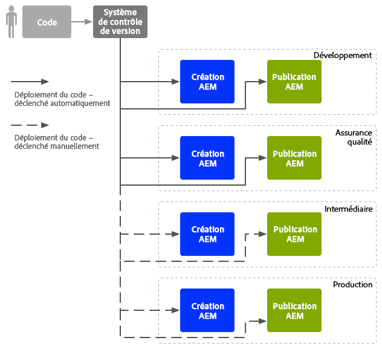
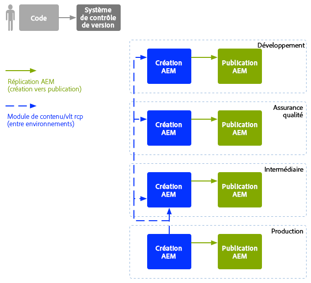

# Opérations de développement d’entreprise (DevOps){#enterprise-devops}

>[!CAUTION]
>
>AEM 6.4 a atteint la fin de la prise en charge étendue et cette documentation n’est plus mise à jour. Pour plus d’informations, voir notre [période de support technique](https://helpx.adobe.com/fr/support/programs/eol-matrix.html). Rechercher les versions prises en charge [here](https://experienceleague.adobe.com/docs/?lang=fr).

Les opérations de développement couvrent les processus, les méthodes et les communications requis pour :

* Facilitez le déploiement de votre logiciel dans les différents environnements.
* Simplifiez la collaboration entre les équipes de développement, de test et de déploiement.

Les opérations de développement visent à éviter les problèmes tels que :

* Erreurs manuelles.
* les éléments oubliés; par exemple, fichiers, détails de configuration.
* les incohérences, par exemple, entre l’environnement local d’un développeur et d’autres environnements.

## Environnements {#environments}

Un déploiement Adobe Experience Manager (AEM) se compose généralement de plusieurs environnements, utilisés à des fins différentes à différents niveaux :

* [Développement](#development)
* [Assurance qualité](#quality-assurance)
* [Évaluation](#staging)
* [Production](#production-author-and-publish)

>[!NOTE]
>
>L’environnement de production doit avoir au moins un environnement de création et un environnement de publication.
>
>Il est recommandé que tous les autres environnements se composent également d’un environnement de création et de publication afin de refléter l’environnement de production et de permettre des tests lors de phases précoces du projet.

### Développement {#development}

Les développeurs sont chargés de développer et de personnaliser le projet proposé (qu’il s’agisse d’un site web, d’applications mobiles, de la mise en oeuvre de la gestion des actifs numériques, etc.), avec toutes les fonctionnalités requises. Ils :

* développer et personnaliser les éléments nécessaires ; par exemple, modèles, composants, workflows, applications
* réalisent la conception ;
* développent les services et les scripts nécessaires pour mettre en œuvre les fonctionnalités requises.

La configuration de la variable [development](/help/sites-developing/best-practices.md) L’environnement peut dépendre de divers facteurs, bien qu’il se compose généralement des éléments suivants :

* Un système de développement intégré avec contrôle de version pour fournir une base de code intégrée. Il est utilisé pour fusionner et consolider le code des différents environnements de développement utilisés par chaque développeur.
* Un environnement personnel pour chaque développeur, résidant habituellement sur son ordinateur local. Le code est synchronisé avec le système de contrôle de version à des intervalles appropriés.

Selon l’échelle de votre système, l’environnement de développement peut comprendre une instance de création et une instance de publication.

### Assurance qualité {#quality-assurance}

Cet environnement est utilisé par l’équipe d’assurance qualité afin de [tester](/help/sites-developing/test-plan.md) entièrement votre nouveau système, autant sur sa conception que ses fonctions. Il doit comporter des environnements de création et de publication, avec du contenu approprié, et fournir tous les services nécessaires pour activer une suite complète de tests.

### Évaluation  {#staging}

L’environnement d’évaluation doit être un miroir de l’environnement de production : configuration, code et contenu :

* Il est utilisé pour tester les scripts utilisés pour mettre en oeuvre le déploiement réel.
* Il peut être utilisé pour les tests finaux (conception, fonctionnalités et interfaces) avant le déploiement dans les environnements de production.
* Bien qu’il ne soit pas toujours possible que l’environnement d’évaluation soit identique à l’environnement de production, il doit être aussi proche que possible pour activer les tests de performance et de charge.

### Production : création et publication  {#production-author-and-publish}

L’environnement de production est constitué des environnements requis pour [créer et publier](/help/sites-authoring/author.md#concept-of-authoring-and-publishing) votre mise en œuvre.

Un environnement de production comprend au moins une instance de création et une instance de publication :

* Une instance de [création](#author) pour la saisie du contenu.
* Une instance de [publication](#publish) pour le contenu mis à la disposition de vos visiteurs/utilisateurs.

En fonction de l’échelle du projet, il se compose bien souvent de plusieurs instances de création et/ou de publication. À un niveau inférieur, le référentiel peut également être mis en grappe sur plusieurs instances.

#### Création {#author}

Les instances d’auteur se trouvent généralement derrière le pare-feu interne. Il s’agit de l’environnement dans lequel vous et vos collègues effectuerez des tâches de création, telles que :

* administrer l’ensemble du système ;
* saisir votre contenu ;
* configurer la mise en page et la conception de votre contenu ;
* activer votre contenu dans l’environnement de publication ;

Le contenu qui a été activé est mis en package et placé dans la file d’attente de réplication de l’environnement de création. Le processus de réplication transporte ensuite ce contenu dans l’environnement de publication.

Afin de répliquer à l’inverse les données générées dans un environnement de publication vers l’environnement de création, un écouteur de réplication dans l’environnement de création interroge l’environnement de publication et récupère ce contenu dans la boîte d’envoi de réplication inverse de l’environnement de publication.

#### Publication  {#publish}

Un environnement de publication se trouve généralement dans la zone démilitarisée (DMZ). Il s’agit de l’environnement dans lequel les visiteurs accéderont à votre contenu (par exemple, via un site web ou sous la forme d’une application mobile) et interagiront avec lui ; qu’il soit public ou dans votre intranet. Un environnement de publication :

* contient du contenu répliqué à partir de l’environnement de création ;
* met ce contenu à la disposition des visiteurs
* stocke les données utilisateur générées par vos visiteurs, telles que les commentaires ou autres envois de formulaire ;
* peut être configuré pour ajouter de telles données utilisateur à une boîte d’envoi, afin que la réplication inverse soit rétablie dans l’environnement de création.

L’environnement de publication génère votre contenu dynamiquement en temps réel et le contenu peut être personnalisé pour chaque utilisateur.

## Mouvement de code  {#code-movement}

Le code doit toujours être propagé du bas vers le haut :

* Le code est initialement développé sur les environnements de développement locaux puis intégrés.
* suivi de tests approfondis sur le ou les environnements d’assurance qualité
* puis effectuer de nouveau les tests sur les environnements intermédiaires.
* À ce stade seulement, le code doit être déployé dans les environnements de production.

Le code (par exemple, les fonctionnalités d’applications web et les modèles de conception personnalisés) est généralement transféré en exportant et en important des packages entre les différents référentiels de contenu. Lorsque c’est approprié, cette réplication peut être configurée en tant que processus automatique.

Les projets AEM déclenchent souvent le déploiement du code :

* Automatiquement : pour le transfert vers les environnements de développement et d’assurance qualité.
* Manuellement : les déploiements sur les environnements d’évaluation et de production sont effectués de manière plus contrôlée, souvent manuelle ; l’automatisation reste toutefois possible, si nécessaire.

## Déplacement de contenu {#content-movement}

Le contenu conçu pour la production doit **toujours** être créé sur l’instance de création de production.

Le contenu ne doit pas suivre le déplacement du code des environnements inférieurs vers les plus élevés. Il n’est en effet pas recommandé de créer du contenu sur des ordinateurs locaux ou des environnements inférieurs, puis de le déplacer vers l’environnement de production, car cela peut introduire des erreurs et des incohérences.

Le contenu de production doit être déplacé à partir de l’environnement de production vers l’environnement d’évaluation pour assurer que ce dernier fournit un environnement de test efficace et précis.

>[!NOTE]
>
>Cela ne signifie pas que le contenu intermédiaire doit être continuellement synchronisé avec la production, les mises à jour régulières sont suffisantes, mais surtout avant de tester une nouvelle itération du code. Le contenu des environnements d’assurance qualité et de développement n’a pas besoin d’être mis à jour aussi fréquemment. Il doit simplement représenter correctement le contenu de production.

Le contenu peut être transféré :

* Entre les différents environnements, en exportant et en important des packages.
* entre différentes instances, en répliquant directement (par [réplication AEM](/help/sites-deploying/replication.md)) le contenu (à l’aide d’une connexion HTTP ou HTTPS).

