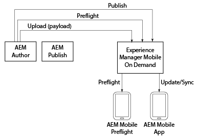

# AEM Mobile à la demande{#aem-mobile-on-demand}

>[!NOTE]
>
>Adobe recommande d’utiliser l’éditeur d’application d’une seule page (SPA) pour les projets nécessitant un rendu côté client basé sur la structure SPA (par exemple, React). [En savoir plus](/help/sites-developing/spa-overview.md).

>[!NOTE]
>
>Si vous n’utilisez pas AEM comme source de gestion de contenu, consultez l’aide [de](https://helpx.adobe.com/digital-publishing-solution/topics.html)AEM Mobile On-demand Services.

AEM fournit plusieurs outils qui permettent d’intégrer du contenu dans les applications mobiles.

Le diagramme suivant illustre comment les différents composants d&#39;AEM Mobile et des services à la demande s&#39;intègrent pour fournir du contenu aux applications mobiles.

L’application AEM Preflight peut être considérée comme un environnement de test pour prévisualisation de l’application et du contenu avant publication ; tandis que l’application AEM Mobile est l’application finale créée pour la distribution.

>[!NOTE]
>
>Pour en savoir plus sur l’application Preflight, voir [Utilisation de l’application](https://helpx.adobe.com/digital-publishing-solution/help/preflight-app.html) AEM Preflight dans l’aide AEM Mobile On-demand Services.

>[!NOTE]
>
>Dans le diagramme ci-dessus, l’instance de publication AEM n’est pas requise pour un scénario de déploiement type vers AEM Mobile On-demand Services.

## Démarrage d’une nouvelle application mobile {#starting-a-new-mobile-app}

L&#39;AEM Mobile n&#39;est qu&#39;un pilier qui constitue la plateforme AEM complète.

Le démarrage d’une nouvelle expérience d’application AEM Mobile requiert une cohésion de rôles avant de pouvoir modifier le contenu. Les rôles suivants constituent un point de départ pour la création d’une application AEM Mobile :

* **Administrateur**
* **Développeur**
* **Auteur**

>[!NOTE]
>
>Avant de travailler avec AEM Mobile et de suivre les étapes de ce guide de prise en main, les utilisateurs doivent connaître les AEM. Learn the basics of AEM [here](/help/sites-deploying/deploy.md).

### Présentation du Tableau de bord d&#39;application AEM Mobile {#understanding-the-aem-mobile-application-dashboard}

Avant de comprendre les rôles et les responsabilités, l&#39;utilisateur doit posséder une connaissance approfondie du Centre **de contrôle** AEM Mobile ou du Tableau de bord **** d&#39;application. Cliquez [ici](/help/mobile/mobile-apps-ondemand-application-dashboard.md) pour une compréhension approfondie.

### Administrateur AEM {#aem-administrator}

Un administrateur ***AEM*** est chargé d’ajouter une nouvelle application au catalogue AEM Mobile, soit en créant une nouvelle application à l’aide de l’assistant de création, soit en important une application existante. AEM administrateurs qui créent une application à l’aide de l’assistant *de* création AEM Mobile sélectionnent généralement l’un des modèles d’application souhaités, soit à partir des exemples de référence prêts à l’emploi, soit (dans la plupart des cas) à partir d’un modèle d’application personnalisé créé par des développeurs *AEM.*

Un administrateur AEM est responsable des tâches suivantes lors de la création d’une application à l’aide de AEM Mobile On-demand Services :

* [Configuration de AEM Mobile](/help/mobile/aem-mobile-setup.md)
* [Configuration de vos groupes d’utilisateurs et d’utilisateurs](/help/mobile/aem-mobile-configure-users.md)
* [Aperçu avec contrôle en amont](/help/mobile/aem-mobile-manage-ondemand-services.md)
* [Administration de Content Services](/help/mobile/developing-content-services.md)

Pour vous familiariser avec les rôles et responsabilités d’un administrateur, voir [Administration du contenu à utiliser AEM Mobile On-demand Services](/help/mobile/aem-mobile.md).

## Développeur AEM {#aem-developer}

Un développeur **AEM** étend et crée des modèles Web et des composants personnalisés pour permettre à *AEM Author *de créer de belles expériences mobiles attrayantes. Ces modèles et composants ne sont pas seulement optimisés pour le monde des applications mobiles ; mais communiquez à la fois au périphérique et au serveur AEM (tout serveur distant) aux points de terminaison du service omni-canal. AEM éditeur de contenu intégré est utilisé par les auteurs ** AEM pour créer des expériences riches et pertinentes au sein de l’application, y compris l’intégration au reste du Adobe Marketing Cloud.

Un développeur d’AEM est responsable des tâches suivantes lors de la création d’une application à l’aide de AEM Mobile On-demand Services :

* [Modèles d’application et composants](/help/mobile/app-templates-and-components1.md)
* [Mobile avec Content Sync](/help/mobile/mobile-ondemand-contentsync.md)
* [Propriétés du contenu et exportation de contenu](/help/mobile/on-demand-content-properties-exporting.md)
* [Développement des services de contenu AEM Mobile](/help/mobile/developing-content-services.md)

Pour vous familiariser avec les rôles et les responsabilités des développeurs, voir [Développement de contenu AEM pour AEM Mobile On-demand Services](/help/mobile/aem-mobile-on-demand.md).

>[!NOTE]
>
>Le rôle *d&#39;un développeur* AEM n&#39;est pas début et se termine par le développement de modèles et de composants. Un développeur ** AEM peut créer une application entièrement nouvelle plutôt que de simplement développer l’exemple d’implémentation de référence prêt à l’emploi.

## Auteur AEM {#aem-author}

Un auteur ****AEM (ou*Marketer *)**utilise les modèles et composants développés ou prêts à l’emploi personnalisés pour ajouter et modifier des pages, faire glisser et déposer des composants et ajouter des supports de tous types à partir du module DAM, y compris des images, des vidéos et des fragments de texte (fragments de contenu). AEM éditeur de contenu intégré est ensuite utilisé par les auteurs**AEM pour créer des expériences riches et pertinentes au sein de l’application, y compris l’intégration au reste du Adobe Marketing Cloud.

Un auteur AEM doit comprendre les rubriques suivantes, lors de la création d’une application à l’aide de AEM Mobile On-demand Services :

* [Tableau de bord d’application AEM Mobile](/help/mobile/mobile-apps-ondemand-application-dashboard.md)
* [Actions de création et de configuration d’application](/help/mobile/mobile-apps-ondemand-application-create-configure-action.md)
* [Configuration du cloud](/help/mobile/mobile-on-demand-associating-an-on-demand-app-to-cloud-configuration.md)
* [Gestion du contenu](/help/mobile/mobile-apps-ondemand-manage-content-ondemand.md)
* [Présentation de Content Services](/help/mobile/develop-content-as-a-service.md)

Pour commencer à utiliser les rôles et responsabilités d’un auteur, voir [Création de contenu AEM pour une application](/help/mobile/mobile-apps-ondemand.md)AEM Mobile On-demand Services.

>[!NOTE]
>
>Un auteur AEM est également chargé de configurer les droits, de créer des cartes et des mises en page et d’envoyer des notifications Push. En outre, pour plus d&#39;informations sur les méthodes de création de contenu ; gestion des articles et des collections ; création de bannières, de cartes et de mises en page en AEM Mobile, voir [AEM Mobile On-Demand Portal](https://helpx.adobe.com/digital-publishing-solution/topics.html#dynamicpod_reference_2).

