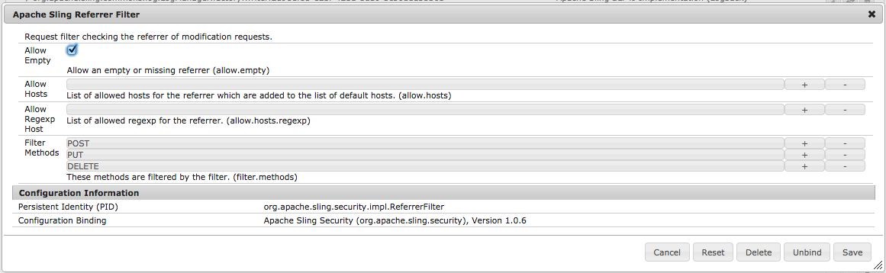

# Définition de votre filtre de référent sur Autoriser vide{#setting-your-referrer-filter-to-allow-empty}

>[!NOTE]
>
>Adobe recommande d’utiliser l’éditeur d’application d’une seule page (SPA) pour les projets nécessitant un rendu côté client basé sur la structure SPA (par exemple, React). [En savoir plus](/help/sites-developing/spa-overview.md).

Pour permettre à la visionneuse d’applications AEM Mobile d’afficher les applications sur votre instance d’auteur, vous devez définir le filtre de référent HTML sur &quot;autoriser vide&quot;.

Si vous n’avez pas l’intention d’utiliser la visionneuse d’application pour passer en revue les applications se trouvant aux stades de développement et intermédiaire, il n’est pas nécessaire de modifier le paramètre par défaut du filtre de référent.

Dans votre instance d’auteur en cours d’exécution d’AEM, accédez à : [http://localhost:4502/system/console/configMgr](http://localhost:4502/system/console/configMgr) et recherchez &quot;Apache Sling Referrer Filter&quot;. Cliquez pour modifier le filtre de référent et cochez la case « autoriser vide » (voir l’image ci-dessous). Cliquez ensuite sur le bouton Enregistrer et fermez la page du navigateur.

