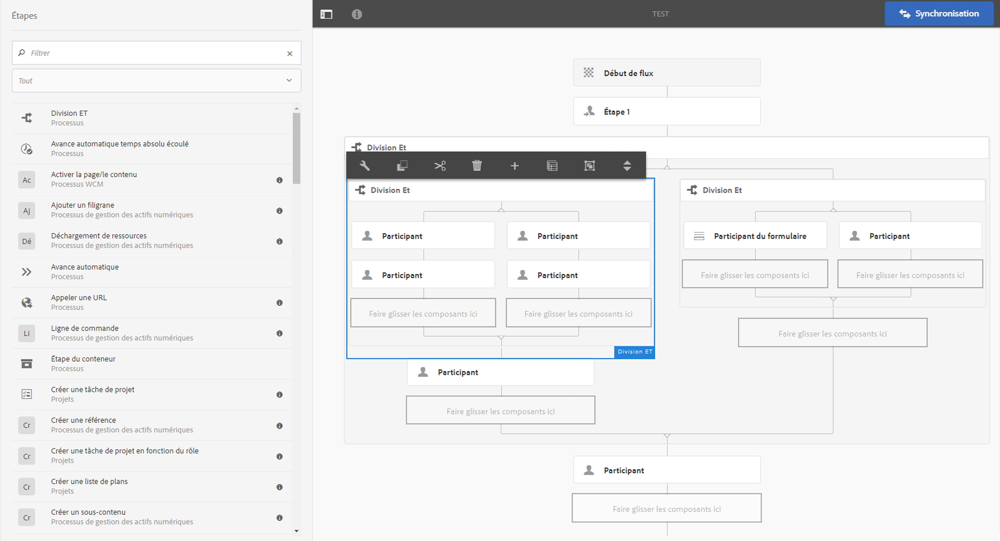
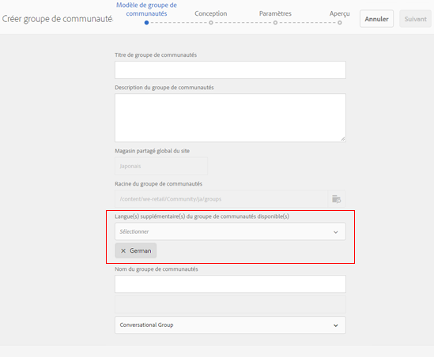
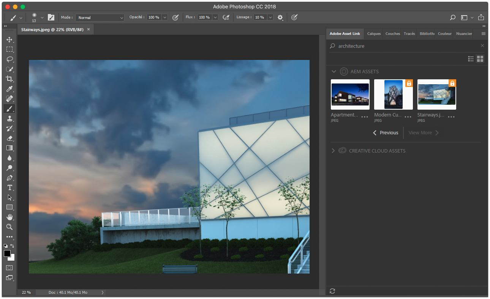
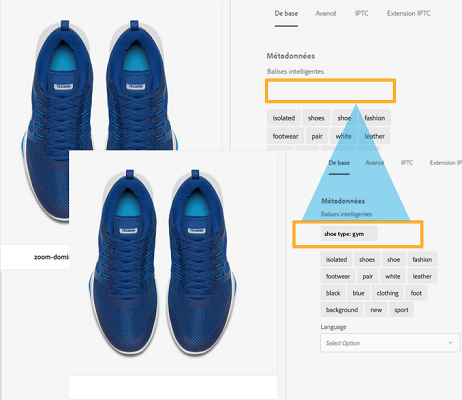

# Notes de mise à jour générales d’Adobe Experience Manager 6.4 {#general-release-notes-for-adobe-experience-manager}

>[!CAUTION]
>
>AEM 6.4 a atteint la fin de la prise en charge étendue et cette documentation n’est plus mise à jour. Pour plus d’informations, voir notre [période de support technique](https://helpx.adobe.com/fr/support/programs/eol-matrix.html). Rechercher les versions prises en charge [here](https://experienceleague.adobe.com/docs/?lang=fr).

## Informations sur la version {#release-information}

| Produit | Adobe Experience Manager  |
|---|---|
| Version | 6.4 |
| Type | Version majeure |
| Date de disponibilité générale | 4 avril 2018 |
| Mises à jour recommandées | Consultez les [versions et mises à jour d’AEM](https://helpx.adobe.com/fr/experience-manager/aem-releases-updates.html) |

### Pour information {#trivia}

Le cycle de publication de cette version d’Adobe Experience Manager a commencé le 27 avril 2017, a subi 22 itérations d’assurance qualité et de correction de bogues, et s’est terminé le 22 mars 2018. Au total, 704 problèmes liés aux clients (y compris améliorations et nouvelles fonctionnalités) ont été corrigés dans cette version.

Adobe Experience Manager 6.4 est disponible depuis le 4 avril 2018.

>[!NOTE]
>
>Adobe recommande d’installer le dernier Service Pack, car tous les nouveaux Feature Packs sont uniquement fournis par le biais de [Service Packs](https://helpx.adobe.com/fr/experience-manager/maintenance-releases-roadmap.html).

## Nouveautés {#what-s-new}

Adobe Experience Manager 6.4 est une mise à niveau de la base de code d’Adobe Experience Manager 6.3. Cette version comporte de nouvelles fonctionnalités améliorées, des correctifs clés de bugs signalés par des clients, des améliorations prioritaires demandées par les clients et des correctifs de bugs généraux destinés à améliorer la stabilité du produit. Elle comprend également la plupart des Feature Packs, correctifs logiciels et Service Pack d’Adobe Experience Manager 6.3.

Vous en trouverez un aperçu dans la liste ci-dessous, puis des détails complets dans les pages suivantes.

### Experience Manager Foundation {#experience-manager-foundation}

Liste complète des modifications apportées à [AEM Foundation](wcm-platform.md).

La plateforme d’Adobe Experience Manager 6.4 repose sur les versions mises à jour de l’infrastructure OSGi (Apache Sling et Apache Felix) et du référentiel de contenu Java : Apache Jackrabbit Oak 1.8.2.

Le démarrage rapide (Quickstart) utilise le moteur de servlet Eclipse Jetty 9.3.22.

#### Interface utilisateur {#user-interface}

Diverses améliorations ont été apportées à l’interface utilisateur pour la rendre plus productive et plus facile à utiliser.

* [Nouveau rail d’arborescence de contenu](/help/sites-authoring/basic-handling.md#content-tree) pour parcourir rapidement une hiérarchie. En mode Liste, le modèle d’interaction de l’interface utilisateur classique est restauré.
* Amélioration de l’expérience de défilement en mode Carte et Liste des dossiers volumineux.
* [Amélioration de l’interaction avec les résultats de la recherche](/help/sites-authoring/search.md) - le bouton Précédent restaure le résultat de la recherche précédente.
* [Raccourcis clavier supplémentaires](/help/sites-authoring/keyboard-shortcuts.md), pour les actions les plus courantes, telles que l’ouverture d’un rail particulier, la modification, le déplacement et la suppression d’un élément ou l’ouverture de propriétés.
* [Possibilité de désactiver les raccourcis clavier](/help/sites-authoring/user-properties.md) (activez/désactivez dans Préférences).
* [Arrêtez d’afficher les horodatages dans toutes les interfaces utilisateur.](/help/sites-authoring/user-properties.md) relatif après 7 jours (défini par défaut dans Préférences).

Voir [Documentation sur la création](/help/sites-authoring/home.md) pour plus d’informations sur ces fonctionnalités.

>[!CAUTION]
>
>Adobe ne prévoit pas d’apporter d’autres améliorations à l’interface utilisateur classique. AEM 6.4 comprend l’interface utilisateur classique, et les clients effectuant une mise à niveau à partir de versions antérieures peuvent continuer à l’utiliser en l’état. Notez que l’interface utilisateur classique reste complètement prise en charge alors qu’elle est en passe de devenir obsolète. [En savoir plus](/help/sites-deploying/ui-recommendations.md).

#### Référentiel de contenu {#content-repository}

* Compression plus rapide et plus efficace par le nettoyage des révisions en ligne. Les tests internes montrent que le nouveau compactage de la queue est jusqu’à 10 fois plus rapide et peut récupérer plus d’espace disque avec moins d’IOPS par rapport à AEM 6.3. Cela a un impact moins important sur les performances pendant l’exécution du nettoyage des révisions en ligne. Pour plus d’informations, voir [la page de documentation ;](/help/sites-deploying/revision-cleanup.md#full-and-tail-compaction-modes).

* Le nettoyage des révisions en continu pour MongoMK remplace la maintenance de nettoyage planifiée.
* Amélioration de l’efficacité du nettoyage des révisions sur les noeuds de document

#### Recherche et indexation {#search-indexing}

* Amélioration de la prise en charge des opérations d’indexation via oak-run (CLI) :

   * Vérification de la cohérence de l&#39;index
   * Indexation des statistiques
   * Import ou export de configuration d&#39;index
   * Réindexation

* Réduction de la croissance des référentiels liés à Lucene pour des performances système globales améliorées

Pour plus d’informations, veuillez consulter [cette page de documentation](/help/sites-deploying/indexing-via-the-oak-run-jar.md).

#### Surveillance {#monitoring}

* Une nouvelle [Présentation du système](/help/sites-administering/operations-dashboard.md#system-overview) fournit une vue instantanée de l’état et des activités de tous les systèmes liés aux performances.
* Un nouvel ensemble de [Contrôles de l’intégrité](/help/sites-administering/operations-dashboard.md#health-checks) à propos de l’indexation, des requêtes et de la maintenance

#### Projets et workflows {#projects-and-workflows}

* Tout nouveau [Éditeur de workflow pour créer et modifier des modèles de workflow](/help/sites-developing/workflows-models.md).

#### Mise à niveau depuis une version antérieure {#upgrade-from-earlier-version}

* [Compatibilité descendante](/help/sites-deploying/backward-compatibility.md): Les fonctionnalités rétrocompatibles de la version 6.4 permettent à votre code personnalisé de rester compatible dans la plupart des cas et réduisent les efforts de mise à niveau.
* [Évaluation de la complexité de la mise à niveau](/help/sites-deploying/pattern-detector.md): Nouvel outil de détection des motifs pour évaluer la complexité de vos mises à niveau avant de procéder à la mise à niveau.
* [Restructuration des référentiels](/help/sites-deploying/repository-restructuring.md): restructuration importante (principalement /etc) pour faciliter les mises à niveau et promouvoir les bonnes pratiques de mise en oeuvre
* Pour plus d’informations générales sur les mises à niveau, voir [cette page](/help/sites-deploying/upgrade.md) pour plus d’informations.

### Experience Manager Sites {#experience-manager-sites}

Liste complète des modifications apportées à [AEM Sites et modules complémentaires](sites.md).

#### Expériences fluides {#fluid-experiences}

L’introduction des expériences fluides début 2017, reposant sur les fragments de contenu, les fragments d’expérience et les services de contenu, a été le début de l’évolution vers une gestion de contenu multi-canal prédominante. AEM version 6.4 étend de manière significative chacune des zones :

**[Fragments de contenu](/help/assets/content-fragments.md)**

Les nouveautés de la version 6.4 sont visuelles [modèle de contenu](/help/assets/content-fragments-models.md) et un nouvel éditeur [composant configurable](https://experienceleague.adobe.com/docs/experience-manager-core-components/using/components/content-fragment-component.html?lang=fr) pour fournir une sortie de HTML flexible et des fichiers JSON à inclure dans Content Services.

**Fragments d’expérience**

La création de variations dans un fragment avec le même contenu mais une disposition différente est désormais plus efficace, grâce à la fonctionnalité Blocs de création . Outre l’envoi de fragments d’expérience à Facebook et Pinterest, il est désormais possible de les envoyer à Adobe Target en tant qu’offre.

**Content Services**

Diverses améliorations apportées à l’exportateur de modèles Sling et aux composants principaux sont incluses afin de fournir une sortie JSON robuste pour incorporer du contenu dans les applications mobiles et les expériences créées avec des applications d’une seule page.

#### Obtention de la création plus rapide de sites {#gettings-sites-built-quicker}

AEM 6.4 effectue la transformation vers le modèle de composant de nouvelle génération. Le concept des composants principaux introduit dans AEM 6.3, désormais rejoint par le système de style, offre un moyen efficace de créer et d’étendre des sites existants.

Tutoriel recommandé pour découvrir comment tirer le meilleur parti du nouveau modèle de composant : [Prise en main d’AEM Sites - Tutoriel WKND](https://experienceleague.adobe.com/docs/experience-manager-learn/getting-started-wknd-tutorial-develop/overview.html?lang=fr)

#### Module complémentaire Screens {#screens-add-on}

Pour AEM Screens, il faut diffuser un message cohérent sur tous les canaux marketing, y compris les réseaux de signalisation numérique et de kiosque. La version 6.4 d’AEM prend désormais en charge l’exécution du lecteur de signalétique sur le matériel Microsoft Windows et Google Chrome OS. En outre, des améliorations ont été apportées à la gestion et aux plannings des périphériques distants (groupes de canaux).

Pour plus d’informations sur les mises à jour de Screens, voir [Guide de l’utilisateur d’AEM Screens](https://experienceleague.adobe.com/docs/experience-manager-screens/user-guide/aem-screens-introduction.html?lang=fr).

### Communautés de Experience Manager {#experience-manager-communities}

AEM 6.4 ajoute de nombreuses nouvelles fonctionnalités et améliorations aux communautés. La liste complète des modifications est disponible dans [AEM Communities](communities-release-notes.md). Les points forts de cette version sont les suivants :

#### Améliorations de la modération {#enhancements-to-moderation}

**Détection automatique de messages indésirables**

Un nouveau moteur de détection du spam a été fourni pour filtrer le contenu non souhaité généré par les utilisateurs sur les sites et groupes de la communauté. Une fois activé à partir de system/console/configMgr, il marque un élément de contenu généré par l’utilisateur comme spam en fonction d’un ensemble prédéfini de mots-clés indésirables. Pour en savoir plus sur le moteur de détection de spam, reportez-vous à la section [automatisation de la génération de contenu par les utilisateurs de la communauté](/help/communities/moderate-ugc.md#spam-detection).

**Nouveaux filtres pour Q&amp;R**

De nouveaux filtres, nommés &quot;A reçu une réponse&quot; et &quot;Pas reçu une réponse&quot;, ont été ajoutés à la console de modération en bloc pour filtrer les questions Q&amp;R. Pour savoir comment fonctionnent les filtres d’état Réponse et Non réponse, reportez-vous à la section [modération en bloc de contenu généré par l’utilisateur](/help/communities/moderation.md#main-pars-note-521961797).

**Filtres de modération en signet**

La possibilité de mettre en signet les filtres de modération prédéfinis sur la console de modération a été fournie. Ces filtres sont ajoutés à la fin de la chaîne d’URL. Ils peuvent donc être partagés, réutilisés et revus ultérieurement. Découvrez comment marquer des filtres dans [console de modération en bloc](/help/communities/moderation.md#main-pars-note-429176623).

#### Suppression du contenu généré par l’utilisateur et des profils utilisateur {#delete-ugc-and-user-profiles}

AEM 6.4 Communities expose [API prêtes à l’emploi](/help/communities/user-ugc-management-service.md) et exemple [servlet](https://github.com/Adobe-Marketing-Cloud/aem-communities-ugc-migration/tree/master/bundles/communities-ugc-management-servlet) pour permettre aux utilisateurs finaux de contrôler leurs données. Ces API permettent également aux organisations de traitement et de contrôle des données de répondre aux demandes de conformité au RGPD de l’UE.

#### Améliorations de la gestion des sites et des groupes {#enhancements-to-site-and-group-management}

**Création de groupes multiparamètres régionaux en une seule étape**

La possibilité de créer des groupes multilingues en une seule opération a été fournie. Pour créer ces groupes, les utilisateurs peuvent accéder à la collection de groupes du site des communautés souhaité à partir de la console Sites. Créez un groupe et spécifiez les langues souhaitées dans la page Modèle de groupe de communautés . Pour en savoir plus sur cette fonctionnalité, reportez-vous à la section [console des groupes de communautés](/help/communities/groups.md).

**[Suppression de sites et de groupes de communautés en un clic](/help/communities/groups.md)**

L’icône Supprimer est désormais disponible sur les sites et groupes respectifs, tout en naviguant à partir de la navigation globale. L’utilisation de cette icône supprime tous les éléments et le contenu associés au site ou au groupe et supprime toutes les associations d’utilisateurs. Pour en savoir plus sur cette fonctionnalité, reportez-vous à la section [gestion des sites communautaires](/help/communities/create-site.md#main-pars-text-fe17) et [gestion des groupes communautaires](/help/communities/groups.md#main-pars-text-5e8c).

#### Améliorations de l’activation {#enhancements-to-enablement}

Les fonctions d’affectation et de catalogue sont désormais disponibles dans les groupes. Cela permet de créer, gérer et publier du contenu d’apprentissage pour un ensemble spécifique de membres ciblés de la communauté. Pour en savoir plus sur l’activation des groupes de communautés, reportez-vous à la section [gestion des ressources d&#39;activation](/help/communities/resource.md).

### Experience Manager Assets {#experience-manager-assets}

La version 6.4 d’AEM apporte plusieurs nouvelles fonctionnalités et améliorations à Assets, notamment une nouvelle intégration Creative Cloud améliorée, des innovations majeures en matière d’intelligence artificielle, une gestion améliorée des métadonnées, des améliorations de la création de rapports et des améliorations globales de l’expérience utilisateur. La liste complète des modifications disponibles dans [AEM Assets](assets.md). Voici les points forts de cette version :

**Adobe Asset Link**

Adobe Asset Link dans Creative Cloud pour les entreprises simplifie la collaboration entre les créatifs et les spécialistes du marketing dans le processus de création de contenu. Il s’agit d’une nouvelle fonctionnalité native en Creative Cloud pour les entreprises qui connecte Photoshop, Illustrator et l’InDesign à AEM — sans que les créatifs aient à laisser leurs outils de choix.

Pour en savoir plus sur cette fonctionnalité, les conditions préalables et comment y accéder, voir [Adobe d’un lien de ressource](https://www.adobe.com/fr/creativecloud/business/enterprise/adobe-asset-link.html).

**Application de bureau AEM**

L’appli de bureau AEM a été mise à jour vers la version 1.8, qui est compatible avec AEM 6.4. La liste complète des modifications apportées à l’appli de bureau Adobe est fournie dans un dossier dédié. [Notes de mise à jour de l’appli de bureau AEM](https://experienceleague.adobe.com/docs/experience-manager-desktop-app/using/release-notes.html?lang=fr) document.

Les améliorations introduites depuis la version 6.3 d’AEM incluent la possibilité de charger des dossiers hiérarchiques en arrière-plan, une nouvelle interface utilisateur pour surveiller les opérations d’arrière-plan des ressources, une mise en cache améliorée, la mise en réseau et la connexion, ainsi que des améliorations générales de stabilité. La documentation comprend également un [guide des bonnes pratiques](https://experienceleague.adobe.com/docs/experience-manager-desktop-app/using/using.html?lang=fr).

**Services Adobe Sensei**

Les nouvelles fonctionnalités comprennent des balises intelligentes améliorées, qui permettent d’apprendre la taxonomie métier des clients, de baliser automatiquement les ressources numériques avec des balises spécifiques aux clients et une recherche de traduction intelligente, ce qui améliore la visibilité en plusieurs langues en traduisant les termes de recherche à la volée. Pour en savoir plus sur cette fonctionnalité, voir [Balises intelligentes améliorées](/help/assets/enhanced-smart-tags.md).

**Métadonnées**

Diverses améliorations ont été apportées à la possibilité d’importer et d’exporter des métadonnées simultanément pour un grand nombre de ressources et de constructions de métadonnées avancées, telles que [Métadonnées en cascade](/help/assets/cascading-metadata.md).

**Rapports**

La création de rapports de ressources a fait l’objet d’une grande refonte dans AEM 6.4 avec une nouvelle structure de création de rapports, l’expérience utilisateur et davantage de rapports prêts à l’emploi pour les cas d’utilisation client. Pour savoir comment générer divers rapports, reportez-vous à la section [Rapports de ressources](/help/assets/asset-reports.md).

**Expérience utilisateur**

Plusieurs améliorations ont été apportées pour améliorer la navigation, la recherche et l’expérience d’administration pour les utilisateurs d’Assets, telles que l’expérience de défilement, le bouton de retour, les filtres de recherche améliorés, etc. La liste complète disponible dans [AEM Assets](assets.md).

**Brand Portal**

Diverses améliorations ont été apportées aux domaines des métadonnées, de la création de rapports, des droits numériques, de l’expérience de connexion et des performances de publication pour la distribution des ressources. Pour en savoir plus sur les nouvelles améliorations et fonctionnalités, voir [Nouveautés d’AEM Assets Brand Portal](https://experienceleague.adobe.com/docs/experience-manager-brand-portal/using/introduction/whats-new.html?lang=fr).

#### Module complémentaire Dynamic Media {#dynamic-media-add-on}

AEM version 6.4 comprend de nombreuses nouvelles fonctionnalités et améliorations de Dynamic Media. La liste complète est disponible dans la section [AEM Assets](assets.md). Voici quelques points forts :

**Recadrage intelligent**

Le recadrage intelligent, optimisé par Adobe Sensei, fournit automatiquement un recadrage non destructif des images, tout en préservant le point d’intérêt du responsive design. Vous pouvez prévisualiser les suggestions d’images recadrées et les ajuster manuellement, si nécessaire. Cette fonctionnalité permet également la génération automatique d’échantillons pour l’imagerie du produit.

Voir [Profils d’image](/help/assets/image-profiles.md) documentation pour en savoir plus sur l’utilisation du recadrage intelligent.

Voir [Ajout de ressources Dynamic Media aux pages](/help/assets/adding-dynamic-media-assets-to-pages.md) pour en savoir plus sur l’utilisation du recadrage intelligent dans le composant Dynamic Media.

**Imagerie dynamique**

L’imagerie dynamique tire parti des caractéristiques de visualisation uniques de chaque utilisateur pour diffuser automatiquement des images optimisées pour leur expérience, ce qui se traduit par de meilleures performances et un meilleur engagement.

Voir [Imagerie dynamique](/help/assets/imaging-faq.md) pour en savoir plus.

**Médias émergents et améliorations apportées aux visionneuses**

De nouvelles visionneuses, notamment panoramique et VR, vous permettent de fournir des expériences plus immersives.

Voir [Images panoramiques](/help/assets/panoramic-images.md) pour en savoir plus.

### Formulaires avec Experience Manager  {#experience-manager-forms}

AEM Forms 6.4 comporte plusieurs nouvelles fonctionnalités et améliorations. En voici un aperçu :

* Communications interactives multicanaux
* Préremplir les communications interactives à partir des applications commerciales
* Modernisation des workflows et prise en charge des employés mobiles
* Chargement différé des fragments
* Mise à niveau en un seul clic de LiveCycle vers Experience Manager Forms 6.4

Plus d’informations sur [AEM Forms](forms.md) page des notes de mise à jour. Voir également la section [Résumé des nouvelles fonctionnalités et améliorations d’AEM 6.4 Forms](/help/forms/using/whats-new.md) pour plus d’informations sur les nouvelles fonctionnalités et les améliorations et les ressources de documentation.

### Experience Manager Livefyre {#experience-manager-livefyre}

Vous pouvez intégrer Livefyre à votre instance AEM 6.4. Vous trouverez des informations sur l’intégration de Livefyre à AEM ici :

* [Intégration de Livefyre](https://experienceleague.adobe.com/docs/experience-manager-64/administering/integration/livefyre.html?lang=fr)

### Tirer parti du développement axé sur les clients {#leverage-customer-focused-development}

Adobe applique un modèle de développement axé sur les utilisateurs afin que ces derniers puissent contribuer à toutes les étapes du processus de développement, au cours des phases de spécification, de développement et de tests. Nous remercions tous les clients et partenaires qui contribuent à ce processus.

Adobe a mis en place les procédures et processus nécessaires à la collecte, à la hiérarchisation et au suivi de la résolution des bogues signalés par les utilisateurs et du développement des demandes d’amélioration. Le [Portail d’assistance Adobe Marketing Cloud](https://helpx.adobe.com/fr/contact/enterprise-support.ec.html) est intégré au système de suivi des défauts et des améliorations de l’Adobe. Si possible, les questions des clients sont identifiées et résolues auprès de l’assistance clientèle. Lorsqu’elles sont transmises au service de R&amp;D, toutes les informations client sont capturées et utilisées à des fins de hiérarchisation et de création de rapports. La priorité est donnée dans le développement aux problèmes d’assistance payante, de garantie et aux améliorations apportées aux clients payants.

Ce processus de hiérarchisation a généré plus de 500 modifications axées sur les clients, corrigées dans AEM 6.4.

## Liste des fichiers faisant partie de la version {#list-of-files-that-are-part-of-the-release}

**Foundation**

* Démarrage rapide autonome : cq-quickstart-6.4.0.jar
* Démarrage rapide du serveur d’applications : cq-quickstart-6.4.0.war
* Dispatcher 4.3.1 ou version ultérieure pour divers serveurs et plateformes web. Voir [lien de téléchargement](https://experienceleague.adobe.com/docs/experience-manager-dispatcher/using/getting-started/release-notes.html?lang=fr).
* Module externe pour Eclipse IDE. [En savoir plus et télécharger](/help/sites-developing/aem-eclipse.md).

* Extension pour l’éditeur de code Brackets. [En savoir plus et télécharger](/help/sites-developing/aem-brackets.md).
* Dépendances Maven/Gradle. Voir [lien de téléchargement](https://repo.adobe.com/nexus/content/repositories/releases/com/adobe/aem/uber-jar/6.1.0/).

**Sites**

* Composants principaux ([Projet GitHub](https://github.com/Adobe-Marketing-Cloud/aem-core-wcm-components))
* Implémentation de référence We.Retail ([en savoir plus](/help/sites-developing/we-retail.md))
* Archétype de plan directeur de projet ([Projet GitHub](https://github.com/Adobe-Marketing-Cloud/aem-project-archetype))
* Lecteurs AEM Screens pour différentes plateformes cibles ([téléchargement](https://download.macromedia.com/screens/))
* Modèles linguistiques pour le contenu dynamique. L’anglais est préinstallé ; d’autres langues peuvent être téléchargées.

   * [Allemand](https://experience.adobe.com/#/downloads/content/software-distribution/en/aem.html?lang=fr?package=/content/software-distribution/en/details.html?lang=fr/content/dam/aem/public/adobe/packages/cq630/product/smartcontent-model-de)
   * [Espagnol](https://experience.adobe.com/#/downloads/content/software-distribution/en/aem.html?lang=fr?package=/content/software-distribution/en/details.html?lang=fr/content/dam/aem/public/adobe/packages/cq630/product/smartcontent-model-es)
   * [Italien](https://experience.adobe.com/#/downloads/content/software-distribution/en/aem.html?lang=fr?package=/content/software-distribution/en/details.html?lang=fr/content/dam/aem/public/adobe/packages/cq630/product/smartcontent-model-it)
   * [Français](https://experience.adobe.com/#/downloads/content/software-distribution/en/aem.html?lang=fr?package=/content/software-distribution/en/details.html?lang=fr/content/dam/aem/public/adobe/packages/cq630/product/smartcontent-model-fr)

* [Outils de modernisation d’AEM](/help/sites-developing/modernization-tools.md) pour migrer les composants de l’interface utilisateur classique vers Coral 3

**Assets**

* Application de bureau Adobe Experience Manager ([en savoir plus](https://experienceleague.adobe.com/docs/experience-manager-desktop-app/using/using.html?lang=fr) et [télécharger](https://experienceleague.adobe.com/docs/experience-manager-desktop-app/using/release-notes.html?lang=fr))

* Package pour l’ajout du requêteur PDF amélioré ([en savoir plus](/help/assets/aem-pdf-rasterizer.md) et [télécharger](https://experience.adobe.com/#/downloads/content/software-distribution/en/aem.html?package=/content/software-distribution/en/details.html/content/dam/aem/public/adobe/packages/cq640/product/assets/aem-assets-pdf-rasterizer-pkg))

* Package pour l’ajout de la prise en charge étendue des images RAW ([en savoir plus](/help/assets/camera-raw.md))

**Forms**

* Modules pour les fonctionnalités AEM Forms :

   * [adobe-aemfd-aix-pkg](https://experienceleague.adobe.com/docs/experience-manager-release-information/aem-release-updates/forms-updates/aem-forms-releases.html?lang=fr)
   * [adobe-aemfd-linux-pkg](https://experienceleague.adobe.com/docs/experience-manager-release-information/aem-release-updates/forms-updates/aem-forms-releases.html?lang=fr)
   * [adobe-aemfd-solaris-pkg](https://experienceleague.adobe.com/docs/experience-manager-release-information/aem-release-updates/forms-updates/aem-forms-releases.html?lang=fr)
   * [adobe-aemfd-win-pkg](https://experienceleague.adobe.com/docs/experience-manager-release-information/aem-release-updates/forms-updates/aem-forms-releases.html?lang=fr)
   * [adobe-aemfd-osx-pkg](https://experienceleague.adobe.com/docs/experience-manager-release-information/aem-release-updates/forms-updates/aem-forms-releases.html?lang=fr)

## Langues {#languages}

L’interface utilisateur de est disponible dans les langues suivantes :

* Anglais
* Allemand
* Français
* Espagnol
* Italien
* Portugais brésilien
* Japonais
* Chinois simplifié
* Chinois traditionnel  (prise en charge limitée)
* Coréen

Experience Manager 6.4 a été certifié dans le cadre de la norme GB18030-2005 CITS pour utiliser le codage des caractères chinois.

## Installation et mise à jour {#install-update}

Voir [instructions d’installation](/help/sites-deploying/custom-standalone-install.md) pour connaître les exigences de configuration.

Veuillez consulter [documentation de mise à niveau](/help/sites-deploying/upgrade.md) pour obtenir des instructions détaillées.

## Plateformes prises en charge {#supported-platforms}

Veuillez trouver la matrice complète des plateformes prises en charge, y compris . Niveau de prise en charge sur [Exigences techniques AEM 6.4](/help/sites-deploying/technical-requirements.md).

>[!NOTE]
>
>Oracle est passé à un modèle de support à long terme (LTS) pour les produits Oracle Java SE. Java 9 et 10 sont des versions non-LTS par Oracle (voir [Feuille de route du support Oracle Java SE](https://www.oracle.com/technetwork/java/eol-135779.html)). Adobe ne prendra en charge que les versions LTS de Java pour exécuter AEM en production. Par conséquent, Java 8 est la version recommandée pour AEM 6.4.

## Fonctionnalités obsolètes et supprimées {#deprecated-and-removed-features}

Adobe évalue constamment les fonctionnalités du produit et prévoit au fil du temps de remplacer les fonctionnalités par des versions plus puissantes, ou décide de mettre à nouveau en oeuvre certaines parties pour mieux se préparer aux attentes ou extensions futures.

Pour Adobe Experience Manager 6.4, [lire la liste des fonctionnalités obsolètes et supprimées](deprecated-removed-features.md). Cette page contient également des annonces préalables de modifications en 2019 et un avis important à l’intention des clients qui effectuent des mises à jour à partir de versions antérieures.

## Listes de modifications détaillées {#detailed-changes-lists}

[AEM Sites](sites.md)

[AEM Assets](assets.md)

[AEM Communities](communities-release-notes.md)

[AEM Forms](forms.md)

[AEM Foundation](wcm-platform.md)

## Problèmes connus {#known-issues}

[Liste des problèmes connus](known-issues.md)

### Assistance technique et téléchargement du produit (sites à accès limité) {#product-download-and-support-restricted-sites}

Ces sites sont réservés aux clients. Si vous êtes client et avez besoin d’un accès, contactez votre gestionnaire de compte d’Adobe.

* [Téléchargement du produit à l’adresse licensing.adobe.com](https://licensing.adobe.com/).
* Mises à jour de produit, correctifs et packages pour des fonctionnalités supplémentaires dans la [distribution logicielle](https://experience.adobe.com/#/downloads/content/software-distribution/en/aem.html).
* [Service clientèle via l’Admin Console](https://adminconsole.adobe.com/). Pour plus d’informations, consultez la section [Nouvelle expérience du service clientèle Adobe](https://experienceleague.adobe.com/docs/customer-one/using/home.html?lang=fr).
