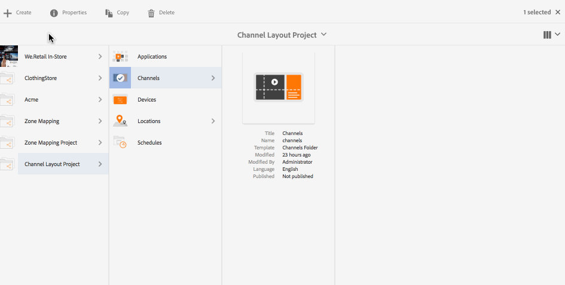

# Éditeur de mise en page de canal{#channel-layout-editor}

***L’éditeur de mise en page de canal*** permet de créer du contenu multizone et d’utiliser une variété de ressources telles que des vidéos, des images et du texte, qui peuvent être regroupées en un seul écran de manière contextuelle. Vous pouvez importer des images, des vidéos et du texte, et les mélanger de façon à créer une expérience numérique intuitive et interactive.

En fonction des exigences du projet, il est parfois nécessaire de disposer de plusieurs zones au sein d’un canal et dus modifier comme une unité entière. Par exemple, une séquence de produits avec un flux de réseaux sociaux associé qui s’exécute dans trois zones distinctes sur un seul canal.

## Présentation {#overview}

Lors de la création d’un canal, vous pouvez utiliser des modèles différents afin de créer des zones dans votre canal. Vous pouvez ajouter une image, une vidéo ou un canal incorporé de façon à exploiter le contenu en fonction des exigences du projet.

### Description du cas d’utilisation {#use-case-description}

Le cas d’utilisation suivant présente la création de zones multiples dans un canal.

1. ***Création d’un projet Screens***

   1. Sélectionnez le lien Adobe Experience Manager (en haut à gauche), puis **Screens**. Vous pouvez également accéder directement à : http://localhost:4502/screens.html/content/screens.
   1. Cliquez sur **Créer** pour créer un projet Screens.
   1. Sélectionnez **Screens** à partir de l’assistant **Créer un projet Screens**, puis cliquez sur **Suivant**.
   1. Saisissez le titre **Channel Layout Project** puis cliquez sur **Créer**.
   

1. ***Création d’un canal***

   1. Accédez à **Channel Layout Project**.
   1. Cliquez sur **Créer** dans la barre d’actions. Un assistant s’ouvre.
   1. Sélectionnez **Canal d’écran partagé 1x2** et cliquez sur **Suivant**.
   1. Saisissez le **titre** **Split horizontal** et cliquez sur **Créer**.
   

1. ***Ajout de contenu à votre canal***

   1. Accédez au projet **Channel Layout Project** que vous avez créé, puis sélectionnez le canal (**Split Channel**).
   1. Cliquez sur **Modifier** dans la barre d’actions et l’éditeur s’ouvrira pour **Split Channel**.
   1. Cliquez sur l’icône qui fait passer le panneau latéral du côté gauche de la barre d’actions pour ouvrir les ressources et les composants. Faites glisser et déposez les composants que vous souhaitez ajouter à votre canal. 
   

   >[!NOTE]
   >
   >Par exemple, les deux images suivantes sont ajoutées au canal dans l’éditeur.

   

1. ***Création d’un emplacement***

   1. Accédez au dossier des emplacements dans lequel vous souhaitez créer votre projet (**Channel Layout Project** > **Emplacements**).
   1. Cliquez sur **Créer** dans la barre d’actions.
   1. Sélectionnez **Emplacement** à partir de l’assistant **Créer** et cliquez sur **Suivant**.
   1. En tant que **titre** de votre emplacement, saisissez **San Jose**.
   1. Cliquez sur **Créer**.
   

1. ***Création d’un affichage***

   1. Accédez à l’emplacement où vous souhaitez créer votre affichage (**Acme** --> **Emplacements** --> **San Jose**) et sélectionnez **San Jose**.
   1. Cliquez sur **Créer** dans la barre d’actions. Sélectionnez **Affichage** à partir de l’assistant **Créer** et cliquez sur **Suivant**.
   1. Saisissez le **titre** de votre emplacement d’affichage (saisissez le titre **Split Display)**.
   1. Dans l’onglet **Affichage**, sélectionnez les détails de la mise en page. Sélectionnez la **résolution** **Full HD**. Sélectionnez 1 pour **Nombre d’appareils horizontalement** et **1** pour **Nombre d’appareils verticalement**.
   1. Cliquez sur **Créer**.
   

1. ***Attribution d’un canal***

   1. Accédez à l’affichage à partir de **Channel Layout Project** --> **Emplacements** --> **San Jose** --> **Split Display**.
   1. Sélectionnez **Split Display** et cliquez ou appuyez sur **Attribuer un canal** depuis la barre d’actions.
   1. Vous pouvez également cliquer sur **Tableau de bord** et sélectionner **+Attribuer le canal** en haut à droite à partir du panneau **CANAUX ET PLANIFICATIONS AFFECTÉS**. La boîte de dialogue **Attribution de canaux** s’ouvre.
   1. Définissez le **rôle du canal** sur **Fractionner**.
   1. Sélectionnez **Canal de référence** en fonction du chemin d’accès. Sélectionnez le chemin d’accès au dossier du canal (**Channel Layout Project** --> **Canaux** --> **Split horizontal**) dans le canal.
   1. Définissez la **priorité** de ce canal sur **1**.
   1. Choisissez les **événements pris en charge** **Chargement initial** et **Écran inactif**.
   1. Cliquez sur **Enregistrer**.
   

1. ***Enregistrement et attribution du périphérique***

   1. Lancez une fenêtre du navigateur distincte. Accédez au lecteur Screens à l’aide du navigateur web ou lancez l’application AEM Screens.
   1. Lorsque vous ouvrez le périphérique, vous remarquez que son état est non enregistré. Depuis le tableau de bord AEM, accédez à **Channel Layout Project** > **Périphériques**.
   1. Cliquez sur **Gestionnaire de périphériques** dans la barre d’actions.
   1. Cliquez sur **Enregistrement de périphérique** pour voir les périphériques en attente. Sélectionnez le périphérique que vous voulez enregistrer et cliquez ensuite sur **Enregistrer le périphérique**.
   1. Vous devez valider le code en le vérifiant à partir du navigateur web ou du lecteur AEM Screens. Cliquez sur **Valider** pour accéder à l’écran **Enregistrement du périphérique**.
   1. Saisissez le titre **NewD** et cliquez sur **Enregistrer** pour que le périphérique soit enregistré.
   1. Cliquez sur **Attribuer l’affichage** pour passer à l’étape suivante où vous attribuez le périphérique à un affichage.
   1. Cliquez sur Attribuer le périphérique et sélectionnez le chemin d’affichage de votre canal () comme suit : /content/screens/Test_Project/Locations/TestLocation/TestDisplay. Cliquez sur **Attribuer**.
   1. Cliquez sur **Terminer** pour achever le processus. Le périphérique est désormais attribué.
   

#### Affichage du contenu dans le lecteur AEM Screens {#viewing-content-in-aem-screens-player}

Chargez le lecteur AEM Screens ou utilisez le navigateur web. Vous verrez le contenu du canal affiché dans votre lecteur Screens. Le contenu est affiché en tant que modèle de canal d’écran partagé 1x2.

### Inférence    {#inference}

L’utilisation des modèles disponibles lors de la création d’un canal permet d’exploiter et d’afficher votre contenu dans différentes zones. L’exemple ci-dessus présente le cas d’utilisation du modèle 2x2.

Les illustrations suivantes montrent la mise en page pouvant être obtenue avec différents modèles.
