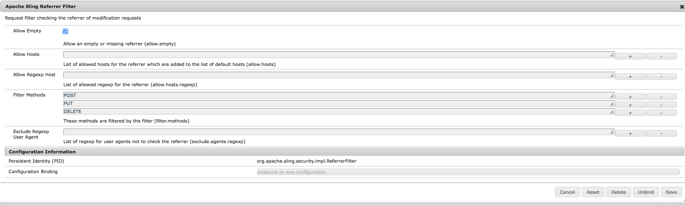

# Configuration et déploiement d’AEM Screens{#configuring-and-deploying-aem-screens}

Cette page explique comment installer et configurer les lecteurs d’écran sur vos périphériques et couvre les rubriques suivantes :

* Installation du lecteur AEM Screens
* Configuration du serveur
* Instructions de sélection du matériel pour le périphérique de lecture
* Étapes suivantes

## Installation du lecteur AEM Screens {#installing-aem-screens-player}

Le lecteur AEM Screens est disponible pour Android, Chrome OS, iOS et Windows.

Pour télécharger le **lecteur AEM Screens**, consultez la page de [**téléchargement du lecteur AEM 6.4 **](https://download.macromedia.com/screens/).

>[!NOTE]
>
>Une fois que vous avez téléchargé la dernière version du lecteur (*.exe*), suivez les étapes du lecteur pour terminer l’installation ad hoc :
>
>1. Appuyez longuement dans l’angle supérieur gauche pour ouvrir le panneau d’administration.
>1. Accédez à **Configuration** à partir du menu d’actions de gauche, saisissez l’adresse de l’emplacement de l’instance AEM dans **Serveur** et cliquez sur **Enregistrer**.
   >
   >
1. Cliquez sur le lien **Enregistrement** dans le menu d’action de gauche et sur les étapes ci-dessous pour terminer le processus d’enregistrement du périphérique.
>

### Ressources supplémentaires {#additional-resources}

Reportez-vous aux rubriques suivantes pour obtenir des informations détaillées :

* Pour télécharger le lecteur Android, rendez-vous sur **Google Play**. To learn about implementing Android Watchdog, please refer to **[Implementing Android player](implementing-android-player.md)**.

* To implement Chrome OS Player, please refer to [Chrome Management Console](implementing-chrome-os-player.md) for more information.
* To configure AEM Screens Windows player, please refer to [Implementing Windows Player](implementing-windows-player.md).

## Configuration du serveur {#server-configuration}

>[!NOTE]
>
>**Important** :
>
>Le lecteur AEM Screens n’utilise pas le jeton CSRF (Cross-Site Request Forgery). Par conséquent, pour configurer un serveur AEM afin qu’il puisse être utilisé avec AEM Screens, ignorez le filtre de référent en autorisant les référents vides.

### Conditions préalables {#prerequisites}

Les points clés suivants permettent de configurer le serveur AEM en vue de son utilisation avec AEM Screens :

#### Autoriser les requêtes de référents vides {#allow-empty-referrer-requests}

Suivez les étapes ci-après pour activer Apache Sling Referrer Filter Allow Empty. Cette activation est nécessaire pour optimiser le fonctionnement du protocole de contrôle entre le lecteur et le serveur AEM Screens.

1. Accédez à **Configuration de la console Web d’Adobe Experience Manager **via l’instance AEM —> icône marteau —> **Opérations** —> **Console Web**.

   

1. **La configuration de la console Web d’Adobe Experience Manager** s’ouvre. Recherche de référent Sling.

   Pour rechercher la propriété référent Sling, appuyez sur **Command+F** pour **Mac** et **Ctrl+F** pour **Windows**.

   

1. Cochez l’option **Allow Empty** comme illustré dans la figure ci-dessous.

   

1. Cliquez sur **Enregistrer** pour activer l’option Allow Empty d’Apache Sling Referrer Filter.

#### Activation de l’interface utilisateur tactile pour AEM Screens {#enable-touch-ui-for-aem-screens}

AEM Screens nécessite une IU TACTILE et ne fonctionne pas avec l’IU CLASSIQUE d’Adobe Experience Manager (AEM).

1. Accédez à *&lt;VotreInstanceAuteur>/system/console/configMgr/com.day.cq.wcm.core.impl.AuthoringUIModeServiceImpl*
1. Veillez à ce que le **mode d’UI de création par défaut** soit défini sur **TACTILE**, comme illustré dans la figure ci-dessous.

Alternatively, you can also perform the same setting using*&lt;yourAuthorInstance> *->* tools (hammer icon)* -> **Operations** ->**Web Console** and search for **WCM Authoring UI Mode Service**.

>[!NOTE]
>
>Vous pouvez toujours activer l’interface utilisateur classique pour des utilisateurs spécifiques à l’aide des préférences utilisateur.

#### AEM en mode d’exécution NOSAMPLECONTENT {#aem-in-nosamplecontent-runmode}

L’exécution d’AEM en production permet d’utiliser le mode d’exécution **NOSAMPLECONTENT**. Remove the *X-Frame-Options=SAMEORIGIN* header (in the additional response header section) from

[http://localhost:4502/system/console/configMgr/org.apache.sling.engine.impl.SlingMainServlet](http://localhost:4502/system/console/configMgr/org.apache.sling.engine.impl.SlingMainServlet).

Cette opération est nécessaire pour que le lecteur AEM Screens joue des chaînes en ligne.

#### Restrictions de mot de passe {#password-restrictions}

Avec les dernières modifications apportées à ***DeviceServiceImpl***, vous n’avez pas à supprimer les restrictions de mot de passe.

Vous pouvez configurer ***DeviceServiceImpl*** à partir du lien ci-dessous pour activer la restriction de mot de passe lors de la création du mot de passe pour les utilisateurs de périphériques Screens :

[http://localhost:4502/system/console/configMgr/com.adobe.cq.screens.device.impl.DeviceService](http://localhost:4502/system/console/configMgr/com.adobe.cq.screens.device.impl.DeviceService)

Suivez les étapes ci-dessous pour configurer ***DeviceServiceImpl***:

1. Accédez au gestionnaire de **Configuration de la console Web Adobe Experience Manager** via l’instance AEM —> icône en forme de marteau —> **Opérations** —> **Console Web**.

1. **La configuration de la console Web d’Adobe Experience Manager** s’ouvre. Recherchez deviceservice. Pour rechercher la propriété, appuyez sur **Command+F** pour **Mac** et **Ctrl+F** pour **Windows**.

#### Configuration du dispatcher {#dispatcher-configuration}

Pour **Répartiteur, **ajoutez les en-têtes client au fichier .any. Autorisez les en-têtes suivants :

* &quot;X-Requested-With&quot;
* &quot;X-SET-HEARTBEAT&quot;
* &quot;X-REQUEST-COMMAND&quot;

#### Encodage Java {#java-encoding}

Définissez l’***encodage Java*** sur Unicode. Par exemple, *Dfile.encoding=Cp1252* ne fonctionnera pas.

>[!NOTE]
>
>**Recommandation :**
>
>Il est recommandé d’utiliser HTTPS pour le serveur AEM Screens utilisé en production.

## Instructions de sélection du matériel pour le périphérique de lecture {#hardware-selection-guidelines-for-player-device}

La section suivante présente les directives de sélection du matériel pour un projet Screens :

* Vous devez toujours vous procurer des composants de qualité ***professionnelle*** ou ***industrielle*** pour le lecteur PC comme pour le panneau d’affichage ou le projecteur.

* Adressez-vous toujours à des fournisseurs qui desservent le marché de la signalisation numérique.
* Tenez toujours compte des facteurs environnementaux tels que la température ambiante et l’humidité relative.
* Examinez toujours les exigences en matière d’alimentation et de conditionnement d’alimentation.
* Examinez attentivement les besoins en performances et les ports d’E/S requis pour l’application.

Le tableau suivant récapitule les configurations matérielles avec les cas d’utilisation standard d’un projet AEM Screens :

<table> 
 <tbody> 
  <tr> 
   <td>Configuration du lecteur</td> 
   <td>Processeur</td> 
   <td>Mémoire</td> 
   <td>Lecteur SSD</td> 
   <td>GPU</td> 
   <td>Affichage</td> 
   <td>E/S</td> 
   <td>Cas d’utilisation standard</td> 
  </tr> 
  <tr> 
   <td>De base</td> 
   <td>Processeur Intel® i3 double cœur ou Atom quadri-cœur d’entrée de gamme</td> 
   <td>
4 Go de mémoire
 
2 Mo de cache
 </td> 
   <td>
・ChromeOS 32 Go
 
・Windows 128 Go
 </td> 
   <td>Intégré</td> 
   <td>1920 x 1080</td> 
   <td>DVI,  Ethernet / Sans fil,  2 x USB</td> 
   <td> 
    <ul> 
     <li>Boucle plein écran standard   </li> 
     <li>Tranches horaires</li> 
    </ul> </td> 
  </tr> 
  <tr> 
   <td>Standard</td> 
   <td>Processeur quadri-cœur Intel® Core i5</td> 
   <td>
8 Go de mémoire
 
4 Mo de cache
 </td> 
   <td>128 Go</td> 
   <td>Intégré</td> 
   <td>3840 x 2160 (4K)</td> 
   <td>DVI, HDMI  Ethernet / sans fil,  2 x USB</td> 
   <td> 
    <ul> 
     <li>Contenu dynamique issu de source unique </li> 
     <li>Interactif simple</li> 
     <li> 1-3 dispositions de zone</li> 
    </ul> </td> 
  </tr> 
  <tr> 
   <td>Avancé</td> 
   <td>Processeur Intel® Core i7 quadri-cœur avec hyperthreading</td> 
   <td>
16 Go de mémoire
 
8 Mo de cache
 </td> 
   <td>256 Go</td> 
   <td>GPU discrète</td> 
   <td>3840 x 2160 (4K)</td> 
   <td>DVI, HDMI  Ethernet / sans fil,  4 x USB</td> 
   <td> 
    <ul> 
     <li>4 zones de contenu ou plus, lecture vidéo simultanée</li> 
     <li> Interactif multipage</li> 
     <li>Déclencheurs de données multisource</li> 
    </ul> </td> 
  </tr> 
 </tbody> 
</table>

## Étapes suivantes {#the-next-steps}

Une fois que vous avez installé et configuré le lecteur d’écrans, suivez les rubriques ci-dessous pour commencer :

1. [Création et gestion de projet Screens](creating-a-screens-project.md)
1. [Création et gestion des canaux](managing-channels.md)
1. [Création et gestion des emplacements](managing-locations.md)
1. [Création et gestion des affichages](managing-displays.md)
1. [Affectation de canaux](channel-assignment.md)
1. [Gestion des périphériques](managing-devices.md)
1. [Enregistrement d’un périphérique](device-registration.md)
1. [Affectation de dispositifs](managing-devices.md)
1. [Création et gestion des planifications](managing-schedules.md)
1. [Lecteur AEM Screens](working-with-screens-player.md)
1. [Résolution des problèmes du Centre de contrôle des périphériques](monitoring-screens.md)

