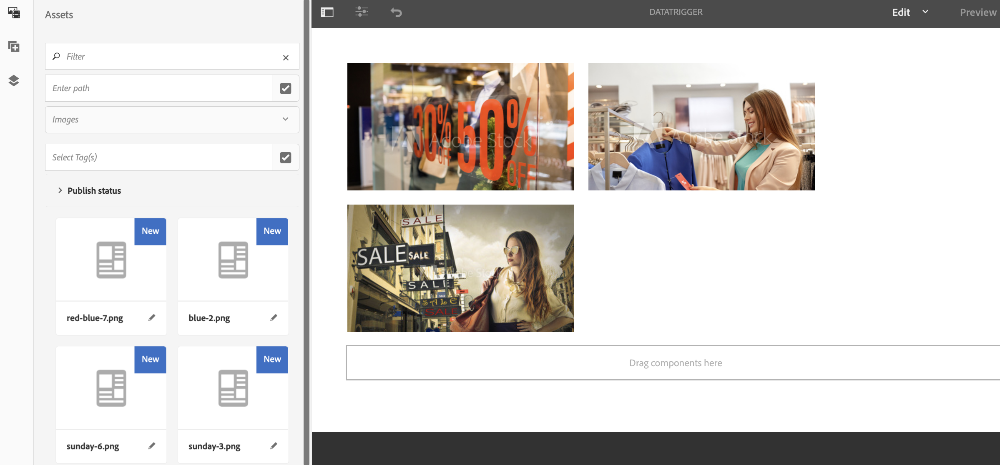

# Modification des ressources déclenchées par les données{#data-triggered-asset-change}

## Description du cas d’utilisation {#use-case-description}

Cet exemple de cas d’utilisation décrit comment obtenir un contenu personnalisé en fonction de la météo de votre emplacement.

Le projet AEM Screens suivant tire parti de la personnalisation AEM, qui inclut ContextHub, le moteur de segmentation et l’interface utilisateur de ciblage de contenu.

Ce cas d’utilisation fournit du contenu personnalisé en fonction de la météo actuelle à chaque emplacement, si le temps est :

* *ensoleillé, il affiche des vêtements d&#39;été*
* *froid, il affiche des vêtements d&#39;hiver*

>[!NOTE]
>
>À des fins de démonstration, ce cas d’utilisation capture votre géolocalisation pour présenter la mise à jour du contenu. Vous pouvez mettre à jour manuellement la vue Géo-emplacement de la sortie dans différents scénarios.

### Conditions préalables {#preconditions}

Avant de commencer cette utilisation, assurez-vous de bien comprendre :

* [Personnalisation ](/help/sites-administering/personalization.md)
* [Configuration de ContextHub](/help/sites-administering/contexthub-config.md)
* [Configuration de la segmentation avec ContextHub](/help/sites-administering/segmentation.md)
* [Création de contenu ciblé à l’aide du mode Ciblage](/help/sites-authoring/content-targeting-touch.md)

### Acteurs principaux {#primary-actors}

Auteurs de contenu

## Flux de base : configuration du projet {#basic-flow-setting-up-the-project}

Suivez les étapes ci-dessous pour configurer un projet présentant le changement de fichier déclenché par les données :

1. Create an AEM Screens Project named as **DataTriggerAsset**, as shown below.

   

1. **Création d’un canal de séquence**

   1. Sélectionnez le dossier **Channels** (Canaux), puis cliquez sur **Créer** pour ouvrir l’assistant afin de créer un canal.
   1. Select **Sequence Channel** from the wizard and create the channel titled as **DataTrigger**.
   

1. **Ajout de contenu à un canal de séquence**

   1. Select the channel **DataTrigger**.
   1. Cliquez sur **Modifier** dans la barre d’actions pour ouvrir l’éditeur. Faites glisser quelques ressources vers votre canal.
   

   >[!NOTE]
   >
   >Vous devez uniquement ajouter les images par défaut à l’éditeur. Les images à remplacer doivent être ajoutées à l’éditeur lorsque vous passez en mode de ciblage à l’étape (6).

1. **Définition des configurations ContextHub et de ciblage**

   1. Accédez à **DataTriggerAsset** —> **Canaux** —> **DataTrigger** et cliquez sur **Propriétés dans la barre d’actions.**
   1. Cliquez sur **l’onglet Personnalisation** .
   

1. **Ajout de configurations ContextHub et de ciblage**

   1. A des fins de démonstration, téléchargez le package de contenu ci-dessous.
   1. Une fois le package téléchargé sur votre instance AEM, vous devez définir ContextHub et Segments Path :
   * Pour **ContextHub**, définissez le chemin sur : ***/libs/settings/cloudsettings/legacy/contexthub***
   * Pour le chemin **** des segments, définissez le chemin sur : ***/conf/data-triggers/settings/wcm/segments***
   Déclencheurs de données

   [Obtenir le fichier](assets/data-triggers-1_00.zip)

   >[!NOTE]
   >
   >Pour en savoir plus sur la configuration de ContextHub et de la segmentation, voir :
   >
   >* [Configuration de ContextHub](/help/sites-administering/contexthub-config.md)
   >* [Configuration de la segmentation avec ContextHub](/help/sites-administering/segmentation.md)

   

   Cliquez sur **Enregistrer et fermer**.

1. **Passage en mode Ciblage**

   1. Accédez à **DataTriggerAsset** > **Canaux** > **DataTrigger** et cliquez sur **Modifier dans la barre d’actions.**
   1. Sélectionnez **Ciblage** dans la barre de menus sous **Modifier**.
   

1. **Ajout du contenu ciblé**

   1. Sélectionnez **Déclencheurs** de données dans **BRAND** et **Déclencheur de données saisonnières **dans **ACTIVITY**.
   1. Click the **Start Targeting**
   

1. **Définition du composant ciblé**

   1. Sélectionnez le composant pour lequel vous souhaitez avoir du contenu ciblé.
   1. Cliquez sur le bouton **Target** pour activer le ciblage pour ce composant.
   1. Définissez le contenu de chaque variation en sélectionnant la variation dans les **audiences** dans le rail latéral et en ajustant le contenu suivant vos besoins.
   >[!NOTE]
   >
   >Pour masquer le panneau **Ressources** dans l’éditeur, vous devez cliquer sur la flèche gauche sur le panneau droit, comme illustré dans la figure ci-dessous.

   

## Affichage des résultats {#viewing-the-results}

Une fois les étapes précédentes terminées, procédez plus loin pour prévisualiser et afficher les résultats :

1. Cliquez sur **Aperçu** dans l’éditeur.

   

1. Pour illustrer le changement d’image, selon l’emplacement et la température de votre zone, vous pouvez cliquer manuellement sur l’icône ContextHub, comme illustré ci-dessous.

   Dès que vous mettez à jour l’emplacement, la température de cette zone est capturée et l’image est mise à jour avec la sélection hivernale et remplace l’image de sélection estivale.

   

