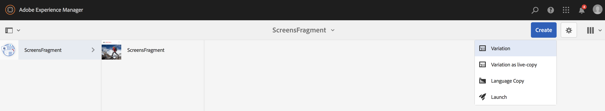
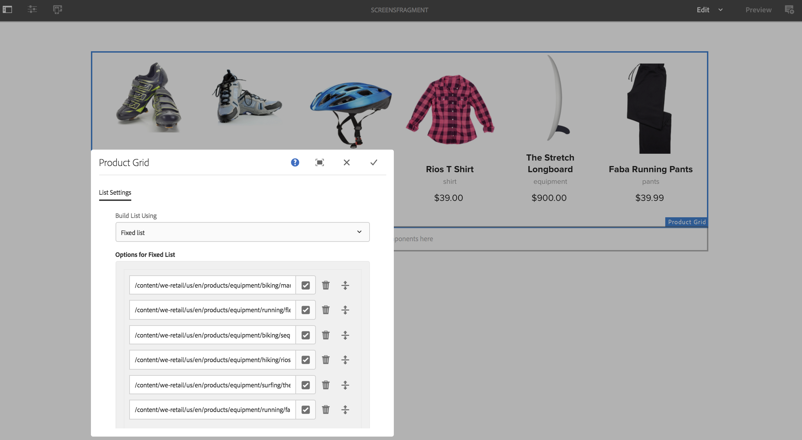
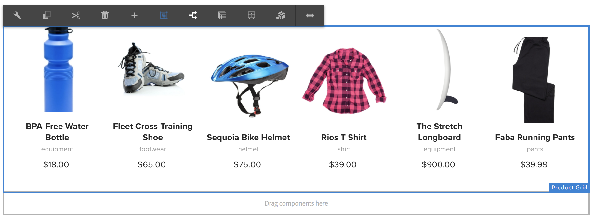

# Utilisation de fragments d’expérience{#using-experience-fragments}

L’utilisation de fragments d’expérience couvre les rubriques suivantes :

* **Présentation**
* **Utilisation de fragments d’expérience dans AEM Screens**
* **Propagation des modifications à partir du gabarit**

## Présentation {#overview}

Un ***fragment d’expérience*** est un groupe d’un ou plusieurs composants comprenant un contenu et une disposition pouvant être référencés dans les pages. Les fragments d’expérience peuvent contenir n’importe quel composant, par exemple, un ou plusieurs composants pouvant contenir un élément dans un système de paragraphes, qui sera référencé dans l’expérience complète ou demandé par un point de terminaison tiers.

## Utilisation de fragments d’expérience dans AEM Screens {#using-experience-fragments-in-aem-screens}

>[!NOTE]
>
>L’exemple ci-dessous utilise **We.Retail** comme projet de démonstration : le fragment d’expérience issu d’une page **Sites** est appliqué à un projet AEM Screens.

Par exemple, le workflow ci-après illustre l’utilisation de fragments d’expérience de We.Retail dans Sites. Vous pouvez choisir une page Web et exploiter ce contenu dans votre canal AEM Screens sur l’un de vos projets.

### Conditions préalables {#pre-requisites}

**Création d’un projet de démonstration avec un canal**

***Création d’un projet***

1. Cliquez sur Screens et sélectionnez **Créer** --> **Créer un projet** pour créer un projet.

1. Sélectionnez **Screens** à partir de l’assistant **Créer un projet Screens**.

1. Saisissez le titre **DemoProject**.
1. Cliquez sur **Créer**.

Un **DemoProject** sera ajouté à AEM Screens. ***Création d’un canal***

1. Accédez au projet **DemoProject** que vous avez créé et sélectionnez le dossier **Channels** (Canaux).

1. Cliquez sur **Créer** dans la barre d’actions (voir la figure ci-dessous). Un assistant s’ouvre.
1. Sélectionnez **Canal de séquences** et cliquez sur **Suivant**.

1. Saisissez le **titre** **Test_Channel** et cliquez sur **Créer**.

Un **TestChannel** sera ajouté à votre **DemoProject**.\

>[!NOTE]
>
>Pour en savoir plus sur la création d’un projet et d’un canal, voir [Création d’un projet](creating-a-screens-project.md) et [Gestion des canaux](managing-channels.md) , respectivement.

### Création d’un fragment d’expérience {#creating-an-experience-fragment}

Suivez les étapes ci-dessous pour réutiliser le contenu de **We.Retail** dans votre canal **TestChannel** de **DemoProject**.

1. **Accédez à une page Sites dans We.Retail**

   1. Accédez à Sites, sélectionnez **We.Retail **->** United States (États-Unis) **->**English (Anglais) **, puis la page **Equipment** (Matériel) pour l’utiliser comme fragment d’expérience pour votre canal Screens.
   1. Cliquez sur **Modifier** dans la barre d’actions pour ouvrir la page que vous souhaitez utiliser comme fragment d’expérience pour votre canal Screens.
   

1. **Réutilisation du contenu**

   1. Sélectionnez le fragment à inclure dans votre canal.
   1. Cliquez sur la dernière icône à droite pour ouvrir la boîte de dialogue **Convertir en fragment d’expérience**.
   

1. **Création d’un fragment d’expérience**

   1. Choisissez l’**action** **Créer un fragment d’expérience**.
   1. Sélectionnez le **Chemin d’accès parent**.
   1. Sélectionnez le **Modèle**. Sélectionnez le modèle **We.Retail** ici.
   1. Saisissez le **titre du fragment** **ScreensFragment**.
   1. Cliquez sur la coche pour terminer la création d’un fragment d’expérience.
   

1. **Création d’une Live Copy du fragment d’expérience**

   1. Accédez à la page d’accueil d’AEM.
   1. Select **Experience Fragments** and highlight the **ScreensFragment** and click **Variation as live- Copy**, as shown in the figure below:
   

   c. Sélectionnez le fragment **ScreensFragment **depuis** l’assistant Créer une Live Copy**, puis cliquez sur **Suivant**.

   
d. Saisissez le **Titre** et le **Nom** **Screens**.

   e. Cliquez sur **Créer** pour créer la Live Copy.

   

1. **Utilisation du fragment d’expérience dans le canal des écrans**

   1. Accédez au canal Screens où vous souhaitez utiliser le fragment **Screens**.
   1. Select the **TestChannel** and click **Edit** from the bar.
   1. Cliquez sur l’icône des composants dans l’onglet latéral.
   1. Drag and drop the **Embedded Page** to your channel.
   

   e. Select the **Embedded Page** component and select the top left (wrench) icon to open the **Page** dialog box.

   f. Sélectionnez la Live Copy **Screens** du fragment que vous avez créé à l’*étape 3* dans le champ **Chemin d’accès**.

   

   h. Entrez les secondes dans le champ** Durée**.

   
i. Cliquez sur la coche pour terminer le processus.

   

### Validation du résultat {#validating-the-result}

After completion of precceeding steps, you can validate your experience fragment in the **TestChannel** by:

1. accédant à **TestChannel** ;
1. sélectionnant l’**Aperçu** dans la barre d’actions.

Vous verrez le contenu de la page **Sites** (Live Copy du fragment d’expérience) dans votre canal, comme illustré ci-dessous :\

## Propagation des modifications à partir du gabarit {#propagating-changes-from-the-master-page}

Une ***Live Copy*** désigne la copie (de la source), gérée par des actions de synchronisation telles que définies par les configurations de déploiement.

Comme le fragment d’expérience que nous avons créé est une Live Copy de pages **Sites**, si vous apportez des modifications à ce fragment depuis le gabarit, vous verrez les modifications sur votre canal ou la destination où vous avez utilisé le fragment d’expérience.

>[!NOTE]
>
>For more information on Live Copy, see [Reusing Content: Multi Site Manager and Live Copy](/help/sites-administering/msm.md).

Pour propager les modifications du canal principal vers votre canal de destination :

1. Sélectionnez le fragment d’expérience sur la page (gabarit) **Sites** et cliquez sur l’icône en forme de crayon pour modifier les éléments du fragment d’expérience.

   

1. Sélectionnez le fragment d’expérience et cliquez sur l’icône en forme de clé pour ouvrir la boîte de dialogue permettant de modifier les images.

   

1. La boîte de dialogue **Grille de produits** apparaît.

   

1. Vous pouvez modifier n’importe quelle image. Par exemple, ici, la première image est remplacée dans ce fragment.

   

1. Sélectionnez le fragment d’expérience et cliquez sur l’icône Déploiement pour propager les modifications sur le fragment utilisé dans votre canal.

   

1. Cliquez sur Déployer pour confirmer les modifications.

   Vous verrez que les modifications sont appliquées.

   

### Validation des modifications {#validating-the-changes}

Pour confirmer les modifications dans votre canal, procédez comme suit :

1. Accédez à **Screens** -> **Channels (Canaux)** -> **TestChannel**.

1. Cliquez sur **Aperçu** dans la barre d’actions pour confirmer les modifications.

L’image suivante illustre les modifications apportées à votre canal **TestChannel**:\

