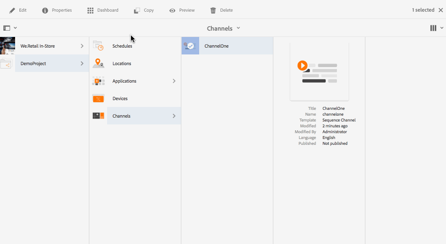
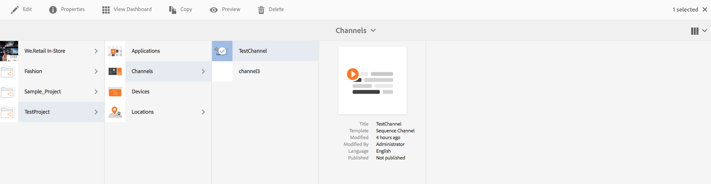

# Création et gestion des canaux{#creating-and-managing-channels}

Un canal affiche une séquence de contenu, des images et des vidéos, mais peut également afficher un site web ou une application sur une seule page.

Vous découvrirez dans cette page comment créer et gérer des canaux pour Screens.

**Conditions préalables** :

* [Configuration et déploiement de Screens](configuring-screens-introduction.md)
* [Création et gestion de projet Screens](creating-a-screens-project.md)

## Création d’un canal {#creating-a-new-channel}

Une fois le projet Screens créé, suivez les étapes ci-dessous pour lui créer un canal :

1. Sélectionnez le lien Adobe Experience Manager (en haut à gauche), puis Screens. Alternatively, you can navigate directly from `http://localhost:4502/screens.html/content/screens`
1. Accédez au projet Screens, puis cliquez sur **Canaux**.
1. Cliquez sur **Créer** en regard de l’icône plus (+) de la barre d’actions. L’assistant s’ouvre (*voir la section Types de canaux pour plus d’informations*).

1. Sélectionnez un modèle dans l’assistant, puis cliquez sur **Suivant**.
1. Saisissez les propriétés pour **Titre et balises**, **Autres titres et description**, **Heure d’activation/de désactivation** et **URL Vanity**.

1. Cliquez sur **Créer** pour créer le canal et l’ajouter à votre dossier de canaux.

### Types de canaux    {#channel-types}

Les options de modèles suivantes sont disponibles avec l’assistant :

| **Option de modèle** | **Description** |
|---|---|
| Dossier de canaux | Permet de créer un dossier où stocker une collection de canaux. |
| Canal de séquence | Permet de créer un canal qui lit les composants de manière séquentielle (l’un après l’autre dans un diaporama). |
| Canal d’application | Permet de présenter votre application web personnalisée dans le lecteur Screens. |
| Canal d’écran partagé 1x1 | Permet d’afficher le composant dans une seule zone. |
| Canal d’écran partagé 1x2 | Permet d’afficher les ressources dans deux zones (division horizontale).. |
| Canal d’écran partagé 2x2 | Permet d’afficher les ressources dans quatre zones (division horizontale et verticale dans une matrice).. |
| Canal d’écran partagé 2x3 | Permet d’afficher les ressources dans deux zones (division horizontale) où l’une des zones est plus grande que l’autre. |

>[!NOTE]
>
>Les canaux d’écran partagé divisent l’affichage en plusieurs zones, ce qui permet de lire plusieurs expériences simultanément, côte à côte. Les expériences peuvent être des ressources/du texte statiques ou des séquences incorporées.

The following example shows the creation of a Sequence Channel **ChannelOne** for a Screens project **DemoProject**.

>[!NOTE]
>
>Vous pouvez créer différentes zones à l’aide des options de modèle, telles que les canaux d’écran partagé 1x2, 2x2 ou 2x3 mentionnés ci-dessus.

***Important*** :

Une fois que vous avez créé et ajouté du contenu au canal, l’étape suivante consiste à créer un emplacement et ensuite un affichage. En outre, vous devez attribuer ce canal à un affichage. Consultez les ressources ci-dessous à la fin de la section pour en savoir plus.

## Utilisation des canaux {#working-with-channels}

Vous pouvez modifier, copier, prévisualiser, supprimer un canal, et afficher ses propriétés et son tableau de bord.

>[!NOTE]
>
>Cliquez sur l’icône située à gauche pour sélectionner un élément. Par exemple, cliquez sur l’icône du canal et effectuez les actions suivantes, comme illustré dans la figure ci-dessous.

### Ajout de contenu à un canal et modification de ce contenu {#adding-editing-content-to-a-channel}

Pour ajouter du contenu à un canal ou modifier son contenu, suivez les étapes ci-dessous :

1. Cliquez sur le canal à modifier (comme illustré ci-dessus).
1. Cliquez sur **Modifier** dans l’angle supérieur gauche de la barre d’actions pour modifier les propriétés du canal. L’éditeur s’ouvre pour vous permettre d’ajouter au canal des ressources/composants que vous souhaitez publier.

**Téléchargement de vidéos dans le canal** Suivez les étapes ci-dessous pour télécharger des vidéos dans votre canal :

1. Sélectionnez le canal vers lequel transférer la vidéo.
1. Cliquez sur **Modifier** dans la barre d’actions pour ouvrir l’éditeur.
1. Sélectionnez **Vidéos** sous Ressources, puis faites glisser les vidéos choisies.

>[!NOTE]
>
>Si vous rencontrez des problèmes lors du transfert des vidéos vers votre canal, reportez-vous à la section [Dépannage des vidéos](troubleshoot-videos.md) sous Administration de Screens.

### Affichage des propriétés {#viewing-properties}

Pour afficher ou modifier les propriétés d’un canal, suivez les étapes ci-dessous :

1. Cliquez sur le canal à modifier.
1. Cliquez sur **Propriétés **dans la barre d’actions pour afficher/modifier les propriétés du canal. Les onglets suivants vous permettent de modifier les options.

### Affichage du tableau de bord {#viewing-dashboard}

Pour afficher le tableau de bord d’un canal, suivez les étapes ci-dessous :

1. Cliquez sur le canal à modifier.
1. Click **View Dashboard** from the action bar to view the dashobard. Les panneaux **INFORMATIONS SUR LES CANAUX** et **AFFICHAGES ATTRIBUÉS** s’ouvrent, comme illustré dans la figure ci-dessous :

### Informations sur le canal {#channel-information}

Le panneau Informations sur le canal fournit une description des propriétés ainsi qu’un aperçu du canal. Il vous permet également de voir si le canal est en ligne ou hors ligne.

Cliquez sur l’icône (**...**) dans la barre d’actions **Informations sur le canal** pour afficher les propriétés, modifier le contenu ou mettre à jour la mémoire cache (contenu hors ligne) du canal.

### Canaux en ligne et hors ligne {#online-and-offline-channels}

>[!NOTE]
>
>Par défaut, lorsque vous créez un canal, celui-ci est hors ligne.

Lorsque vous créez un canal, il peut être défini comme étant en ligne ou hors ligne.

Un ***canal en ligne*** affiche le contenu mis à jour dans l’environnement en temps réel, alors qu’un ***canal hors ligne*** affiche le contenu en mémoire cache.

Suivez les étapes ci-dessous pour que le canal soit en ligne :

1. Accédez au canal **TestChannel** à partir du dossier **Canaux** de votre **projet** Test.

   Sélectionnez le canal.

   

   Cliquez sur **Afficher le tableau de bord** dans la barre d’actions pour afficher le statut du lecteur. Le panneau **INFORMATIONS SUR LE CANAL** indique si le canal est en ligne ou hors ligne.

   

1. Cliquez sur **Propriétés** dans la barre d’actions et accédez à l’onglet **Canal** comme illustré ci-dessous :

   

1. Vérifiez le canal **Make en ligne** pour que le canal soit en ligne.

   Cliquez sur **Enregistrer et Fermer** pour enregistrer.

   

   Le tableau de bord s’affiche et vous pouvez alors voir le statut en ligne du lecteur dans le panneau **INFORMATIONS SUR LES CANAUX**.

   

#### Mises à jour automatiques ou manuelles depuis le tableau de bord du périphérique. {#automatic-versus-manual-updates-from-the-device-dashboard}

Le tableau suivant répertorie les événements associés aux mises à jour automatiques ou manuelles depuis le tableau de bord du périphérique.

<table> 
 <tbody> 
  <tr> 
   <td><strong>Événement</strong></td> 
   <td><strong>Mise à jour automatique du périphérique</strong></td> 
   <td><strong>Mise à jour manuelle du périphérique</strong></td> 
  </tr> 
  <tr> 
   <td>Changement de canal en ligne</td> 
   <td>Contenu mis à jour automatiquement</td> 
   <td>
Contenu mis à jour sur "Périphérique : Configuration Push"
 
Ou,
 
Contenu mis à jour sur <strong><i>Périphérique : Redémarrer</i></strong>
 </td> 
  </tr> 
  <tr> 
   <td>Changement du canal hors ligne, mais le "contenu Push" du canal n’est PAS déclenché (aucune recréation du package hors ligne)</td> 
   <td>Aucune mise à jour de contenu</td> 
   <td>Aucune mise à jour de contenu</td> 
  </tr> 
  <tr> 
   <td>Changement dans le canal hors ligne et le "contenu Push" du canal est déclenché (nouveau package hors ligne)</td> 
   <td>Contenu mis à jour automatiquement</td> 
   <td>
Contenu mis à jour sur <strong><i>Périphérique : Configuration Push</i></strong>
 
Ou,
 
Contenu mis à jour sur <strong><i>Périphérique : Redémarrer</i></strong>
 </td> 
  </tr> 
  <tr> 
   <td>
Changement de configuration
 
    <ul> 
     <li>Affichage (canal forcé)</li> 
     <li>Périphérique</li> 
     <li>Affectations de canal (nouveau canal, canal supprimé)</li> 
     <li>Affectation de canal (rôle, événement, planification)</li> 
    </ul> </td> 
   <td>Configuration mise à jour automatiquement</td> 
   <td>
Configuration mise à jour sur <strong><i>Périphérique : Configuration Push</i></strong>
 
Ou,
 
Configuration mise à jour sur <strong><i>Périphérique : Redémarrer</i></strong>
 </td> 
  </tr> 
 </tbody> 
</table>

### Affichages attribués {#assigned-displays}

Le panneau des affichages attribués indique quel affichage est associé à quel canal. Il fournit un instantané de l’affichage attribué et de sa résolution.

Les affichages attribués sont affichés dans le panneau **Affichages attribués** comme illustré ci-dessous :

>[!NOTE]
>
>Pour en savoir plus sur la création d’un affichage à un emplacement donné, consultez :
>
>* [Création et gestion des emplacements](managing-locations.md)
>* [Création et gestion des affichages](managing-displays.md)
>

Cliquez ensuite sur l’affichage dans le panneau **AFFICHAGES ATTRIBUÉS** pour voir les informations relatives à l’affichage, comme illustré ci-dessous :

### Étapes suivantes {#the-next-steps}

Une fois que vous savez créer un canal, lui ajouter du contenu et modifier ce contenu, l’étape suivante consiste à découvrir comment créer un emplacement et un affichage, ainsi qu’à attribuer un canal à cet affichage.

Consultez les ressources ci-après pour les étapes suivantes :

* [Création et gestion des canaux](managing-channels.md)
* [Création et gestion des emplacements](managing-locations.md)
* [Création et gestion des affichages](managing-displays.md)