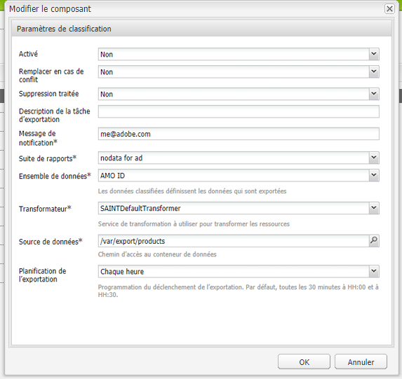

# Classifications Adobe{#adobe-classifications}

>[!CAUTION]
>
>AEM 6.4 a atteint la fin de la prise en charge étendue et cette documentation n’est plus mise à jour. Pour plus d’informations, voir notre [période de support technique](https://helpx.adobe.com/fr/support/programs/eol-matrix.html). Rechercher les versions prises en charge [here](https://experienceleague.adobe.com/docs/?lang=fr).

Adobe Classifications exporte les données de classification dans [Adobe Analytics](/help/sites-administering/adobeanalytics.md) de façon planifiée. L’exportateur est une implémentation d’un **com.adobe.cq.scheduled.Export.Exporter**.

Pour configurer cela :

1. Navigation via **Outils, Cloud Services** au **Adobe Analytics** .
1. Ajoutez une nouvelle configuration. Vous verrez que la variable **Classifications Adobe Analytics** Le modèle de configuration s’affiche sous **Structure Adobe Analytics** configuration. Fournissez un **Titre** et **Nom** selon les besoins :

   

1. Cliquez sur **Créer** pour configurer les paramètres.

   

   Les propriétés sont par exemple les suivantes :

   | **Champ** | **Description** |
   |---|---|
   | Activé | Sélectionner **Oui** pour activer les paramètres Adobe des classifications . |
   | Remplacer en cas de conflit | Sélectionner **Oui** pour remplacer toute collision de données. Par défaut, cette valeur est définie sur **Non**. |
   | Suppression traitée | Si la variable est définie sur **Oui**, supprime les noeuds traités après leur exportation. La valeur par défaut est **False**. |
   | Description de la tâche d’exportation | Saisissez une description pour la tâche Adobe des classifications . |
   | Message de notification | Saisissez une adresse e-mail qui recevra la notification d’Adobe Classifications. |
   | Suite de rapports | Saisissez la suite de rapports pour laquelle exécuter la tâche d’importation. |
   | Ensemble de données | Saisissez l’identifiant de relation du jeu de données pour lequel exécuter la tâche d’importation. |
   | Transformateur | Dans le menu déroulant, sélectionnez une implémentation du transformateur. |
   | Source de données | Accédez au chemin d’accès du conteneur de données. |
   | Planification de l’exportation | Sélectionnez le planning de l&#39;export. La valeur par défaut est toutes les 30 minutes. |

1. Cliquez sur **OK** pour enregistrer vos paramètres.

## Modification du format de page {#modifying-page-size}

Les enregistrements sont traités par pages. Par défaut, Adobe Classifications crée des pages avec une taille de page de 1 000.

Une page peut présenter une taille maximale de 25 000, par définition dans Adobe Classifications, et peut être modifiée à partir de la console Felix. Pendant l’exportation, Adobe Classifications verrouille le nœud source pour empêcher les modifications simultanées. Le noeud est déverrouillé après l’exportation, en erreur ou lorsque la session est fermée.

Pour modifier la taille de la page :

1. Accédez à la console OSGi sur **https://&lt;hôte>:&lt;port>/system/console/configMgr** et sélectionnez **Adobe AEM Classifications Exporter**.

   

1. Mettez à jour le **Exporter la taille de page** selon les besoins, puis cliquez sur **Enregistrer**.

## SAINTDefaultTransformer {#saintdefaulttransformer}

>[!NOTE]
>
>Les classifications d’Adobe étaient auparavant connues sous le nom d’exportateur de SAINT.

Un exportateur peut utiliser un transformateur pour transformer les données d’exportation vers un format spécifique. Pour Adobe Classifications, une sous-interface `SAINTTransformer<String[]>` mettant en œuvre l’interface de transformateur est fournie. Cette interface est utilisée pour limiter le type de données à `String[]`, qui est utilisé par l’API SAINT et pour disposer d’une interface de marquage permettant de rechercher ces services à sélectionner.

Dans la mise en œuvre par défaut SAINTDefaultTransformer, les ressources enfants de la source de l’exportateur sont traitées comme des enregistrements avec des noms de propriétés comme clés, et des valeurs de propriétés comme valeurs. La colonne **Clé** est automatiquement ajoutée en tant que première colonne ; sa valeur est le nom du nœud. Les propriétés d’espace de noms (contenant :) ne sont pas prises en compte.

*Structure de nœud :*

* id-classification `nt:unstructured`

   * 1 `nt:unstructured`

      * Produit = Mon Nom De Produit (Chaîne)
      * Price = 120.90 (chaîne)
      * Taille = M (chaîne)
      * Couleur = noir (chaîne)
      * Color^Code = 101 (chaîne)

**En-tête et enregistrement du SAINT :**

| **Clé** | **Produit** | **Prix** | **Taille** | **Couleur** | **Code Couleur** |
|---|---|---|---|---|---|
| 1 | Mon nom de produit | 120,90 | M | noir | 101 |

Les propriétés sont par exemple les suivantes :

<table> 
 <tbody> 
  <tr> 
   <td><strong>Chemin de la propriété</strong></td> 
   <td><strong>Description</strong></td> 
  </tr> 
  <tr> 
   <td>transformer</td> 
   <td>Nom de classe d’une implémentation SAINTTransformer</td> 
  </tr> 
  <tr> 
   <td>email</td> 
   <td>Adresse électronique de notification.</td> 
  </tr> 
  <tr> 
   <td>reportsuites</td> 
   <td>Identifiants des suites de rapports pour lesquelles exécuter la tâche d’importation. </td> 
  </tr> 
  <tr> 
   <td>dataset</td> 
   <td>Identifiant de relation du jeu de données pour lequel exécuter la tâche d’importation. </td> 
  </tr> 
  <tr> 
   <td>description</td> 
   <td>Description de la tâche.   </td> 
  </tr> 
  <tr> 
   <td>remplacer</td> 
   <td>Indicateur pour remplacer les collisions de données. La valeur par défaut est <strong>false</strong>.</td> 
  </tr> 
  <tr> 
   <td>checkdivisions</td> 
   <td>Indicateur pour vérifier la compatibilité des suites de rapports. La valeur par défaut est <strong>true</strong>.</td> 
  </tr> 
  <tr> 
   <td>deleteprocessed</td> 
   <td>Indicateur pour supprimer les nœuds traités après l’exportation. La valeur par défaut est <strong>false</strong>.</td> 
  </tr> 
 </tbody> 
</table>

## Automatisation de l’exportation des classifications d’Adobe {#automating-adobe-classifications-export}

Vous pouvez créer votre propre workflow, de sorte que tout nouveau import lance le workflow pour créer les données appropriées et correctement structurées dans **/var/export/** afin qu’il puisse être exporté vers les classifications d’Adobe.
