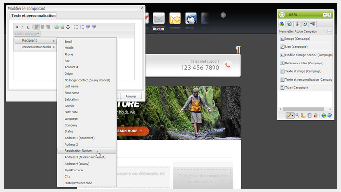

# Intégrer à Adobe Campaign Classic{#integrating-with-adobe-campaign-classic}

>[!CAUTION]
>
>AEM 6.4 a atteint la fin de la prise en charge étendue et cette documentation n’est plus mise à jour. Pour plus d’informations, voir notre [période de support technique](https://helpx.adobe.com/fr/support/programs/eol-matrix.html). Rechercher les versions prises en charge [here](https://experienceleague.adobe.com/docs/?lang=fr).

>[!NOTE]
>
>Cette documentation décrit comment intégrer AEM à Adobe Campaign Classic, la solution sur site. Si vous utilisez Adobe Campaign Standard, reportez-vous à la section [Intégration à Adobe Campaign Standard](/help/sites-administering/campaignstandard.md) pour ces instructions.

Adobe Campaign vous permet de gérer le contenu et les formulaires de diffusion email directement dans Adobe Experience Manager.

Pour utiliser les deux solutions conjointement et simultanément, vous devez d’abord les configurer de manière à les connecter l’une à l’autre. Cela implique certaines étapes de configuration à la fois dans Adobe Campaign et dans Adobe Experience Manager, Ces étapes sont décrites en détail dans ce document.

L’utilisation d’Adobe Campaign dans AEM comprend la possibilité d’envoyer un courrier électronique par le biais d’Adobe Campaign. Cette possibilité est décrite dans la section [Utilisation d’Adobe Campaign](/help/sites-authoring/campaign.md). Cela inclut également l’utilisation de formulaires sur les pages d’AEM pour manipuler les données.

En outre, les rubriques suivantes peuvent être utiles lors de l’intégration d’AEM avec [Adobe Campaign](https://helpx.adobe.com/fr/support/campaign/classic.html) :

* [Bonnes pratiques relatives aux modèles d’e-mail](/help/sites-administering/best-practices-for-email-templates.md)
* [Résolution des incidents liés à votre intégration Adobe Campaign](/help/sites-administering/troubleshooting-campaignintegration.md)

Si vous étendez votre intégration à Adobe Campaign, vous pouvez consulter les pages suivantes :

* [Création d’extensions personnalisées](/help/sites-developing/extending-campaign-extensions.md)
* [Création de mappages de formulaires personnalisés](/help/sites-developing/extending-campaign-form-mapping.md)

## Processus d’intégration AEM et Adobe Campaign {#aem-and-adobe-campaign-integration-workflow}

Cette section décrit un workflow type entre AEM et Adobe Campaign lors de la création de campagnes et de la diffusion de contenu.

Le workflow type implique les éléments suivants et est décrit en détail :

1. Commencez à créer votre campagne (à la fois dans Adobe Campaign et dans AEM).
1. Avant de lier le contenu et la diffusion, personnalisez votre contenu dans AEM et créez une diffusion dans Adobe Campaign.
1. Liez le contenu et la diffusion dans Adobe Campaign.

### Commencez à créer votre campagne {#start-building-your-campaign}

Vous commencez à créer une campagne à tout moment. Avant de lier le contenu, AEM et AC sont indépendants Cela signifie que les marketeurs peuvent commencer à créer leurs campagnes et leurs ciblages dans Adobe Campaign, tandis que les créateurs de contenu travaillent sur la conception dans AEM.

### Avant de lier le contenu et la diffusion {#before-linking-content-and-delivery}

Avant de lier le contenu et de créer un mécanisme de diffusion, vous devez effectuer les opérations suivantes :

**Dans AEM**

* Personnalisez à l’aide des champs de personnalisation de la **Texte et personnalisation** component

**Dans Adobe Campaign **

* Créer une diffusion de type **aemContent**

### Liaison du contenu et définition de la diffusion {#linking-content-and-setting-delivery}

Après avoir préparé le contenu pour la liaison et la diffusion, vous déterminez exactement comment et où lier le contenu.

Toutes ces étapes sont effectuées dans Adobe Campaign.

1. Spécifiez l’instance AEM à utiliser.
1. Synchronisez le contenu en cliquant sur le bouton Synchroniser .
1. Ouvrez le sélecteur de contenu pour sélectionner votre contenu.

### Si vous êtes nouveau dans AEM {#if-you-are-new-to-aem}

Si vous commencez à AEM, vous trouverez peut-être les liens suivants utiles pour comprendre AEM :

* [Démarrage d’AEM](/help/sites-deploying/deploy.md)
* [Compréhension des agents de réplication](/help/sites-deploying/replication.md)
* [Recherche et utilisation des fichiers journaux](/help/sites-deploying/monitoring-and-maintaining.md#working-with-audit-records-and-log-files)
* [Introduction à la plateforme AEM](/help/sites-deploying/platform.md)

## Configuration d’Adobe Campaign {#configuring-adobe-campaign}

La configuration d’Adobe Campaign implique les opérations suivantes :

1. Installation du package d’intégration d’AEM dans Adobe Campaign.
1. Configuration d&#39;un compte externe.
1. Vérification de la configuration correcte de AEMResourceTypeFilter.

En outre, vous pouvez effectuer des configurations avancées, notamment :

* Gestion des blocs de contenu
* Gestion des champs de personnalisation

Voir [Configurations avancées](#advanced-configurations).

>[!NOTE]
>
>Pour effectuer ces opérations, vous devez posséder le rôle d’**administration** dans Adobe Campaign.

### Prérequis {#prerequisites}

Assurez-vous préalablement que vous disposez des éléments suivants :

* [Une instance de création AEM](/help/sites-deploying/deploy.md#getting-started)
* [Une instance de publication AEM](/help/sites-deploying/deploy.md#author-and-publish-installs)
* [Une instance Adobe Campaign Classic](https://helpx.adobe.com/fr/support/campaign/classic.html) avec un client et un serveur
* Internet Explorer 11

>[!NOTE]
>
>Si vous utilisez une version antérieure à Adobe Campaign Classic version 8640, consultez la [documentation de mise à niveau](https://docs.campaign.adobe.com/doc/AC6.1/en/PRO_Updating_Adobe_Campaign_Upgrading.html) pour plus d’informations. Notez que le client et la base de données doivent être mis à niveau vers la même version.

>[!CAUTION]
>
>Les opérations décrites en détail dans les sections [Configuration d’Adobe Campaign](#configuring-adobe-campaign) et [Configuration d’Adobe Experience Manager](#configuring-adobe-experience-manager) sont nécessaires au bon fonctionnement des fonctionnalités d’intégration entre AEM et Adobe Campaign.

### Installation du package d’intégration AEM {#installing-the-aem-integration-package}

Vous devez installer le package **Intégration AEM** dans Adobe Campaign. Pour ce faire :

1. Accédez à l’instance Adobe Campaign que vous souhaitez lier à AEM.
1. Sélectionnez *Outils* > *Avancés* > *Importer un package…*.

   

1. Cliquez sur **Installer un package standard**, puis sélectionnez le package **Intégration AEM**.

   

1. Cliquez sur **Suivant**, puis sur **Démarrer**.

   Ce package contient l’opérateur **emserver** qui sera utilisé pour connecter le serveur AEM à Adobe Campaign.

   >[!CAUTION]
   >
   >Par défaut, aucune zone de sécurité n’est configurée pour cet opérateur. Pour vous connecter à Adobe Campaign via AEM, vous devez en sélectionner une.
   >
   >Dans le fichier **serverConf.xml**, l’attribut **allowUserPassword** de la zone de sécurité sélectionnée doit être défini sur **true** pour autoriser AEM à se connecter à Adobe Campaign par le biais d’un nom de connexion/mot de passe.
   >
   >Il est vivement recommandé de créer une zone de sécurité dédiée à AEM afin d’éviter tout problème de sécurité. Pour plus d’informations sur ce point, consulter le [Guide d’installation](https://docs.campaign.adobe.com/doc/AC/en/INS_Additional_configurations_Configuring_Campaign_server.html).

   

### Configuration d&#39;un compte externe AEM {#configuring-an-aem-external-account}

Vous devez configurer un compte externe qui vous permet de connecter Adobe Campaign à votre instance AEM.

>[!NOTE]
>
>* Lors de l’installation du package **Intégration AEM**, un compte externe AEM est créé. Vous pouvez configurer la connexion à votre instance AEM à partir de celle-ci ou en créer une nouvelle.
>* Dans AEM, veillez à définir le mot de passe de l’utilisateur distant d’Adobe Campaign. Vous devez définir ce mot de passe pour connecter Adobe Campaign à AEM. Connectez-vous en tant qu’administrateur et dans la console d’administration des utilisateurs, recherchez l’utilisateur distant campaign et cliquez sur **Définir mot de passe**.
>


Pour configurer un compte AEM externe :

1. Sélectionnez **Administration** > **Plateforme** > nœud **Comptes externes**.
1. Créez un compte externe et sélectionnez le type **AEM**.
1. Saisissez les paramètres d’accès pour votre instance de création AEM : l’adresse du serveur, ainsi que l’ID et le mot de passe utilisés pour la connexion à cette instance. Le mot de passe du compte utilisateur campaign-api est identique à celui de l’utilisateur distant campaign pour lequel vous définissez un mot de passe dans AEM.

   >[!NOTE]
   >
   >Assurez-vous que l’adresse du serveur ne se termine **pas** par une barre oblique. Par exemple, utilisez `https://yourserver:4502` au lieu de `https://yourserver:4502/`.

    

1. Veillez à ce que la case **Activé** soit cochée.

### Vérification de l’option AEMResourceTypeFilter {#verifying-the-aemresourcetypefilter-option}

L’option **AEMResourceTypeFilter** est utilisée pour filtrer les types de ressources AEM qui peuvent être utilisées dans Adobe Campaign. Cela permet à Adobe Campaign de récupérer AEM contenu spécialement conçu pour être utilisé dans Adobe Campaign uniquement.

Cette option doit être préconfigurée ; toutefois, si vous modifiez cette option, il se peut qu’elle ne fonctionne pas.

Pour vérifier que l’option **AEMResourceTypeFilter** est configurée :

1. Sélectionnez **Plateforme** >**Options**.
1. Dans l’option **AEMResourceTypeFilter**, vérifiez que les chemins d’accès sont corrects. Ce champ doit contenir la valeur :

   **mcm/campaign/components/newsletter,mcm/campaign/components/campaign_newsletterpage,mcm/neolane/components/newsletter**

   Ou, dans certains cas, la valeur est la suivante :

   **mcm/campaign/components/newsletter**

   

## Configuration d’Adobe Experience Manager {#configuring-adobe-experience-manager}

Pour configurer AEM, procédez comme suit :

* Configurez la réplication entre les instances.
* Connectez AEM à Adobe Campaign via Cloud Services.
* Configurez l’externaliseur.

### Configuration de la réplication entre les instances AEM {#configuring-replication-between-aem-instances}

Le contenu créé à partir de l’instance de création AEM est d’abord envoyé à l’instance de publication. Vous devez effectuer la publication de sorte que les images de la newsletter soient disponibles dans l’instance de publication et pour ses destinataires. L’agent de réplication doit donc être configuré pour répliquer de l’instance de création AEM vers l’instance de publication AEM.

>[!NOTE]
>
>Si vous ne souhaitez pas utiliser l’adresse URL de réplication, mais utiliser à la place l’adresse URL visible par le public, vous pouvez définir l’**adresse URL publique** dans le paramètre de configuration suivant dans OSGi (**Logo AEM** > icône **Outils** > **Opérations** > **Console web** > **OSGi Configuration** > **Intégration AEM Campaign – Configuration**) :
**Adresse URL publique :** com.day.cq.mcm.campaign.impl.IntegrationConfigImpl#aem.mcm.campaign.publicUrl

Cette étape est également nécessaire pour répliquer certaines configurations d’instance de création dans l’instance de publication.

Pour configurer la réplication entre les instances AEM :

1. À partir de l’instance de création, sélectionnez **Logo AEM** > icône **Outils** > **Déploiement** > **Réplication** > **Agents sur l’instance de création**, puis cliquez sur **Agent par défaut**.

   

   >[!NOTE]
   Évitez d’utiliser l’hôte local localhost (il s’agit d’une copie locale d’AEM) lors de la configuration de votre intégration avec Adobe Campaign, à moins que les instances de publication et de création se trouvent toutes deux sur le même ordinateur.

1. Appuyez ou cliquez sur **Modifier**, puis sélectionnez **Transférer**.
1. Configurez l’URI en remplaçant **localhost** par l’adresse IP ou l’adresse de l’instance de publication AEM.

   

### Connexion d’AEM à Adobe Campaign {#connecting-aem-to-adobe-campaign}

Avant de pouvoir utiliser AEM et Adobe Campaign ensemble, vous devez établir le lien entre les deux solutions afin qu’elles puissent communiquer.

1. Connectez-vous à votre instance de création AEM.
1. Sélectionnez **Logo AEM** > icône **Outils** > **Déploiement** > **Services cloud**, puis **Configurer maintenant** dans la section Adobe Campaign.

   

1. Créez une configuration en saisissant un **titre**, puis cliquez sur **Créer**, ou sélectionnez la configuration existante que vous souhaitez lier à votre instance Adobe Campaign.
1. Modifiez la configuration afin qu’elle corresponde aux paramètres de votre instance Adobe Campaign.

   * **Nom d’utilisateur** : **aemserver**, l’opérateur du package d’intégration AEM Adobe Campaign utilisé pour établir la liaison entre les deux solutions.
   * **Mot de passe** : mot de passe de l’opérateur aemserver Adobe Campaign. Vous devrez peut-être préciser à nouveau le mot de passe de cet opérateur directement dans Adobe Campaign.
   * **Point de terminaison API**: URL de l’instance Adobe Campaign.

1. Sélectionnez **Se connecter à Adobe Campaign** et cliquez sur **OK**.

   

   >[!NOTE]
   Après avoir [créé et publié votre e-mail](/help/sites-authoring/campaign.md), vous devez republier la configuration sur votre instance de publication.

   

>[!NOTE]
Si la connexion échoue, vérifiez les points suivants :
* Vous pouvez rencontrer un problème de certificat lorsque vous utilisez une connexion sécurisée sur une instance Adobe Campaign (https). Vous devez ajouter le certificat de l’instance Adobe Campaign au fichier **cacerts** du JDK de votre instance AEM.
* Une zone de sécurité doit être configurée pour l’[opérateur aemserver](#connecting-aem-to-adobe-campaign) dans Adobe Campaign. De plus, dans le fichier **serverConf.xml**, l’attribut **allowUserPassword** de la zone de sécurité doit être défini sur **true** pour autoriser la connexion d’AEM à Adobe Campaign en mode nom de connexion/mot de passe.
>
En outre, voir [Dépannage de votre intégration AEM/Adobe Campaign](/help/sites-administering/troubleshooting-campaignintegration.md).

### Configuration de l’externaliseur {#configuring-the-externalizer}

Vous devez [configurer l’externaliseur](/help/sites-developing/externalizer.md) dans AEM sur votre instance de création. L’externaliseur est un service OSGi qui vous permet de transformer un chemin de ressources en une URL absolue externe. Ce service fournit un emplacement central pour configurer ces URL externes et les créer.

Pour des instructions générales, voir [Configuration de l’externaliseur](/help/sites-developing/externalizer.md). Pour l’intégration d’Adobe Campaign, veillez à configurer le serveur de publication sur l’adresse `https://<host>:<port>/system/console/configMgr/com.day.cq.commons.impl.ExternalizerImpl` de façon à ce qu’il ne pointe pas vers `localhost:4503`, mais vers un serveur accessible par la console Adobe Campaign.

S’il pointe vers `localhost:4503` ou sur un autre serveur auquel Adobe Campaign ne parvient pas à se connecter, les images ne s’affichent pas dans la console Adobe Campaign.


## Configurations avancées {#advanced-configurations}

Vous pouvez également effectuer certaines configurations avancées, à savoir :

* Gérez les champs et les blocs de personnalisation.
* Désactivez un bloc de personnalisation.
* Gérer les données d’extension de la cible.

### Gestion des champs et des blocs de personnalisation {#managing-personalization-fields-and-blocks}

Les champs et les blocs disponibles pour ajouter de la personnalisation au contenu de votre email dans AEM sont gérés par Adobe Campaign.

Une liste par défaut est fournie, mais peut être modifiée. Vous pouvez également ajouter ou masquer des champs et des blocs de personnalisation.

#### Ajouter un champ de personnalisation {#adding-a-personalization-field}

Pour ajouter un champ de personnalisation à ceux déjà disponibles, vous devez étendre le schéma **nms:seedMember** d’Adobe Campaign, comme suit :

>[!CAUTION]
Le champ à ajouter doit déjà avoir été ajouté par le biais d’une extension de schéma de destinataire (**nms:recipient**). Pour plus d’informations, consultez le guide de [configuration](https://docs.campaign.adobe.com/doc/AC6.1/en/CFG_Editing_schemas_Editing_schemas.html).

1. Sélectionnez **Administration** > **Configuration** > **Schémas de données** dans la navigation d’Adobe Campaign.
1. Sélectionnez **Nouveau**.

   

1. Dans la fenêtre contextuelle, sélectionnez **Étendre les données du tableau à l’aide d’un schéma d’extension** et cliquez sur **Suivant**.

   

1. Saisissez les différents paramètres du schéma étendu :

   * **Schéma** : sélectionnez le schéma **nms:seedMember**. Les autres champs de la fenêtre sont automatiquement renseignés.
   * **Espace de noms**: personnalisez l’espace de noms du schéma étendu.

1. Modifiez le code XML du schéma pour spécifier le champ que vous souhaitez ajouter. Pour plus d’informations sur l’extension des schémas dans Adobe Campaign, consulter le [Guide de configuration](https://docs.campaign.adobe.com/doc/AC6.1/en/CFG_Editing_schemas_Extending_a_schema.html).
1. Enregistrez votre schéma, puis mettez à jour la structure de la base de données Adobe Campaign en sélectionnant **Outils** > **Avancés** > **Mettre à jour la structure de la base de données** dans la console.
1. Déconnectez-vous de la console Adobe Campaign, puis reconnectez-vous pour enregistrer vos modifications. Le nouveau champ figure maintenant dans la liste des champs de personnalisation disponibles dans AEM.

#### Exemple {#example}

Pour ajouter un champ **Numéro d’enregistrement**, vous devez disposer des éléments suivants :

* L’extension du schéma **nms:recipient** appelée « **cus:recipient** » contient les éléments suivants :

```xml
<element desc="Recipient table (profiles)" img="nms:recipient.png" label="Recipients" labelSingular="Recipient" name="recipient">

  <attribute dataPolicy="smartCase" desc="Recipient registration number" 
  label="Registration Number"
  length="50" name="registrationNumber" type="string"/>

</element>
```

L’extension du schéma **nms:seedMember** appelée « **cus:seedMember** » contient les éléments suivants :

```xml
<element desc="Seed to insert in the export files" img="nms:unknownad.png" label="Seed addresses" labelSingular="Seed" name="seedMember">

  <element name="custom_nms_recipient">
    <attribute name="registrationNumber" 
    template="cus:recipient:recipient/@registrationNumber"/>
  </element>

</element>
```

Le champ **Numéro d’enregistrement** fait maintenant partie des champs de personnalisation disponibles :



#### Masquage d’un champ de personnalisation {#hiding-a-personalization-field}

Pour masquer un champ de personnalisation dans la liste des champs déjà disponibles, vous devez étendre le schéma **nms:seedMember** d’Adobe Campaign, comme indiqué en détail dans la section [Ajout d’un champ de personnalisation](#adding-a-personalization-field). Procédez comme suit :

1. Copiez le champ à utiliser du schéma **nms:seedMember** vers le schéma étendu (**cus :seedMember**, par exemple).
1. Ajoutez l’attribut XML **advanced=&quot;true&quot;** au champ. Il ne figure plus dans la liste des champs de personnalisation disponibles dans AEM.

   Par exemple, pour masquer le champ **Deuxième prénom**, le schéma **cud:seedMember** doit contenir l’élément suivant :

   ```xml
   <element desc="Seed to insert in the export files" img="nms:unknownad.png" label="Seed addresses" labelSingular="Seed" name="seedMember">
   
     <element name="custom_nms_recipient">
       <attribute advanced="true" name="middleName"/>
     </element>
   
   </element>
   ```

### Désactivation d’un bloc de personnalisation {#deactivating-a-personalization-block}

Pour désactiver un bloc de personnalisation parmi ceux disponibles :

1. Sélectionnez **Ressources** > **Gestion des campagnes** > nœud **Blocs de personnalisation** dans la navigation d’Adobe Campaign.
1. Sélectionnez le bloc de personnalisation à désactiver dans AEM.
1. Désélectionnez la case **Visible dans les menus de personnalisation** et enregistrez vos modifications. Le bloc ne figure plus dans la liste des blocs de personnalisation disponibles dans Adobe Campaign.

   

### Gestion des données d’extension cible {#managing-target-extension-data}

Vous pouvez également insérer des données d’extension cible pour la personnalisation. Les données d’extension cible (également appelées « données cibles ») sont issues de l’enrichissement ou de l’ajout de données dans une requête dans un processus de campagne, par exemple. Pour plus d’informations, consultez les sections [Création de requêtes](https://docs.campaign.adobe.com/doc/AC/en/PTF_Creating_queries_About_queries_in_Campaign.html) et [Enrichissement des données](https://docs.campaign.adobe.com/doc/AC/en/WKF_Use_cases_Enriching_data.html).

>[!NOTE]
Les données dans la cible ne sont disponibles que si le contenu AEM est synchronisé avec une diffusion Adobe Campaign. Consultez [Synchronisation du contenu créé dans AEM avec une diffusion à partir d’Adobe Campaign](/help/sites-authoring/campaign.md#synchronizing-content-created-in-aem-with-a-delivery-from-adobe-campaign-classic).


