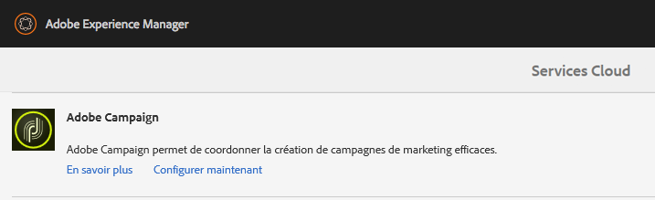

# Intégrer à Adobe Campaign Standard{#integrating-with-adobe-campaign-standard}

>[!CAUTION]
>
>AEM 6.4 a atteint la fin de la prise en charge étendue et cette documentation n’est plus mise à jour. Pour plus d’informations, voir notre [période de support technique](https://helpx.adobe.com/fr/support/programs/eol-matrix.html). Rechercher les versions prises en charge [here](https://experienceleague.adobe.com/docs/?lang=fr).

>[!NOTE]
>
>Cette documentation décrit comment intégrer AEM à Adobe Campaign Standard, la solution par abonnement. Si vous utilisez Adobe Campaign 6.1, reportez-vous à la section [Intégration à Adobe Campaign 6.1](/help/sites-administering/campaignonpremise.md) pour ces instructions.

Adobe Campaign vous permet de gérer le contenu et les formulaires de diffusion email directement dans Adobe Experience Manager.

Pour utiliser les deux solutions ensemble, vous devez d’abord les configurer pour les connecter l’une à l’autre. Cela implique certaines étapes de configuration à la fois dans Adobe Campaign et dans Adobe Experience Manager, Ces étapes sont décrites en détail dans ce document.

L’utilisation d’Adobe Campaign dans AEM inclut la possibilité d’envoyer des courriers électroniques et des formulaires via Adobe Campaign. Elle est décrite à la section [Utilisation d’Adobe Campaign](/help/sites-authoring/campaign.md).

En outre, les rubriques suivantes peuvent être utiles lors de l’intégration d’AEM avec [Adobe Campaign](https://docs.campaign.adobe.com/doc/standard/fr/home.html) :

* [Bonnes pratiques relatives aux modèles d’e-mail](/help/sites-administering/best-practices-for-email-templates.md)
* [Résolution des incidents liés à votre intégration Adobe Campaign](/help/sites-administering/troubleshooting-campaignintegration.md)

Si vous étendez votre intégration à Adobe Campaign, vous pouvez consulter les pages suivantes :

* [Création d’extensions personnalisées](/help/sites-developing/extending-campaign-extensions.md)
* [Création de mappages de formulaires personnalisés](/help/sites-developing/extending-campaign-form-mapping.md)

## Configuration d’Adobe Campaign {#configuring-adobe-campaign}

La configuration d’Adobe Campaign implique les opérations suivantes :

1. Configuration de la variable **aemserver** utilisateur.
1. Créer un compte externe dédié.
1. Vérification de l’option AEMResourceTypeFilter.
1. Créer un modèle de diffusion dédié.

>[!NOTE]
>
>Pour effectuer ces opérations, vous devez posséder le rôle d’**administration** dans Adobe Campaign.

### Prérequis {#prerequisites}

Assurez-vous préalablement que vous disposez des éléments suivants :

* [Une instance de création AEM](/help/sites-deploying/deploy.md#getting-started)
* [Une instance de publication AEM](/help/sites-deploying/deploy.md#author-and-publish-installs)
* [Une instance Adobe Campaign](https://docs.adobe.com/content/docs/fr/campaign/ACS.html)

>[!CAUTION]
>
>Les opérations décrites en détail dans les sections [Configuration d’Adobe Campaign](#configuring-adobe-campaign) et [Configuration d’Adobe Experience Manager](#configuring-adobe-experience-manager) sont nécessaires au bon fonctionnement des fonctionnalités d’intégration entre AEM et Adobe Campaign.

### Configuration de l’utilisateur aemserver {#configuring-the-aemserver-user}

L’utilisateur **aemserver** doit être configuré dans Adobe Campaign. **aemserver** est un utilisateur technique utilisé pour connecter le serveur AEM à Adobe Campaign.

Accédez à **Administration **> **Utilisateurs et sécurité** > **Utilisateurs** et sélectionnez l’utilisateur **aemserver**. Cliquez dessus pour ouvrir les paramètres utilisateur.

* Vous devez définir un mot de passe pour cet utilisateur. Cette opération ne peut pas être effectuée via l’interface utilisateur. Cette configuration doit être effectuée dans REST par un administrateur technique.
* Vous pouvez attribuer des rôles spécifiques à cet utilisateur, par exemple **deliveryPrepare** qui permet à l’utilisateur de créer et de modifier les livraisons.

### Configuration d’un compte externe Adobe Experience Manager {#configuring-an-adobe-experience-manager-external-account}

Vous devez configurer un compte externe qui vous permet de connecter Adobe Campaign à votre instance AEM.

>[!NOTE]
>
>Dans AEM, veillez à définir le mot de passe de l’utilisateur distant d’Adobe Campaign. Vous devez définir ce mot de passe pour connecter Adobe Campaign à AEM. Connectez-vous en tant qu’administrateur et dans la console d’administration des utilisateurs, recherchez l’utilisateur distant campaign et cliquez sur **Définir mot de passe**.

Pour configurer un compte externe AEM :

1. Accédez à **Administration** > **Paramètres d’application** > **Comptes externes**.

   

1. Sélectionnez le compte externe **aemInstance** par défaut ou créez-en un en cliquant sur le bouton **Créer**.
1. Sélectionnez **Adobe Experience Manager** dans le champ **Type** et saisissez les paramètres d’accès utilisés pour votre instance de création AEM : adresse du serveur, nom du compte et mot de passe du serveur.

   >[!NOTE]
   >
   >Veillez à ne pas ajouter de barre oblique **/** à la fin de l’URL ou la connexion ne fonctionnera pas.

1. Assurez-vous que la case **Activé** est cochée, puis cliquez sur **Enregistrer** pour enregistrer vos modifications.

### Vérification de l’option AEMResourceTypeFilter {#verifying-the-aemresourcetypefilter-option}

L’option **AEMResourceTypeFilter** est utilisée pour filtrer les types de ressources AEM qui peuvent être utilisées dans Adobe Campaign. Cela permet à Adobe Campaign de récupérer AEM contenu spécialement conçu pour être utilisé dans Adobe Campaign uniquement.

Cette option est préconfigurée ; toutefois, si vous modifiez cette option, il se peut qu’elle ne fonctionne pas.

Pour vérifier que l’option **AEMResourceTypeFilter** est configurée :

1. Accédez à **Administration** > **Paramètres d’application** > **Options**.
1. Dans la liste, vous pouvez vous assurer que l’option **AEMResourceTypeFilter** est répertoriée et que les chemins sont corrects.

### Création d’un modèle de diffusion email spécifique à AEM {#creating-an-aem-specific-email-delivery-template}

Par défaut, la fonction AEM n’est pas activée dans les modèles de courrier électronique Adobe Campaign. Vous pouvez configurer un nouveau modèle de diffusion email qui sera utilisé pour créer des emails avec du contenu AEM.

Pour créer un modèle de diffusion email spécifique à AEM :

1. Accédez à **Ressources** > **Modèles** > **Modèles de diffusion**.
1. **Activez la sélection** en cliquant sur l’icône en forme de coche dans la barre d’actions et en sélectionnant le modèle par défaut **E-mail standard (courrier)** existant, puis dupliquez-le en cliquant sur l’icône **Copier** et sur **Confirmer**.
1. Désactivez le mode de sélection en cliquant sur la croix **x** et ouvrez le modèle **Copie d’e-mail standard (courrier)** que vous venez de créer, puis choisissez **Modifier les propriétés** dans la barre d’actions du tableau de bord de modèle.

   Vous pouvez modifier le **libellé** du modèle.

1. Dans la section **Contenu** des propriétés, modifiez la **source de contenu** en **Adobe Experience Manager**. Sélectionnez ensuite le compte externe créé précédemment et cliquez sur **Confirmer**.

   Enregistrez vos modifications en cliquant sur **Confirmer** et sur **Enregistrer.**

   La fonction de contenu AEM sera activée pour les livraisons d’e-mail créées à partir de ce modèle.

   

## Configuration d’Adobe Experience Manager {#configuring-adobe-experience-manager}

Pour configurer AEM, procédez comme suit :

* Configurez la réplication entre les instances.
* Connectez AEM à Adobe Campaign.
* Configurez l’externaliseur.

### Configuration de la réplication entre les instances AEM {#configuring-replication-between-aem-instances}

Le contenu créé à partir de l’instance de création AEM est d’abord envoyé à l’instance de publication. Cette instance de publication transfère ensuite le contenu vers Adobe Campaign. L’agent de réplication doit donc être configuré pour répliquer de l’instance de création AEM vers l’instance de publication AEM.

>[!NOTE]
>
>Si vous ne souhaitez pas utiliser l’URL de réplication, mais plutôt l’URL destinée au public, vous pouvez définir la variable **URL publique** dans le paramètre de configuration suivant dans OSGi (**Outils** > **Console web** > **Configuration OSGi > Intégration AEM Campaign - Configuration**) :
**Adresse URL publique :** com.day.cq.mcm.campaign.impl.IntegrationConfigImpl#aem.mcm.campaign.publicUrl

Cette étape est également nécessaire pour répliquer certaines configurations d’instance de création dans l’instance de publication.

Pour configurer la réplication entre les instances AEM :

1. Dans l’instance de création, sélectionnez **Logo AEM**> **Icône Outils ** > **Déploiement** > **Réplication** > **Agents sur l’auteur**, puis cliquez sur **Agent par défaut**.

   

   >[!NOTE]
   Évitez d’utiliser l’hôte local localhost (il s’agit d’une copie locale d’AEM) lors de la configuration de votre intégration avec Adobe Campaign, à moins que les instances de publication et de création se trouvent toutes deux sur le même ordinateur.

1. Cliquez sur **Modifier** et sélectionnez ensuite l’onglet **Transfert**.
1. Configurez l’URI en remplaçant **localhost** par l’adresse IP ou l’adresse de l’instance de publication AEM.

   

### Connexion d’AEM à Adobe Campaign {#connecting-aem-to-adobe-campaign}

Avant de pouvoir utiliser AEM et Adobe Campaign ensemble, vous devez établir le lien entre les deux solutions afin qu’elles puissent communiquer.

1. Connectez-vous à votre instance de création AEM.
1. Sélectionnez **Outils** > **Opérations** > **Cloud** > **Services cloud**, puis **Configurer maintenant** dans la section Adobe Campaign.

   

1. Créez une configuration en saisissant un **titre**, puis cliquez sur **Créer**, ou sélectionnez la configuration existante que vous souhaitez lier à votre instance Adobe Campaign.
1. Modifiez la configuration afin qu’elle corresponde aux paramètres de votre instance Adobe Campaign.

   * **Nom d’utilisateur** : **aemserver**, l’opérateur du package d’intégration AEM Adobe Campaign utilisé pour établir la liaison entre les deux solutions.
   * **Mot de passe** : mot de passe de l’opérateur aemserver Adobe Campaign. Vous devrez peut-être préciser à nouveau le mot de passe de cet opérateur directement dans Adobe Campaign.
   * **Point de terminaison API**: URL de l’instance Adobe Campaign.

1. Sélectionnez **Se connecter à Adobe Campaign** et cliquez sur **OK**.

   

   >[!NOTE]
   Après avoir [créé et publié votre e-mail](/help/sites-authoring/campaign.md), vous devez republier la configuration sur votre instance de publication.

   

>[!NOTE]
Si la connexion échoue, vérifiez les points suivants :
* Vous pouvez rencontrer un problème de certificat lorsque vous utilisez une connexion sécurisée sur une instance Adobe Campaign (https). Vous devez ajouter le certificat d’instance Adobe Campaign au fichier **cacerts** de votre JDK.
* En outre, voir [Résolution des problèmes liés à votre intégration AEM/Adobe Campaign](/help/sites-administering/troubleshooting-campaignintegration.md).
>

### Configuration de l’externaliseur {#configuring-the-externalizer}

Vous devez [configurer l’externaliseur](/help/sites-developing/externalizer.md) dans AEM sur votre instance de création. L’externaliseur est un service OSGi qui vous permet de transformer un chemin de ressources en une URL absolue externe. Ce service fournit un emplacement central pour configurer ces URL externes et les créer.

Pour des instructions générales, voir [Configuration de l’externaliseur](/help/sites-developing/externalizer.md). Pour l’intégration d’Adobe Campaign, veillez à configurer le serveur de publication sur l’adresse `https://<host>:<port>/system/console/configMgr/com.day.cq.commons.impl.ExternalizerImpl` de façon à ce qu’il ne pointe pas vers `localhost:4503`, mais vers un serveur accessible par la console Adobe Campaign.

S’il pointe vers `localhost:4503` ou sur un autre serveur auquel Adobe Campaign ne parvient pas à se connecter, les images ne s’affichent pas dans la console Adobe Campaign.

