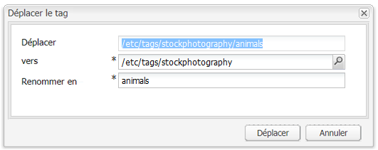

# Console Balisage de l’interface utilisateur (IU) classique{#classic-ui-tagging-console}

Cette section est réservée à la console Balisage de l’interface utilisateur classique.

La console Balisage de l’interface utilisateur optimisée pour les écrans tactiles se trouve [ici](/help/sites-administering/tags.md#tagging-console).

Pour accéder à la console Balisage de l’interface utilisateur classique :

* en mode de création
* Connectez-vous avec des droits d’administrateur.
* accéder à la console

   for example, [http://localhost:4502/tagging](http://localhost:4502/tagging)

## Créations de balises et d’espaces de noms {#creating-tags-and-namespaces}

1. En fonction du niveau de départ, vous pouvez créer une balise ou un espace de noms à l’aide de l’option **Nouveau** :

   Si vous sélectionnez **Balises**, vous pouvez créer un espace de noms :

   

   Si vous sélectionnez un espace de noms (**Demo**, par exemple), vous pouvez y créer une balise :

   

1. Dans les deux cas, saisissez

   * **Titre**
(
*Obligatoire*) Titre d’affichage de la balise. Bien que n&#39;importe quel caractère puisse être saisi,

      il est recommandé de ne pas utiliser ces caractères spéciaux :

      * `colon (:)` - Délimiteur d&#39;espace de nommage
      * `forward slash (/)` - délimiteur de sous-balises

      Si vous saisissez ces caractères, ils ne s’affichent pas.

   * **Nom**

      (*Required*) The node name for the tag.

   * **Description**

      (*facultatif*) Description de la balise.

   * Sélectionnez **Créer**.

## Modification de balises {#editing-tags}

1. Dans le volet de droite, sélectionnez la balise à modifier.
1. Cliquez sur **Modifier**.
1. Vous pouvez modifier le **Titre** et la **Description**.
1. Cliquez sur **Enregistrer** pour fermer la boîte de dialogue.

## Suppression de tags {#deleting-tags}

1. Dans le volet de droite, sélectionnez la balise à supprimer.
1. Cliquez sur **Supprimer**.
1. Cliquez sur **Oui** pour fermer la boîte de dialogue.

   La balise ne doit plus figurer dans la liste.

## Activation et désactivation de balises {#activating-and-deactivating-tags}

1. Dans le volet de droite, sélectionnez l’espace de noms ou la balise à activer (publication) ou à désactiver (annulation de la publication).
1. Cliquez sur **Activer** ou **Désactiver**, suivant les besoins.

## Liste : indiquant où les balises sont référencées {#list-showing-where-tags-are-referenced}

L’option **Liste** ouvre une nouvelle fenêtre qui présente les chemins d’accès de toutes les pages utilisant la balise mise en surbrillance :

## Déplacement des balises {#moving-tags}

Pour aider les administrateurs et les développeurs de balises à nettoyer la taxonomie ou à renommer un ID de balise, il est possible de déplacer une balise vers un nouvel emplacement :

1. Ouvrez la console **Tagging**.
1. Sélectionnez le tag et cliquez sur **Déplacer...** dans la barre d’outils supérieure (ou dans le menu contextuel).
1. Dans la boîte de dialogue **Déplacer le tag**, définissez :

   * **vers**, le nœud de destination.
   * **Renommer en**, le nouveau nom du nœud.

1. Cliquez sur **Déplacer**.

La boîte de dialogue **Déplacer le tag** se présente comme suit :

>[!NOTE]
>
>Les créateurs ne doivent pas déplacer les balises ou renommer l’ID de balise. When necessary, Authors should only [change the tag titles](#editing-tags).

## Fusion des balises {#merging-tags}

Il est également possible de recourir à la fusion de balises lorsqu’une taxonomie comporte des doublons. Lorsque la balise A est fusionnée dans la balise B, toutes les pages balisées avec la balise A sont balisées avec la balise B, et la balise A n’est plus disponible pour les auteurs.

Pour fusionner un tag dans un autre :

1. Ouvrez la console **Tagging**.
1. Sélectionnez le tag et cliquez sur **Fusionner...** dans la barre d’outils supérieure (ou dans le menu contextuel).
1. Dans la boîte de dialogue **Fusionner le tag**, définissez :

   * **en**, le nœud de destination.

1. Cliquez sur **Fusionner**.

The **Merge Tag** dialog looks as follows:

## Compte d’utilisation des balises {#counting-usage-of-tags}

Pour afficher le nombre d’utilisations d’un tag :

1. Ouvrez la console **Tagging**.
1. Cliquez sur **Compteur d’utilisations** dans la barre d’outils supérieure : la colonne Décompte affiche le résultat.

## Gestion de tags dans diverses langues {#managing-tags-in-different-languages}

La propriété facultative `title`   d’une balise peut être traduite en plusieurs langues. Tag `titles` can then be displayed according to the user language or to the page language.

### Définition de titres de balises dans plusieurs langues {#defining-tag-titles-in-multiple-languages}

The following procedure shows how to translate the `title`of the tag **Animals** into English, German and French:

1. Go to the **Tagging** console.
1. Edit the tag **Animals** below **Tags** > **Stock Photography**.
1. Ajoutez les traductions dans les langues suivantes :

   * **Anglais** : Animals
   * **Allemand** : Tiere
   * **Français** : Animaux

1. Enregistrez les modifications.

La boîte de dialogue se présente comme suit :

La console Balisage utilise la langue du créateur, dès lors, pour la balise « Animals », « Animaux » s’affiche si l’utilisateur définit la langue sur Français dans les propriétés de l’utilisateur.

Pour ajouter une nouvelle langue à la boîte de dialogue, reportez-vous à la section [Ajout d’une langue à la boîte de dialogue Modifier la balise](/help/sites-developing/building.md#adding-a-new-language-to-the-edit-tag-dialog) dans la section **Balisage pour les développeurs**.

### Affichage des titres des balises dans les propriétés de page dans une langue spécifiée {#displaying-tag-titles-in-page-properties-in-a-specified-language}

By default the tag `titles`in the page properties are displayed in the page language. The tag dialog in the page properties has a language field that enables the display of tag `titles`in a different language. The following procedure describes how to display the tag `titles`in French:

1. Refer to the previous section to add the French translation to the **Animals** below **Tags** > **Stock Photography**.
1. Ouvrez les propriétés de la page **Produits** dans la branche English (Anglais) du site **Geometrixx**.
1. Open the **Tags/Keywords** dialog (by selecting the pull-down menu to the right of the Tags/Keywords display area) and select the **French** language from the pull-down menu in the bottom right corner.
1. Scroll using the left-right arrows until able to select the **Stock Photography** tab

   Select the **Animals** (**Animaux**) tag and select outside the dialog to close it and add the tag to the page properties.

   

By default, the Page Properties dialog displays the tag `titles`according to the page language.

En général, la langue de la balise est celle de la page si elle est disponible. Lorsque le [widget](/help/sites-developing/building.md#tagging-on-the-client-side) balise est utilisé dans d’autres cas (formulaires ou boîtes de dialogue, par exemple), la langue da la balise dépend du contexte.

>[!NOTE]
>
>The tag cloud and the meta keywords in the standard page component use the localized tag `titles`based on the page language, if available.

