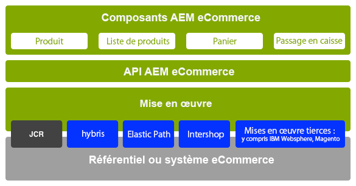
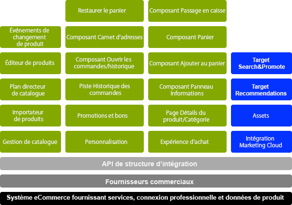
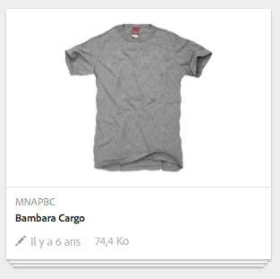
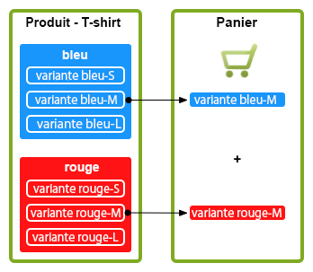
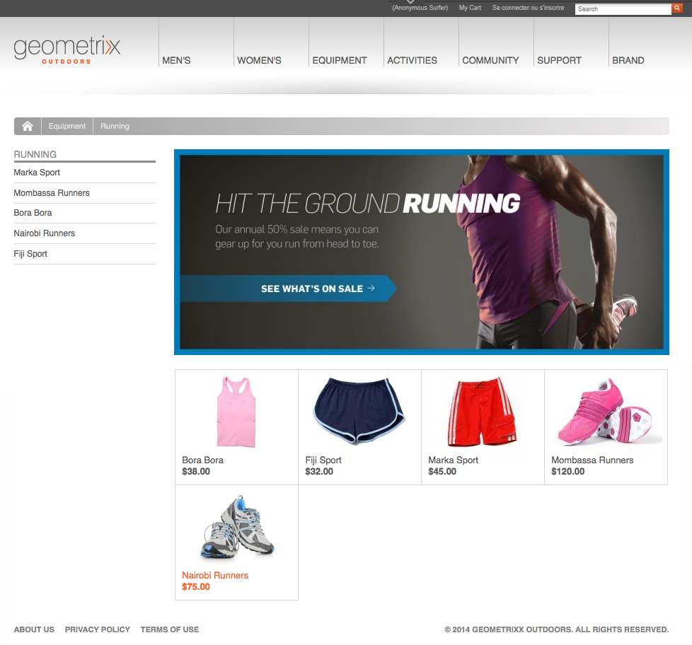
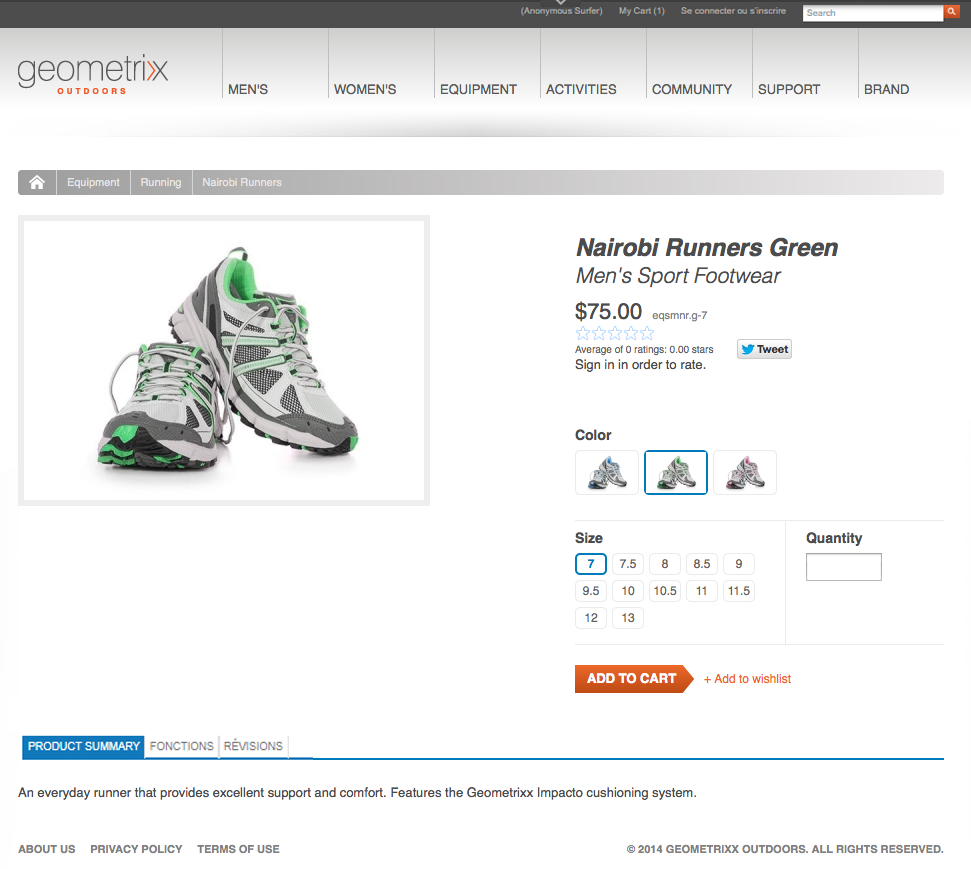
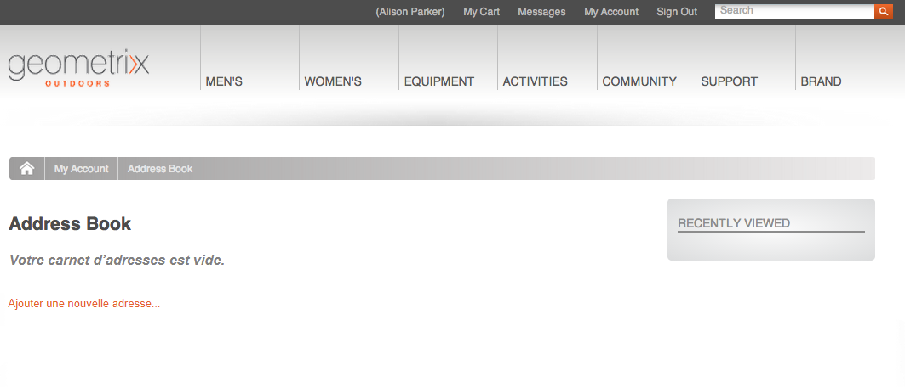
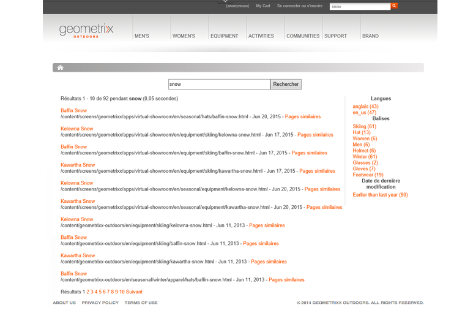

# Concepts{#concepts}

>[!CAUTION]
>
>AEM 6.4 a atteint la fin de la prise en charge étendue et cette documentation n’est plus mise à jour. Pour plus d’informations, voir notre [période de support technique](https://helpx.adobe.com/fr/support/programs/eol-matrix.html). Rechercher les versions prises en charge [here](https://experienceleague.adobe.com/docs/?lang=fr).

La structure d’intégration fournit les mécanismes et les composants pour :

* connexion à un moteur eCommerce
* extraction de données dans AEM
* afficher ces données et collecter les réponses de l’acheteur ;
* renvoi des détails de transaction
* Recherche des données des deux systèmes

Cela signifie que :

* Les acheteurs peuvent s&#39;inscrire et faire leurs achats sans attendre.
* Les acheteurs verront sans délai les changements de prix.
* Vous pouvez ajouter des produits selon vos besoins.

>[!NOTE]
>
>La structure de commerce électronique peut être utilisée avec :
>
>* [Magento](https://www.adobe.io/apis/experiencecloud/commerce-integration-framework/integrations.html#!AdobeDocs/commerce-cif-documentation/master/integrations/02-AEM-Magento.md)
>
>* [SAP Commerce Cloud](/help/sites-administering/sap-commerce-cloud.md)
>
>* [Commerce Cloud Salesforce](https://github.com/adobe/commerce-salesforce)
>

>[!CAUTION]
>
>le [framework d’intégration du e-commerce](https://www.adobe.com/fr/solutions/web-experience-management/commerce.html) est un module complémentaire d’AEM.
>
>Le représentant commercial peut vous donner plus de détails, en fonction du moteur approprié.

>[!CAUTION]
>
>Le framework fournit les exigences de base de votre propre projet.
>
>Un certain travail de développement reste nécessaire pour adapter le framework à vos spécifications.

>[!CAUTION]
>
>L’installation d’AEM standard comprend la mise en oeuvre générique d’AEM eCommerce (JCR).
>
>Il est actuellement prévu à des fins de démonstration ou comme base d’une implémentation personnalisée selon vos besoins.

Pour optimiser le fonctionnement, AEM et le moteur eCommerce se concentrent chacun sur leur propre champ d’expertise. Les informations sont transmises en temps réel entre les deux ; par exemple :

* AEM peut :

   * Requête :

      * Informations sur les produits du moteur eCommerce.
   * Fournissez les détails suivants :

      * Affichages des utilisateurs pour des informations sur les produits, le panier et le passage en caisse.
      * Informations sur le panier et le passage en caisse pour le moteur eCommerce.
      * Optimisation du moteur de recherche (SEO).
      * Fonctionnalités de la communauté.
      * Interactions marketing non structurées.

* Le moteur eCommerce peut :

   * fournir les détails suivants :

      * Informations sur les produits de la base de données.
      * Gestion des variantes de produits.
      * Gestion des commandes.
      * la planification des ressources de l’entreprise (ERP) ;
      * Recherchez dans les informations sur les produits.
   * Processus :

      * Le panier.
      * Le passage en caisse.
      * Exécution des commandes.

>[!NOTE]
>
>Les détails exacts dépendent du moteur eCommerce et de la mise en oeuvre du projet.

Un certain nombre de composants AEM prêts à l’emploi sont proposés pour utiliser la couche d’intégration. Actuellement, il s’agit des éléments suivants :

* Informations sur les produits
* Panier
* Extraction
* Mon compte

Diverses options de recherche sont également disponibles.

## Architecture {#architecture}

La structure d’intégration fournit l’API, une gamme de composants pour illustrer les fonctionnalités et plusieurs extensions pour fournir des exemples de méthodes de connexion :

Le framework vous donne accès à certaines fonctionnalités, comme :

### Mises en œuvre {#implementations}

AEM eCommerce est implémenté avec un moteur eCommerce :

* La structure d’intégration de commerce électronique a été conçue pour permettre d’intégrer facilement un moteur de commerce électronique à AEM. Le moteur eCommerce dédié contrôle les données de produit, les paniers, le passage en caisse et l’exécution des commandes, tandis qu’AEM contrôle l’affichage des données et les campagnes marketing.

>[!NOTE]
>
>L’installation d’AEM standard comprend la mise en oeuvre générique d’AEM eCommerce (JCR).
>
>Il est actuellement prévu à des fins de démonstration ou comme base d’une implémentation personnalisée selon vos besoins.
>
>AEM eCommerce implémenté dans AEM à l’aide d’un développement générique basé sur JCR est :
>
>* Un exemple d’instance AEM eCommerce native autonome illustrant l’utilisation de l’API, qui peut être utilisée pour contrôler des données des produits, les paniers et le passage en caisse conjointement à l’affichage des données existantes et aux campagnes marketing. Dans ce cas, la base de données de produit est stockée dans le référentiel natif d’AEM (mise en oeuvre de l’Adobe de [JCR](https://www.adobe.io/experience-manager/reference-materials/spec/jcr/2.0/index.html)).\
   >  L’installation standard d’AEM contient les éléments de base de la [mise en œuvre générique eCommerce](/help/sites-administering/generic.md).

### Fournisseurs de commerce {#commerce-providers}

Lors de l’importation des données d’un moteur de commerce dans votre site AEM eCommerce, un fournisseur de commerce est utilisé pour fournir des données aux importateurs. Un fournisseur de commerce peut prendre en charge plusieurs importateurs.

Un fournisseur de commerce est AEM code personnalisé pour :

* Interface d’un moteur de commerce principal
* mettre en oeuvre un système de commerce sur le référentiel JCR ;

Deux exemples de fournisseurs de commerce sont actuellement disponibles pour AEM :

* un pour geometrixx-hybris
* autre pour geometrixx-generic (JCR)

Bien qu’un projet doive généralement développer son propre fournisseur de commerce personnalisé spécifique à son PIM et à son schéma de données de produit.

>[!NOTE]
>
>Les importateurs geometrixx utilisent des fichiers CSV ; une description du schéma est acceptée (avec les propriétés personnalisées autorisées) dans les commentaires au-dessus de leur implémentation.

[ProductServicesManager](https://helpx.adobe.com/experience-manager/6-4/sites/developing/using/reference-materials/javadoc/com/adobe/cq/commerce/pim/api/ProductServicesManager.html) conserve (par le biais d’[OSGi](/help/sites-deploying/configuring.md#osgi-configuration-settings)) une liste des mises en œuvre des interfaces [ProductImporter](https://helpx.adobe.com/experience-manager/6-4/sites/developing/using/reference-materials/javadoc/com/adobe/cq/commerce/pim/api/ProductImporter.html) et [CatalogBlueprintImporter. ](https://helpx.adobe.com/experience-manager/6-4/sites/developing/using/reference-materials/javadoc/com/adobe/cq/commerce/pim/api/CatalogBlueprintImporter.html) Celles-ci sont répertoriées dans le champ de liste déroulante **Importateur/Fournisseur de commerce** de l’assistant d’importation (à l’aide de la propriété `commerceProvider` comme nom).

Lorsqu’un importateur/fournisseur de commerce spécifique est répertorié dans la liste déroulante, toutes les données complémentaires dont il a besoin doivent être définies (en fonction du type de l’importateur) dans :

* `/apps/commerce/gui/content/catalogs/importblueprintswizard/importers`
* `/apps/commerce/gui/content/products/importproductswizard/importers`

Le dossier situé sous le dossier `importers` approprié doit correspondre au nom de l’importateur, par exemple :

* `.../importproductswizard/importers/geometrixx/.content.xml`

Le format du fichier d’importation source est défini par l’importateur. L’importateur peut également établir une connexion (WebDAV ou HTTP, par exemple) au moteur de commerce.

## Rôles {#roles}

Le système intégré gère les rôles suivants pour gérer les données :

* Utilisateur de la gestion d’informations sur les produits, qui gère les éléments suivants :

   * Informations sur les produits.
   * Taxonomie, catégorisation, approbation.
   * Interagit avec la gestion des ressources numériques.
   * Tarifs : souvent issus d’un système ERP et qui n’est pas explicitement pris en charge dans le système commercial.

* Auteur/responsable marketing qui conserve :

   * Contenu marketing pour tous les canaux.
   * Promotions.
   * Bons.
   * Campagnes.

* Surfeur/acheteur qui :

   * Affiche les informations sur votre produit.
   * Place les articles dans le panier.
   * Extrait leurs commandes.
   * Attendez-vous à l’exécution de la commande.

Bien que l’emplacement réel puisse dépendre de votre mise en oeuvre ; par exemple, générique ou avec un moteur eCommerce :

## Produits {#products}

### Données de produit par rapport aux données marketing {#product-data-versus-marketing-data}

#### Catégories structurelles ou marketing {#structural-versus-marketing-categories}

Si les deux catégories ci-dessous peuvent être différenciées, vous pouvez créer des adresses URL claires avec une structure significative (arborescences de nœuds `cq:Page`) et, par conséquent, très proche de la gestion de contenu AEM classique :

* Catégories *structurelles*

   Arborescence de catégories définissant *ce qu’est un produit* ; par exemple :

   `/products/mens/shoes/sneakers`

* Catégories *Marketing*

   Toutes les autres catégories auxquelles un *produit peut appartenir*, par exemple :

   `/special-offers/christmas/shoes`)

### Données du produit {#product-data}

Pour représenter et gérer votre produit, vous souhaiterez conserver diverses informations à son sujet.

Les données de produit peuvent être :

* créées directement dans AEM (générique) ;
* gérées dans le moteur eCommerce et mises à disposition dans AEM.

   Selon le type de données, elles sont [synchronisées](#catalog-maintenance-data-synchronization) si nécessaire ou directement accessibles. Par exemple, les données très variables et essentielles, comme les prix des produits, sont extraites du moteur eCommerce pour chaque demande de page afin qu’elles soient toujours à jour.

Dans un cas comme dans l’autre, lorsque les données des produits ont été saisies/importées dans AEM, elles sont visibles dans la console **Produits**. Ici, les modes Carte et Liste d’un produit affichent des informations telles que :

* image
* le code SKU ;
* date de dernière modification

### Variantes de produit {#product-variants}

Pour certains produits, il peut exister des informations sur les variantes. Pour des vêtements par exemple, les différentes couleurs disponibles sont affichées sous forme de variantes :

### Attributs de produit {#product-attributes}

Les différents attributs de produit peuvent dépendre du moteur eCommerce utilisé et de votre mise en œuvre AEM. Elles sont disponibles (le cas échéant) lors de l’affichage de pages de produits et/ou de la modification d’informations sur les produits et peuvent inclure :

* **Image**

   Image du produit.

* **Titre**

   Nom du produit.

* **Description**

   Description textuelle du produit.

* **Balises**

   Balises utilisées pour regrouper des produits associés.

* **Catégorie de ressources par défaut**

   Catégorie par défaut des ressources.

* **Données ERP**

   Informations sur la planification des ressources de l’entreprise.

   * **SKU**

      Informations sur les unités de gestion des stocks (SKU).

   * **Couleur**
   * **Taille**
   * **Prix**

      Prix du produit à l’unité.

* **Résumé**

   Récapitulatif des caractéristiques du produit.

* **Fonctions**

   Informations plus exhaustives des caractéristiques du produit.

### Ressources du produit {#product-assets}

Plusieurs ressources peuvent être disponibles pour différents produits. En général, il s’agit d’images et de vidéos.

## Catalogues {#catalogs}

Un catalogue regroupe des données sur les produits afin de faciliter la gestion et la présentation à l’acheteur. Souvent, un catalogue est structuré selon des attributs tels que la langue, l’espace géographique, la marque, la saison, le loisir, le sport, etc.

### Structure du catalogue {#catalog-structure}

#### Catalogues en plusieurs langues {#catalogs-in-multiple-languages}

AEM prend en charge le contenu du produit en plusieurs langues. Lorsque vous demandez des données, le framework d’intégration extrait la langue de l’arborescence actuelle (par exemple, `en_US` pour les pages sous `/content/geometrixx-outdoors/en_US`).

Pour un magasin multilingue, vous pouvez importer votre catalogue pour chaque arborescence de langue individuellement (ou le copier au moyen de l’option [MSM](/help/sites-administering/msm.md)).

#### Catalogues pour plusieurs marques {#catalogs-for-multiple-brands}

Comme pour les langues, les grandes entreprises multinationales peuvent avoir à couvrir plusieurs marques.

#### Catalogues par balises {#catalogs-by-tags}

Vous pouvez également utiliser des balises pour regrouper des produits dans un catalogue. Ceci permet de générer des catalogues plus dynamiques, par exemple pour les offres saisonnières.

### Configuration du catalogue (importation initiale) {#catalog-setup-initial-import}

Selon votre mise en oeuvre, vous pouvez importer les données de produit requises pour votre catalogue de base dans AEM à partir de :

* un fichier CSV (pour l’implémentation générique) ;
* le moteur eCommerce

### Maintenance du catalogue (synchronisation des données) {#catalog-maintenance-data-synchronization}

D’autres modifications apportées aux données de produit seront inévitables :

* pour l’implémentation générique, ces éléments peuvent être gérés avec l’événement [éditeur de produit](/help/sites-administering/generic.md#editing-product-information)
* Lors de l’utilisation d’un [moteur eCommerce, les modifications doivent être synchronisées](#data-synchronization-with-an-ecommerce-engine-ongoing).

#### Synchronisation des données avec un moteur eCommerce (en cours) {#data-synchronization-with-an-ecommerce-engine-ongoing}

Après l’importation initiale, les modifications apportées aux données de vos produits sont inévitables.

Lorsque vous utilisez un moteur eCommerce, les données des produits y sont conservées et doivent être disponibles dans AEM. Ces données sur les produits doivent être synchronisées en cas de mises à jour.

Cela peut dépendre du type de données :

* A [la synchronisation périodique est utilisée avec un flux de données de modifications.](/help/sites-developing/sap-commerce-cloud.md#product-synchronization-and-publishing).

   De plus, vous pouvez sélectionner des mises à jour spécifiques pour une mise à jour express.

* Des données hautement volatiles, telles que des informations sur les prix, sont récupérées à partir du moteur de commerce pour chaque demande de page, afin de garantir qu’elles sont toujours à jour.

### Catalogues - Performance et mise à l’échelle {#catalogs-performance-and-scaling}

L’importation d’un catalogue volumineux contenant de nombreux produits (plus de 100 000 en général) à partir d’un moteur eCommerce (gestion d’informations sur les produits) peut avoir un impact sur le système en raison du grand nombre de nœuds. Elle peut également ralentir l’instance de création si des ressources (images des produits, par exemple) sont associées aux produits. Cela s’explique par l’utilisation intensive du processeur et de la mémoire lors du post-traitement de ces ressources.

Pour contourner ces problèmes, vous pouvez appliquer l’une des stratégies suivantes :

* [Compartimentage](#bucketing) : permet de gérer le nombre important de nœuds
* [Déchargement du post-traitement des ressources sur une instance dédiée](#offload-asset-post-processing-to-a-dedicated-instance)
* [Importation exclusive des données des produits](#only-import-product-data)
* [Limitation de l’importation et enregistrements par lots](#import-throttling-and-batch-saves)
* [Test de performance](#performance-testing)
* [Performances – Divers](#performance-miscellaneous)

#### Bucketing {#bucketing}

Si un nœud JCR comporte de nombreux nœuds enfants directs (1 000 et plus, par exemple), des compartiments (dossiers fantômes) sont nécessaires pour s’assurer que les performances ne sont pas affectées. Ils sont générés selon un algorithme lors de l’importation.

Ces compartiments prennent la forme de dossiers fantômes introduits dans la structure de votre catalogue, mais peuvent être configurés de sorte qu’ils ne soient pas visibles dans les URL publiques.

#### Décharger le post-traitement des ressources sur une instance dédiée {#offload-asset-post-processing-to-a-dedicated-instance}

Ce scénario implique la configuration de deux instances d’auteur :

1. Instance de création principale

   Importe des données de produit à partir de la gestion d’informations sur les produits, pour laquelle le post-traitement des chemins d’accès aux ressources est désactivé.

1. Instance de création de gestion des ressources numériques dédiée

   Importe et post-traite des ressources de produit à partir de la gestion d’informations sur les produits, puis réplique ces ressources sur l’instance de création principale pour les utiliser.

#### Importer uniquement des données des produits {#only-import-product-data}

Dans le cas où les produits ne contiennent pas de ressources (images) à importer, vous pouvez importer les données de produit sans être affecté par le post-traitement des ressources.

<!--delete
#### Import Throttling and Batch Saves {#import-throttling-and-batch-saves}

[Import throttling](/help/sites-deploying/scaling.md#import-throttling) and [batch saves](/help/sites-deploying/scaling.md#batch-saves) are two general [scaling](/help/sites-deploying/scaling.md) mechanisms that can help when importing large volumes of data.-->

#### Test de performance {#performance-testing}

Les tests de performance doivent être pris en compte dans les implémentations d’AEM eCommerce :

* Environnement de création :

   L’activité en arrière-plan (une importation, par exemple) peut avoir lieu en même temps que l’activité habituelle de l’utilisateur (modification des pages, par exemple). Même si les performances frontales (en général) bénéficient d’une priorité supérieure, des performances médiocres constatées par les créateurs en ligne peuvent conduire à une frustration susceptible de bloquer une décision de lancement.

* Environnement de publication :

   La réplication est un processus critique, qui permet de s’assurer que le contenu est publié rapidement et facilement, et qui peut être influencé par la façon dont le créateur regroupe le contenu à publier.

* Frontal :

   L’ensemble des invalidations frontales et du cache peut nuire aux performances. Les tests permettent d’éviter ces erreurs.

Veuillez noter que ce test de performance nécessite des connaissances et une analyse de votre cible :

* Volumes de contenu

   * Assets
   * Produits et SKU localisés I18ned

* Activité de l’utilisateur :

   * Modification en bloc
   * Publication en masse
   * Requêtes de recherche intensives

* Processus en arrière-plan

   * Importations
   * Mises à jour de synchronisation (ex. tarification)

* Exigences de maintenance (sauvegarde, optimisation Tar PM, nettoyage de la mémoire d’entrepôt de données, etc.)

#### Performances – Divers {#performance-miscellaneous}

Pour toutes les mises en oeuvre, vous pouvez tenir compte des points suivants :

* En tant que produit, les unités et catégories de gestion des stocks peuvent être nombreuses, essayez d’utiliser le moins de noeuds possible pour modéliser le contenu.

    Plus il y a de nœuds, plus le contenu est flexible (système de paragraphes, par exemple). Cependant, tout est un compromis et avez-vous besoin d’une flexibilité individuelle (par défaut) lors de la manipulation (par exemple) de produits 30 000 ?

* Évitez autant que possible la duplication (voir localisation) ou, lorsque vous le faites, pensez au nombre de noeuds que votre duplication va générer.
* Essayez de baliser votre contenu autant que possible afin de préparer l’optimisation des requêtes.

   Par exemple :

   `/content/products/france/fr/shoe/reebok/pump/46 SKU`

   Doit comporter une balise par niveau de contenu (c’est-à-dire pays, langue, catégorie, marque, produit). Recherche de

   `//element(*,my:Sku)[@country=’france’ and @language=’fr’`

   et

   `@category=’shoe’ and @brand=’reebok’ and @product=’pump’]`

   sera considérablement plus rapide que la recherche de

   `/jcr:root/content/france/fr/shoe/reebok/pump/element(*,my:Sku)`

* Dans votre pile technique, planifiez un modèle et des services d’accès au contenu très adaptés. Il s’agit d’une bonne pratique générale, mais elle est encore plus essentielle, car vous pouvez, dans les phases d’optimisation, ajouter des caches d’application pour les données lues très souvent (et avec lesquelles vous ne souhaitez pas remplir le cache du lot).

   Par exemple, il est habituellement recommandé de mettre en cache la gestion des attributs, car cela concerne les données mises à jour lors de l’importation des produits.
* Envisager d’utiliser [pages proxy](/help/sites-administering/concepts.md#proxy-pages).

### Pages de section du catalogue {#catalog-section-pages}

Les sections du catalogue vous fournissent, par exemple :

* Présentation (image et/ou texte) de la catégorie. Elle peut également être utilisée pour les bannières et les teasers afin de promouvoir des offres spéciales.
* liens vers les produits individuels de cette catégorie
* liens vers les autres catégories

### Pages de produits {#product-pages}

Les pages de produits fournissent des informations exhaustives sur des produits spécifiques. Les mises à jour dynamiques issues de sont également répercutées ; par exemple, les modifications de prix enregistrées dans le moteur eCommerce.

Les pages de produit sont AEM pages qui utilisent la variable **Produit** composant; par exemple, dans la variable **Commerce Product** modèle :

Le composant Produit fournit les éléments suivants :

* Informations générales sur les produits, dont le texte et les images.
* Tarification : cette opération est généralement extraite du moteur eCommerce chaque fois que la page est affichée/actualisée.
* Informations sur les variantes des produits, par exemple, couleur et taille.

Ces informations permettent à l’acheteur de sélectionner les éléments ci-dessous lorsqu’il ajoute un article dans son panier :

* Variantes de couleur et de taille
* Quantité

#### Pages d’entrée de produit {#product-landing-pages}

Il s’agit AEM pages qui fournissent principalement des informations statiques. par exemple, une introduction et un aperçu avec des liens vers les pages produit sous-jacentes.

### Composant de produit {#product-component}

Le composant **Produit** peut être ajouté à une page avec une page parente, qui contient les métadonnées nécessaires (à savoir, chemins d’accès à `cartPage` et à `cartObject`). Sur le site de démonstration Geometrixx Outdoors, il est fourni par `UserInfo.jsp`.

Le **Produit** peut également être personnalisé en fonction de vos besoins.

### Pages de proxy {#proxy-pages}

Les pages proxy sont utilisées pour simplifier la structure du référentiel et optimiser le stockage pour les catalogues volumineux.

La création d’un catalogue utilise dix nœuds par produit, car elle fournit des composants individuels pour chaque produit, que vous pouvez mettre à jour et personnaliser dans AEM. Ce grand nombre de nœuds peut devenir problématique si votre catalogue contient des centaines, voire des milliers de produits. Pour éviter tout problème, vous pouvez créer votre catalogue à l’aide de pages proxy.

Les pages de proxy reposent sur une structure à deux nœuds (`jcr:content` et `cq:Page`), qui ne contient pas de contenu réel de produits. Le contenu est généré lors de la demande, en se référant aux données des produits et au modèle de page.

Ceci présente cependant un inconvénient : Vous ne pourrez pas personnaliser les informations sur vos produits dans AEM, un modèle standard (défini pour votre site) sera utilisé.

>[!NOTE]
>
>Vous ne rencontrerez aucun problème si vous importez un catalogue volumineux sans pages de proxy.
>
>Vous pouvez passer d’une méthode à l’autre à tout moment. Vous pouvez également convertir une sous-section de votre catalogue.

## Promotions et bons {#promotions-and-vouchers}

### Bons {#vouchers}

Les bons sont une méthode éprouvée d’offre de rabais pour inciter les acheteurs à faire un achat et/ou récompenser la fidélité du client.

* Envoi des bons :

   * Code de bon (à saisir dans le panier par l’acheteur).
   * Libellé du bon (à afficher une fois que l’acheteur l’a saisi dans le panier).
   * Un chemin de promotion (qui définit l’action appliquée par le bon).

* Les moteurs de commerce externes peuvent également fournir des bons.

En AEM :

* Un bon est un composant basé sur une page, créé/modifié avec la console Sites web.
* Le composant **Bon** fournit :

   * Un moteur de rendu pour l’administration des bons qui affiche tous les bons actuellement dans le panier.
   * Les boîtes de dialogue de modification (formulaire) pour l’administration (ajout/suppression) des bons.
   * Actions requises pour l’ajout/la suppression de bons dans le panier.

* Les bons n’ont pas leur propre date/heure d’activation et de désactivation, mais utilisent ceux de leurs campagnes parents.

>[!NOTE]
>
>AEM utilise le terme **bon**, synonyme de **coupon**.

### Promotions {#promotions}

Les promotions, ainsi que les bons, vous permettent de réaliser des scénarios tels que :

* Une entreprise fournit des prix personnalisés pour les employés, qui est une liste d’utilisateurs conçue à la main.
* Les clients à long terme bénéficient de remises sur toutes les commandes.
* Un prix de vente offert sur une période bien définie.
* Un client reçoit un bon lorsque sa commande précédente a dépassé un montant spécifique.
* Un client qui achète *product-X* offre une remise sur *product-Y* (paire de produits).

Les promotions ne sont généralement pas gérées par les responsables de l’information sur les produits, mais par les responsables marketing :

* Une promotion est un composant basé sur une page, créé/modifié avec la console Sites web. ``
* Offre de promotions :

   * Une priorité
   * Un chemin de gestionnaire de promotion

* Vous pouvez lier des promotions à une campagne pour définir leur date/heure d’activation/de désactivation.
* Vous pouvez lier des promotions à une expérience pour définir leurs segments.
* Les promotions non connectées à une expérience ne se déclenchent pas seules, mais peuvent toujours être déclenchées par un bon.
* Le composant Promotion contient :

   * rendus et boîtes de dialogue pour l’administration des promotions
   * sous-composants pour le rendu et la modification des paramètres de configuration spécifiques aux gestionnaires de promotion

Dans AEM, les promotions sont également intégrées dans la variable [Campaign Management](/help/sites-authoring/personalization.md):

* a [campaign](/help/sites-authoring/personalization.md) spécifie les heures d’activation/de désactivation
* [expériences](/help/sites-authoring/personalization.md) *dans* la campagne est utilisée pour regrouper des ressources (teaserpages, promotions, etc.) en fonction du segment d’audience auquel elles correspondent.

Une promotion peut être contenue dans une expérience ou directement dans la campagne :

* Si une promotion est contenue dans une expérience, elle peut alors être appliquée automatiquement à un segment d’audience.

   Par exemple, dans l’exemple de site geometrixx-outdoors, la promotion :

   `/content/campaigns/geometrixx-outdoors/big-spender/ordervalueover100/free-shipping`

   se déclenche automatiquement chaque fois que le segment (`ordervalueover100`) est résolu.

* Si une promotion ne s’affiche pas dans une expérience (seulement dans la campagne), elle ne peut pas être appliquée automatiquement à une audience. Cependant, elle peut se déclencher si l’acheteur saisit un bon dans son panier et que ce bon est associé à la promotion.

   Par exemple, la promotion : 

   `/content/campaigns/geometrixx-outdoors/article/10-bucks-off`

   se trouve en dehors d’une expérience et ne se déclenche donc jamais automatiquement (par exemple : en fonction de la segmentation). Elle est, cependant, référencée par les bons qui se trouvent dans différentes expériences dans la campagne concernant l’article. La saisie de ces codes de bon dans le panier déclenche la promotion.

>[!NOTE]
>
>Les [promotions Hybris](https://www.hybris.com/modules/promotion) et les [bons Hybris](https://www.hybris.com/en/modules/voucher) couvrent tout ce qui influence le panier et est lié au prix. Le contenu marketing spécifique à la promotion (comme les bannières, etc.) ne fait pas partie de la promotion Hybris.

## Personnalisation {#personalization}

### Enregistrement et compte des clients {#customer-registration-and-accounts}

Lorsqu’un acheteur s’enregistre, les détails du compte doivent être synchronisés entre AEM et le moteur eCommerce. Les données sensibles sont conservées indépendamment, mais les profils sont partagés :

Le mécanisme exact peut dépendre du scénario :

1. Le compte utilisateur existe sur les deux systèmes :

   1. Aucune action requise.

1. Le compte utilisateur existe uniquement dans AEM :

   1. L’utilisateur sera créé dans le moteur eCommerce avec le même ID de compte et un mot de passe aléatoire qui seront stockés dans AEM.
   1. Le mot de passe aléatoire est nécessaire, car AEM tente de se connecter au moteur eCommerce au premier appel (par exemple, lorsqu’une page de produit est demandée et que le moteur eCommerce est consulté pour le prix). Dans la mesure où cela se produit après la connexion AEM, le mot de passe n’est pas disponible.

1. Le compte utilisateur existe uniquement dans le moteur eCommerce :

   1. Le compte sera créé en AEM avec les mêmes ID et mot de passe de compte.

Lorsque vous utilisez un moteur eCommerce, AEM stocke uniquement l’ID de compte et le mot de passe (éventuellement, un groupe d’utilisateurs). Toutes les autres informations sont stockées dans le moteur eCommerce.

>[!NOTE]
>
>Lors de l’utilisation d’un moteur eCommerce, vous devez vous assurer que les comptes créés pour les utilisateurs qui se connectent à une instance AEM sont répliqués (par exemple via des workflows) vers toute autre instance AEM qui communique avec ce moteur.
>
>Autrement, ces autres instances AEM essaient également de créer des comptes pour les mêmes utilisateurs dans le moteur. Ces actions échouent avec une exception `DuplicateUidException` générée par le moteur.

### Inscription des clients {#customer-sign-up}

Pour que l’acheteur ait accès au panier, il doit généralement s’inscrire. Cela implique un enregistrement (Créer un compte) afin de pouvoir créer un compte spécifique au client.

>[!NOTE]
>
>Un panier et un passage en caisse anonymes sont également pris en charge.

### Connexion client {#customer-sign-in}

Après s’être inscrit, l’acheteur peut se connecter à son compte afin que ses actions puissent faire l’objet d’un suivi et que ses commandes soient exécutées.

### Authentification unique {#single-sign-on}

L’authentification unique (SSO) est fournie, de sorte que les auteurs soient connus dans AEM et dans le système eCommerce sans avoir à se connecter deux fois.

### myAccount {#myaccount}

Les données des transactions du moteur eCommerce sont combinées aux informations personnelles sur l’acheteur. AEM utilise certaines de ces données sous forme de données de profil. L’action d’un formulaire dans AEM réécrit les informations dans le moteur eCommerce.

Il existe une page qui vous permet de gérer facilement les informations de votre compte. Pour y accéder, cliquez sur **Mon compte** dans la partie supérieure d’une page geometrixx ou accédez à `/content/geometrixx-outdoors/en/user/account.html`.

### Carnet d’adresses {#address-book}

Votre site doit stocker diverses adresses, dont les adresses de livraison, de facturation et secondaires. Vous pouvez le mettre en oeuvre à l’aide de formulaires basés sur votre format d’adresse par défaut ou vous pouvez utiliser le composant Carnet d’adresses fourni par AEM.

Ce composant Carnet d’adresses vous permet d’effectuer les opérations suivantes :

* modifier les adresses du livre ;
* sélectionner une adresse du livre pour l’adresse de livraison
* sélectionner une adresse du livre pour l’adresse de facturation ;

Vous pouvez choisir l’adresse que vous souhaitez par défaut.

Pour accéder au composant Carnet d’adresses, sélectionnez la page **Mon compte** en cliquant sur **Carnet d’adresses** ou en accédant à `/content/geometrixx-outdoors/en/user/account/address-book.html`.

Cliquez sur **Ajouter une nouvelle adresse…** pour ajouter une nouvelle adresse à votre carnet d’adresses. Il ouvre un formulaire que vous pouvez remplir, puis cliquez sur **Ajouter une adresse**.

>[!NOTE]
>
>Vous pouvez saisir plusieurs adresses dans votre carnet d’adresses.

Le carnet d’adresses est utilisé lorsque vous passez en caisse votre panier :

Les adresses sont conservées ci-dessous `user_home/profile/addresses`.\
Par exemple, Alison Parker serait enregistrée sous /home/users/geometrixx/aparker@geometrixx.info/profile/addresses.

Vous pouvez définir l’adresse à sélectionner par défaut. Ces informations sont conservées dans le profil de l’acheteur plutôt qu’avec l’adresse. La propriété de profil `address.default` est définie avec le chemin d’accès de l’adresse sélectionnée pour la valeur.

### Tarifs spécifiques au client {#customer-specific-pricing}

Le moteur eCommerce utilise le contexte (essentiellement les informations sur les acheteurs) pour déterminer le prix qu’il détient, puis fournit les informations correctes à AEM.

## Panier et commandes {#shopping-cart-and-orders}

Lorsque l’acheteur effectue des achats, il parcourt les pages de produits et sélectionne des articles qu’il place dans son panier. Lorsqu’il passe en caisse, il peut passer une commande.

### Acheteurs anonymes {#anonymous-shoppers}

Un client anonyme peut :

* Afficher les produits
* Ajout de produits à leur panier
* Effectuer l’extraction pour classer

>[!NOTE]
>
>Selon la configuration des informations d’adresse de votre instance ou l’enregistrement du client, peut être nécessaire avant le passage en caisse.

### Acheteurs enregistrés {#registered-shoppers}

Un client enregistré peut :

* Connexion à leur compte
* Afficher les produits
* Ajout de produits à leur panier
* Effectuer l’extraction pour classer
* Afficher et suivre les commandes précédentes

### Présentation du contenu du panier {#shopping-cart-content-overview}

Le panier fournit :

* un aperçu des éléments sélectionnés ;
* des liens vers des pages de produits pour les articles sélectionnés ;
* la possibilité de :

   * mettre à jour le nombre/la quantité des éléments individuels ;
   * suppression d’éléments individuels

Le panier est enregistré en fonction du moteur utilisé :

* AEM générique stocke le panier dans un cookie.
* Certains moteurs de commerce électronique peuvent stocker le panier dans une session.

Dans un cas comme dans l’autre, les articles restent dans le panier (et peuvent être restaurés) au-delà de la connexion/déconnexion (mais uniquement sur le même ordinateur/dans le même navigateur). Par exemple :

* Parcourez un site en tant qu’utilisateur `anonymous` et ajoutez des articles au panier.
* Connectez-vous en tant qu’`Allison Parker` (son panier est vide).
* Ajoutez des produits à son panier.
* Déconnectez-vous. Le panier affiche les produits de l’utilisateur `anonymous`.

* Reconnectez-vous en tant qu’`Allison Parker`. Ses produits sont restaurés.

>[!NOTE]
>
>Un panier anonyme peut être restauré uniquement sur le même ordinateur/dans le même navigateur.

>[!NOTE]
>
>Il n’est pas recommandé de tester la restauration du contenu du panier avec le compte `admin`, car cela peut créer un conflit avec le compte `admin`du moteur eCommerce (Hybris, par exemple).

>[!NOTE]
>
>hybris peut être configuré pour supprimer les paniers en attente après une période définie.

Avant le passage en caisse, les changements de prix sont répercutés (dans les deux systèmes) au fur et à mesure.

### Informations sur la commande {#order-information}

En fonction de votre mise en oeuvre, les informations relatives à une commande sont conservées dans le moteur eCommerce ou l’AEM, ces informations sont générées par AEM.

Diverses informations sont stockées, notamment :

* **ID de commande**

   Numéro de référence de la commande.

* **Passée**

   Date à laquelle la commande a été passée.

* **Statut**

   Statut de la commande, par exemple, Expédiée.

* **Devise**

   Devise dans laquelle la commande est libellée.

* **Éléments de contenu**

   Liste des éléments triés.

* **Sous-total**

   Coût total des articles commandés.

* **Taxes**

   Montant des taxes dues sur la commande.

* **Expédition**

   Frais d’expédition.

* **Total**

   Valeur totale de la commande : articles commandés, taxes et frais d’expédition.

* **Adresse de facturation**

   Adresse à laquelle la facture doit être envoyée.

* **Jeton de paiement**

   Mode de paiement.

* **Statut du paiement**

   Statut du paiement.

* **Adresse d’expédition**

   Adresse à laquelle les produits doivent être expédiés.

* **Mode d’expédition**

   Mode d’expédition, par exemple, par voie terrestre, maritime ou aérienne.

* **Numéro de suivi**

   Tout numéro de suivi utilisé par le transporteur.

* **Lien de suivi**

   Lien utilisé pour suivre la commande en cours d’expédition.

>[!NOTE]
>
>Les champs utilisés dans l’assistant de création de commande dépendent de la génération de modèles automatique optimisée pour les écrans tactiles définie pour le lieu. Dans l’exemple générique, elle se trouve sous :\
>`/etc/scaffolding/geometrixx-outdoors/order/jcr:content/cq:dialog`

Lorsque la commande est conservée dans AEM, la console Commande affiche les informations ci-dessous pour chaque commande :

* Nombre d’articles dans le panier
* Valeur totale de la commande
* Date à laquelle la commande a été passée
* Statut

### Suivi des commandes {#order-tracking}

Après avoir passé une commande, les acheteurs reviennent souvent à :

* Vérifiez l’état de leur commande.
* Suppression de produits de la commande
* Ajout de produits à la commande

Après réception de la livraison de la commande, les acheteurs peuvent également consulter l’historique des commandes passées sur une période donnée.

L’exécution et le suivi des commandes sont généralement gérés par le moteur eCommerce. Ces informations peuvent être affichées par AEM à l’aide du composant Historique des commandes, qui affiche tous les détails pertinents, dont les bons et les promotions appliqués. Par exemple :

## Passage en caisse {#checkout}

Le passage en caisse est mis en œuvre avec des formulaires AEM standard. Cela permet au responsable marketing de personnaliser l’expérience avec le contenu marketing.

Le commerce électronique gère ensuite le processus de passage en caisse avec les entrées des formulaires AEM.

### Sécurité des paiements {#payment-security}

Les informations de paiement, dont les informations de carte de crédit, sont généralement gérées par le moteur eCommerce. AEM transfère ces informations sur les transactions au moteur (d’où elles sont ensuite transférées à un service de traitement des paiements).

La complaisance du secteur des cartes de paiement (PCI) peut être obtenue.

### Confirmation de commande {#confirmation-of-order}

La commande est confirmée à l’écran et peut être suivie grâce au [suivi des commandes](#order-tracking).

## Rechercher {#search-features}

Dans la mesure où AEM utilise des pages standard pour les produits, vous pouvez utiliser le composant de recherche standard afin de créer une page de recherche.

Si vous avez besoin d’une mise en oeuvre plus approfondie, vous pouvez effectuer l’une des opérations suivantes :

* Étendez le composant de recherche par défaut avec les fonctionnalités dont vous avez besoin.
* mettre en œuvre la méthode de recherche de `CommerceService`, puis utiliser le composant de recherche eCommerce sur votre page de recherche.

Lorsque vous utilisez un moteur eCommerce, l’API de recherche eCommerce peut être totalement mise en œuvre dans la solution du moteur eCommerce afin que vous puissiez utiliser le composant de recherche eCommerce fourni. La recherche à facette permet d’effectuer une recherche dans JCR et/ou dans le moteur :
