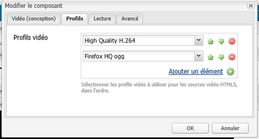

# Configuration du composant vidéo {#configure-the-video-component}

Le [Composant vidéo](/help/sites-authoring/default-components-foundation.md#video) vous permet de placer un élément vidéo prêt à l’emploi prédéfini sur votre page.

Pour qu’un transcodage correct se produise, votre administrateur doit [Installation de FFmpeg et configuration des AEM](#install-ffmpeg) séparément. Vous pouvez aussi [configurer vos profils vidéo](#configure-video-profiles) pour les utiliser avec les éléments HTML5.

>[!CAUTION]
>
>Ce composant n’est plus censé fonctionner sans nécessiter une personnalisation détaillée au niveau du projet.

## Configuration des profils vidéo {#configure-video-profiles}

Vous pouvez définir des profils vidéo à utiliser pour les éléments HTML5. Les profils vidéo sélectionnés ici sont utilisés dans l’ordre. Pour y accéder, utilisez le [mode de conception](/help/sites-authoring/default-components-designmode.md) (interface utilisateur classique uniquement) et sélectionnez l’onglet **[!UICONTROL Profils]** :



Vous pouvez également configurer la conception des composants vidéo et des paramètres pour [!UICONTROL Lecture], [!UICONTROL Flash], et [!UICONTROL Avancé].

## Installation de FFmpeg et configuration d’AEM {#install-ffmpeg}

Le composant vidéo repose sur le produit Open Source tiers FFmpeg pour le transcodage correct des vidéos qui peuvent être téléchargées à partir de [https://ffmpeg.org/](https://ffmpeg.org/). Après avoir installé FFmpeg, vous devez configurer AEM pour pouvoir utiliser un codec audio et des options d’exécution spécifiques.

**Pour installer FFmpeg pour votre plateforme**:

* **Sous Windows :**

   1. Téléchargez le fichier binaire compilé en tant que `ffmpeg.zip`
   1. Décompressez-le dans un dossier.
   1. Définissez la variable d’environnement système `PATH` à `<*your-ffmpeg-locatio*n>\bin`
   1. Redémarrez AEM.

* **Sur Mac OS X :**

   1. Installer Xcode ([https://developer.apple.com/technologies/tools/xcode.html](https://developer.apple.com/technologies/tools/xcode.html))
   1. Installez XQuartz/X11.
   1. Installation de MacPorts ([https://www.macports.org/](https://www.macports.org/))
   1. Dans la console, exécutez la commande suivante et suivez les instructions :

      `sudo port install ffmpeg`

      `FFmpeg` must be in `PATH` AEM peut donc le récupérer via la ligne de commande.

* **Utilisation de la version précompilée d’OS X 10.6 :**

   1. Téléchargez la version précompilée.
   1. Extrayez-le dans le `/usr/local` répertoire .
   1. Depuis le terminal, exécutez :

      `sudo ln -s /usr/local/Cellar/ffmpeg/0.6/bin/ffmpeg /usr/bin/ffmpeg`

**Pour configurer AEM**:

1. Ouvrez [!UICONTROL CRXDE Lite] dans un navigateur Web. ([http://localhost:4502/crx/de](http://localhost:4502/crx/de))
1. Sélectionnez le nœud `/libs/settings/dam/video/format_aac/jcr:content` et vérifiez que les propriétés du nœud sont les suivantes :

   * audioCodec :

      ```
       aac
      ```

   * customArgs:

      ```
       -flags +loop -me_method umh -g 250 -qcomp 0.6 -qmin 10 -qmax 51 -qdiff 4 -bf 16 -b_strategy 1 -i_qfactor 0.71 -cmp chroma -subq 8 -me_range 16 -coder 1 -sc_threshold 40 -b-pyramid normal -wpredp 2 -mixed-refs 1 -8x8dct 1 -fast-pskip 1 -keyint_min 25 -refs 4 -trellis 1 -direct-pred 3 -partitions i8x8,i4x4,p8x8,b8x8
      ```

1. Pour personnaliser la configuration, créez une superposition dans `/apps/settings/` et déplacez la même structure sous le nœud `/conf/global/settings/`. Elle ne peut pas être modifiée dans le nœud `/libs`. Par exemple, pour recouvrir le chemin `/libs/settings/dam/video/fullhd-bp`, créez-le à l’adresse `/conf/global/settings/dam/video/fullhd-bp`.

   >[!NOTE]
   >
   >Remplacez et modifiez le profile-node entier et pas seulement la propriété ayant besoin d’être modifiée. Ces ressources ne sont pas résolues via SlingResourceMerger.

1. Si vous avez modifié des propriétés, cliquez sur **[!UICONTROL Tout enregistrer]**.

>[!NOTE]
>
>Les modèles de workflow prêts à l’emploi ne sont pas conservés lors de la mise à niveau de votre instance AEM. Adobe recommande de copier les modèles de workflow prêts à l’emploi avant de les modifier. Par exemple, copiez le modèle de Ressource de mise à jour de la gestion des ressources numériques prêt à l’emploi avant de modifier l’étape de transcodage FFmpeg dans le modèle de Ressource de mise à jour de la gestion des ressources numériques afin de choisir des noms de vidéo-profil qui existaient avant la mise à niveau. Ensuite, vous pouvez remplacer le nœud `/apps` pour permettre à AEM de récupérer les modifications personnalisées apportées au modèle prêt à l’emploi.
