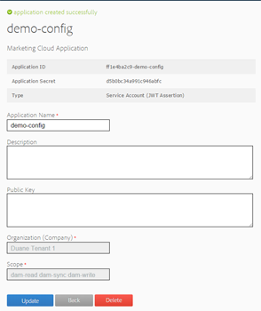
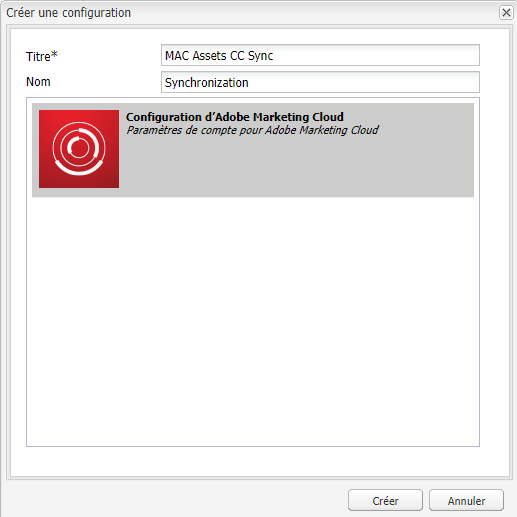
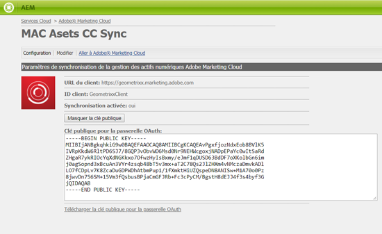

# Configuration de l’intégration d’AEM Assets avec Experience Cloud et Creative Cloud {#configure-aem-assets-integration-with-experience-cloud-and-creative-cloud}

Si vous êtes un client d’Adobe Marketing Cloud, vous pouvez synchroniser vos ressources dans AEM Assets avec Adobe Creative Cloud, et vice versa. Vous pouvez également synchroniser vos ressources avec Experience Cloud et vice versa. Vous pouvez configurer cette synchronisation par le biais d’Adobe I/O.

Le workflow pour configurer cette intégration est le suivant :

1. Créez une authentification dans Adobe I/O à l’aide d’une passerelle publique et obtenez un ID d’application.
1. Créez un profil sur votre instance AEM Assets à l’aide de l’ID d’application.
1. Utilisez cette configuration pour synchroniser vos ressources dans AEM Assets avec Creative Cloud.

En arrière-plan, le serveur AEM authentifie votre profil avec la passerelle, puis synchronise les données entre AEM Assets et Marketing Cloud.

>[!NOTE]
>
>La fonctionnalité de partage de dossiers Adobe Creative Cloud AEM est obsolète. Learn more and find a better method in [AEM and Creative Cloud integration best practices](../assets/aem-cc-integration-best-practices.md). La configuration de la réplication AEM vers Marketing Cloud et l’échange des ressources entre AEM Assets et Marketing Cloud ne sont pas obsolètes.

Flux des données lorsque AEM Assets et Creative Cloud sont intégrés

>[!NOTE]
>
>Le partage de ressources entre Adobe Experience Cloud et Creative Cloud nécessite des privilèges d’administrateur sur l’instance AEM.

>[!CAUTION]
>
>Adobe Maketing Cloud a été rebaptisé Adobe Experience Cloud. Les procédures ci-dessous mentionnent toujours Marketing Cloud afin de refléter l’interface actuelle.

## Création d’une application {#create-an-application}

1. Accédez à l&#39;interface de passerelle Adobe Developer en vous connectant à [https://legacy-oauth.cloud.adobe.io](https://legacy-oauth.cloud.adobe.io/).

   >[!NOTE]
   >
   >Vous devez disposer de droits d’administrateur pour créer un ID d’application.

1. From the left pane, navigate to **[!UICONTROL Developer Tools]** > **[!UICONTROL Applications]** to view a list of applications.
1. Cliquez sur **[!UICONTROL Ajouter]**  pour créer une application.
1. Dans la liste **[!UICONTROL Informations d’identification du client]**, sélectionnez **[!UICONTROL Compte de service (déclaration JWT)]**, qui est un service de communication serveur à serveur pour l’authentification de serveur.

   

1. Spécifiez le nom de l’application et une description facultative.
1. Dans la liste **[!UICONTROL Organisation]**, sélectionnez l’organisation pour laquelle vous souhaitez synchroniser les ressources.
1. From the **[!UICONTROL Scope]** list, select **[!UICONTROL dam-read]**, **[!UICONTROL dam-sync]**, **[!UICONTROL dam-write]**, and **[!UICONTROL cc-share]**.
1. Cliquez sur **[!UICONTROL Créer]**. Un message indique que l’application a été créée.

   

1. Copiez l’**[!UICONTROL ID d’application]** généré pour la nouvelle application.

   >[!CAUTION]
   >
   >Assurez-vous de ne pas copier par inadvertance le **[!UICONTROL secret d’application]** au lieu de l’**[!UICONTROL ID d’application.]**.

## Ajout d’une nouvelle configuration à Marketing Cloud {#add-a-new-configuration-to-marketing-cloud}

1. Cliquez sur le logo AEM sur l’interface utilisateur de votre instance AEM Assets locale et accédez à **[!UICONTROL Outils]** > **[!UICONTROL Déploiement]** > **[!UICONTROL Services cloud hérités]**.

1. Locate the **[!UICONTROL Adobe Marketing Cloud]** service. If no configurations exist, click **[!UICONTROL Configure Now]**. If configurations exist, click **[!UICONTROL Show Configurations]** and click **[!UICONTROL [+]]** to add a new configuration.

   >[!NOTE]
   >
   >Utilisez un compte Adobe ID pourvu de droits d’administrateur pour l’organisation.

1. Dans la boîte de dialogue **[!UICONTROL Créer une configuration]**, indiquez un titre et un nom pour la nouvelle configuration et cliquez sur **[!UICONTROL Créer]**.

   

1. Dans le champ **[!UICONTROL URL du client]**, spécifiez l’URL d’AEM Assets.

   >[!CAUTION]
   >
   >Due to rebranding, if you entered the Tenant URL as **https://&lt;tenant_id>.marketing.adobe.com** you need to change it to **https://&lt;tenant_id>.experiencecloud.adobe.com.** Pour ce faire, procédez comme suit :
   1. Accédez à **Outils > Cloud Services > Ancienne version de Cloud Services**.
   1. Sous Adobe Marketing Cloud, cliquez sur **Afficher les configurations**.
   1. Sélectionnez la configuration créée lors de la configuration de la synchronisation AEM-MAC-CC.
   1. Edit the cloudservice configuration and replace **marketing.adobe.com** in Tenant URL field to **experiencecloud.adobe.com**.
   1. Enregistrez la configuration.
   1. Testez les agents de réplication mac-sync.

1. Dans le champ **[!UICONTROL ID client]**, collez l’ID d’application que vous avez copié à la fin de la procédure [Création d’une application](/help/sites-administering/configure-assets-cc-integration.md#create-an-application).

   

1. Under **[!UICONTROL Synchronization]** select **[!UICONTROL Enabled]** to enable synchronization and click **[!UICONTROL OK]**.

   >[!NOTE]
   Si vous sélectionnez **Désactivé**, la synchronisation opère dans une seule direction.

1. Sur la page de configuration, cliquez sur **[!UICONTROL Afficher la clé publique]** afin d’afficher la clé publique générée pour votre instance. Alternatively, click **[!UICONTROL Download Public Key for OAuth Gateway]** to download the file containing the public key. Ouvrez ensuite le fichier pour afficher la clé publique.

## Activation de la synchronisation {#enable-synchronization}

1. Display the public key using one of the following methods mentioned in the last step of the procedure [Add a new configuration to Marketing Cloud](/help/sites-administering/configure-assets-cc-integration.md#add-a-new-configuration-to-marketing-cloud). Cliquez sur **[!UICONTROL Afficher la clé publique]**.

   

1. Copiez la clé publique et collez-la dans le champ **[!UICONTROL Clé publique]** de l’interface de configuration de l’application que vous avez créée dans la section [Création d’une application](/help/sites-administering/configure-assets-cc-integration.md#create-an-application).

   

1. Cliquez sur **[!UICONTROL Mettre à jour]**. Synchronisez vos ressources avec l’instance AEM Assets maintenant.

## Test de la synchronisation {#test-the-synchronization}

1. Click the AEM logo on the user interface of your local AEM Assets instance and navigate to **[!UICONTROL Tools]**> **[!UICONTROL Deployment]**> **[!UICONTROL Replication]**to locate the replication profiles created for synchronization.
1. On the **[!UICONTROL Replication]** page, click **[!UICONTROL Agents on author]**.
1. Dans la liste des profils, cliquez sur le profil de réplication par défaut de votre organisation pour l’ouvrir.
1. Dans la boîte de dialogue, cliquez sur **[!UICONTROL Tester la connexion]**.

   

1. Une fois le test de réplication terminé, recherchez le message de réussite à la fin des résultats des tests.

## Ajout d’utilisateurs à Marketing Cloud {#add-users-to-marketing-cloud}

1. Connectez-vous à Marketing Cloud avec les informations d’identification de l’administrateur.
1. From the rails, go to **[!UICONTROL Administration]**and then click/tap **[!UICONTROL Launch Enterprise Dashboard]**.
1. Sur le rail, cliquez sur **[!UICONTROL Utilisateurs]** pour ouvrir la page **[!UICONTROL Gestion des utilisateurs]**.
1. Dans la barre d’outils, cliquez/appuyez sur **Ajouter** .
1. Ajoutez un ou plusieurs utilisateurs auxquels vous souhaitez offrir la possibilité de partager des ressources avec Creative Cloud.

   >[!NOTE]
   Seuls les utilisateurs que vous ajoutez à Marketing Cloud peuvent partager des ressources depuis AEM Assets vers Creative Cloud.

## Échange de ressources entre AEM Assets et Marketing Cloud {#exchange-assets-between-aem-assets-and-marketing-cloud}

1. Connectez-vous à AEM Assets.
1. Dans la console Assets, créez un dossier et téléchargez des ressources vers ce dossier. Par exemple, créez un dossier **mc-demo** et téléchargez une ressource vers ce dossier.
1. Select the folder and click **Share** .
1. Dans le menu, sélectionnez **[!UICONTROL Adobe Marketing Cloud]**, puis cliquez sur **[!UICONTROL Partagé]**. Un message indique que le dossier est partagé avec Marketing Cloud.

   

   >[!NOTE]
   Partager un dossier de ressources du type `sling:OrderedFolder` n’est pas pris en charge dans le cadre du partage dans Adobe Marketing Cloud. Si vous souhaitez partager un dossier, lors de sa création dans AEM Assets, ne sélectionnez pas l’option **[!UICONTROL Ordre]**.

1. Actualisez l’interface utilisateur AEM Assets. Le dossier que vous avez créé dans la console Ressources de votre instance AEM Assets locale est copié dans l’interface utilisateur du Marketing Cloud. La ressource que vous téléchargez dans le dossier en AEM Assets s’affiche dans la copie du dossier dans le Marketing Cloud après son traitement par le serveur AEM.
1. Vous pouvez également télécharger une ressource dans la copie répliquée du dossier dans Marketing Cloud. Une fois qu’elle a été traitée, la ressource s’affiche dans le dossier partagé dans AEM Assets.

## Échange de ressources entre AEM Assets et Creative Cloud {#exchange-assets-between-aem-assets-and-creative-cloud}

AEM Assets permet de partager des dossiers comportant des ressources avec les utilisateurs d’Adobe Creative Cloud.

1. Dans la console Assets, sélectionnez le fichier à partager avec Creative Cloud.
1. Dans la barre d’outils, cliquez sur **[!UICONTROL Partager]** les .
1. From the list, select the **[!UICONTROL Adobe Creative Cloud]** option.

   >[!NOTE]
   Les options sont disponibles pour les utilisateurs possédant des autorisations de lecture sur la racine. Les utilisateurs doivent bénéficier de l’autorisation requise pour accéder aux informations de l’agent de réplication de Marketing Cloud.

1. In the **[!UICONTROL Creative Cloud Sharing]** page, add the user to share the folder with and choose a role for the user. Click **[!UICONTROL Save]** and click **[!UICONTROL OK]**.

1. Connectez-vous à Creative Cloud avec les informations d’identification de l’utilisateur avec lequel vous avez partagé le dossier. Le dossier partagé est disponible dans Creative Cloud.

La synchronisation AEM Assets-Marketing Cloud est conçue de manière à ce que l’instance de machine utilisateur à partir de laquelle la ressource est téléchargée conserve le droit de modifier la ressource. Seules ces modifications sont propagées vers l’autre instance.

Par exemple, si une ressource est téléchargée d’une instance AEM Assets (sur site), les modifications apportées à la ressource à partir de cette instance sont propagées à l’instance Marketing Cloud. Cependant, les modifications effectuées de l’instance de Marketing Cloud à la même ressource ne sont pas propagées à l’instance AEM et vice versa pour la ressource téléchargée à partir du Marketing Cloud.

>[!MORELIKETHIS]
* [Meilleures pratiques d’intégration d’AEM et de Creative Cloud](../assets/aem-cc-integration-best-practices.md)
* [Meilleures pratiques de partage de dossiers entre AEM et Creative Cloud](../assets/aem-cc-folder-sharing-best-practices.md)

