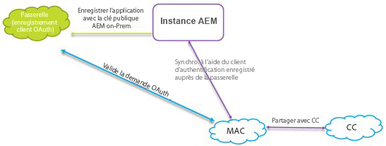
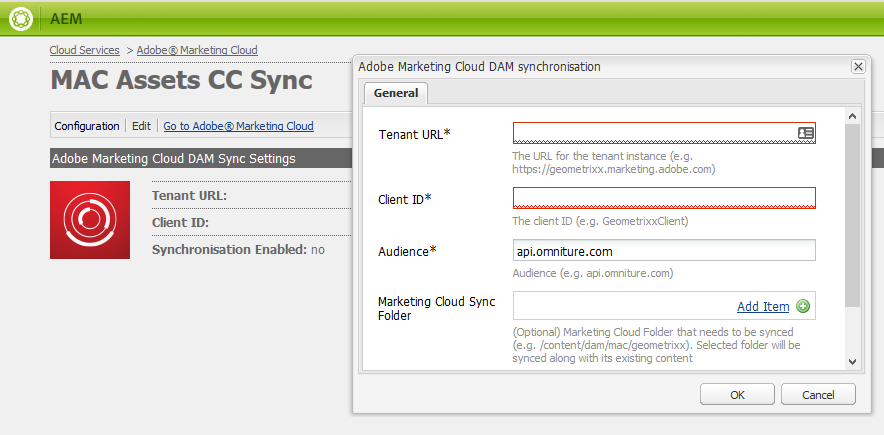

# Configuration de l’intégration AEM Assets avec Experience Cloud {#configure-aem-assets-integration-with-experience-cloud-and-creative-cloud}

Si vous êtes client Adobe Experience Cloud, vous pouvez synchroniser vos ressources dans Adobe Experience Manager Assets avec Adobe Creative Cloud, et vice versa. Vous pouvez également synchroniser vos ressources avec Experience Cloud et vice versa. Vous pouvez configurer cette synchronisation via [!DNL Adobe I/O]. Le nom mis à jour de [!DNL Adobe Marketing Cloud] est [!DNL Adobe Experience Cloud].

Le workflow pour configurer cette intégration est le suivant :

1. Créez une authentification dans [!DNL Adobe I/O] à l’aide d’une passerelle publique et obtenez un ID d’application.
1. Créez un profil sur votre instance AEM Assets à l’aide de l’ID d’application.
1. Utilisez cette configuration pour synchroniser vos ressources.

En arrière-plan, le serveur authentifie votre profil avec la passerelle, puis synchronise les données entre AEM Assets et Marketing Cloud.

>[!NOTE]
>
>Cette fonctionnalité est obsolète dans AEM Assets. Recherchez des remplacements dans [Bonnes pratiques d’intégration AEM et Creative Cloud](/help/assets/aem-cc-integration-best-practices.md). Si vous avez des questions, [contactez l’Assistance clientèle Adobe](https://www.adobe.com/account/sign-in.supportportal.html).

<!-- Hiding this for now via cqdoc-16834.

>[!NOTE]
>
>Sharing assets between Adobe Experience Cloud and Adobe Creative Cloud requires administrator privileges on the AEM instance.
-->

## Création d’une application {#create-an-application}

1. Accédez à l&#39;interface de passerelle Adobe Developer en vous connectant à [https://legacy-oauth.cloud.adobe.io](https://legacy-oauth.cloud.adobe.io/).

   >[!NOTE]
   >
   >Vous devez disposer de droits d’administrateur pour créer un ID d’application.

1. Dans le volet de gauche, accédez à **[!UICONTROL Outils de développement]** > **[!UICONTROL Applications]** pour afficher la liste des applications.
1. Cliquez sur **[!UICONTROL Ajouter]**  pour créer une application.
1. Dans la liste **[!UICONTROL Informations d’identification du client]**, sélectionnez **[!UICONTROL Compte de service (déclaration JWT)]**, qui est un service de communication serveur à serveur pour l’authentification de serveur.

   

1. Spécifiez le nom de l’application et une description facultative.
1. Dans la liste **[!UICONTROL Organisation]**, sélectionnez l’organisation pour laquelle vous souhaitez synchroniser les ressources.
1. Dans la liste **[!UICONTROL Portée]**, sélectionnez **[!UICONTROL dam-read]**, **[!UICONTROL dam-sync]**, **[!UICONTROL dam-write]** et **[!UICONTROL cc-share]**.
1. Cliquez sur **[!UICONTROL Créer]**. Un message indique que l’application a été créée.

   

1. Copiez l’**[!UICONTROL ID d’application]** généré pour la nouvelle application.

   >[!CAUTION]
   >
   >Assurez-vous de ne pas copier par inadvertance le **[!UICONTROL secret d’application]** au lieu de l’**[!UICONTROL ID d’application.]**.

## Ajouter une nouvelle configuration à Experience Cloud {#add-a-new-configuration}

1. Cliquez sur le logo AEM sur l’interface utilisateur de votre instance AEM Assets locale et accédez à **[!UICONTROL Outils]** > **[!UICONTROL Déploiement]** > **[!UICONTROL Services cloud hérités]**.

1. Recherchez le service **[!UICONTROL Adobe Experience Cloud]** . S’il n’existe aucune configuration, cliquez sur **[!UICONTROL Configurer maintenant]**. S’il existe des configurations, cliquez sur **[!UICONTROL Afficher les configurations]** et cliquez sur `+` pour ajouter une nouvelle configuration.

   >[!NOTE]
   >
   >Utilisez un compte Adobe ID pourvu de droits d’administrateur pour l’organisation.

1. Dans la boîte de dialogue **[!UICONTROL Créer une configuration]**, indiquez un titre et un nom pour la nouvelle configuration et cliquez sur **[!UICONTROL Créer]**.

   

1. Dans le champ **[!UICONTROL URL du client]**, spécifiez l’URL d’AEM Assets. Auparavant, si l’URL était définie sur `https://<tenant_id>.marketing.adobe.com`, remplacez-la par `https://<tenant_id>.experiencecloud.adobe.com`.

   1. Accédez à **Outils > Cloud Services > Ancienne version de Cloud Services**. Sous Adobe Experience Cloud, cliquez sur **Afficher les configurations**.
   1. Sélectionnez la configuration existante à modifier. Modifiez la configuration et remplacez `marketing.adobe.com` par `experiencecloud.adobe.com`.
   1. enregistrez la configuration. Testez les agents de réplication de synchronisation MAC.

1. Dans le champ **[!UICONTROL ID client]** , collez l’ID d’application que vous avez copié à la fin de la procédure [création d’une application](#create-an-application).

   

1. Sous **[!UICONTROL Synchronisation]** sélectionnez **[!UICONTROL Activé]** pour activer la synchronisation, puis cliquez sur **[!UICONTROL OK]**. Si vous sélectionnez **disabled**, la synchronisation fonctionne dans une seule direction.

1. Sur la page de configuration, cliquez sur **[!UICONTROL Afficher la clé publique]** afin d’afficher la clé publique générée pour votre instance. Vous pouvez également cliquer sur **[!UICONTROL Télécharger la clé publique pour la passerelle OAuth]** pour télécharger le fichier contenant la clé publique. Ouvrez ensuite le fichier pour afficher la clé publique.

## Activation de la synchronisation {#enable-synchronization}

1. Affichez la clé publique à l’aide de l’une des méthodes suivantes mentionnées à la dernière étape de la procédure [ajoutez une nouvelle configuration à Experience Cloud](#add-a-new-configuration). Cliquez sur **[!UICONTROL Afficher la clé publique]**.

1. Copiez la clé publique et collez-la dans le champ **[!UICONTROL Clé publique]** de l’interface de configuration de l’application que vous avez créée dans [créer une application](#create-an-application).

   

1. Cliquez sur **[!UICONTROL Mettre à jour]**. Synchronisez maintenant vos ressources avec l’instance AEM Assets.

## Test de la synchronisation {#test-the-synchronization}

1. Cliquez sur le logo AEM dans l’interface utilisateur de votre instance AEM Assets locale et accédez à **[!UICONTROL Outils]** **[!UICONTROL Déploiement]** **[!UICONTROL Réplication]** pour localiser les profils de réplication créés pour la synchronisation.
1. Sur la page **[!UICONTROL Réplication]**, cliquez sur **[!UICONTROL Agents sur l’auteur]**.
1. Dans la liste des profils, cliquez sur le profil de réplication par défaut de votre organisation pour l’ouvrir.
1. Dans la boîte de dialogue, cliquez sur **[!UICONTROL Tester la connexion]**.

   

1. Une fois le test de réplication terminé, recherchez le message de réussite à la fin des résultats des tests.

## Ajout d’utilisateurs à l’Experience Cloud {#add-users-to-experience-cloud}

1. Connectez-vous à Experience Cloud à l’aide des informations d’identification de l’administrateur.
1. À partir des rails, accédez à **[!UICONTROL Administration]**, puis cliquez sur **[!UICONTROL Lancer Enterprise Dashboard]**.
1. Sur le rail, cliquez sur **[!UICONTROL Utilisateurs]** pour ouvrir la page **[!UICONTROL Gestion des utilisateurs]**.
1. Dans la barre d’outils, cliquez sur **Ajouter** .
1. Ajoutez un ou plusieurs utilisateurs auxquels vous souhaitez offrir la possibilité de partager des ressources avec Creative Cloud.

   >[!NOTE]
   >
   >Seuls les utilisateurs que vous ajoutez à Experience Cloud peuvent partager des ressources d’AEM Assets vers Creative Cloud.

## Échange de ressources entre AEM Assets et Experience Cloud {#exchange-assets-between-aem-and-experience-cloud}

1. Connectez-vous à AEM Assets.
1. Dans la console Assets, créez un dossier et téléchargez des ressources vers ce dossier. Par exemple, créez un dossier **mc-demo** et téléchargez une ressource vers ce dossier.
1. Sélectionnez le dossier et cliquez sur **Partager** .
1. Dans le menu, sélectionnez **[!UICONTROL Adobe Experience Cloud]** et cliquez sur **[!UICONTROL Partager]**. Un message indique que le dossier est partagé avec l’Experience Cloud.

   

   >[!NOTE]
   >
   >Le partage d’un dossier de ressources de type `sling:OrderedFolder` n’est pas pris en charge dans le cadre du partage dans Adobe Experience Cloud. Si vous souhaitez partager un dossier, lors de sa création dans AEM Assets, ne sélectionnez pas l’option **[!UICONTROL Ordre]**.

1. Actualisez l’interface utilisateur d’AEM Assets. Le dossier que vous avez créé dans la console Ressources de votre instance AEM Assets locale est copié dans l’interface utilisateur de l’Experience Cloud. La ressource que vous chargez dans le dossier AEM Assets apparaît dans la copie du dossier dans Experience Cloud après son traitement par le serveur AEM.
1. Vous pouvez également charger une ressource dans la copie répliquée du dossier dans Experience Cloud. Une fois qu’elle a été traitée, la ressource s’affiche dans le dossier partagé dans AEM Assets.

<!-- Removing as per PM guidance via https://jira.corp.adobe.com/browse/CQDOC-16834?focusedCommentId=22881523&page=com.atlassian.jira.plugin.system.issuetabpanels:comment-tabpanel#comment-22881523.
## Exchange assets between AEM Assets and Creative Cloud {#exchange-assets-between-aem-assets-and-creative-cloud}

AEM Assets lets you share folders containing assets with Adobe Creative Cloud users.

1. In the Assets console, select the folder to share with Creative Cloud.
1. From the toolbar, click **[!UICONTROL Share]** .
1. From the list, select the **[!UICONTROL Adobe Creative Cloud]** option.

   >[!NOTE]
   >
   >The options are available for users with read permissions on the root. Users must have the required permission to access the replication agent information of Marketing Cloud.

1. In the **[!UICONTROL Creative Cloud Sharing]** page, add the user to share the folder with and choose a role for the user. Click **[!UICONTROL Save]** and click **[!UICONTROL OK]**.

1. Log on to Creative Cloud with the credentials of the user you shared the folder with. The shared folder is available in Creative Cloud.

The AEM Assets-Marketing Cloud synchronization is designed in a way that the user machine instance from where the asset is uploaded retains the right to modify the asset. Only these changes are propagated to the other instance.

For example, if an asset is uploaded from an AEM Assets (on premises) instance, the changes to the asset from this instance are propagated to the Marketing Cloud instance. However, the changes done from the Marketing Cloud instance to the same asset aren’t propagated to the AEM instance and vice versa for asset uploaded from Marketing Cloud.
-->

>[!MORELIKETHIS]
>
>* [Bonnes pratiques d’intégration des ressources et des Creative Cloud](/help/assets/aem-cc-integration-best-practices.md)
* [Meilleures pratiques de partage de dossiers de ressources vers Creative Cloud](/help/assets/aem-cc-folder-sharing-best-practices.md)

