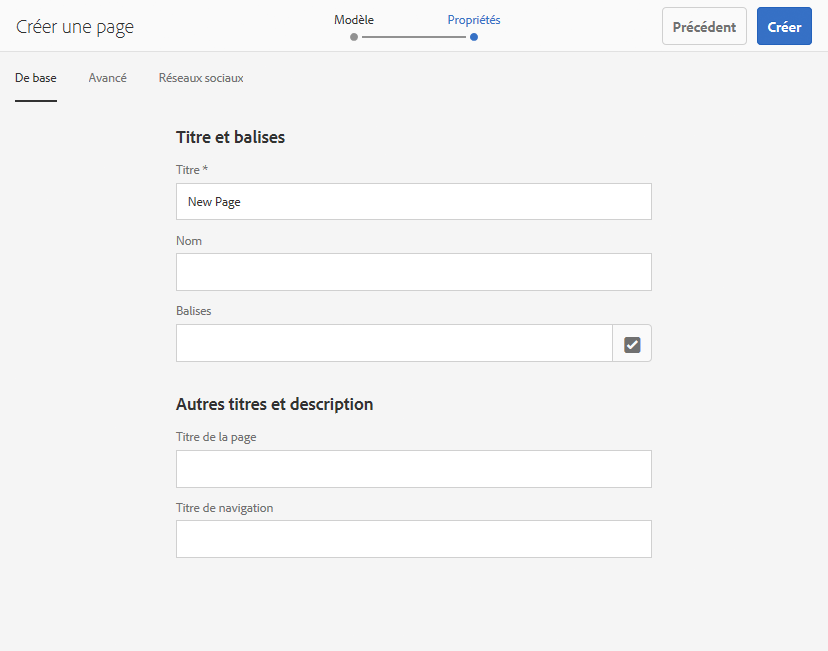
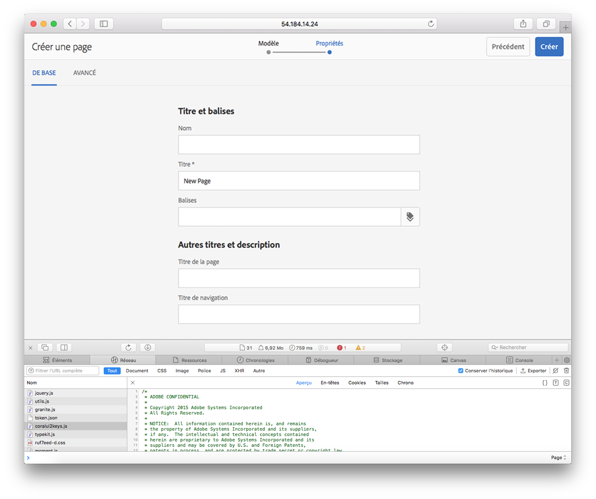
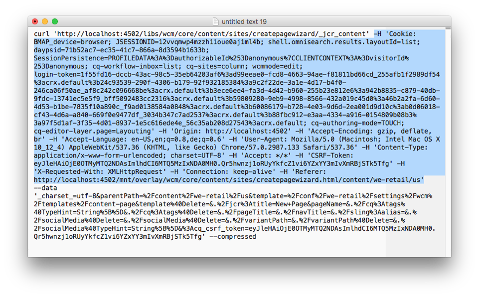

# Utilisation de cURL avec AEM{#using-curl-with-aem}

Les administrateurs ont souvent besoin d’automatiser ou de simplifier des tâches courantes sur un système. Dans AEM, par exemple, la gestion des utilisateurs, l’installation des modules et la gestion des lots OSGi sont des tâches fréquemment effectuées.

En raison de la nature RESTful de le framework Sling sur laquelle repose AEM, pratiquement toutes les tâches peuvent se réduire à l’appel d’une adresse URL. cURL peut être utilisé pour exécuter ce type d’appel d’adresse URL et peut s’avérer un outil utile pour les administrateurs AEM.

## Qu’est-ce que cURL ? {#what-is-curl}

cURL est un outil de ligne de commande Open Source utilisé pour manipuler des adresses URL. Il prend en charge de nombreux protocoles Internet, tels que HTTP, HTTPS, FTP, FTPS, SCP, SFTP, TFTP, LDAP, DAP, DICT, TELNET, FILE, IMAP, POP3, SMTP et RTSP.

Initialement publié en 1997, cURL est un outil bien établi et largement répandu pour obtenir ou envoyer des données en utilisant la syntaxe de l’adresse URL. Le nom « cURL » signifie à l’origine « see URL » (afficher l’adresse URL).

Compte tenu de la nature RESTful de la structure Sling sur laquelle repose AEM, la plupart des tâches peuvent se réduire à l’appel d’une adresse URL, ce que cURL peut exécuter. Les [tâches de manipulation de contenu](/help/sites-administering/curl.md#common-content-manipulation-aem-curl-commands), comme l’activation des pages et le démarrage de workflows, ainsi que les [tâches opérationnelles](/help/sites-administering/curl.md#common-operational-aem-curl-commands), comme la gestion de modules et d’utilisateurs, peuvent être automatisées à l’aide de cURL. De plus, vous pouvez [créer vos propres commandes cURL](/help/sites-administering/curl.md#building-a-curl-ready-aem-command) pour la plupart des tâches dans AEM.

>[!NOTE]
>
>Toute commande AEM exécutée par le biais de cURL doit être autorisée, comme n’importe quel utilisateur, dans AEM. L’ensemble des listes de contrôle d’accès et des droits d’accès sont respectés lors de l’utilisation de cURL pour exécuter une commande AEM.

## Téléchargement de cURL {#downloading-curl}

cURL est une partie standard de Mac OS et de certaines distributions Linux. Cependant, il est disponible pour la plupart des systèmes d’exploitation. Vous trouverez les derniers téléchargements à l’adresse [https://curl.haxx.se/download.html](https://curl.haxx.se/download.html).

Le référentiel source de cURL est également disponible sur GitHub.

## Création d’une commande AEM compatible avec cURL {#building-a-curl-ready-aem-command}

Il est possible de créer des commandes cURL pour la plupart des opérations dans AEM, comme le déclenchement de workflows, le contrôle de configuration OSGi, le déclenchement de commandes JMX, la création d’agents de réplication, et bien plus encore.

Pour déterminer la commande exacte dont vous avez besoin pour une opération particulière, utilisez les outils de développement de votre navigateur pour enregistrer l’appel POST envoyé au serveur lorsque vous exécutez la commande AEM.

La procédure ci-dessous décrit, à titre d’exemple, comment effectuer cette opération en créant une page dans le navigateur Chrome.

1. Préparez l’action à appeler dans AEM. Dans ce cas, nous sommes allés jusqu’à la fin de l’assistant de **création de page**, mais nous n’avons pas encore cliqué sur **Créer**.

   

1. Démarrez les outils de développement et sélectionnez l’onglet **Network**. Cliquez sur l’option **Preserve log** avant d’effacer la console.

   

1. Cliquez sur **Create** dans l’assistant de **création de page** afin de créer réellement le workflow.
1. Cliquez avec le bouton droit de la souris sur l’action POST qui en résulte et sélectionnez **Copy** > **Copy as cURL**.

   

1. Copiez la commande cURL dans un éditeur de texte et supprimez tous les en-têtes de la commande, qui commencent par `-H` (soulignés en bleu dans l’illustration ci-dessous), puis ajoutez le paramètre d’authentification approprié, comme `-u <user>:<password>`.

   

1. Exécutez la commande cURL à l’aide de la ligne de commande et affichez la réponse.

   

## Commandes cURL d’AEM pour les tâches opérationnelles courantes {#common-operational-aem-curl-commands}

Voici une liste de commandes cURL d’AEM pour les tâches administratives et opérationnelles courantes.

>[!NOTE]
>
>Les exemples ci-dessous considèrent qu’AEM est exécuté sur `localhost` sur le port `4502` et utilise le nom d’utilisateur `admin` avec le mot de passe `admin`. D’autres espaces réservés aux commandes sont définis entre crochets.

### Gestion de modules {#package-management}

#### Liste de tous les modules installés

```shell
curl -u <user>:<password> http://<host>:<port>/crx/packmgr/service.jsp?cmd=ls
```

#### Création d’un module {#create-a-package}

```shell
curl -u <user>:<password> -X POST http://localhost:4502/crx/packmgr/service/.json/etc/packages/mycontent.zip?cmd=create -d packageName=<name> -d groupName=<name>
```

#### Aperçu d’un module {#preview-a-package}

```shell
curl -u <user>:<password> -X POST http://localhost:4502/crx/packmgr/service/.json/etc/packages/mycontent.zip?cmd=preview
```

#### Liste du contenu d’un module {#list-package-content}

```shell
curl -u <user>:<password> -X POST http://localhost:4502/crx/packmgr/service/console.html/etc/packages/mycontent.zip?cmd=contents
```

#### Compilation d’un module {#build-a-package}

```shell
curl -X POST http://localhost:4502/crx/packmgr/service/.json/etc/packages/mycontent.zip?cmd=build
```

#### Réencapsulation d’un module {#rewrap-a-package}

```shell
curl -u <user>:<password> -X POST http://localhost:4502/crx/packmgr/service/.json/etc/packages/mycontent.zip?cmd=rewrap
```

#### Changement de nom d’un module {#rename-a-package}

```shell
curl -u <user>:<password> -X POST -Fname=<New Name> http://localhost:4502/etc/packages/<Group Name>/<Package Name>.zip/jcr:content/vlt:definition
```

#### Chargement d’un module {#upload-a-package}

```shell
curl -u <user>:<password> -F cmd=upload -F force=true -F package=@test.zip http://localhost:4502/crx/packmgr/service/.json
```

#### Installation d’un module {#install-a-package}

```shell
curl -u <user>:<password> -F cmd=install http://localhost:4502/crx/packmgr/service/.json/etc/packages/my_packages/test.zip
```

#### Désinstallation d’un module {#uninstall-a-package}

```shell
curl -u <user>:<password> -F cmd=uninstall http://localhost:4502/crx/packmgr/service/.json/etc/packages/my_packages/test.zip
```

#### Suppression d’un module {#delete-a-package}

```shell
curl -u <user>:<password> -F cmd=delete http://localhost:4502/crx/packmgr/service/.json/etc/packages/my_packages/test.zip
```

#### Téléchargement d’un module {#download-a-package}

```shell
curl -u <user>:<password> http://localhost:4502/etc/packages/my_packages/test.zip
```

### User Management {#user-management}

#### Création d’un utilisateur {#create-a-new-user}

```shell
curl -u <user>:<password> -FcreateUser= -FauthorizableId=hashim -Frep:password=hashim http://localhost:4502/libs/granite/security/post/authorizables
```

#### Création d’un groupe {#create-a-new-group}

```shell
curl -u <user>:<password> -FcreateGroup=group1 -FauthorizableId=testGroup1 http://localhost:4502/libs/granite/security/post/authorizables
```

#### Ajout d’une propriété à un utilisateur existant {#add-a-property-to-an-existing-user}

```shell
curl -u <user>:<password> -Fprofile/age=25 http://localhost:4502/home/users/h/hashim.rw.html
```

#### Création d’un utilisateur avec un profil {#create-a-user-with-a-profile}

```shell
curl -u <user>:<password> -FcreateUser=testuser -FauthorizableId=hashimkhan -Frep:password=hashimkhan -Fprofile/gender=male http://localhost:4502/libs/granite/security/post/authorizables
```

#### Création d’un utilisateur comme membre d’un groupe {#create-a-new-user-as-a-member-of-a-group}

```shell
curl -u <user>:<password> -FcreateUser=testuser -FauthorizableId=testuser -Frep:password=abc123 -Fmembership=contributor http://localhost:4502/libs/granite/security/post/authorizables
```

#### Ajout d’un utilisateur à un groupe {#add-a-user-to-a-group}

```shell
curl -u <user>:<password> -FaddMembers=testuser1 http://localhost:4502/home/groups/t/testGroup.rw.html
```

#### Suppression d’un utilisateur dans un groupe {#remove-a-user-from-a-group}

```shell
curl -u <user>:<password> -FremoveMembers=testuser1 http://localhost:4502/home/groups/t/testGroup.rw.html
```

#### Définition de l’appartenance à un groupe d’un utilisateur {#set-a-user-s-group-membership}

```shell
curl -u <user>:<password> -Fmembership=contributor -Fmembership=testgroup http://localhost:4502/home/users/t/testuser.rw.html
```

#### Suppression d’un utilisateur {#delete-a-user}

```shell
curl -u <user>:<password> -FdeleteAuthorizable= http://localhost:4502/home/users/t/testuser
```

#### Suppression d’un groupe {#delete-a-group}

```shell
curl -u <user>:<password> -FdeleteAuthorizable= http://localhost:4502/home/groups/t/testGroup
```

### Sauvegarde {#backup}

Pour plus d’informations, consultez [Sauvegarde et restauration](/help/sites-administering/backup-and-restore.md#automating-aem-online-backup).

### OSGi {#osgi}

#### Démarrage d’un lot {#starting-a-bundle}

```shell
curl -u <user>:<password> -Faction=start http://localhost:4502/system/console/bundles/<bundle-name>
```

#### Arrêt d’un lot {#stopping-a-bundle}

```shell
curl -u <user>:<password> -Faction=stop http://localhost:4502/system/console/bundles/<bundle-name>
```

### Dispatcher {#dispatcher}

#### Invalidation du cache {#invalidate-the-cache}

```shell
curl -H "CQ-Action: Activate" -H "CQ-Handle: /content/test-site/" -H "CQ-Path: /content/test-site/" -H "Content-Length: 0" -H "Content-Type: application/octet-stream" http://localhost:4502/dispatcher/invalidate.cache
```

#### Purge du cache {#evict-the-cache}

```shell
curl -H "CQ-Action: Deactivate" -H "CQ-Handle: /content/test-site/" -H "CQ-Path: /content/test-site/" -H "Content-Length: 0" -H "Content-Type: application/octet-stream" http://localhost:4502/dispatcher/invalidate.cache
```

### Agent de réplication {#replication-agent}

#### Contrôle de l’état d’un agent {#check-the-status-of-an-agent}

```shell
curl -u <user>:<password> "http://localhost:4502/etc/replication/agents.author/publish/jcr:content.queue.json?agent=publish"
http://localhost:4502/etc/replication/agents.author/publish/jcr:content.queue.json?agent=publish
```

#### Suppression d’un agent {#delete-an-agent}

```shell
curl -X DELETE http://localhost:4502/etc/replication/agents.author/replication99 -u <user>:<password>
```

#### Création d’un agent {#create-an-agent}

```shell
curl -u <user>:<password> -F "jcr:primaryType=cq:Page" -F "jcr:content/jcr:title=new-replication" -F "jcr:content/sling:resourceType=/libs/cq/replication/components/agent" -F "jcr:content/template=/libs/cq/replication/templates/agent" -F "jcr:content/transportUri=http://localhost:4503/bin/receive?sling:authRequestLogin=1" -F "jcr:content/transportUser=admin" -F "jcr:content/transportPassword={DES}8aadb625ced91ac483390ebc10640cdf"http://localhost:4502/etc/replication/agents.author/replication99
```

#### Suspension d’un agent {#pause-an-agent}

```shell
curl -u <user>:<password> -F "cmd=pause" -F "name=publish"  http://localhost:4502/etc/replication/agents.author/publish/jcr:content.queue.json
```

#### Effacement d’une file d’attente d’agent {#clear-an-agent-queue}

```shell
curl -u <user>:<password> -F "cmd=clear" -F "name=publish"  http://localhost:4502/etc/replication/agents.author/publish/jcr:content.queue.json
```

### Communities {#communities}

#### Affectation et révocation de badges {#assign-and-revoke-badges}

Pour plus d’informations, consultez [Notation et attribution de badges de Communautés](/help/communities/implementing-scoring.md#assign-and-revoke-badges).

Pour plus d’informations, consultez [Notions fondamentales sur la notation et l’attribution de badges](/help/communities/configure-scoring.md#example-setup).

#### Réindexation de MSRP {#msrp-reindexing}

Pour plus d’informations, consultez [MSRP – Fournisseur de ressources de stockage MongoDB](/help/communities/msrp.md#running-msrp-reindex-tool-using-curl-command).

### Sécurité {#security}

#### Activation et désactivation de CRXDE Lite {#enabling-and-disabling-crx-de-lite}

Pour plus d’informations, consultez [Activation de CRXDE Lite dans AEM](/help/sites-administering/enabling-crxde-lite.md).

### Nettoyage de la mémoire du magasin de données {#data-store-garbage-collection}

Pour plus d’informations, consultez [Nettoyage de la mémoire de magasin de données](/help/sites-administering/data-store-garbage-collection.md#automating-data-store-garbage-collection).

### Intégration d’Analytics à Target {#analytics-and-target-integration}

Pour plus d’informations, consultez [Souscription à Adobe Analytics et Target](/help/sites-administering/opt-in.md#configuring-the-setup-and-provisioning-via-script).

### Connexion unique {#single-sign-on}

#### Envoi d’un en-tête de test {#send-test-header}

Pour plus d’informations, consultez [Authentification unique](/help/sites-deploying/single-sign-on.md).

## Commandes cURL de manipulation de contenu d’AEM courantes {#common-content-manipulation-aem-curl-commands}

Vous trouverez ci-après une liste des commandes cURL d’AEM pour la manipulation de contenu.

>[!NOTE]
>
>Les exemples ci-dessous considèrent qu’AEM est exécuté sur `localhost` sur le port `4502` et utilise le nom d’utilisateur `admin` avec le mot de passe `admin`. D’autres espaces réservés aux commandes sont définis entre crochets.

### Gestion des pages {#page-management}

#### Activation des pages {#page-activation}

```shell
curl -u <user>:<password> -X POST -F path="/content/path/to/page" -F cmd="activate" http://localhost:4502/bin/replicate.json
```

#### Désactivation des pages {#page-deactivation}

```shell
curl -u <user>:<password> -X POST -F path="/content/path/to/page" -F cmd="deactivate" http://localhost:4502/bin/replicate.json
```

#### Activation d’une arborescence {#tree-activation}

```shell
curl -u <user>:<password> -F cmd=activate -F ignoredeactivated=true -F onlymodified=true -F path=/content/geometrixx http://localhost:4502/etc/replication/treeactivation.html
```

#### Verrouillage de la page {#lock-page}

```shell
curl -u <user>:<password> -X POST -F cmd="lockPage" -F path="/content/path/to/page" -F "_charset_"="utf-8" http://localhost:4502/bin/wcmcommand
```

#### Déverrouillage de la page {#unlock-page}

```shell
curl -u <user>:<password> -X POST -F cmd="unlockPage" -F path="/content/path/to/page" -F "_charset_"="utf-8" http://localhost:4502/bin/wcmcommand
```

#### Copie de la page {#copy-page}

```shell
curl -u <user>:<password> -F cmd=copyPage -F destParentPath=/path/to/destination/parent -F srcPath=/path/to/source/location http://localhost:4502/bin/wcmcommand
```

### Workflows {#workflows}

Pour plus d’informations, consultez [Interaction avec des workflows par programmation](/help/sites-developing/workflows-program-interaction.md).

### Contenu Sling {#sling-content}

#### Création d’un dossier {#create-a-folder}

```shell
curl -u <user>:<password> -F jcr:primaryType=sling:Folder http://localhost:4502/etc/test
```

#### Suppression d’un nœud {#delete-a-node}

```shell
curl -u <user>:<password> -F :operation=delete http://localhost:4502/etc/test/test.properties
```

#### Déplacement d’un nœud {#move-a-node}

```shell
curl -u <user>:<password> -F":operation=move" -F":applyTo=/sourceurl"  -F":dest=/target/parenturl/" https://localhost:4502/content
```

#### Copie d’un nœud {#copy-a-node}

```shell
curl -u <user>:<password> -F":operation=copy" -F":applyTo=/sourceurl"  -F":dest=/target/parenturl/" https://localhost:4502/content
```

#### Chargement de fichiers à l’aide de Sling PostServlet {#upload-files-using-sling-postservlet}

```shell
curl -u <user>:<password> -F"*=@test.properties"  http://localhost:4502/etc/test
```

#### Chargement de fichiers à l’aide de Sling PostServlet et spécification d’un nom de nœud {#upload-files-using-sling-postservlet-and-specifying-node-name}

```shell
curl -u <user>:<password> -F"test2.properties=@test.properties"  http://localhost:4502/etc/test
```

#### Chargement de fichiers spécifiant un type de contenu {#upload-files-specifying-a-content-type}

```shell
curl -u <user>:<password> -F "*=@test.properties;type=text/plain" http://localhost:4502/etc/test
```

### Manipulation des ressources {#asset-manipulation}

Pour plus d’informations, consultez [API Assets HTPP](/help/assets/mac-api-assets.md).
