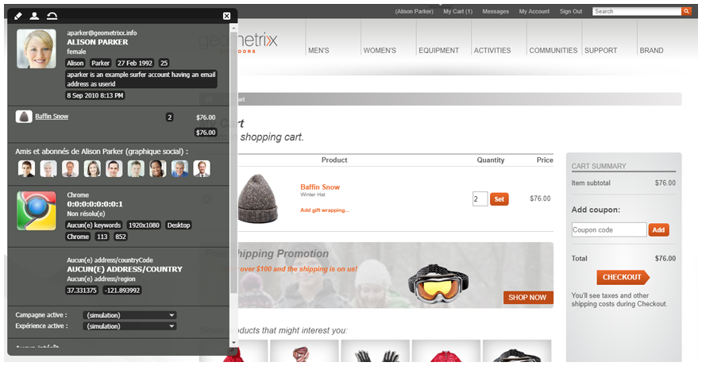

# eCommerce{#ecommerce}

* [Concepts](/help/sites-administering/concepts.md)
* [Administration (générique)](/help/sites-administering/generic.md)
* [SAP Commerce Cloud](/help/sites-administering/sap-commerce-cloud.md)
* [Salesforce Commerce Cloud](https://github.com/adobe/commerce-salesforce)
* [Magento](https://www.adobe.io/apis/experiencecloud/commerce-integration-framework/integrations.html#!AdobeDocs/commerce-cif-documentation/master/integrations/02-AEM-Magento.md)

Adobe propose deux versions de la structure d’intégration de Commerce :

|  | CIF sur site | CIF Cloud |
|-------------------------|--------------------------------------------------------------------------------------------------------------------------------------------------------------------------------------------------------|------------------------------------------------------------------------------------------------------------------------|
| Versions d’AEM prises en charge | AEM sur site ou AMS 6.x | AEM AMS 6.4 et 6.5 |
| Back-end | - AEM, Java   - Intégration monolithique, mappage de prégénération (modèle)  - Référentiel JCR | - Magento  - Java et JavaScript  - Aucune donnée Commerce stockée dans le référentiel JCR |
| Frontal | Pages rendues côté serveur AEM | Application de page mixte (rendu hybride) |
| Catalogue de produits | - Importateur de produits, éditeur, mise en cache dans AEM  - Catalogues réguliers avec des pages AEM ou proxy | - Pas d’importation de produit  - Modèles génériques  - Données à la demande via le connecteur |
| Évolutivité | - Peut prendre en charge jusqu’à quelques millions de produits (selon le cas d’utilisation)   - Mise en cache sur Dispatcher | - Aucune limitation de volume  - Mise en cache sur Dispatcher ou CDN |
| Modèle de données normalisé | Non | Oui, schéma GraphQL Magento |
| Disponibilité | Oui :  - Commerce Cloud SAP (extension mise à jour pour prendre en charge AEM 6.4 et Hybris 5 (par défaut) et maintenir la compatibilité avec Hybris 4)  - Commerce Cloud Salesforce (Connecteur Open Source pour prendre en charge AEM 6.4) | Oui via open source via GitHub.   Magento Commerce (prend en charge Magento 2.3.2 (par défaut) et compatible avec Magento 2.3.1). |
| Quand l’utiliser | Cas d’utilisation limités : Dans les cas où de petits catalogues statiques peuvent avoir besoin d’être importés | Solution conseillée dans la plupart des cas d’utilisation |

Conjointement avec la gestion d’informations sur les produits, eCommerce gère les activités d’un site web de vente de produits dans une boutique en ligne :

* Création, durée de vie et obsolescence d’un produit
* Gestion des tarifs
* Gestion des transactions
* Gestion de catalogues entiers
* Enregistrements de stockage directs et centralisés
* Interfaces web

AEM eCommerce aide les spécialistes du marketing à offrir des expériences d’achat personnalisées sur le web, les appareils mobiles et les médias sociaux. L’environnement de création d’AEM permet de personnaliser des pages et des composants en fonction du contexte du visiteur cible et des stratégies de marchandisage, par exemple :

* Pages de produits
* Composants de panier
* Composants de passage en caisse

La mise en œuvre d’eCommerce permet d’accéder en temps réel à des informations sur le produit. Il peut être utilisé pour veiller aux points suivants :

* Intégrité des informations sur le produit
* Tarifs
* Inventaire de gestion des stocks
* Variantes de l’état d’un panier

>[!NOTE]
>
>Pour utiliser la structure d’intégration avec les fournisseurs prestataires eCommerce externes, vous devez tout d’abord installer les modules nécessaires. Pour plus d’informations, voir [Déploiement d’eCommerce](/help/sites-deploying/ecommerce.md).
>
>Pour plus d’informations sur l’extension des fonctionnalités d’eCommerce, voir [Développement du commerce électronique](/help/sites-developing/ecommerce.md).

## Principales fonctionnalités {#main-features}

AEM eCommerce fournit ce qui suit :

* Un certain nombre de **Composants AEM d’usine** pour illustrer ce qui peut être réalisé pour votre projet :

   * Affichage des produits
   * Panier
   * Passage en caisse
   * Produits récemment affichés
   * Bons
   * Autres

   

   >[!NOTE]
   >
   >La structure d’intégration d’AEM permet également de créer d’autres composants AEM pour les fonctions de commerce indépendamment de votre moteur eCommerce spécifique.

* **Recherche** : à l’aide de l’une des fonctions suivantes :

   * Recherche AEM
   * Recherche du système de commerce électronique
   * recherche tierce
   * Ou une combinaison de ces trois fonctions

   

* Utilise l’AEM de la fonction **présenter votre contenu sur plusieurs canaux ;**, que ce soit la fenêtre complète du navigateur ou l’appareil mobile. Ainsi, vous proposez votre contenu au format nécessaire pour vos visiteurs.

   

* La possibilité de **développer votre propre mise en œuvre de l’intégration en fonction de la [structure d’AEM eCommerce](#the-framework)**.

   Les deux mises en œuvre actuellement disponibles reposent sur la même base et complètent l’API générale (la structure). La mise en œuvre d’une nouvelle intégration implique seulement de mettre en œuvre les fonctionnalités dont votre intégration a besoin. Les composants frontaux peuvent être utilisés par les nouvelles mises en œuvre puisqu’ils utilisent des interfaces (et sont donc indépendants de la mise en œuvre).

* Possibilité de développer un **commerce axé sur l’expérience en fonction des données et de l’activité des acheteurs**, et ce dans divers scénarios :

   * Par exemple, une réduction des frais de livraison proposée lorsque le montant total d’une commande dépasse un montant spécifique.
   * Autre exemple : la possibilité de proposer des offres à certaines occasions à partir des informations de profil (tel le lieu). Ces possibilités peuvent ensuite être mises en avant, là encore en fonction d’autres facteurs, si nécessaire.

   Dans l’exemple ci-dessous, un teaser est affiché lorsque le contenu du panier est inférieur à 75 $ :

   

   Ceci peut être modifié lorsque le contenu du panier dépasse 75 $ :

   

* Et d’autres fonctionnalités, dont :

   * Contenu du panier conservé d’une session à l’autre
   * Historique des commandes exhaustif
   * Mise à jour rapide du catalogue

## Structure {#the-framework}

La section [Concepts](/help/sites-administering/concepts.md) couvre la structure plus en détail. Vous trouverez ci-dessous un aperçu de la structure :

### Quoi ? {#what}

* La structure d’intégration fournit l’API, une série de composants illustrant les fonctionnalités et différentes extensions pour fournir des exemples de méthodes de connexion.
* La structure fournit la structure de base nécessaire à la mise en œuvre d’un projet.
* La structure est extensible.
* La structure ne fournit pas de site prêt à l’emploi. Un certain travail de développement reste nécessaire pour adapter la structure à vos spécifications.

### Pourquoi ? {#why}

* Fournir les mécanismes de base nécessaires à la création rapide d’un site de commerce électronique personnalisé.
* Offrir la flexibilité nécessaire pour développer un site de commerce électronique réel.
* Illustrer les pratiques recommandées.
