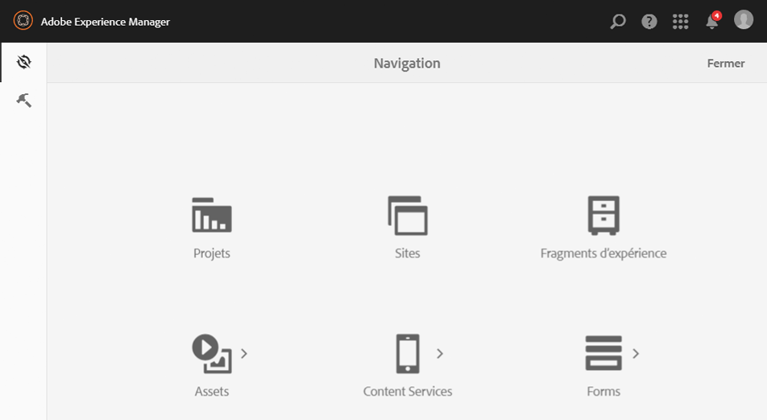
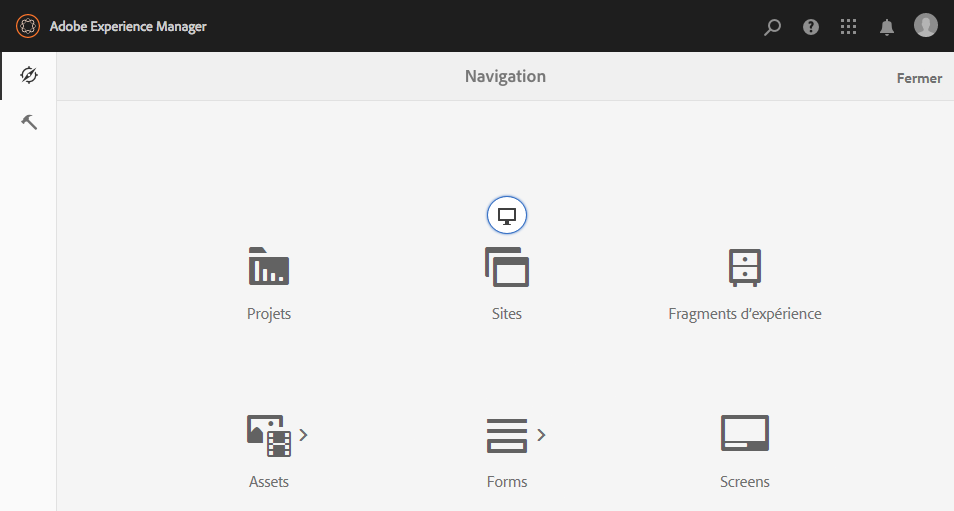

# Consoles d’administration{#admin-consoles}

Par défaut, la possibilité de basculer vers l’IU classique via les consoles d’administration a été désactivée. Par conséquent, les icônes contextuelles qui s’affichaient lors du survol du curseur sur certaines icônes de la console, et qui permettaient d’accéder à l’IU classique, ne sont plus affichées.

Every console that has a Classic UI version in `/libs/cq/core/content/nav` can be re-enabled individually so that the **Classic UI** option once again pops up over the console icon when it is moused over.

Dans cet exemple, nous réactivons l’IU classique pour la console Sites.

1. A l’aide de CRXDE Lite, recherchez le noeud correspondant à la console d’administration pour laquelle vous souhaitez réactiver l’interface utilisateur classique. Il se trouve sous :

   `/libs/cq/core/content/nav`

   Par exemple, 

   [ `http://localhost:4502/crx/de/index.jsp#/libs/cq/core/content/nav`](http://localhost:4502/crx/de/index.jsp#/libs/cq/core/content/nav)

1. Sélectionnez le nœud correspondant à la console pour laquelle vous souhaitez réactiver l’IU classique. Dans notre exemple, nous allons recréer l’IU classique pour la console Sites.

   `/libs/cq/core/content/nav/sites`

1. Create an overlay using the **Overlay Node** option; for example:

   * **Chemin**: `/apps/cq/core/content/nav/sites`
   * **Emplacement du recouvrement**: `/apps/`
   * **Faire correspondre les types de nœuds** : actif (cochez la case)

1. Ajoutez la propriété booléenne suivante au nœud recouvert :

   `enableDesktopOnly = {Boolean}true`

1. L’option **IU classique** est toujours disponible en tant qu’option d’élément contextuel dans la console d’administration.

   

Répétez ces étapes pour chaque console pour laquelle vous souhaitez réactiver l’accès à la version d’IU classique.
