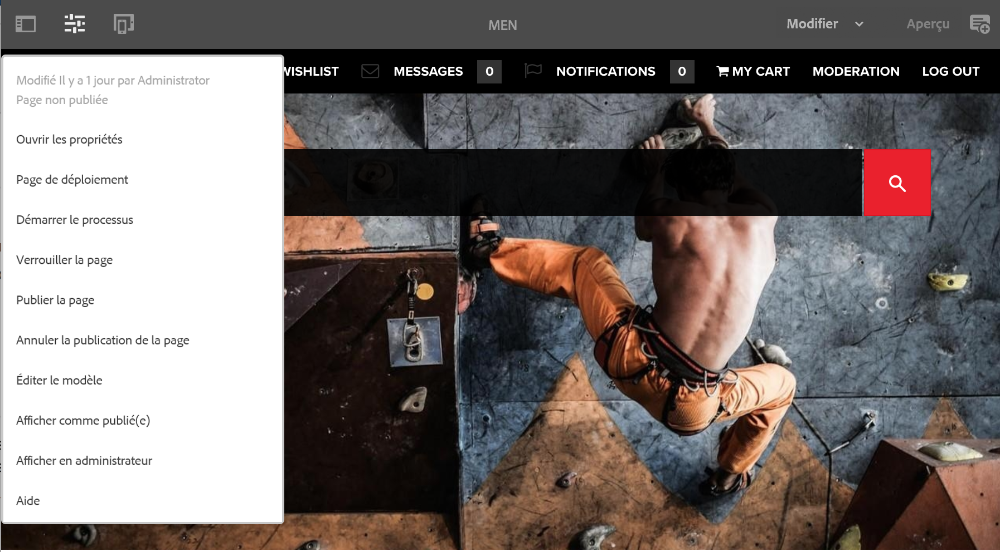

# Éditeur{#editor}

Par défaut, la possibilité de basculer vers de l’éditeur vers l’interface utilisateur classique a été désactivée.

Pour réactiver l’option **Ouvrir dans l’IU classique** dans le menu **informations sur la page**, procédez comme suit.

1. À l’aide de CRXDE Lite, recherchez le nœud suivant :

   `/libs/wcm/core/content/editor/jcr:content/content/items/content/header/items/headerbar/items/pageinfopopover/items/list/items/classicui`

   Par exemple :

   `http://localhost:4502/crx/de/index.jsp#/libs/wcm/core/content/editor/jcr%3Acontent/content/items/content/header/items/headerbar/items/pageinfopopover/items/list/items/classicui](http://localhost:4502/crx/de/index.jsp#/libs/wcm/core/content/editor/jcr%3Acontent/content/items/content/header/items/headerbar/items/pageinfopopover/items/list/items/classicui`

1. Créez une superposition à l’aide de la fonction **Noeud de recouvrement** option; par exemple :

   * **Chemin**: `/apps/wcm/core/content/editor/jcr:content/content/items/content/header/items/headerbar/items/pageinfopopover/items/list/items/classicui`
   * **Emplacement du recouvrement**: `/apps/`
   * **Faire correspondre les types de nœuds** : actif (cochez la case)

1. Ajoutez la propriété de texte à valeurs multiples ci-dessous au nœud de recouvrement :

   `sling:hideProperties = ["granite:hidden"]`

1. L’option **Ouvrir dans l’IU classique** est toujours disponible dans le menu des **Informations de la page** lors de la modification des pages.

   
