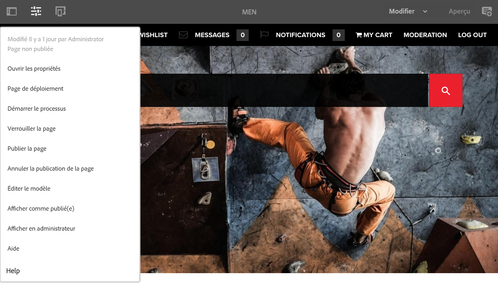

# Éditeur{#editor}

>[!CAUTION]
>
>AEM 6.4 a atteint la fin de la prise en charge étendue et cette documentation n’est plus mise à jour. Pour plus d’informations, voir notre [période de support technique](https://helpx.adobe.com/fr/support/programs/eol-matrix.html). Rechercher les versions prises en charge [here](https://experienceleague.adobe.com/docs/?lang=fr).

Par défaut, la possibilité de basculer vers l’IU classique à partir de l’éditeur a été désactivée.

Pour réactiver l’option **Ouvrir dans l’interface utilisateur classique** dans le **Informations sur la page** , procédez comme suit.

1. À l’aide de CRXDE Lite, recherchez le nœud suivant :

   `/libs/wcm/core/content/editor/jcr:content/content/items/content/header/items/headerbar/items/pageinfopopover/items/list/items/classicui`

   Par exemple :

   `http://localhost:4502/crx/de/index.jsp#/libs/wcm/core/content/editor/jcr%3Acontent/content/items/content/header/items/headerbar/items/pageinfopopover/items/list/items/classicui](http://localhost:4502/crx/de/index.jsp#/libs/wcm/core/content/editor/jcr%3Acontent/content/items/content/header/items/headerbar/items/pageinfopopover/items/list/items/classicui`

1. Créez un recouvrement à l’aide de l’option **Nœud de recouvrement** ; par exemple :

   * **Chemin** : `/apps/wcm/core/content/editor/jcr:content/content/items/content/header/items/headerbar/items/pageinfopopover/items/list/items/classicui`
   * **Emplacement du recouvrement** : `/apps/`
   * **Faire correspondre les types de noeud**: principal (cochez la case)

1. Ajoutez la propriété de texte à valeurs multiples ci-dessous au nœud de recouvrement :

   `sling:hideProperties = ["granite:hidden"]`

1. L’option **Ouvrir dans l’IU classique** est toujours disponible dans le menu des **Informations de la page** lors de la modification des pages.

   
