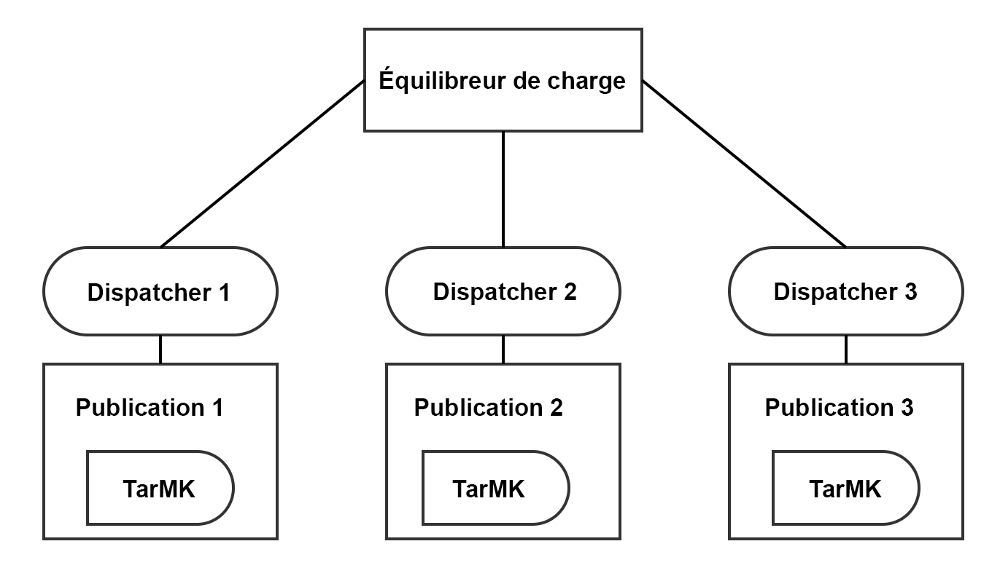
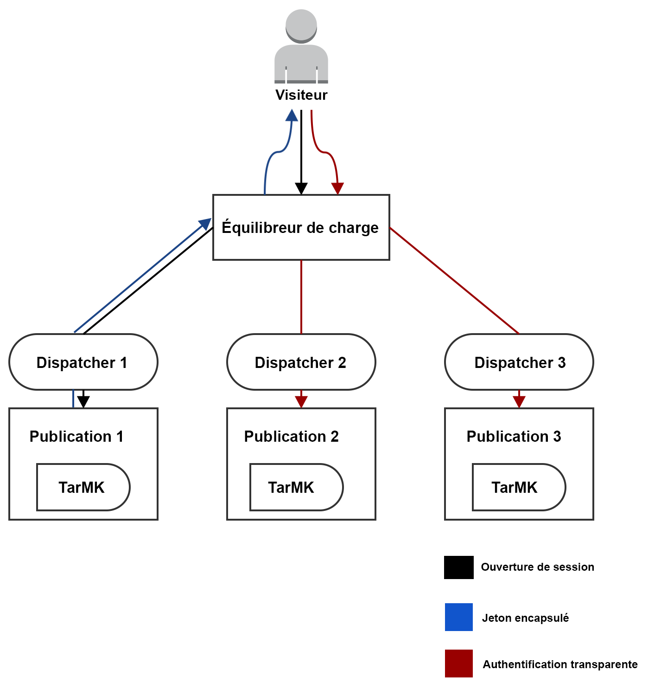
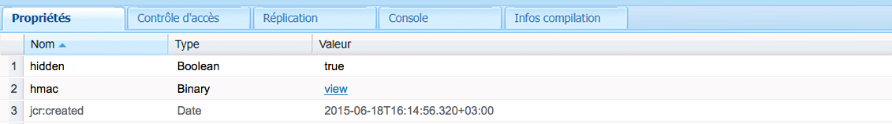

# Prise en charge des jetons encapsulés{#encapsulated-token-support}

>[!CAUTION]
>
>AEM 6.4 a atteint la fin de la prise en charge étendue et cette documentation n’est plus mise à jour. Pour plus d’informations, voir notre [période de support technique](https://helpx.adobe.com/fr/support/programs/eol-matrix.html). Rechercher les versions prises en charge [here](https://experienceleague.adobe.com/docs/?lang=fr).

## Présentation {#introduction}

Par défaut, AEM utilise le gestionnaire d’authentification des jetons pour authentifier chaque demande. Cependant, pour traiter des demandes d’authentification, le gestionnaire d’authentification des jetons doit avoir accès au référentiel pour chaque demande. Ceci est dû au fait que des cookies sont utilisés pour maintenir l’état d’authentification. Logiquement, l’état doit perdurer dans le référentiel afin de valider les demandes ultérieures. En effet, cela signifie que le mécanisme d’authentification est à l’état.

Cela est particulièrement important pour l’évolutivité horizontale. Dans une configuration comportant plusieurs instances, comme la ferme de serveurs de publication représentée ci-dessous, l’équilibrage de charge ne peut pas être exécuté de façon optimale. Avec l’authentification avec état, l’état d’authentification persistante n’est disponible que sur l’instance où l’utilisateur est authentifié pour la première fois.

Prenons comme exemple le scénario suivant :

Un utilisateur peut être authentifié sur l’instance de publication 1, mais si une requête ultérieure est envoyée à l’instance de publication 2, cette instance ne dispose pas de cet état d’authentification persistant, car cet état a été conservé dans le référentiel de publication 1 et la publication 2 possède son propre référentiel.

La solution consiste à configurer des connexions persistantes au niveau de l’équilibreur de charge. Avec des connexions persistantes, un utilisateur serait toujours dirigé vers la même instance de publication. Par conséquent, un équilibrage de charge réellement optimal n’est pas possible.

Si une instance de publication devient inaccessible, tous les utilisateurs authentifiés sur cette instance perdent leur session, Cela est dû au fait que l’accès au référentiel est nécessaire pour valider le cookie d’authentification.

## Authentification sans état avec jeton encapsulé {#stateless-authentication-with-the-encapsulated-token}

Pour permettre une évolutivité horizontale, la solution consiste à recourir à une authentification sans état, grâce à la nouvelle prise en charge des jetons encapsulés dans AEM.

Le jeton encapsulé est un élément de chiffrement qui permet à AEM de créer et de valider de façon sécurisée des informations d’authentification hors ligne, sans accéder au référentiel. Ainsi, une demande d’authentification peut être effectuée sur toutes les instances de publication, sans nécessiter de connexions persistantes. Elle présente également l’avantage d’améliorer les performances d’authentification, car il n’est pas nécessaire d’accéder au référentiel pour chaque demande d’authentification.

Vous pouvez découvrir comment cela fonctionne dans un déploiement distribué géographiquement avec les instances de création MongoMK et de publication TarMK ci-dessous :

>[!NOTE]
>
>Le jeton encapsulé concerne l’authentification. Il permet de s’assurer que le cookie peut être validé sans avoir à accéder au référentiel. Cependant, il est toujours nécessaire que l’utilisateur existe sur toutes les instances et que les informations stockées sous cet utilisateur soient accessibles par chaque instance.
>
>Par exemple, si un nouvel utilisateur est créé sur l’instance de publication 1, en raison du fonctionnement du jeton encapsulé, il est authentifié correctement sur l’instance de publication 2. Si l’utilisateur n’existe pas sur la deuxième instance de publication, la requête échoue toujours.

## Configuration du jeton encapsulé {#configuring-the-encapsulated-token}

>[!NOTE]
>Tous les gestionnaires d’authentification qui synchronisent les utilisateurs et reposent sur l’authentification par jeton (comme SAML et OAuth) ne fonctionnent qu’avec des jetons encapsulés si :
>
>* les sessions persistantes sont activées, ou
>
>* les utilisateurs sont déjà créés dans AEM au démarrage de la synchronisation. Cela signifie que les jetons encapsulés ne seront pas pris en charge dans les cas où les gestionnaires **créent** des utilisateurs au cours du processus de synchronisation.

Lors de la configuration du jeton encapsulé, vous devez prendre en compte quelques points :

1. Compte tenu du chiffrement impliqué, toutes les instances doivent posséder la même clé HMAC. À compter d’AEM 6.3, le matériel de la clé n’est plus stocké dans le référentiel, mais sur le système de fichiers réel. Ainsi, la meilleure façon de répliquer les clés consiste à les copier du système de fichiers de l’instance source vers celle des instances cibles sur lesquelles vous souhaitez répliquer les clés. Pour plus d’informations, voir &quot;Réplication de la clé HMAC&quot; ci-dessous.
1. Le jeton encapsulé doit être activé. Vous pouvez le faire via la console web.

### Réplication de la clé HMAC {#replicating-the-hmac-key}

La clé HMAC est présente sous forme de propriété binaire `/etc/key` dans le référentiel. Vous pouvez la télécharger séparément en cliquant sur le lien **afficher** en face de lui :

Pour répliquer la clé sur plusieurs instances, procédez comme suit :

1. Accédez à l’instance AEM, généralement une instance de création, et qui contient le matériel des clés à copier.
1. Localisez le lot `com.adobe.granite.crypto.file` dans le système de fichiers local. Par exemple, sous ce chemin d’accès :

   * &lt;author-aem-install-dir>/crx-quickstart/launchpad/felix/bundle21

   Le fichier `bundle.info` à l’intérieur de chaque dossier identifie le nom du lot.

1. Accédez au dossier des données. Par exemple :

   * `<author-aem-install-dir>/crx-quickstart/launchpad/felix/bundle21/data`

1. Copier les fichiers HMAC et maîtres.
1. Ensuite, accédez à l’instance cible sur laquelle vous souhaitez dupliquer la clé HMAC, puis accédez au dossier des données. Par exemple :

   * `<publish-aem-install-dir>/crx-quickstart/launchpad/felix/bundle21/data`

1. Collez les deux fichiers copiés précédemment.
1. [Actualisez le lot de chiffrement](/help/communities/deploy-communities.md#refresh-the-granite-crypto-bundle) si l’instance cible est déjà en cours d’exécution.

1. Répétez les étapes ci-dessus pour toutes les instances sur lesquelles vous souhaitez répliquer la clé.

#### Activation du jeton encapsulé {#enabling-the-encapsulated-token}

Une fois la clé HMAC répliquée, vous pouvez activer le jeton encapsulé à l’aide de la console Web :

1. Pointez votre navigateur sur `https://serveraddress:port/system/console/configMgr`.
1. Recherchez une entrée appelée **Gestionnaire d’authentification du jeton Day CRX** et cliquez dessus.
1. Dans la fenêtre suivante, cochez la case **Activer la prise en charge des jetons encapsulés** et cliquez sur **Enregistrer**.
