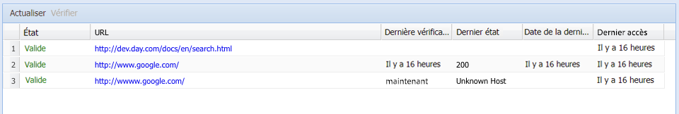

# Vérificateur de lien externe{#the-external-link-checker}

Un vérificateur de lien externe est fourni avec AEM. Le vérificateur de lien :

* analyse toutes les pages de contenu ;
* génère une liste de tous les liens valides et non valides ;
* marque les liens non valides comme rompus in situ dans les différentes pages de contenu.

## Validation des liens externes {#how-to-validate-external-links}

Pour utiliser le vérificateur de lien externe, procédez comme suit :

1. Ouvrez la console **Outils**.
1. Double-cliquez sur **Vérificateur de lien externe** (volet de droite ou de gauche). Une liste de tous les liens externes est créée.
1. Validez un lien spécifique en le sélectionnant dans la liste, puis en cliquant sur **Vérifier** :

   

   Des informations comme :

   * État du lien
   * URL
   * Délai depuis que le lien a été validé pour la dernière fois
   * Délai depuis que le lien a été mis à disposition pour la dernière fois
   * Délai depuis que le lien a été consulté pour la dernière fois

   s’affichent.

1. Dans les différentes pages de contenu, les liens non valides sont affichés comme étant rompus :

   

