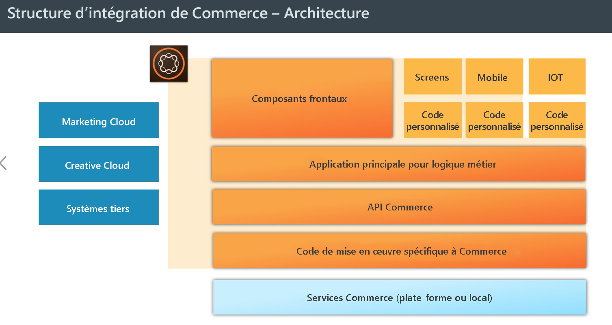
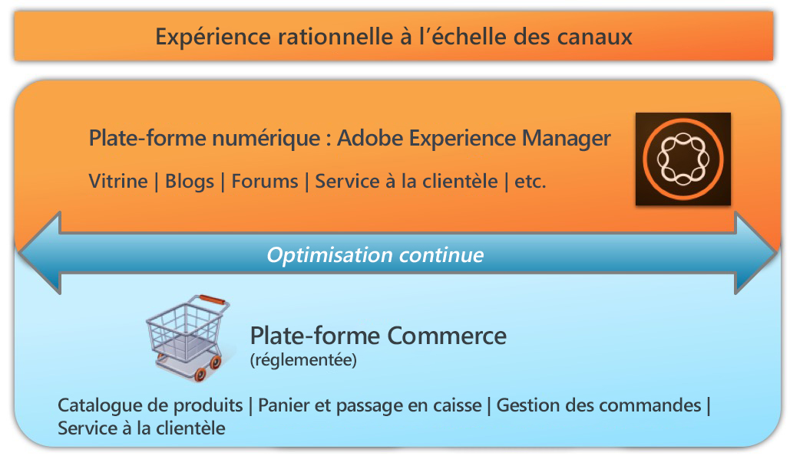

# AEM Commerce – Préparation pour le RGPD{#aem-commerce-gdpr-readiness}

>[!CAUTION]
>
>AEM 6.4 a atteint la fin de la prise en charge étendue et cette documentation n’est plus mise à jour. Pour plus d’informations, voir notre [période de support technique](https://helpx.adobe.com/fr/support/programs/eol-matrix.html). Rechercher les versions prises en charge [here](https://experienceleague.adobe.com/docs/?lang=fr).

>[!IMPORTANT]
>
>Le RGPD est utilisé comme exemple dans les sections ci-dessous, mais les détails couverts sont applicables à toutes les réglementations de protection des données et de confidentialité, comme le RGPD, le CCPA, etc.

Le règlement général sur la protection des données (RGPD) de l’Union européenne sur les droits de confidentialité des données entre en vigueur en mai 2018. Pour plus d’informations, voir [Page RGPD du Centre de traitement des données personnelles des Adobes](https://www.adobe.com/fr/privacy/general-data-protection-regulation.html).

>[!NOTE]
>
>Voir [AEM Préparation au RGPD](/help/managing/data-protection-and-privacy.md) pour plus de détails.

Dans nos intégrations Commerce prêtes à l’emploi, AEM représente la couche d’expérience, utilisant des services et renvoyant des données vers la plateforme commerciale du client qui s’exécute en mode découplé.

Pour certaines plateformes commerciales, nous stockons des informations de profil (`/home/users`) et des jetons commerciaux (pour la connexion à la plateforme commerciale) dans AEM. Pour ces cas d’utilisation, consultez la section [Traitement des requêtes de RGPD pour la plateforme AEM](/help/sites-administering/handling-gdpr-requests-for-aem-platform.md).

## Traitement des requêtes de RGPD pour AEM Commerce {#handling-gdpr-requests-for-aem-commerce}

Pour l’intégration du Commerce Cloud Salesforce, AEM Commerce ne stocke aucune information pertinente en vertu du RGPD. Vous devriez transférer la requête au [cloud Salesforce](https://documentation.demandware.com/).

En ce qui concerne les intégrations hybris et IBM WebSphere, certaines données sont présentes dans AEM. Vous devez utiliser la variable [Instructions relatives au RGPD AEM Platform](/help/sites-administering/handling-gdpr-requests-for-aem-platform.md) et tenez compte de ces questions :

1. **Où mes données sont-elles stockées/utilisées ?** Les informations de profil utilisateur mises en cache comme le nom, l’identifiant de l’utilisateur commercial, le jeton, le mot de passe, les coordonnées, etc. sont affichées à partir d’AEM.
1. **Avec qui partager les données couvertes par le RGPD ?** Toute mise à jour de données relatives au RGPD dans AEM Commerce n’est pas stockée (à l’exception des informations de profil appropriées, comme indiqué ci-dessus), mais est par proxy vers la plateforme commerciale.
1. **Comment supprimer mes données utilisateur** ? Supprimez le profil utilisateur dans AEM et appelez la suppression de l’utilisateur sur la plateforme commerciale.

>[!NOTE]
>
>Consultez le [wiki hybris](https://wiki.hybris.com/) ou la [documentation de WebSphere Commerce](https://www-01.ibm.com/support/docview.wss?uid=swg27036450) si nécessaire.
