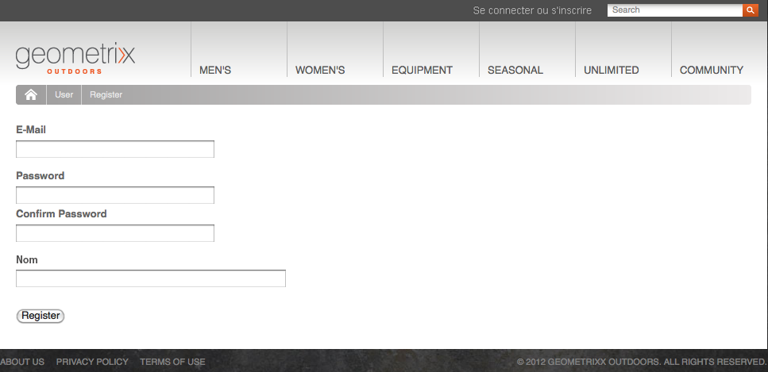
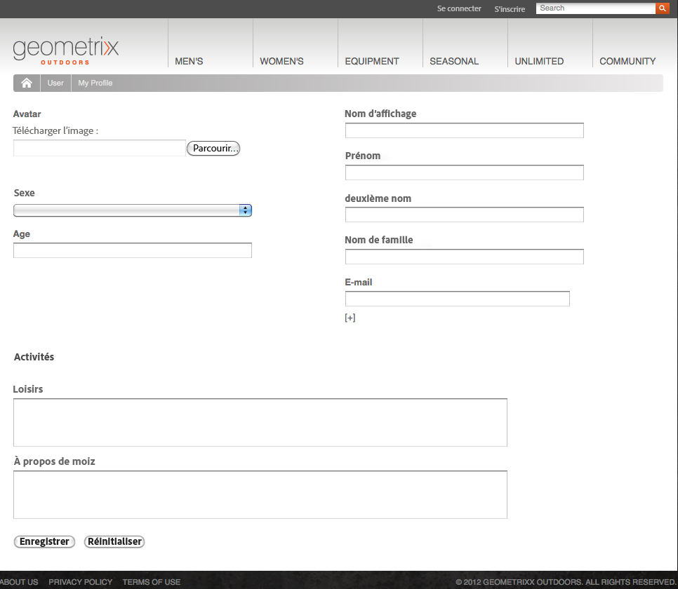
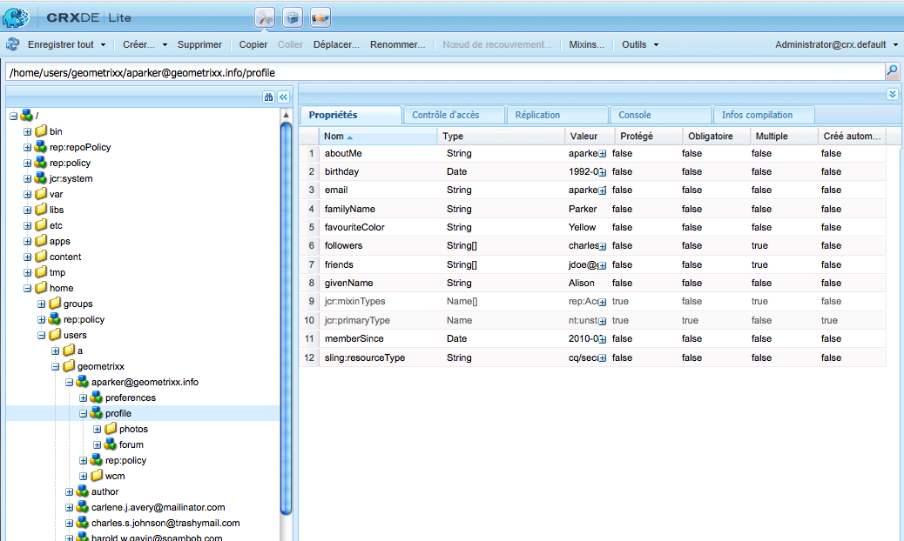
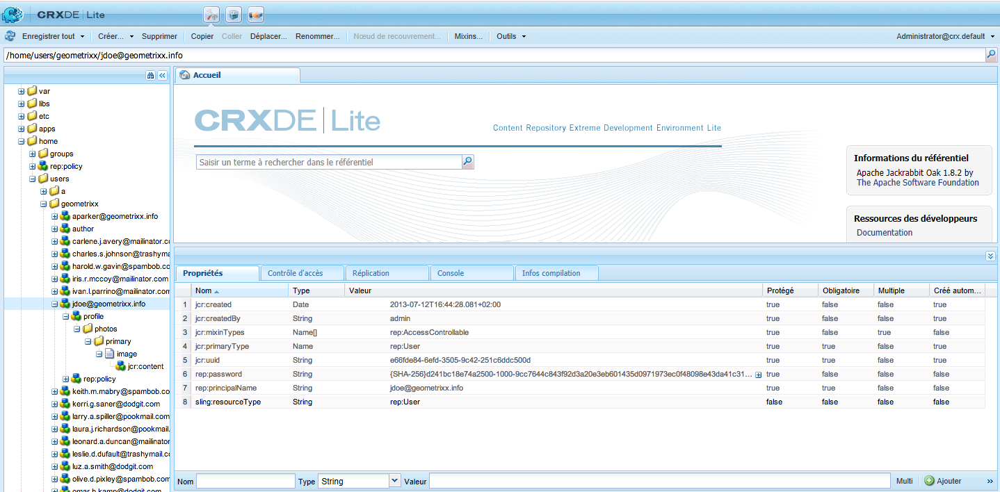
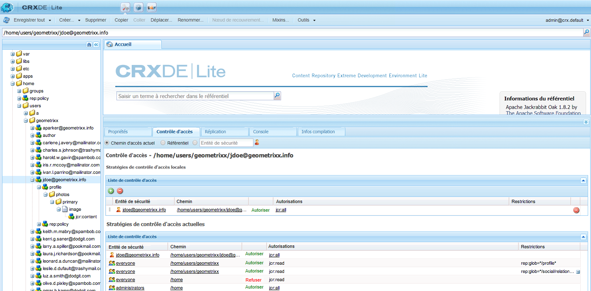
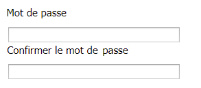
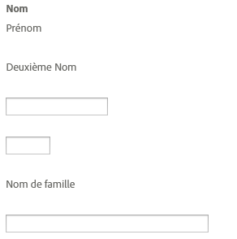

# Identity Management{#identity-management}

>[!CAUTION]
>
>AEM 6.4 a atteint la fin de la prise en charge étendue et cette documentation n’est plus mise à jour. Pour plus d’informations, voir notre [période de support technique](https://helpx.adobe.com/fr/support/programs/eol-matrix.html). Rechercher les versions prises en charge [here](https://experienceleague.adobe.com/docs/?lang=fr).

Les visiteurs individuels de votre site web ne peuvent être identifiés que lorsque vous leur donnez la possibilité de se connecter. Vous pouvez leur permettre de se connecter pour différentes raisons :

* Les visiteurs du site [AEM Communities](/help/communities/overview.md) doivent se connecter pour publier du contenu à l’intention de la communauté.
* [Groupes d’utilisateurs fermés](/help/sites-administering/cug.md)

   Vous devrez peut-être limiter l’accès à votre site web (ou à des sections de votre site web) à des visiteurs spécifiques.

* [Personnalisation](/help/sites-administering/personalization.md) Permet aux visiteurs de configurer certains aspects de la façon dont ils accèdent à votre site web.

La fonctionnalité de connexion (et de déconnexion) est mise à disposition par un [compte avec un **profil**](#profiles-and-user-accounts) contenant des informations supplémentaires sur le visiteur (utilisateur) enregistré. Les processus réels pour l’enregistrement et l’autorisation peuvent différer :

* Auto-enregistrement sur le site web

   Un [site communautaire](/help/communities/sites-console.md) peut être configuré de manière à permettre aux visiteurs de s’auto-enregistrer ou de se connecter avec leur compte Facebook ou Twitter.

* Demande d’enregistrement sur le site web

   Pour un groupe d’utilisateurs fermé, vous pouvez permettre aux visiteurs de demander à être enregistrés, mais imposer une autorisation au moyen d’un workflow.

* Enregistrement de chaque compte dans l’environnement de création

   Si vous disposez d’un petit nombre de profils, qui devront de toute façon être autorisés, vous pouvez décider de les enregistrer directement.

Pour permettre aux visiteurs de s’enregistrer, une série de composants et de formulaires peut être utilisée pour recueillir les informations d’identification nécessaires, puis d’autres informations de profil (facultatives). Une fois enregistré, il doit également pouvoir vérifier et mettre à jour les détails qu’il a soumis.

D’autres fonctionnalités peuvent être configurées ou développées :

* Configurez toute réplication inverse requise.
* Permet à un utilisateur de supprimer son profil, en développant un formulaire avec un workflow.

>[!NOTE]
>
>Les informations spécifiées dans le profil peuvent également être utilisées pour fournir à l’utilisateur du contenu ciblé via [Segments](/help/sites-administering/campaign-segmentation.md) et [Campagnes](/help/sites-authoring/personalization.md).

## Enregistrement de Forms {#registration-forms}

Un formulaire peut être utilisé pour collecter les informations d’enregistrement, puis générer le nouveau compte et le nouveau profil.

Par exemple, les utilisateurs peuvent demander un nouveau profil à l’aide de la page Geometrixx\
`http://localhost:4502/content/geometrixx-outdoors/en/user/register.html`



Lors de l’envoi de la demande, la page de profil s’affiche lorsque l’utilisateur peut fournir des détails personnels.



Le nouveau compte est également visible dans la [console Utilisateurs](/help/sites-administering/security.md).

## Connexion {#login}

Le composant de connexion peut être utilisé pour collecter les informations de connexion, puis activer le processus de connexion.

Les champs standard **Nom d’utilisateur** et **Mot de passe**, avec un bouton **Connexion**, s’affichent à l’intention du visiteur afin de lui permettre d’activer le processus de connexion lors de la saisie des informations d’identification.

Par exemple, les utilisateurs peuvent se connecter ou créer un compte à l’aide de l’option **Se connecter** de la barre d’outils Geometrixx, qui utilise la page :

`http://localhost:4502/content/geometrixx-outdoors/en/user/sign-in.html`


## Déconnexion {#logging-out}

Tout comme il y a un mécanisme de connexion, un mécanisme de déconnexion est également nécessaire. Cette option est disponible sous la forme **Se déconnecter** dans Geometrixx.

## Affichage et mise à jour d’un profil {#viewing-and-updating-a-profile}

En fonction du formulaire d’enregistrement, le visiteur peut avoir enregistré des informations sur son profil. Il doit pouvoir les afficher et/ou les mettre à jour ultérieurement. Cette opération peut être effectuée avec un formulaire similaire. Par exemple, dans Geometrixx :

```
http://localhost:4502/content/geometrixx-outdoors/en/user/profile.html
```

Pour afficher les détails de votre profil, cliquez sur **Mon profil** dans le coin supérieur droit d’une page ; par exemple, avec le compte `admin` :
\
`http://localhost:4502/home/users/a/admin/profile.form.html/content/geometrixx-outdoors/en/user/profile.html.`

Vous pouvez afficher un autre profil à l’aide du [contexte du client](/help/sites-administering/client-context.md) (dans l’environnement de création et avec des autorisations suffisantes) :

1. Ouvrez une page. Par exemple, la page Geometrixx :

   `http://localhost:4502/cf#/content/geometrixx/en.html`

1. Cliquez sur **Mon profil** dans le coin supérieur droit. Le profil de votre compte actuel s’affiche. par exemple l’administrateur.
1. Press **control-alt-C** pour ouvrir le contexte client.
1. Dans le coin supérieur gauche du contexte client, cliquez sur le bouton **Chargement d’un profil** bouton .

   

1. Sélectionnez un autre profil dans la liste déroulante de la boîte de dialogue ; par exemple, **Alison Parker**.
1. Cliquez sur **OK**.
1. Cliquez de nouveau sur **Mon profil**. Le formulaire sera mis à jour avec les détails d’Alison.

   

1. Vous pouvez désormais utiliser **Modifier le profil** ou **Modifier le mot de passe** pour mettre à jour les détails.

## Ajout de champs à la définition de profil {#adding-fields-to-the-profile-definition}

Vous pouvez ajouter des champs à la définition d’un profil. Par exemple, pour ajouter un champ Couleur préférée au profil Geometrixx :

1. Dans la console Sites web, accédez à Site Geometrixx Outdoors > Français > Utilisateur > Mon profil.

1. Double-cliquez sur la page **Mon profil** pour l’ouvrir afin de la modifier.

1. Sur l’onglet **Composants** de Sidekick, développez la section **Formulaire**.

1. Faites glisser un composant **Liste déroulante** du Sidekick vers le formulaire, juste en dessous du champ **À propos de moi**.

1. Double-cliquez sur le composant **Liste déroulante** pour afficher la boîte de dialogue pour la configuration et saisissez les éléments suivants :

   * **Nom de l’élément** - `favoriteColor`
   * **Titre** - `Favorite Color`
   * **Éléments** - Ajoutez plusieurs couleurs sous forme d’éléments.

   Cliquez sur **OK** pour enregistrer.

1. Fermez la page et revenez à la console **Sites web** et activez la page Mon profil.

   La prochaine fois que vous affichez un profil, vous pouvez choisir une couleur préférée :

   

   Le champ est enregistré dans la section **profil** du compte utilisateur approprié :

   

## États du profil {#profile-states}

Différents cas d’utilisation nécessitent de savoir si un utilisateur (ou plutôt son profil) est dans un *état spécifique* ou non.

Cela implique de définir une propriété appropriée dans le profil utilisateur de manière à :

* est visible et accessible pour l’utilisateur ;
* définit deux états pour chaque propriété ;
* permet de basculer entre les deux états définis.

Pour ce faire, procédez comme suit :

* [Fournisseurs d’état](#state-providers)

   Permet de gérer les deux états d’une propriété spécifique et les transitions entre les deux états.

* [Workflows](#workflows)

   Permet de gérer les actions associées aux états.

Différents états peuvent être définis. Dans Geometrixx, par exemple, il s’agit des états suivants :

* Abonnement (ou désabonnement) aux notifications des newsletters ou aux fils de commentaires
* Ajout et suppression d’une connexion à un ami

### Fournisseurs d’état {#state-providers}

Un fournisseur d’état gère le statut actuel de la propriété en question, ainsi que les transitions entre les deux états possibles.

Les fournisseurs d’état sont mis en œuvre sous forme de composants et peuvent donc être personnalisés pour votre projet. En Geometrixx, ces éléments sont les suivants :

* S&#39;abonner/Se désabonner du sujet du forum
* Ajouter/Supprimer un ami

### Workflows {#workflows}

Les fournisseurs d’état gèrent une propriété de profil et ses états.

Un workflow est nécessaire à la mise en œuvre des actions associées aux états. Par exemple, lors de l’abonnement aux notifications, le workflow gère l’action réelle d’abonnement effective. Lors du désabonnement des notifications, le workflow gère la suppression de l’utilisateur de la liste d’abonnement.

## Profils et comptes utilisateur {#profiles-and-user-accounts}

Les profils sont stockés dans le référentiel de contenu, au sein du [compte utilisateur](/help/sites-administering/user-group-ac-admin.md).

Le profil se trouve sous `/home/users/geometrixx` :



Dans une configuration standard (création ou publication), chacun possède un accès en lecture à toutes les informations de profil de tous les utilisateurs. Chacun est un *groupe intégré contenant automatiquement tous les utilisateurs et groupes existants. La liste des membres ne peut pas être modifiée.*&quot;.

Ces droits d’accès sont définis par la liste de contrôle d’accès générique suivante :

/home everyone permet jcr:read rep:glob = &amp;ast;/profile&amp;ast;

Cela permet :

* forum, commentaires ou publications de blog pour afficher des informations (telles qu’une icône ou un nom complet) à partir du profil approprié.
* liens vers les pages de profil geometrixx

Si cet accès n’est pas adapté à votre installation, vous pouvez modifier ces paramètres par défaut.

À cet effet, utilisez l’onglet **[Contrôle d’accès](/help/sites-administering/user-group-ac-admin.md#access-right-management)** :



## Composants de profil {#profile-components}

Plusieurs composants de profil sont également disponibles pour définir les exigences de profil de votre site.

### Champ du mot de passe vérifié {#checked-password-field}

Ce composant vous donne deux champs pour :

* saisie d’un mot de passe
* une vérification pour confirmer que le mot de passe a été saisi correctement.

Avec les paramètres par défaut, le composant s’affiche comme suit :



### Photo de l’avatar du profil {#profile-avatar-photo}

Ce composant fournit à l’utilisateur un mécanisme permettant de sélectionner et de charger un fichier photo d’avatar.


### Nom détaillé du profil {#profile-detailed-name}

Ce composant permet à l’utilisateur de saisir un nom détaillé.



### Sexe du profil {#profile-gender}

Ce composant permet à l’utilisateur de saisir son sexe.


