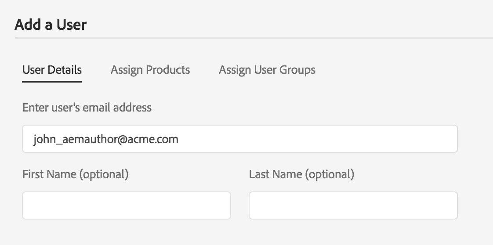

# Authentification Adobe IMS et prise en charge de l’Admin Console pour AEM Managed Services {#adobe-ims-authentication-and-admin-console-support-for-aem-managed-services}

>[!NOTE]
>
>Notez que cette fonctionnalité n’est disponible que pour les clients Adobe Managed Services.

## Présentation {#introduction}

AEM 6.4.3.0 introduit la prise en charge des Admin Console pour les instances AEM et l’authentification par Adobe IMS (système Identity Management) pour les clients **Managed Services**.

L’intégration d’AEM à l’Admin Console permettra aux clients AEM Managed Services de gérer tous les utilisateurs d’Experience Cloud dans une seule console. Les utilisateurs et les groupes peuvent être affectés à des profils de produit associés à des instances AEM, ce qui leur permet de se connecter à une instance spécifique.

## Principales caractéristiques {#key-highlights}

* La prise en charge de l’authentification IMS d’AEM est réservée aux auteurs, administrateurs ou développeurs AEM et non aux utilisateurs finaux externes de sites clients comme les visiteurs de site
* L’Admin Console représentera les clients AEM Managed Services comme des organisations IMS et leurs instances comme des contextes de produit. Le système client et les administrateurs de produits pourront gérer l’accès aux instances
* AEM Managed Services synchronisera les topologies client avec l’Admin Console. Il y aura une instance de contexte de produit AEM Managed Services par instance dans l’Admin Console.
* Les profils de produit de l’Admin Console détermineront à quelles instances un utilisateur peut accéder
* L’authentification fédérée à l’aide des propres fournisseurs d’identité des clients conformes SAML 2 est prise en charge
* Seuls les ID d’entreprise ou fédérés (pour l’authentification unique du client) sont pris en charge, et non les Adobe ID personnels.
* La gestion des utilisateurs (dans Adobe Admin Console) continuera à appartenir aux administrateurs du client.

## Architecture {#architecture}

L’authentification IMS fonctionne en utilisant le protocole OAuth entre AEM et le point de terminaison Adobe IMS. Une fois qu’un utilisateur a été ajouté à IMS et possède une identité Adobe, il peut se connecter aux instances AEM Managed Services à l’aide des informations d’identification IMS.

Le flux d’identifiant de connexion utilisateur est indiqué ci-dessous, l’utilisateur sera redirigé vers IMS et éventuellement vers le fournisseur d’identité client pour la validation SSO, puis redirigé vers AEM.

## Méthode de configuration {#how-to-set-up}

### Intégration des organisations dans Admin Console {#onboarding-organizations-to-admin-console}

L’intégration du client à l’Admin Console est un prérequis pour utiliser Adobe IMS pour l’authentification AEM.

Pour commencer, une organisation doit être configurée pour les clients dans Adobe IMS. Les clients Adobe Enterprise sont représentés en tant qu’organisations IMS dans [Adobe Admin Console](https://helpx.adobe.com/fr/enterprise/using/admin-console.html).

AEM clients Managed Services doivent déjà avoir une organisation configurée. Dans le cadre de la mise en service IMS, les instances de client seront mises à disposition dans le Admin Console pour gérer les droits et accès des utilisateurs.

L’authentification des utilisateurs par IMS sera un travail commun à AMS et les clients, chacun devant mener à bien ses workflows.

Une fois qu’un client est défini en tant qu’organisation IMS et qu’AMS a attribué ce client pour l’IMS, voici, en résumé, les workflows de la configuration nécessaires :

1. L’administrateur système désigné reçoit une invitation à se connecter au Admin Console.
1. L’administrateur système désigne le domaine pour confirmer la propriété du nom de domaine (dans cet exemple acme.com)
1. L’administrateur système configure les répertoires utilisateur
1. L’administrateur système configure le fournisseur d’identité (IDP) dans l’Admin Console pour la configuration SSO.
1. L’administrateur AEM gère les groupes locaux, les autorisations et les droits comme d’habitude. Voir Synchronisation des utilisateurs et des groupes .

>[!NOTE]
>
>Pour plus d’informations sur les bases de la gestion des identités dans Adobe, y compris sur la configuration de fournisseur d’identité, voir l’article présenté [sur cette page.](https://helpx.adobe.com/fr/enterprise/using/set-up-identity.html)
>
>Pour plus d’informations sur Enterprise Administration et sur l’Admin Console, voir l’article présenté [sur cette page](https://helpx.adobe.com/fr/enterprise/managing/user-guide.html).

### Intégration d’utilisateurs à l’Admin Console {#onboarding-users-to-the-admin-console}

Il existe trois méthodes d’intégration des utilisateurs en fonction de la taille du client et de ses préférences :

1. Création manuelle d’utilisateurs et de groupes dans l’Admin Console
1. Téléchargement d’un fichier CSV avec des utilisateurs
1. Synchronisation des utilisateurs et des groupes depuis le répertoire Active Directory d’entreprise du client.

#### Ajout manuel via l’interface utilisateur de l’Admin Console {#manual-addition-through-admin-console-ui}

Les utilisateurs et les groupes peuvent être créés manuellement dans l’interface utilisateur d’Admin Console. Cette méthode peut être utilisée s’il y a un nombre réduit d’utilisateurs à gérer. Par exemple, moins de 50 utilisateurs d’AEM.

Les utilisateurs peuvent aussi être créés manuellement si le client utilise déjà cette méthode pour administrer d’autres produits Adobe comme Analytics, Target ou des applications Creative Cloud.

#### Téléchargement de fichier dans l’interface utilisateur de l’Admin Console {#file-upload-in-the-admin-console-ui}

Pour gérer facilement la création d’utilisateurs, un fichier CSV peut être téléchargé pour permettre l’ajout groupé des utilisateurs :

#### Outil de synchronisation des utilisateurs {#user-sync-tool}

L’outil de synchronisation des utilisateurs permet aux clients d’entreprise de créer ou de gérer des utilisateurs Adobe utilisant Active Directory ou d’autres services testés de répertoires OpenLDAP. Les utilisateurs cibles sont les administrateurs d’identité informatique (Enterprise Directory et administrateurs système) qui pourront installer et configurer l’outil. Cet outil en open source est personnalisable, de telle sorte que les clients peuvent le faire modifier par un développeur en fonction de leurs besoins spécifiques.

Lorsque la synchronisation des utilisateurs s’exécute, elle récupère une liste d’utilisateurs à partir du répertoire Active Directory de l’organisation (ou de toute autre source de données compatible) et la compare à la liste des utilisateurs de l’Admin Console. Elle appelle ensuite l’API de gestion des utilisateurs Adobe pour synchroniser Admin Console avec le répertoire de l’organisation. Le flux de modification est uniquement unidirectionnel et les modifications apportées dans l’Admin Console ne sont pas transférées vers le répertoire.

Cet outil permet à l’administrateur système de mapper les groupes d’utilisateurs dans le répertoire client avec la configuration de produits et les groupes d’utilisateurs dans l’Admin Console. La nouvelle version de l’outil de synchronisation des utilisateurs permet également la création dynamique de groupes d’utilisateurs dans l’Admin Console.

Pour configurer la synchronisation des utilisateurs, l’organisation doit créer un ensemble d’informations d’identification de la même manière qu’avec l’[API User Management](https://www.adobe.io/apis/cloudplatform/usermanagement/docs/setup.html).

La synchronisation des utilisateurs est distribuée via le référentiel Adobe Github à cet emplacement :

[https://github.com/adobe-apiplatform/user-sync.py/releases/latest](https://github.com/adobe-apiplatform/user-sync.py/releases/latest)

Notez qu’une version préliminaire 2.4RC1 avec prise en charge de la création de groupe dynamique est disponible ici : [https://github.com/adobe-apiplatform/user-sync.py/releases/tag/v2.4rc1](https://github.com/adobe-apiplatform/user-sync.py/releases/tag/v2.4rc1)

Cette version a pour principales fonctionnalités la possibilité de mapper de manière dynamique les nouveaux groupes LDAP pour l’appartenance des utilisateurs à Admin Console, ainsi que la création dynamique de groupes d’utilisateurs.

Vous trouverez plus d’informations sur les nouvelles fonctionnalités du groupe ici :

[https://github.com/adobe-apiplatform/user-sync.py/blob/v2/docs/en/user-manual/advanced_configuration](https://github.com/adobe-apiplatform/user-sync.py/blob/v2/docs/en/user-manual/advanced_configuration.md#additional-group-options)

>[!NOTE]
>
>Pour plus d’informations sur l’outil de synchronisation des utilisateurs, consultez la [page de documentation](https://adobe-apiplatform.github.io/user-sync.py/en/).
>
>
>L’outil de synchronisation des utilisateurs doit s’enregistrer en tant qu’UMAPI client d’Adobe I/O en suivant la procédure décrite [ici](https://adobe-apiplatform.github.io/umapi-documentation/en/UM_Authentication.html).
>
>La documentation relative à la console Adobe I/O est disponible [ici](https://www.adobe.io/apis/cloudplatform/console.html).
>
>
>L’API User Management utilisée par l’outil de synchronisation des utilisateurs est traitée à cet [emplacement](https://www.adobe.io/apis/cloudplatform/umapi-new.html).

>[!NOTE]
>
>La configuration IMS d’AEM sera gérée par l’équipe Adobe Managed Services. Cependant, l’administrateur du client peut la modifier en fonction de ses besoins (par exemple, pour gérer l’appartenance automatique des groupes ou le mappage de groupes). Le client IMS sera également enregistré par votre équipe Managed Services.

## Utilisation {#how-to-use}

### Gestion des produits et accès utilisateur dans Admin Console {#managing-products-and-user-access-in-admin-console}

Lorsque l’administrateur de produit client se connecte à l’Admin Console, il voit plusieurs instances de contexte du produit AEM Managed Services, comme illustré ci-dessous :

Dans cet exemple, l’organisation *AEM-MS-Onboard* comporte 32 instances couvrant différents environnements et topologies tels que Intermédiaire, Production, etc.

Les détails de l’instance peuvent être vérifiés pour identifier celle-ci :

Un profil de produit est associé à chaque instance de contexte du produit. Ce profil de produit est utilisé pour attribuer l’accès aux utilisateurs et aux groupes.

Tous les utilisateurs et groupes ajoutés au profil de produit pourront se connecter à cette instance, comme illustré dans l’exemple ci-dessous :

### Connexion à AEM {#logging-into-aem}

#### Connexion de l’administrateur local {#local-admin-login}

AEM peut continuer à prendre en charge les connexions locales pour les utilisateurs administrateurs, puisque l’écran de connexion dispose d’une option de connexion locale :

#### Connexion via IMS {#ims-based-login}

Pour les autres utilisateurs, la connexion via IMS peut être utilisée une fois qu’IMS est configuré sur l’instance. L’utilisateur doit d’abord cliquer sur le bouton **Se connecter avec Adobe** comme illustré ci-dessous :

Il est alors redirigé vers l’écran de connexion IMS et saisit ses informations d’identification :

Si un fournisseur d’identité fédéré est configuré lors de la configuration initiale de l’Admin Console, l’utilisateur est redirigé vers le fournisseur d’identité client pour SSO.

Le fournisseur d’identité est Okta dans l’exemple ci-dessous :

Une fois l’authentification terminée, l’utilisateur est redirigé vers AEM et connecté :

### Migration d’utilisateurs existants {#migrating-existing-users}

Pour les instances AEM existantes qui utilisent une autre méthode d’authentification et qui sont désormais migrées vers IMS, une étape de migration est nécessaire.

Les utilisateurs existants dans le référentiel AEM (source locale, via LDAP ou SAML) peuvent être migrés pour pointer vers IMS en tant que fournisseur d’identité à l’aide de l’utilitaire de migration des utilisateurs.

Cet utilitaire sera exécuté par votre équipe AMS dans le cadre de la mise en service de l’IMS.

### Gestion des autorisations et des listes de contrôle d’accès dans AEM  {#managing-permissions-and-acls-in-aem}

Le contrôle d’accès et les autorisations continueront à être gérés dans AEM. Pour ce faire, vous pouvez séparer les groupes d’utilisateurs issus d’IMS (par exemple AEM-GRP-008 dans l’exemple ci-dessous) et les groupes locaux dans lesquels les autorisations et le contrôle d’accès sont définis. Les groupes d’utilisateurs synchronisés à partir de l’IMS peuvent être attribués aux groupes locaux et hériter des autorisations.

Dans l’exemple ci-dessous, nous ajoutons des groupes synchronisés au groupe local *Dam_Users* comme exemple.

Dans ce cas, un utilisateur a également été attribué à plusieurs groupes dans l’Admin Console. ( Notez que les utilisateurs et les groupes peuvent être synchronisés à partir de LDAP à l’aide de l’outil de synchronisation des utilisateurs ou créés localement, consultez la section **Intégration des utilisateurs au Admin Console** ci-dessus).

>[!NOTE]
>
>Les groupes d’utilisateurs ne sont synchronisés que lorsque les utilisateurs se connectent à l’instance.

L’utilisateur fait partie des groupes suivants dans IMS :

Lorsque l’utilisateur se connecte, ses adhésions de groupes sont synchronisées, comme illustré ci-dessous :

Dans AEM, les groupes d’utilisateurs synchronisés à partir de l’IMS peuvent être ajoutés en tant que membres aux groupes locaux existants, par exemple aux utilisateurs DAM.

Comme illustré ci-dessous, le groupe *AEM-GRP_008* hérite des autorisations et droits des utilisateurs DAM. C’est un moyen efficace de gérer des autorisations pour les groupes synchronisés. Il est généralement utilisé dans les méthodes d’authentification par LDAP.

