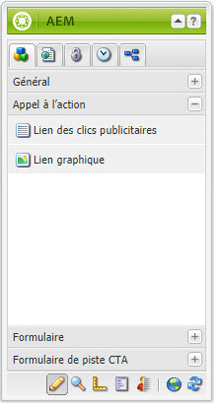
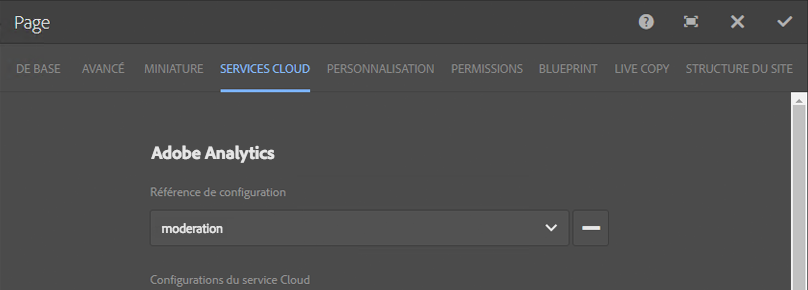

# Intégrer des pages d’entrée à Adobe Analytics{#integrating-landing-pages-with-adobe-analytics}

>[!CAUTION]
>
>AEM 6.4 a atteint la fin de la prise en charge étendue et cette documentation n’est plus mise à jour. Pour plus d’informations, voir notre [période de support technique](https://helpx.adobe.com/fr/support/programs/eol-matrix.html). Rechercher les versions prises en charge [here](https://experienceleague.adobe.com/docs/?lang=fr).

AEM a intégré la solution des pages d’entrée à [Adobe Analytics](https://www.omniture.com/en/products/analytics/sitecatalyst) en utilisant les composants CTA (call-to-action) suivants :

1. Composant Clic publicitaire
1. Composant de lien graphique

Ces composants exposent certains attributs pouvant être mappés via les variables Adobe Analytics (variables de trafic, de conversion) et des événements de réussite pour envoyer des informations à Adobe Analytics.

## Prérequis {#prerequisites}

Adobe vous recommande de passer en revue l’[intégration AEM-Adobe Analytics existante](/help/sites-administering/adobeanalytics.md) pour en comprendre le fonctionnement.

## Composants disponibles pour le mappage {#components-available-for-mapping}

Dans AEM, les composants **Appel à l’action** (**ClickThroughLink** et **GraphicalLink**) affichés ici dans le sidekick peuvent être mappés sur des variables Adobe Analytics.

### Mappage des composants de page d’entrée à Adobe Analytics {#mapping-landing-page-components-to-adobe-analytics}

Pour mapper des composants de page d’entrée à Adobe Analytics :

1. Après avoir créé la configuration Adobe Analytics et un nouveau framework, sélectionnez la suite de rapports appropriée dans le menu déroulant. Les variables Adobe Analytics sont alors récupérées et affichées dans l’outil de recherche de contenu.
1. Faites glisser les composants CTA (Appel à l’action) du sidekick vers la zone de mappage située au milieu de la page, le cas échéant.

<table> 
 <tbody>
  <tr>
   <td><strong>Nom du composant</strong></td> 
   <td><strong>Attributs présentés</strong></td> 
   <td><strong>Signification de l’attribut</strong></td> 
  </tr>
  <tr>
   <td><strong>Lien des clics publicitaires CTA</strong></td> 
   <td><i>eventdata.clickthroughLinkLabel</i>   </td> 
   <td>Libellé ou texte du lien </td> 
  </tr>
  <tr>
   <td>  </td> 
   <td><i>eventdata.clickthroughLinkTarget</i>   </td> 
   <td>Destination à laquelle vous accédez lorsque vous cliquez sur le lien </td> 
  </tr>
  <tr>
   <td>  </td> 
   <td><i>eventdata.events.clickthroughLinkClick</i>   </td> 
   <td>Événement de clic </td> 
  </tr>
  <tr>
   <td><strong>Lien graphique CTA</strong></td> 
   <td><i>eventdata.clicktroughImageLabel</i>   </td> 
   <td>Titre de l’image CTA </td> 
  </tr>
  <tr>
   <td>  </td> 
   <td><i>eventdata.clicktroughImageTarget</i>   </td> 
   <td>Destination à laquelle vous accédez lorsque vous cliquez sur l’image contenant un lien.</td> 
  </tr>
  <tr>
   <td>  </td> 
   <td><i>eventdata.clicktroughImageAsset</i>   </td> 
   <td>Chemin d’accès à la ressource image dans le référentiel </td> 
  </tr>
  <tr>
   <td>  </td> 
   <td><i>eventdata.events.clicktroughImageClick</i>   </td> 
   <td>Événement de clic</td> 
  </tr>
 </tbody>
</table>

1. Mappez ces attributs exposés avec toute variable Adobe Analytics issue de l’outil de recherche de contenu. Le framework est maintenant prêt à être utilisé.
1. Vous pouvez à présent créer une nouvelle page d’entrée ou ouvrir une page d’entrée existante avec des composants CTA existants et cliquer sur l’onglet **Cloud Services** dans **Propriétés de page** dans le sidekick (dans l’IU optimisée pour les écrans tactiles, sélectionnez **Ouvrir les propriétés** et cliquez sur **Cloud Services**), puis configurez le framework à utiliser avec la page d’entrée. Sélectionnez le framework dans la liste déroulante.

   

1. Après avoir configuré le framework avec la page d’accueil, vous pouvez utiliser les composants activés. Tout clic effectué sur l’appel à l’action est alors enregistré dans Adobe Analytics.
