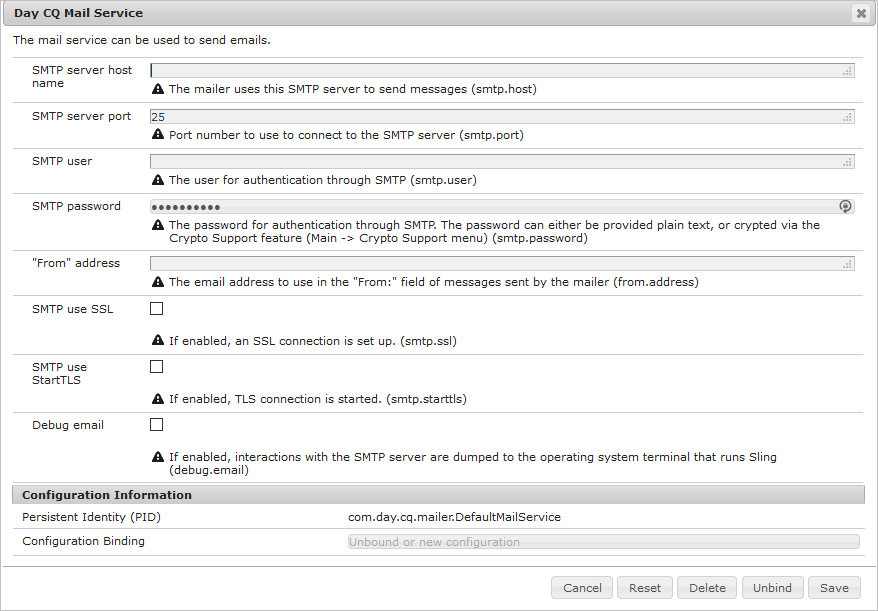

# Configurer les notifications par e-mail{#configuring-email-notification}

>[!CAUTION]
>
>AEM 6.4 a atteint la fin de la prise en charge étendue et cette documentation n’est plus mise à jour. Pour plus d’informations, voir notre [période de support technique](https://helpx.adobe.com/fr/support/programs/eol-matrix.html). Rechercher les versions prises en charge [here](https://experienceleague.adobe.com/docs/?lang=fr).

AEM envoie des notifications par e-mail aux utilisateurs qui :

* Ont souscrit aux événements de pages, par exemple la modification ou la réplication. La section [Boîte de réception de notifications](/help/sites-classic-ui-authoring/author-env-inbox.md#subscribing-to-notifications) décrit comment s’abonner à ces événements.

* Ont souscrit aux événements de forum.
* Doivent effectuer une opération dans un workflow. Le [Étape du participant](/help/sites-developing/workflows-step-ref.md#participant-step) décrit comment déclencher une notification électronique dans un workflow.

Conditions préalables :

* Une adresse email valide doit être définie dans son profil pour le ou les utilisateurs.
* Le **Service de messagerie Day CQ** doit être correctement configuré.

Lorsque l’utilisateur est averti, il reçoit un courrier électronique dans la langue définie dans son profil. Chaque langue possède son propre modèle, qui peut être personnalisé. De nouveaux modèles de courrier électronique peuvent être ajoutés pour de nouvelles langues.

>[!NOTE]
>
>Lorsque vous utilisez AEM, plusieurs méthodes permettent de gérer les paramètres de configuration pour ces services. Consultez la section [Configuration d’OSGi](/help/sites-deploying/configuring-osgi.md) pour plus de détails et connaître les pratiques recommandées.

## Configuration du service de messagerie {#configuring-the-mail-service}

Pour qu’AEM puisse envoyer des courriers électroniques, le **service de messagerie Day CQ** doit être correctement configuré. Vous pouvez afficher la configuration dans la console Web. Lorsque vous utilisez AEM, plusieurs méthodes permettent de gérer les paramètres de configuration pour ces services. Consultez la section [Configuration d’OSGi](/help/sites-deploying/configuring-osgi.md) pour plus de détails et connaître les pratiques recommandées.

Les contraintes suivantes s’appliquent :

* Le **port de serveur SMTP** doit être le port 25 ou un port supérieur.

* Le **nom d’hôte de serveur SMTP** ne doit pas être vide.
* L’**adresse « De »** ne doit pas être vide.

Pour résoudre plus facilement un problème avec le **service de messagerie Day CQ**, vous pouvez examiner les journaux du service :

`com.day.cq.mailer.DefaultMailService`

La configuration ressemble à ce qui suit dans la console web :



## Configuration du canal de notification par e-mail {#configuring-the-email-notification-channel}

Lorsque vous vous abonnez à des notifications d’événement de page ou de forum, l’adresse électronique De est définie sur `no-reply@acme.com` par défaut. Vous pouvez modifier cette valeur en configurant le service **Notification par e-mail** dans la console web.

Pour configurer l’adresse électronique De, ajoutez un nœud `sling:OsgiConfig` au référentiel. Procédez comme suit pour ajouter le nœud directement avec CRXDE Lite :

1. Dans CRXDE Lite, ajoutez un dossier nommé `config` sous votre dossier d’application.
1. Dans le dossier de configuration, ajoutez un nœud nommé :

   `com.day.cq.wcm.notification.email.impl.EmailChannel` de type `sling:OsgiConfig`

1. Ajoutez une propriété `String` au nœud nommé `email.from`. Pour la valeur , indiquez l’adresse électronique à utiliser.

1. Cliquez sur **Enregistrer tout**.

Procédez comme suit pour définir le noeud dans les dossiers source de votre package de contenu :

1. Dans votre `jcr_root/apps/*app_name*/config folder`, créez un fichier nommé `com.day.cq.wcm.notification.email.impl.EmailChannel.xml`.

1. Ajoutez le fichier XML suivant pour représenter le nœud :

   `<?xml version="1.0" encoding="UTF-8"?> <jcr:root xmlns:sling="https://sling.apache.org/jcr/sling/1.0" xmlns:jcr="https://www.jcp.org/jcr/1.0" jcr:primaryType="sling:OsgiConfig" email.from="name@server.com"/>`
1. Remplacez la valeur de l’attribut `email.from` (`name@server.com`) par votre adresse électronique.

1. Enregistrez le fichier.

## Configuration du service de notification électronique de workflow {#configuring-the-workflow-email-notification-service}

Lorsque vous recevez des notifications électroniques de workflow, l’adresse électronique De et le préfixe URL hôte sont définis sur les valeurs par défaut. Vous pouvez modifier ces valeurs en configurant le **service de notification électronique de workflow Day CQ** dans la console Web. Si vous le faites, il est recommandé de conserver la modification dans le référentiel.

La configuration par défaut se présente comme suit dans la console web :


### Modèles de courrier électronique pour la notification de page {#email-templates-for-page-notification}

Les modèles de courrier électronique pour les notifications de page se trouvent ci-dessous :

`/libs/settings/notification-templates/com.day.cq.wcm.core.page`

Le modèle en anglais par défaut (`en.txt`) est défini comme suit :

```xml
subject=[CQ Page Event Notification]: Page Event

header=-------------------------------------------------------------------------------------\n \
Time: ${time}\n \
User: ${userFullName} (${userId})\n \
-------------------------------------------------------------------------------------\n\n

message=The following pages were affected by the event: \n \
 \n \
${modifications} \n \
 \n\n
footer=\n \
-------------------------------------------------------------------------------------\n \
This is an automatically generated message. Please do not reply.
```

#### Personnalisation des modèles d’e-mail pour la notification de page {#customizing-email-templates-for-page-notification}

Pour personnaliser le modèle d’e-mail en anglais en vue de la notification de page :

1. Dans CRXDE, ouvrez le fichier :

   `/libs/settings/notification-templates/com.day.cq.wcm.core.page/en.txt`

1. Modifiez le fichier selon vos besoins.
1. Enregistrez les modifications.

Le modèle doit avoir le format suivant :

```
 subject=<text_1>
 header=<text_2>
 message=<text_3>
 footer=<text_4>
```

&lt;text_x> pouvant combiner du texte statique et des variables de chaînes dynamiques. Les variables suivantes peuvent être utilisées dans le modèle de courrier électronique pour les notifications de page :

* `${time}`, la date et l’heure de l’événement.

* `${userFullName}`, le nom complet de l’utilisateur ayant déclenché l’événement.

* `${userId}`, l’ID de l’utilisateur ayant déclenché l’événement.
* `${modifications}`, le type de l’événement de page et le chemin de page au format suivant :

   &lt;page event type> => &lt;page path>

   Par exemple :

   PageModified => /content/geometrixx/en/products

### Modèles de courrier électronique pour les notifications de forum {#email-templates-for-forum-notification}

Les modèles de courrier électronique pour les notifications de forum se trouvent sous :

`/etc/notification/email/default/com.day.cq.collab.forum`

Le modèle en anglais par défaut (`en.txt`) est défini comme suit :

```xml
subject=[CQ Forum Notification]

header=-------------------------------------------------------------------------------------\n \
Time: Time: ${time}\n \
Forum Page Path: ${forum.path}\n \
-------------------------------------------------------------------------------------\n\n

message=Page: ${host.prefix}${forum.path}.html\n

footer=\n \
-------------------------------------------------------------------------------------\n \
This is an automatically generated message. Please do not reply.
```

#### Personnalisation des modèles d’e-mail pour les notifications de forum {#customizing-email-templates-for-forum-notification}

Pour personnaliser le modèle d’e-mail en anglais en vue de la notification de forum :

1. Dans CRXDE, ouvrez le fichier :

   `/etc/notification/email/default/com.day.cq.collab.forum/en.txt`

1. Modifiez le fichier selon vos besoins.
1. Enregistrez les modifications.

Le modèle doit avoir le format suivant :

```
 subject=<text_1>
 header=<text_2>
 message=<text_3>
 footer=<text_4>
```

`<text_x>` pouvant combiner du texte statique et des variables de chaînes dynamiques.

Les variables suivantes peuvent être utilisées dans le modèle d’e-mail pour les notifications de forum :

* `${time}`, la date et l’heure de l’événement.

* `${forum.path}`, le chemin d’accès à la page de forum.

### Modèles de courrier électronique pour la notification de workflow {#email-templates-for-workflow-notification}

Le modèle de courrier électronique pour les notifications de workflow (en anglais) se trouve à l’adresse :

`/libs/settings/workflow/notification/email/default/en.txt`

Elle se définit comme suit :

```xml
subject=Workflow notification: ${event.EventType}

header=-------------------------------------------------------------------------------------\n \
Time: ${event.TimeStamp}\n \
Step: ${item.node.title}\n \
User: ${participant.name} (${participant.id})\n \
Workflow: ${model.title}\n \
-------------------------------------------------------------------------------------\n\n

message=Content: ${host.prefix}${payload.path.open}\n

footer=\n \
-------------------------------------------------------------------------------------\n \
View the overview in your ${host.prefix}/aem/inbox\n \
-------------------------------------------------------------------------------------\n \
This is an automatically generated message. Please do not reply.
```

#### Personnalisation des modèles de courrier électronique pour les notifications de workflow {#customizing-email-templates-for-workflow-notification}

Pour personnaliser le modèle d’e-mail en anglais en vue de la notification d’événement de workflow :

1. Dans CRXDE, ouvrez le fichier :

   `/libs/settings/workflow/notification/email/default/en.txt`

1. Modifiez le fichier selon vos besoins.
1. Enregistrez les modifications.

Le modèle doit avoir le format suivant :

```
subject=<text_1>
 header=<text_2>
 message=<text_3>
 footer=<text_4>
```

>[!NOTE]
>
>`<text_x>` pouvant combiner du texte statique et des variables de chaînes dynamiques. Chaque ligne d’un élément `<text_x>` doit se terminer par une barre oblique inverse (`\`), à l’exception de la dernière instance, lorsque l’absence de la barre oblique inverse indique la fin de la variable de chaîne `<text_x>`.
>
>Vous trouverez plus d’informations sur le format des modèles dans les [javadocs de la méthode Properties.load()](https://docs.oracle.com/javase/8/docs/api/java/util/Properties.html#load-java.io.InputStream-).

La méthode `${payload.path.open}` révèle le chemin d’accès au payload de l’élément de travail. Par exemple, pour une page dans Sites, `payload.path.open` serait similaire à `/bin/wcmcommand?cmd=open&path=…`.Sans le nom de serveur, raison pour laquelle le modèle fait précéder ceci de `${host.prefix}`.

Les variables suivantes peuvent être utilisées dans le modèle d’e-mail :

* `${event.EventType}`, type de l’événement
* `${event.TimeStamp}`, date et heure de l’événement
* `${event.User}`, utilisateur ayant déclenché l’événement
* `${initiator.home}`, chemin d’accès au nœud de l’initiateur

* `${initiator.name}`, nom de l’initiateur

* `${initiator.email}`, adresse électronique de l’initiateur
* `${item.id}`, ID de l’élément de travail
* `${item.node.id}`, ID du nœud dans le modèle de workflow associé à cet élément de travail
* `${item.node.title}`, titre de l’élément de travail
* `${participant.email}`, adresse électronique du participant
* `${participant.name}`, nom du participant
* `${participant.familyName}`, nom de famille du participant
* `${participant.id}`, ID du participant
* `${participant.language}`, langue du participant
* `${instance.id}`, ID du workflow
* `${instance.state}`, statut du workflow
* `${model.title}`, titre du modèle de workflow
* `${model.id}`, ID du modèle de workflow

* `${model.version}`, version du modèle de workflow
* `${payload.data}`, payload

* `${payload.type}`, type de payload
* `${payload.path}`, chemin d’accès au payload
* `${host.prefix}`, préfixe hôte, par exemple, http://localhost:4502

### Ajout d’un modèle de courrier électronique pour une nouvelle langue {#adding-an-email-template-for-a-new-language}

Pour ajouter un modèle pour une nouvelle langue :

1. Dans CRXDE, ajoutez un fichier `<language-code>.txt` ci-dessous :

   * `/libs/settings/notification-templates/com.day.cq.wcm.core.page` : pour les notifications de page
   * `/etc/notification/email/default/com.day.cq.collab.forum` : pour les notifications de forum
   * `/libs/settings/workflow/notification/email/default` : pour les notifications de workflow

1. Adaptez le fichier à la langue.
1. Enregistrez les modifications.

>[!NOTE]
>
>Le `<language-code>` utilisé comme nom de fichier du modèle d’e-mail doit être un code de langue à deux lettres en minuscules reconnu par AEM. Pour les codes de langue, AEM s’appuie sur la norme ISO-639-1.

## Configuration des notifications électroniques AEM Assets {#assetsconfig}

Lorsque des collections dans AEM Assets sont partagées ou non partagées, les utilisateurs peuvent recevoir des notifications par e-mail d’AEM. Pour configurer les notifications par courrier électronique, procédez comme suit.

1. Configurez le service de messagerie, comme décrit ci-dessus dans [Configuration du service de messagerie](/help/sites-administering/notification.md#configuring-the-mail-service).
1. Connectez-vous à AEM en tant qu’administrateur. Cliquez sur **Outils** > **Opérations** > **Console web** pour ouvrir la configuration de la console web.
1. Modifier **Servlet de collecte des ressources de la gestion des actifs numériques Day CQ**. Sélectionner **envoyer un email**. Cliquez sur **Enregistrer**.
