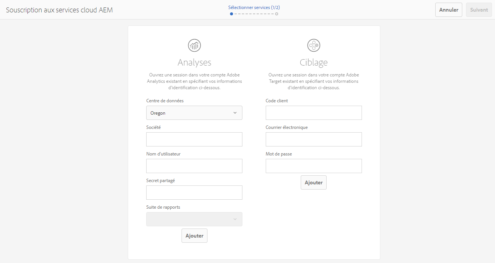
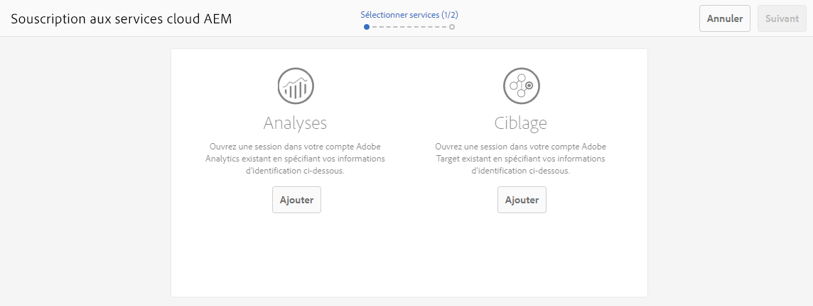

# Souscription à Adobe Analytics et Adobe Target{#opting-into-adobe-analytics-and-adobe-target}

AEM dispose d’une procédure de souscription pour vous aider à l’intégrer à Adobe Analytics et Target. Elle est prête à l’emploi sous la forme d’une tâche préchargée attribuée au groupe d’utilisateurs administrateurs.

Lorsque vous vous connectez en tant qu’administrateur, cette tâche (**Configurer Analytics et Targeting**) est disponible dans la [boîte de réception](/help/sites-authoring/inbox.md#out-of-the-box-administrative-tasks). En fonction des informations d’identification que vous fournissez, elle vous aide à configurer et à intégrer ces services.

Vous disposez des options suivantes pour configurer l’intégration :

* Configuration de l’intégration via la tâche

    Cela peut être effectué immédiatement ou ultérieurement ; la tâche reste dans la boîte de réception jusqu’à ce qu’une action soit effectuée. Dans les deux cas, la configuration peut être effectuée directement dans l’interface utilisateur ou à l’aide d’une `.properties` fichier .

* Exclusion de l’intégration

   Sélectionnez cette option si vous préférez [configurer manuellement l’intégration](/help/sites-administering/marketing-cloud.md). Voir aussi la rubrique [Intégration d’AEM à Adobe Target et Adobe Analytics à l’aide de DTM](https://helpx.adobe.com/fr/experience-manager/using/integrate-digital-marketing-solutions.html).

* Définissez la configuration et la mise en service à l’aide d’un script.

## Configuration de l’intégration {#configuring-the-integration}

Souscrivez à l’intégration avec :

* Analytics pour permettre l’utilisation de ses fonctionnalités de suivi et d’analyse des pages ;
* Target pour permettre l’utilisation de ses fonctionnalités de personnalisation.

Pour l’une ou l’autre des options, vous devez fournir des informations de compte utilisateur et spécifier les pages suivies.

>[!NOTE]
>
>Vous pouvez également fournir les informations de compte Analytics et Target dans un fichier de propriétés qui est lu au démarrage du serveur Voir [Fournir des informations de compte dans un fichier de propriétés](/help/sites-administering/opt-in.md#providing-account-information-using-a-properties-file).

Lorsque vous souscrivez à l’intégration, AEM effectue les tâches suivantes :

* Crée les configurations cloud qui permettent la connexion à Analytics et Target.
* Crée les structures qui définissent les données qui sont suivies.
* Configure les pages web pour utiliser ces services.

>[!NOTE]
>
>AT.js est la bibliothèque cliente par défaut. Tout ceci est configuré sous votre [configuration de services cloud Target](/help/sites-administering/target-configuring.md#creating-a-target-cloud-configuration).
>
>Adobe recommande d’utiliser AT.js comme bibliothèque cliente.

Pour souscrire à partir de la tâche prête à l’emploi préchargée :

1. Dans votre [boîte de réception, sélectionnez et **ouvrez** la tâche Configurer Analytics et Targeting](/help/sites-authoring/inbox.md#taking-action-on-an-item).

   

1. Pour Analytics :

   1. Saisissez les informations du compte utilisateur pour Analytics, puis cliquez sur le bouton **Ajouter** correspondant.
   1. Les informations d’identification appropriées sont authentifiées.
   1. Lorsque le compte Analytics est authentifié, sélectionnez suite de rapports Analytics à utiliser. AEM récupère ces suites de rapports Analytics. L’état devient **Ajouté**.

1. Pour Target :

   1. Saisissez les informations du compte utilisateur pour Target, puis cliquez sur le bouton **Ajouter** correspondant.
   1. Les informations d’identification appropriées sont authentifiées. L’état devient **Ajouté**.

1. Sélectionnez **Suivant**.
1. Sélectionnez les sites pour lesquels Analytics et/ou Target doivent être utilisés.

1. Sélectionnez **Terminé** pour terminer.

   >[!CAUTION]
   >
   >Une fois que vous avez souscrit à la configuration, vous devez publier le site/les pages concernés afin de répliquer ces modifications sur votre instance de publication.

## Exclusion de l’intégration {#opting-out-of-the-integration}

Excluez-vous de l’intégration à Analytics et Target dans les cas suivants :

* Si vous ne souhaitez pas intégrer AEM à ces produits.
* Si vous préférez configurer les intégrations manuellement.

   Pour plus d’informations sur la configuration manuelle des intégrations, voir [Intégration à Adobe Analytics](/help/sites-administering/adobeanalytics.md) et [Intégration à Adobe Target](/help/sites-administering/target.md).

Pour vous exclure, vous devez terminer la tâche préchargée :

* Dans votre [boîte de réception, sélectionnez et **terminez** la tâche Configurer Analytics et Targeting](/help/sites-authoring/inbox.md#taking-action-on-an-item).

## Fournir des informations de compte dans un fichier de propriétés {#providing-account-information-using-a-properties-file}

Installez un fichier de propriétés qu’AEM lit au démarrage du serveur pour configurer les propriétés de compte pour l’intégration à Analytics et Target. Lorsque vous utilisez le fichier de propriétés, l’assistant de souscription utilise automatiquement les propriétés du fichier, et la configuration de cloud est créée en conséquence.

Le fichier de propriétés est un fichier texte appelé marketingcloud.properties que vous enregistrez dans le répertoire de travail utilisé par le processus AEM (généralement le même répertoire que le fichier JAR). Le fichier comprend les propriétés suivantes :

* analytics.server : URL du centre de données Analytics que vous utilisez.
* analytics.company : entreprise associée à votre compte utilisateur Analytics.
* analytics.username : votre nom d’utilisateur Analytics.
* analytics.secret : secret associé à votre nom d’utilisateur Analytics.
* analytics.reportsuite : nom de la suite de rapports Analytics à utiliser.
* target.clientcode : code client associé à votre compte Target.
* target.email : adresse électronique que vous utilisez pour authentifier votre compte Target.
* target.password : mot de passe associé à votre adresse électronique.

Les propriétés et les valeurs sont séparées par des signes égal (=). Les propriétés sont dotées du préfixe `analytics`analytics, et les propriétés du préfixe `target`target. Pour configurer un service, fournissez les valeurs de toutes ses propriétés. Si vous ne souhaitez pas configurer un service, n’indiquez aucune valeur pour ce service.

L’exemple suivant `.properties` comprend les valeurs de propriété pour la création d’une configuration cloud pour Analytics :

```xml
analytics.server=https://test.omniture.com/login/
analytics.company=MyCompany
analytics.username=sbroders
analytics.secret=12345678
analytics.reportsuite=myreportsuite
target.clientcode=
target.email=
target.password=
```

La procédure suivante explique comment s’exclure de l’intégration à l’aide du fichier de propriétés.

1. Créez le fichier `marketingcloud.properties` dans le répertoire de travail utilisé par le processus AEM (instance de création).

   >[!NOTE]
   >
   >Le répertoire de travail est généralement le répertoire contenant le fichier JAR ou `license.properties`.
   >
   >Toutefois, il peut également être défini en tant que chemin absolu par la propriété système :
   >
   >`mac.provisioning.file.container`

1. Ajoutez les valeurs de propriétés conformément à vos comptes Analytics et/ou Target.
1. Démarrez ou redémarrez le serveur, puis connectez-vous à l’aide d’un compte administrateur.
1. Ouvrez la tâche Configurer Analytics et Targeting comme indiqué dans [Configuration de l’intégration](/help/sites-administering/opt-in.md#configuring-the-integration). Au lieu de demander les informations de votre compte, l’assistant utilise les valeurs de la variable `.properties` fichier .

   Sélectionner **Ajouter** pour le service approprié, continuez avec l’assistant.

   

## À propos des configurations cloud {#about-the-cloud-configurations}

Lorsque vous configurez l’intégration à Analytics et Target, AEM crée automatiquement les configurations et les structures cloud requises. Par exemple, la configuration cloud s’appelle Compte Analytics mis en service.

Vous n’avez pas besoin de modifier les configurations cloud. Toutefois, vous pouvez configurer les structures selon vos besoins. (Voir [Mappage des données de composant avec les propriétés Adobe Analytics](/help/sites-administering/adobeanalytics-mapping.md) et [Ajout d’une structure Target](/help/sites-administering/target.md).)

>[!NOTE]
>
>Par défaut, lorsque vous souscrivez à l’assistant de configuration Adobe Target, le ciblage précis est activé.
>
>Le ciblage précis implique que cette configuration du service cloud attend le chargement du contexte avant de charger le contenu. Par conséquent, en termes de performances, le ciblage précis peut entraîner un délai de quelques millisecondes avant le chargement du contenu.
>
>Le ciblage précis est toujours activé sur l’instance de création. Toutefois, sur l’instance de publication, vous pouvez choisir de le désactiver en désactivant la coche en regard de Ciblage précis dans la configuration du service cloud (**http://localhost:4502/etc/cloudservices.html**). Vous pouvez également toujours activer et désactiver le ciblage précis pour chaque composant, quel que soit le paramètre dans la configuration du service cloud.
>
>Si vous avez ***déjà*** créé les composants ciblés et si vous modifiez ce paramètre, vos modifications n’affectent pas ces composants. Vous devez effectuer toutes les modifications directement sur ces composants.

>[!CAUTION]
>
>Lorsque vous souscrivez à la configuration Analytics et qu’un rapport `reportsuite` spécifique est sélectionné, la structure est alors limitée au mode d’exécution de publication. Cela signifie que le suivi fonctionne uniquement sur l’instance de publication.
>
>Si le suivi est également nécessaire sur une instance de création, la valeur doit être remplacée par `all`.

## Configuration de l’installation et mise en service via un script {#configuring-the-setup-and-provisioning-via-script}

En tant qu’administrateur, vous pouvez déclencher l’installation et la mise en service avec un script plutôt que de suivre une à une les étapes de l’assistant. Vous pouvez le faire en procédant comme suit :

* En envoyant une requête POST à **/libs/cq/cloudservicesprovisioning/content/autoprovisioning.json** avec les paramètres requis.

Les paramètres que vous envoyez dépendent de ce qui suit :

* Si vous souhaitez utiliser le fichier **marketingcloud.properties** contenant toutes les informations d’identification requises, vous devez envoyer les paramètres suivants :

   * `automaticProvisioning`= `true`
   * `servicename`= `analytics|target`
   * `path`=chemin d’une page AEM à laquelle joindre les configurations de services cloud créées

   Par exemple, une requête curl qui crée à la fois des configurations Analytics et Target, et les joint à la page we.retail prendrait la forme suivante :

   ```shell
   curl -v -u admin:admin -X POST -d"automaticProvisioning=true&servicename=target&servicename=analytics&path=/content/we-retail" http://localhost:4502/libs/cq/cloudservicesprovisioning/content/autoprovisioning.json
   ```

* Si vous ne souhaitez pas utiliser la variable **marketingcloud.properties** vous devrez envoyer les informations d’identification ainsi que les paramètres ; par exemple :

   * automatiquesProvisioning= `true`
   * servicename= `analytics|target`
   * path=chemin d’une page AEM à laquelle joindre les configurations de services cloud créées ; plusieurs chemins peuvent être définis
   * analytics.server= `https://servername`
   * analytics.company= `Name of company`
   * analytics.username= `me`
   * analytics.secret= `secret`
   * analytics.reportsuite= `we-retail`
   * target.clientcode= `mycompany`
   * target.email= `me@adobe.com`
   * target.password= `password`

   Dans ce cas, la requête curl qui crée à la fois des configurations Analytics et Target, et les joint à la page we-retail prendrait la forme suivante :

   ```shell
   curl -v -u admin:admin -X POST -d"automaticProvisioning=false&servicename=target&servicename=analytics&path=/content/we-retail&analytics.server=https://servername/&analytics.company=Name of company&analytics.username=me&analytics.secret=secret&analytics.reportsuite=weretail&target.clientcode=mycompany&target.email=me@adobe.com&target.password=password" http://localhost:4502/libs/cq/cloudservicesprovisioning/content/autoprovisioning.json
   ```
