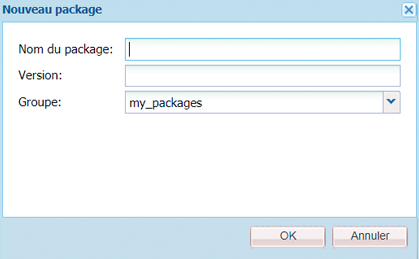

# Utilisation de modules{#how-to-work-with-packages}

>[!CAUTION]
>
>AEM 6.4 a atteint la fin de la prise en charge étendue et cette documentation n’est plus mise à jour. Pour plus d’informations, voir notre [période de support technique](https://helpx.adobe.com/fr/support/programs/eol-matrix.html). Rechercher les versions prises en charge [here](https://experienceleague.adobe.com/docs/?lang=fr).

Les packages permettent d’importer et d’exporter le contenu du référentiel. Par exemple, vous pouvez utiliser des packages pour installer de nouvelles fonctionnalités, transférer du contenu entre des instances et sauvegarder le contenu du référentiel.

Les packages sont accessibles et/ou gérés à partir des pages suivantes :

* [Gestionnaire de modules](#package-manager), que vous utilisez pour gérer les packages dans votre instance d’AEM locale.

* [Partage de modules](#package-share), un serveur centralisé contenant à la fois des packages disponibles publiquement et des packages privés pour votre entreprise. Les packages publics peuvent contenir des correctifs, de nouvelles fonctionnalités, de la documentation, etc.

Vous pouvez transférer des modules entre le gestionnaire de modules, le partage de modules et votre système de fichiers.

## Que sont les packages ? {#what-are-packages}

Un package est un fichier zip contenant du contenu de référentiel sous la forme d’une sérialisation du système de fichiers (appelée sérialisation &quot;Vault&quot;). Vous obtenez ainsi une représentation facile à utiliser et à modifier des fichiers et des dossiers.

Les modules comprennent le contenu, le contenu de page et le contenu associé au projet, sélectionnés à l’aide de filtres.

Un package contient également les méta-informations du coffre, notamment les définitions des filtres et les informations de configuration de l’importation. D’autres propriétés de contenu (qui ne sont pas utilisées pour l’extraction de package) peuvent être incluses dans le package, telles qu’une description, une image visuelle ou une icône ; ces propriétés sont destinées au consommateur du module de contenu et à titre d’information uniquement.

>[!NOTE]
>
>Les packages représentent la version actuelle du contenu au moment où le package est créé. Elles n’incluent aucune version précédente du contenu que AEM conserve dans le référentiel.

Vous pouvez effectuer les actions suivantes sur ou avec des modules :

* créer de nouveaux packages ; définition des paramètres et des filtres de package selon les besoins ;
* Prévisualiser le contenu du module (avant la génération)
* Créer des packages
* Affichage des informations sur le module
* Afficher le contenu du module (après la création)
* Modifier la définition des packages existants
* Reconstruire les packages existants
* Réencapsuler des modules
* Télécharger des modules d’AEM vers votre système de fichiers
* Charger des modules de votre système de fichiers dans votre instance d’AEM locale
* Valider le contenu du package avant installation
* Exécution d’une installation d’exécution d’essai
* Installer des packages (AEM n’installe pas automatiquement les packages après le téléchargement)
* Suppression de modules
* Télécharger des modules, tels que des correctifs, depuis la bibliothèque Package Share
* Chargement de modules dans la section interne de l’entreprise de la bibliothèque de partage de modules

## Informations sur le module {#package-information}

Une définition de package est composée de différents types d’informations :

* [Paramètres du package](#package-settings)
* [Filtres de package](#package-filters)
* [Captures d’écran des packages](#package-screenshots)
* [Icônes de module](#package-icons)

### Paramètres du package {#package-settings}

Vous pouvez modifier divers paramètres de module pour définir des aspects tels que la description du module, les bogues associés, les dépendances et les informations sur le fournisseur.

Le **Paramètres du module** est disponible via la boîte de dialogue **Modifier** lorsque [création](#creating-a-new-package) ou [édition](#viewing-and-editing-package-information) un module et fournit trois onglets pour la configuration. Une fois les modifications effectuées, cliquez sur **OK** pour les enregistrer.


| **Champ** | **Description** |
|---|---|
| Nom | Le nom du package. |
| Groupe | Nom du groupe auquel ajouter le module pour l’organisation des modules. Saisissez le nom d’un nouveau groupe ou sélectionnez un groupe existant. |
| Version | Texte à utiliser pour la version personnalisée. |
| Description | Brève description du package. Les balises de HTML peuvent être utilisées pour la mise en forme. |
| Miniature | L’icône qui s’affiche dans la liste des packages. Cliquez sur Parcourir pour sélectionner un fichier local. |


<table> 
 <tbody> 
  <tr> 
   <th><strong>Champ</strong></th> 
   <th><strong>Description</strong></th> 
   <th><strong>Format/Exemple</strong></th> 
  </tr> 
  <tr> 
   <td>Nom</td> 
   <td>Nom du fournisseur.</td> 
   <td><em>Geometrixx AEM<br /> </em></td> 
  </tr> 
  <tr> 
   <td>URL</td> 
   <td>Adresse URL du fournisseur.</td> 
   <td><em>https://www.aem-geometrixx.com</em></td> 
  </tr> 
  <tr> 
   <td>Lien</td> 
   <td>Lien spécifique au package vers une page de fournisseur.</td> 
   <td><em>https://www.aem-geometrixx.com/mypackage.html</em></td> 
  </tr> 
  <tr> 
   <td>Requiert<br /> </td> 
   <td> 
    <ul> 
     <li>Administrateur : Sélectionnez cette option lorsque le package ne peut être installé que par un compte disposant de droits d’administrateur.</li> 
     <li>Redémarrez : Sélectionnez le moment où le serveur doit être redémarré après l’installation du package.</li> 
    </ul> </td> 
   <td> </td> 
  </tr> 
  <tr> 
   <td>Traitement AC</td> 
   <td><p>Indiquez le mode de traitement des informations de contrôle d’accès définies dans le package lors de l’importation du package :</p> 
    <ul> 
     <li><strong>Ignorer</strong></li> 
     <li><strong>Remplacer</strong></li> 
     <li><strong>Fusionner</strong></li> 
     <li><strong>Clair</strong></li> 
     <li><strong>MergePreserve</strong></li> 
    </ul> <p>La valeur par défaut est <strong>Ignorer</strong>.</p> </td> 
   <td> 
    <ul> 
     <li><strong>Ignorer</strong> - conserver les listes de contrôle d’accès dans le référentiel</li> 
     <li><strong>Remplacer</strong> - remplacer les listes de contrôle d’accès dans le référentiel</li> 
     <li><strong>Fusion</strong> - fusionner les deux ensembles de listes de contrôle d’accès</li> 
     <li><strong>Effacer</strong> - effacer les listes ACL</li> 
     <li><strong>MergePreserve</strong> - fusionner le contrôle d’accès dans le contenu avec celui fourni avec le package en ajoutant les entrées de contrôle d’accès des entités non présentes dans le contenu</li> 
    </ul> </td> 
  </tr> 
 </tbody> 
</table>


| **Champ** | **Description** | **Format/Exemple** |
|---|---|---|
| Testé avec | Le nom et la version du produit auquel ce package est destiné ou avec lequel il est compatible. | *AEM6* |
| Correction de bogues/problèmes | Un champ de texte vous permettant de répertorier les détails des bogues corrigés avec ce module. Veuillez répertorier chaque bogue sur une ligne distincte. | bug-nr summary |
| Dépend de | Répertorie les informations de dépendance qui doivent être respectées lorsque d’autres modules sont nécessaires pour que le module actuel s’exécute comme prévu. Ce champ est important lorsque vous utilisez des correctifs. | groupId:name:version |
| Remplace | Liste des packages obsolètes que ce package remplace. Avant l’installation, vérifiez que ce package contient tout le contenu nécessaire des packages obsolètes afin qu’aucun contenu ne soit remplacé. | groupId:name:version |

### Filtres de package {#package-filters}

Les filtres identifient les nœuds du référentiel à inclure dans le package. Une **définition de filtre** spécifie les informations suivantes :

* **Chemin d’accès racine** du contenu à inclure.
* **Règles** incluant ou excluant certains nœuds sous le chemin d’accès racine.

Les filtres peuvent ne comporter aucune règle ou en comporter plusieurs. Lorsqu’aucune règle n’est définie, le package contient tout le contenu sous le chemin d’accès racine.

Vous pouvez définir une ou plusieurs définitions de filtre pour un package. Utilisez plusieurs filtres de manière à inclure le contenu de différents chemins d’accès racine.


Le tableau suivant décrit ces règles et fournit des exemples :

<table> 
 <tbody> 
  <tr> 
   <th> Type de règle</th> 
   <th>Description </th> 
   <th>Exemple </th> 
  </tr> 
  <tr> 
   <td> inclure</td> 
   <td>Vous pouvez définir un chemin ou utiliser une expression régulière pour spécifier tous les noeuds à inclure.<br /> <br /> L’inclusion d’un répertoire : 
    <ul> 
     <li>inclure ce répertoire ; <i>et</i> tous les fichiers et dossiers de ce répertoire (c’est-à-dire toute la sous-arborescence) ;</li> 
     <li><strong>not</strong> inclure d’autres fichiers ou dossiers sous le chemin d’accès racine spécifié ;</li> 
    </ul> </td> 
   <td>/libs/sling/install(/.*)? </td> 
  </tr> 
  <tr> 
   <td> exclusion</td> 
   <td>Vous pouvez spécifier un chemin ou utiliser une expression régulière pour spécifier tous les noeuds à exclure.<br /> <br /> L’exclusion d’un répertoire exclut ce répertoire. <i>et</i> tous les fichiers et dossiers de ce répertoire (c’est-à-dire toute la sous-arborescence).<br /> </td> 
   <td>/libs/wcm/foundation/components(/.*)?</td> 
  </tr> 
 </tbody> 
</table>

>[!NOTE]
>
>Un package peut contenir plusieurs définitions de filtre, de sorte que les noeuds de différents emplacements puissent être facilement combinés en un seul package.

Les filtres de module sont le plus souvent définis lors de votre première utilisation. [créer le module ;](#creating-a-new-package), mais elles peuvent également être modifiées ultérieurement (après quoi le module doit être recréé).

### Captures d’écran des packages {#package-screenshots}

Vous pouvez joindre des captures d’écran à votre module afin de fournir une représentation visuelle du contenu ; par exemple, en fournissant des captures d’écran de la nouvelle fonctionnalité.

### Icônes de module {#package-icons}

Vous pouvez également joindre une icône à votre module pour fournir une représentation visuelle de référence rapide de ce qu’il contient. Il s’affiche ensuite dans la liste des modules et peut vous aider à identifier facilement le module, ou la classe du module.

Comme un package peut contenir une icône, les conventions suivantes sont utilisées pour les packages officiels :

>[!NOTE]
>
>Pour éviter toute confusion, utilisez une icône descriptive pour votre package et n’utilisez aucune des icônes officielles.

Package de correctif officiel :


Package d’installation ou d’extension d’AEM officiel :

Feature Packs officiels :


## Gestionnaire de packages {#package-manager}

Le gestionnaire de modules gère les modules de votre installation AEM locale. Après avoir [attribué les autorisations nécessaires](#permissions-needed-for-using-the-package-manager) vous pouvez utiliser le gestionnaire de modules pour diverses actions, notamment la configuration, la création, le téléchargement et l’installation de vos modules. Les éléments clés à configurer sont les suivants :

* [Paramètres du package](#package-settings)
* [Filtres de package](#package-filters)

### Autorisations nécessaires pour utiliser le gestionnaire de modules {#permissions-needed-for-using-the-package-manager}

Pour accorder aux utilisateurs le droit de créer, modifier, charger et installer des packages, vous devez leur accorder les autorisations appropriées aux emplacements suivants :

* **/etc/packages** (droits complets à l’exclusion de la suppression)
* le noeud contenant le contenu du module ;

Voir [Définition des autorisations](/help/sites-administering/security.md) pour obtenir des instructions sur la modification des autorisations.

### Création d’un module {#creating-a-new-package}

Pour créer une définition de package :

1. Dans l’écran de bienvenue AEM, cliquez sur **Packages** (ou de la fonction **Outils** double-cliquez sur la console **Packages**).

1. Sélectionnez **Gestionnaire de modules**.
1. Cliquez sur **Créer un package**.

   >[!NOTE]
   >
   >Si votre instance comporte de nombreux modules, il se peut qu’une structure de dossiers soit en place. Vous pouvez donc accéder au dossier cible requis avant de créer le module.

1. Dans la boîte de dialogue :

   

   Saisissez les informations suivantes :

   * **Nom de groupe**

      Nom du groupe cible (ou dossier). Les groupes sont conçus pour vous aider à organiser vos modules.

      Un dossier sera créé pour le groupe s’il n’existe pas déjà. Si vous laissez le nom du groupe vide, il crée le package dans la liste de packages principale (Accueil > Packages).

   * **Nom du module**

      Le nom de votre nouveau package. Sélectionnez un nom explicite pour vous aider (et d’autres) à identifier facilement le contenu du module.

   * **Version**

      Champ de texte permettant d’indiquer une version. Il sera ajouté au nom du module pour former le nom du fichier zip.
   Cliquez sur **OK** pour créer le package.

1. AEM répertorie le nouveau module dans le dossier de groupe approprié.

   

   Cliquez sur l’icône ou le nom du module à ouvrir.

   

   >[!NOTE]
   >
   >Vous pouvez revenir à cette page ultérieurement, si nécessaire.

1. Cliquez sur **Modifier** pour modifier la variable [paramètres du package](#package-settings).

   Vous pouvez y ajouter des informations et/ou définir certains paramètres ; par exemple, il s’agit d’une description, de la [icon](#package-icons), bogues associés et ajout de détails sur le fournisseur.

   Cliquez sur **OK** une fois que vous avez terminé de modifier les paramètres.

1. Ajouter **[Captures d’écran](#package-screenshots)** au module selon les besoins. Une instance est disponible lors de la création du module, ajoutez-en davantage si nécessaire en utilisant **Capture d’écran du module** à partir du sidekick.

   Ajoutez l’image réelle en double-cliquant sur le composant d’image dans le **Captures d’écran** , ajouter une image, puis cliquer sur **OK**.

1. Définissez la variable **[Filtres de module](#package-filters)** en faisant glisser les instances de la variable **Définition du filtre** dans le sidekick, puis double-cliquez pour ouvrir et modifier :

   

   Précisez les paramètres suivants :

   * **Chemin racine**
le contenu à conditionner ; il peut s’agir de la racine d’une sous-arborescence.
   * **Règles**
Les règles sont facultatives ; pour les définitions de packages simples, il n’est pas nécessaire de spécifier des règles d’inclusion ou d’exclusion.

      Si nécessaire, vous pouvez définir [**Inclure** ou **Exclure** rules](#package-filters) pour définir exactement le contenu du module.

      Ajoutez des règles à l’aide du **+** , vous pouvez également supprimer des règles à l’aide de la propriété **-** symbole . Les règles sont appliquées selon leur ordre, positionnez-les selon vos besoins à l’aide de la fonction **Monter** et **Descendre** des boutons.
   Cliquez ensuite sur **OK** pour enregistrer le filtre.

   >[!NOTE]
   >
   >Vous pouvez utiliser autant de définitions de filtre que nécessaire, bien qu’il faille veiller à ce qu’elles ne soient pas en conflit. Utilisation **Aperçu** pour confirmer le contenu du module.

1. Pour confirmer le contenu du module, vous pouvez utiliser **Aperçu**. Cette opération effectue une exécution d’essai du processus de génération et répertorie tout ce qui sera ajouté au module lorsqu’il sera réellement créé.
1. Vous pouvez maintenant [créer](#building-a-package) votre package.

   >[!NOTE]
   >
   >Il n’est pas obligatoire de créer le package à ce stade ; il peut être effectué ultérieurement.

### Concevoir un package {#building-a-package}

Un module est souvent créé en même temps que vous [créer la définition de package ;](#creating-a-new-package), mais vous pouvez renvoyer ultérieurement pour créer ou recréer le module. Cela peut s’avérer utile si le contenu du référentiel a changé.

>[!NOTE]
>
>Avant de créer le module, il peut s’avérer utile de prévisualiser le contenu du module. Pour ce faire, cliquez sur **Aperçu**.

1. Ouvrez la définition de package à partir de **Gestionnaire de modules** (cliquez sur l’icône ou le nom du module).

1. Cliquez sur **Concevoir**. Une boîte de dialogue vous demande de confirmer que vous souhaitez créer le module.

   >[!NOTE]
   >
   >Cela est particulièrement important lorsque vous recréez un module, car le contenu du module sera remplacé.

1. Cliquez sur **OK**. AEM crée le module, répertoriant tout le contenu ajouté au module tel qu’il le fait. Une fois l’opération terminée, AEM affiche un message de confirmation indiquant que le package a été conçu et (lorsque vous fermez la boîte de dialogue) met à jour les informations de la liste de packages.

### Réencapsuler un package {#rewrapping-a-package}

Une fois qu’un module a été créé, il peut être réencapsulé, si nécessaire.

Le retour à la ligne modifie les informations du module - *without* modification du contenu du package. Les informations sur le module sont la miniature, la description, etc., en d’autres termes, tout ce que vous pouvez modifier à l’aide de la fonction **Paramètres du module** (pour ouvrir ce clic **Modifier**).

L’un des principaux cas d’utilisation du retour à la ligne est la préparation d’un module pour le partage de module. Par exemple, vous pouvez avoir un package existant et décider de le partager avec d’autres. Pour ce faire, ajoutez une miniature et une description. Au lieu de recréer l’ensemble du module avec toutes ses fonctionnalités (ce qui peut prendre un certain temps et entraîner le risque que le module ne soit plus identique à l’original), vous pouvez le réencapsuler et simplement ajouter la miniature et la description.

1. Ouvrez la définition de package à partir de **Gestionnaire de modules** (cliquez sur l’icône ou le nom du module).

1. Cliquez sur **Modifier** et mettez à jour les **[Paramètres du package](#package-settings)**, au besoin. Cliquez sur **OK** pour enregistrer.

1. Cliquez sur **Réencapsuler**, une boîte de dialogue de confirmation s’affiche.

### Affichage et modification des informations du module {#viewing-and-editing-package-information}

Pour afficher ou modifier des informations sur une définition de package :

1. Dans le Gestionnaire de modules, accédez au module à afficher.
1. Cliquez sur l’icône de module du module que vous souhaitez afficher. Cette action ouvre la page du module qui répertorie les informations sur la définition de module :

   

   >[!NOTE]
   >
   >Vous pouvez également modifier et effectuer certaines actions sur le module à partir de cette page.
   >
   >Les boutons disponibles dépendent si le package a déjà été créé ou non.

1. Si le module a déjà été créé, cliquez sur **Contenu**, une fenêtre s’ouvre et répertorie l’ensemble du contenu du module :

### Afficher le contenu du package et test de l’installation {#viewing-package-contents-and-testing-installation}

Une fois qu’un module a été créé, vous pouvez en afficher le contenu :

1. Dans le Gestionnaire de modules, accédez au module à afficher.
1. Cliquez sur l’icône de module du module que vous souhaitez afficher. Cette action ouvre la page du module qui répertorie les informations sur la définition de module.

1. Pour afficher le contenu, cliquez sur **Contenu**, une fenêtre s’ouvre et répertorie l’ensemble du contenu du module :

   

1. Pour exécuter une exécution d’essai de l’installation, cliquez sur **Test de l’installation**. Une fois que vous avez confirmé l’action, une fenêtre s’ouvre et répertorie les résultats comme si l’installation avait été effectuée :

   

### Télécharer des packages sur votre système de fichiers {#downloading-packages-to-your-file-system}

Cette section décrit comment télécharger un module d’AEM vers votre système de fichiers à l’aide de **Gestionnaire de modules**.

>[!NOTE]
>
>Voir [Partage de modules](#package-share) pour plus d’informations sur le téléchargement des correctifs, Feature Packs et packages à partir de la zone publique et de la zone interne du partage de package de votre entreprise.
>
>À partir du partage de modules, vous pouvez :
>
>* télécharger des modules depuis [Partage de modules directement dans votre instance AEM locale](#downloading-and-installing-packages-from-package-share).\
   >  Lors du téléchargement, le package est importé dans votre référentiel, après quoi vous pouvez l’installer immédiatement sur votre instance locale à l’aide de la fonction **Gestionnaire de modules**. Ces packages incluent des correctifs et d’autres packages partagés.
>
>* télécharger des modules depuis [Partage de modules sur votre système de fichiers](#downloading-packages-to-your-file-system-from-package-share).
>


1. Dans l’écran de bienvenue AEM, cliquez sur **Packages**, puis sélectionnez **Gestionnaire de modules**.
1. Accédez au module à télécharger.

   

1. Cliquez sur le lien formé par le nom du fichier zip (souligné) pour le package que vous souhaitez télécharger ; par exemple `export-for-offline.zip`.

   AEM télécharge le module sur votre ordinateur (à l’aide d’une boîte de dialogue de téléchargement de navigateur standard).

### Chargement des packages à partir du système de fichiers {#uploading-packages-from-your-file-system}

Un chargement de package vous permet de charger un package de votre système de fichiers dans AEM Package Manager.

>[!NOTE]
>
>Voir [Chargement de modules dans le partage de modules interne à l’entreprise](#uploading-a-package) pour charger un module dans la zone privée de votre entreprise du partage de modules.

Pour charger un package :

1. Accédez au **Gestionnaire de modules**. Ensuite, accédez au dossier du groupe dans lequel vous souhaitez charger le module.

   

1. Cliquez sur **Upload Package** (Télécharger le package).

   

   * **File**

      Vous pouvez saisir directement le nom du fichier ou utiliser la variable **Parcourir..** pour sélectionner le module requis dans votre système de fichiers local (après la sélection, cliquez sur **OK**).

   * **Forcer le chargement**

      Si un package portant ce nom existe déjà, vous pouvez cliquer dessus pour forcer le téléchargement (et remplacer le package existant).
   Cliquez sur **OK** afin que le nouveau module soit chargé et répertorié dans la liste du gestionnaire de modules.

   >[!NOTE]
   >
   >Pour que le contenu soit disponible pour AEM, veillez à [installer le package](#installing-packages).

### Validation de packages {#validating-packages}

Avant d&#39;installer un package, vous pouvez vérifier son contenu. Parce que les modules peuvent modifier des fichiers superposés sous `/apps` et/ou ajouter, modifier et supprimer des listes de contrôle d’accès, il est souvent utile de valider ces modifications avant l’installation.

#### Options de validation {#validation-options}

Le mécanisme de validation peut vérifier les caractéristiques suivantes du package :

* Imports de modules OSGi
* Recouvrements
* Listes ACL

Ces options sont présentées ci-dessous.

* **Valider les importations de packages OSGi**

   **Contenu vérifié**

   Cette validation inspecte le package pour tous les fichiers JAR (lots OSGi), extrait leurs `manifest.xml` (qui contient les dépendances versionnées sur lesquelles repose le bundle OSGi) et vérifie que l’instance AEM exporte les dépendances avec les versions correctes.

   **Comment est-ce rapporté ?**

   Toutes les dépendances versionnées qui ne peuvent pas être satisfaites par l’instance AEM sont répertoriées dans la variable **Journal d’activité** du gestionnaire de modules.

   **États d’erreur**

   Si les dépendances ne sont pas satisfaites, les lots OSGi du package avec ces dépendances ne démarrent pas. Cela entraîne un déploiement d’application interrompu, car tout ce qui dépend du lot OSGi non démarré ne fonctionnera pas correctement.

   **Résolution d’erreurs**

   Pour résoudre les erreurs dues à des lots OSGi insatisfaits, la version de dépendance du lot avec des importations insatisfaites doit être ajustée.

* **Valider les recouvrements**

   **Contenu vérifié**

   Cette validation détermine si le package en cours d’installation contient un fichier qui est déjà recouvert dans l’instance d’AEM de destination.

   Par exemple, étant donné un recouvrement présent dans `/apps/sling/servlet/errorhandler/404.jsp`, un package contenant `/libs/sling/servlet/errorhandler/404.jsp`, il modifiera donc le fichier existant dans `/libs/sling/servlet/errorhandler/404.jsp`.

   **Comment sont-ils signalés ?**

   Toutes ces superpositions sont décrites dans la section **Journal d’activité** du gestionnaire de modules.

   **États d’erreur**

   Un état d’erreur signifie que le package tente de déployer un fichier déjà recouvert. Par conséquent, les modifications du package seront remplacées (et donc &quot;masquées&quot;) par la superposition et ne prendront pas effet.

   **Résolution d’erreurs**

   Pour résoudre ce problème, le responsable de l’ du fichier de recouvrement dans `/apps` doit réviser les modifications apportées au fichier recouvert dans `/libs` et incorporer les modifications nécessaires dans le recouvrement ( `/apps`), puis redéployez le fichier recouvert.

   >[!NOTE]
   >
   >Notez que le mécanisme de validation ne permet pas de réconcilier si le contenu superposé a été correctement incorporé dans le fichier de recouvrement. Par conséquent, cette validation continuera à signaler des conflits même après que les modifications nécessaires auront été apportées.

* **Valider les listes ACL**

   **Contenu vérifié**

   Cette validation vérifie quelles autorisations sont ajoutées, comment elles seront gérées (fusion/remplacement) et si les autorisations actuelles seront affectées.

   **Comment est-ce rapporté ?**

   Les autorisations sont décrites dans la section **Journal d’activité** du gestionnaire de modules.

   **États d’erreur**

   Aucune erreur explicite ne peut être fournie. La validation indique simplement si de nouvelles autorisations ACL seront ajoutées ou affectées lors de l’installation du package.

   **Résolution d’erreurs**

   À l’aide des informations fournies par la validation, les noeuds concernés peuvent être examinés dans CRXDE et les listes de contrôle d’accès peuvent être ajustées dans le module, si nécessaire.

   >[!CAUTION]
   >
   >Il est recommandé que les packages n’affectent pas les listes de contrôle d’accès fournies par AEM, car cela peut entraîner un comportement inattendu du produit.

#### Exécution de la validation {#performing-validation}

La validation des packages peut se faire de deux manières différentes :

* Via l’interface utilisateur du gestionnaire de modules
* via une requête HTTP POST, telle que cURL.

>[!NOTE]
>
>La validation doit toujours avoir lieu après le chargement du package, mais avant son installation.

**Validation de package via le gestionnaire de modules**

1. Ouvrez le gestionnaire de modules à l’adresse `https://<server>:<port>/crx/packmgr`
1. Sélectionnez le package dans la liste, puis sélectionnez **Plus** dans le menu déroulant de l’en-tête, puis **Valider** dans le menu déroulant.

   >[!NOTE]
   >
   >Cette opération doit être effectuée après le téléchargement du module de contenu, mais avant l’installation du module.

1. Dans la boîte de dialogue modale qui s’affiche alors, utilisez les cases à cocher pour sélectionner le ou les types de validation et commencez la validation en cliquant sur **Valider**. Sinon, cliquez sur **Annuler**.

1. Les validations sélectionnées sont ensuite exécutées. Les résultats s’affichent dans le journal d’activité du Gestionnaire de modules.

**Validation de packages via une requête HTTP POST**

La requête POST se présente comme suit.

```
https://<host>:<port>/crx/packmgr/service.jsp?cmd=validate&type=osgiPackageImports,overlays,acls
```

>[!NOTE]
>
>Le `type` peut être n’importe quelle liste non triée séparée par des virgules composée des éléments suivants :
>
>* `osgiPackageImports`
>* `overlays`
>* `acls`
>
>La valeur de `type` par défaut : `osgiPackageImports` si elle n’est pas transmise.

Voici un exemple d’utilisation de cURL pour exécuter une validation de package.

1. Si vous utilisez cURL, exécutez une instruction similaire à celle-ci :

   ```shell
   curl -v -X POST --user admin:admin -F file=@/Users/SomeGuy/Desktop/core.wcm.components.all-1.1.0.zip 'http://localhost:4502/crx/packmgr/service.jsp?cmd=validate&type=osgiPackageImports,overlays,acls'
   ```

1. La validation demandée est exécutée et la réponse est renvoyée sous la forme d’un objet JSON.

>[!NOTE]
>
>La réponse à une requête de POST HTTP de validation sera un objet JSON avec les résultats de la validation.

### Installation des packages {#installing-packages}

Après avoir téléchargé un package, vous devez installer le contenu. Pour que le contenu du package soit installé et fonctionnel, il doit être à la fois :

* chargé dans AEM (soit [téléchargé depuis votre système de fichiers](#uploading-packages-from-your-file-system) ou [téléchargé à partir du partage de package](#downloading-and-installing-packages-from-package-share))

* installé

>[!CAUTION]
>
>L’installation d’un package peut remplacer ou supprimer le contenu existant. Ne chargez un package que si vous êtes certain qu’il ne supprime pas ou ne remplace pas le contenu dont vous avez besoin.
>
>Pour voir le contenu, ou l’impact, d’un module, vous pouvez :
>
>* Effectuez un test d&#39;installation du package sans modifier le contenu :\
   >  Ouvrez le module (cliquez sur l’icône ou le nom du module), puis cliquez sur **Test Install**.
>
>* Consultez la liste des contenus de package :\
   >  Ouvrez le module et cliquez sur **Contenu**.
>


>[!NOTE]
>
>Immédiatement avant l’installation de votre package, un package instantané est créé pour contenir le contenu qui sera remplacé.
>
>Cet instantané sera réinstallé si/lorsque vous désinstallez votre package.

>[!CAUTION]
>
>Si vous installez des ressources numériques, vous devez :
>
>* Tout d’abord, désactivez WorkflowLauncher.\
   >  Utilisez l’option du menu Composants de la console OSGi pour le désactiver. `com.day.cq.workflow.launcher.impl.WorkflowLauncherImpl`.
>
>* Ensuite, une fois l’installation terminée, réactivez WorkflowLauncher.
>
>La désactivation de WorkflowLauncher permet de s’assurer que la structure de l’importateur de ressources ne manipule pas (involontairement) les ressources lors de l’installation.

1. Dans le Gestionnaire de modules, accédez au module à installer.

   Un **Installer** s’affiche sur le côté des modules qui n’ont pas encore été installés.

   >[!NOTE]
   >
   >Vous pouvez également ouvrir le module en cliquant sur son icône pour accéder au **Installer** à cet endroit.

1. Cliquez sur **Installer** pour lancer l’installation. Une boîte de dialogue vous invite à confirmer et énumère toutes les modifications apportées. Lorsque vous avez terminé, cliquez sur **Fermer** dans la boîte de dialogue.

   Le mot **Installé** s’affiche en regard du package après son installation.

### Chargement et installation basés sur le système de fichiers {#file-system-based-upload-and-installation}

Il existe une autre manière de charger et d’installer des packages sur votre instance. Dans votre système de fichiers, vous disposez d’un `crx-quicksart` dossier avec votre fichier jar et `license.properties` fichier . Vous devez créer un dossier nommé `install` under `crx-quickstart`. Vous aurez alors quelque chose comme ceci : `<aem_home>/crx-quickstart/install`

Dans cette installation, vous pouvez ajouter directement vos packages. Ils sont chargés et installés automatiquement sur votre instance. Une fois cette opération terminée, vous pouvez voir les modules dans le Gestionnaire de modules.

Si votre instance est en cours d’exécution, ajoutez un module à la variable `install` lance directement le téléchargement et l’installation sur l’instance. Si votre instance n’est pas en cours d’exécution, les modules que vous placez dans la variable `install` sera installé au démarrage dans l’ordre alphabétique.

>[!NOTE]
>
>Vous pouvez également le faire avant même de démarrer l’instance pour la première fois. Pour ce faire, vous devez créer la variable `crx-quickstart` créer manuellement le dossier `install` et placez vos paquets. Lorsque vous lancez votre instance pour la première fois, les packages sont installés dans l’ordre alphabétique.

### Désinstaller les packages {#uninstalling-packages}

AEM vous permet de désinstaller des packages. Cette action rétablit le contenu du référentiel affecté à l’instantané effectué immédiatement avant l’installation du package.

>[!NOTE]
>
>Lors de l’installation, un package instantané est créé avec le contenu qui sera remplacé.
>
>Ce package sera réinstallé lorsque vous désinstallez le package.

1. Dans le Gestionnaire de modules, accédez au module à désinstaller.
1. Cliquez sur l’icône de package du package que vous souhaitez désinstaller.
1. Cliquez sur **Désinstaller** pour supprimer le contenu de ce module du référentiel. Une boîte de dialogue vous invite à confirmer et énumère toutes les modifications apportées. Lorsque vous avez terminé, cliquez sur **Fermer** dans la boîte de dialogue.

### Suppression de packages {#deleting-packages}

Pour supprimer un module de la ou des listes du Gestionnaire de modules :

>[!NOTE]
>
>Les fichiers/noeuds installés du package sont les suivants : **not** supprimé.

1. Dans le **Outils** , développez la console **Packages** pour afficher votre package dans le volet de droite.

1. Cliquez sur le module à supprimer afin qu’il soit mis en surbrillance, puis effectuez l’une des opérations suivantes :

   * Cliquez sur **Supprimer** dans le menu de la barre d’outils.
   * Cliquez avec le bouton droit et sélectionnez **Supprimer**.

   

1. AEM vous invite à confirmer que vous souhaitez supprimer le package. Cliquez sur **OK** pour confirmer la suppression.

>[!CAUTION]
>
>Si ce package a déjà été installé, la variable *installé* content **not** être supprimées.

### Répliquer les packages {#replicating-packages}

Répliquez le contenu d’un package pour l’installer sur l’instance de publication :

1. Dans le **Gestionnaire de modules**, accédez au module à répliquer.

1. Cliquez sur l’icône ou le nom du module à répliquer pour le développer.
1. Dans le **Plus** menu déroulant de la barre d’outils, sélectionnez **Répliquer**.

## Partage de packages {#package-share}

Le partage de modules était un serveur centralisé, rendu public, permettant de partager des modules de contenu.

Il a été remplacé par [Distribution logicielle.](#software-distribution)

## Distribution logicielle {#software-distribution}

[Distribution logicielle](https://downloads.experiencecloud.adobe.com) est la nouvelle interface utilisateur conçue pour simplifier la recherche et le téléchargement des modules AEM.

Pour plus d’informations, reportez-vous à la [Documentation sur la distribution logicielle.](https://experienceleague.adobe.com/docs/experience-cloud/software-distribution/home.html?lang=fr)

>[!CAUTION]
>
>AEM gestionnaire de modules n’est actuellement pas utilisable avec Distribution logicielle. Vous téléchargez vos packages sur votre disque local.
