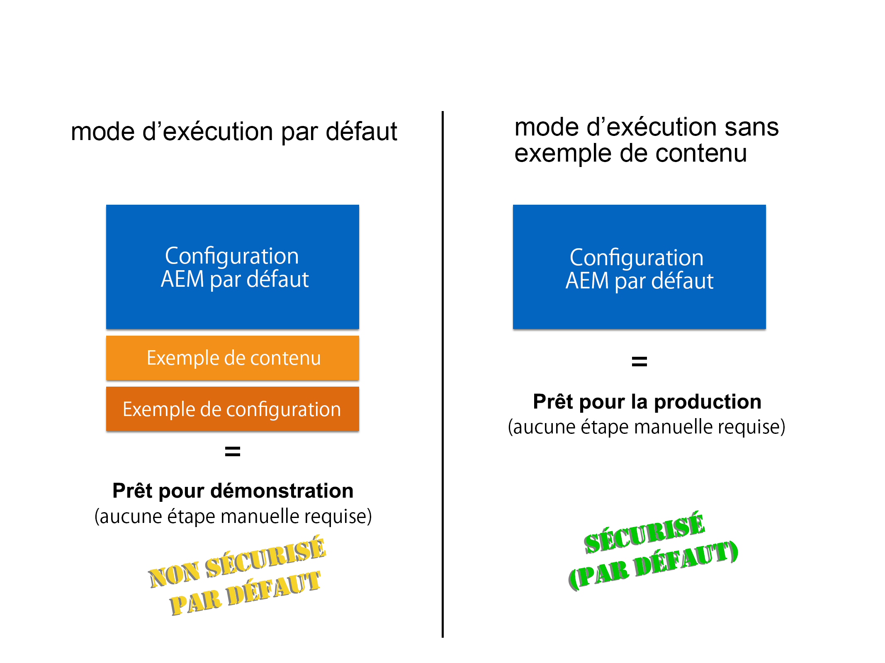

# Exécuter AEM en mode Prêt pour la production{#running-aem-in-production-ready-mode}

>[!CAUTION]
>
>AEM 6.4 a atteint la fin de la prise en charge étendue et cette documentation n’est plus mise à jour. Pour plus d’informations, voir notre [période de support technique](https://helpx.adobe.com/fr/support/programs/eol-matrix.html). Rechercher les versions prises en charge [here](https://experienceleague.adobe.com/docs/?lang=fr).

Avec AEM 6.1, Adobe introduit le nouveau mode d’exécution `"nosamplecontent"` visant à automatiser les étapes nécessaires pour préparer le déploiement d’une instance AEM dans un environnement d’exploitation.

Le nouveau mode d’exécution configure non seulement automatiquement l’instance pour qu’elle soit conforme aux bonnes pratiques de sécurité décrites dans la liste de contrôle de sécurité, mais en plus supprime tous les exemples d’applications et de configurations geometrixx dans le processus.

>[!NOTE]
>
>Étant donné que, pour des raisons pratiques, le mode AEM Prêt pour la production ne couvre que la majorité des tâches nécessaires pour sécuriser une instance, il est vivement recommandé de consulter le [Liste de contrôle de sécurité](/help/sites-administering/security-checklist.md) avant de passer en ligne avec votre environnement de production.
>
>De plus, notez qu’exécuter AEM en mode Prêt pour la production aura pour effet de désactiver l’accès à CRXDE Lite. Si vous en avez besoin à des fins de débogage, consultez la section [Activation de CRXDE Lite dans AEM](/help/sites-administering/enabling-crxde-lite.md).



Pour pouvoir exécuter AEM en mode Prêt pour l’exploitation, il vous suffit d’ajouter le composant `nosamplecontent` via le commutateur de mode d’exécution `-r` à vos arguments de démarrage existants :

```shell
java -jar aem-quickstart.jar -r nosamplecontent
```

Par exemple, vous pouvez utiliser le mode Prêt pour l’exploitation afin de lancer une instance de création avec la persistance MongoDB comme suit :

```shell
java -jar aem-quickstart.jar -r author,crx3,crx3mongo,nosamplecontent -Doak.mongo.uri=mongodb://remoteserver:27017 -Doak.mongo.db=aem-author
```

## Modifications faisant partie du mode Prêt pour l’exploitation {#changes-part-of-the-production-ready-mode}

Plus spécifiquement, les modifications de configuration suivantes seront effectuées lorsque AEM est exécuté en mode Prêt pour l’exploitation :

1. Le **lot de prise en charge CRXDE** (`com.adobe.granite.crxde-support`) est désactivé par défaut dans le mode Prêt pour l’exploitation. Il peut être installé à tout moment à partir du référentiel Maven public Adobe. La version 3.0.0 est requise pour AEM 6.1.

1. Le lot **Accès aux référentiels WebDAV simple Apache Sling** (`org.apache.sling.jcr.webdav`) ne sera disponible que sur les instances de **création**.

1. Les utilisateurs nouvellement créés devront changer de mot de passe à la première connexion. Ceci ne s’applique pas à l’administrateur.
1. L’option **Générer les informations de débogage** est désactivée pour le **gestionnaire de script Java Apache Sling**.

1. Les options **Contenu mappé** et **Générer les informations de débogage** sont désactivées pour le **gestionnaire de script JSP Apache Sling**.

1. Le **filtre de gestion de contenu web Day CQ** est défini sur `edit` sur les instances de **création** et sur `disabled` sur les instances de **publication**.

1. **Le gestionnaire de bibliothèque HTML Adobe Granite** est configuré avec les paramètres suivants :

   1. **Minimiser :** `enabled`
   1. **Déboguer :** `disabled`
   1. **Gzip :** `enabled`
   1. **Synchroniser :** `disabled`

1. Le servlet **GET Apache Sling** est configuré pour prendre en charge les configurations sécurisées par défaut, comme suit :

| **Configuration** | **Auteur** | **Publication** |
|---|---|---|
| Rendu TXT | disabled | disabled |
| Rendu HTML | disabled | disabled |
| Rendu JSON | enabled | enabled |
| Rendu XML | disabled | disabled |
| json.maximumresults | 1000 | 100 |
| Indexation automatique | disabled | disabled |
